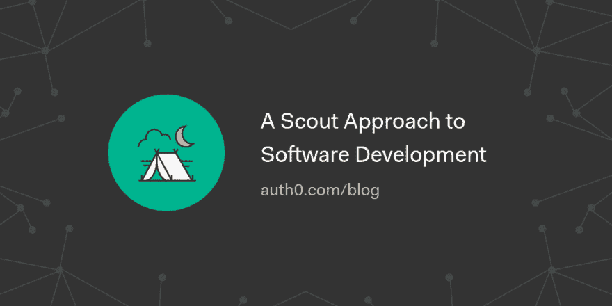

# 软件开发的侦察方法

> 原文：<https://dev.to/auth0/a-scout-approach-to-software-development-9lm>

当我还是个孩子的时候，我练习了 [*球探*](https://en.wikipedia.org/wiki/Scouting) 八年，我获得了许多优秀的价值观，我的球探经历帮助我塑造了我的性格，使我成为一名更好的程序员。让我告诉你为什么。

作为一名童子军，你可以通过户外露营来体验大自然，这教会了你一个核心价值观——**尊重生命**。童军规则有助于支持核心童军价值观。我学到的第一条规则是:

[读下去🏕](https://auth0.com/blog/a-scout-approach-to-software-development/?utm_source=dev&utm_medium=sc&utm_campaign=scout_softdev)

[T2】](https://res.cloudinary.com/practicaldev/image/fetch/s--LFZstkcm--/c_limit%2Cf_auto%2Cfl_progressive%2Cq_auto%2Cw_880/https://thepracticaldev.s3.amazonaws.com/i/v9ivfvrj9bo5iscyzp50.png)