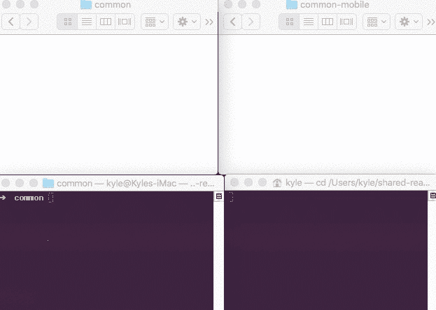
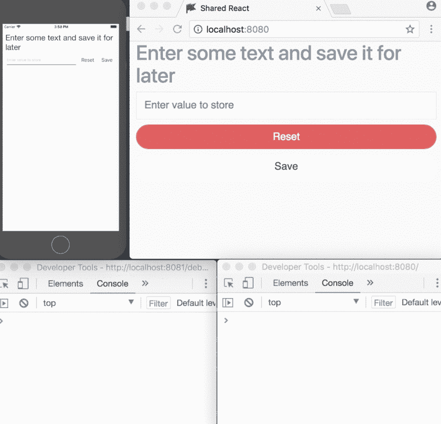

# 使用 React 和 React Native 进行跨平台开发的明智方法

> 原文：<https://dev.to/kylessg/a-sensible-approach-to-cross-platform-development-with-react-and-react-native-57pk>

对于考虑采用 React Native 的企业来说，同时为 Android、iOS 和最近的 Windows Phone 开发的能力经常被宣传为最大的卖点。可以说，这种技术堆栈带来的一个更大但经常被忽视的机会是，能够使用 React 将这种跨平台生态系统扩展到 web。

这里的最终目标是让您能够实现并保持由一个团队编写的 web 和移动应用程序的同等功能，并且能够用一个代码库同时编写新功能和修复错误。

本指南阐述了一种构建和维护代码库的方法，这种方法可以明智地最大化跨所有平台的共享功能。它只关注 React/React Native，这样您就不会陷入依赖和状态管理系统(如 Redux 和 Mobx)的泥潭。

# 项目结构

这似乎是一个过于明显的起点，但是在考虑跨平台的情况下建立一个清晰的项目结构是很重要的，这样你和你的团队就知道所有东西都在哪里了。

**/普通**

顾名思义，任何可以在 web 和 mobile 之间共享的代码都放在这里。虽然我们希望最大化代码共享，但重要的是要务实，不要仅仅为了获得一点重用而过度填充代码。最重要的是，我们的应用程序必须易于理解和遵循。根据我们的经验，如果满足以下所有要求，模块就可以在这里:

1.  它不依赖于任何不受网络、手机或节点支持的模块。
2.  它是平台不可知的，并且从不包含检查哪个平台正在执行它的代码。
3.  它不包含任何标记任何表象。
4.  它的功能不做假设，这可能会阻碍网络和移动之间的 UX 差异。

记住这些规则，常见模块的一些示例包括:

*   您的应用程序的 API 调用。
*   状态管理(Redux、MobX 等)。
*   环境配置/常量。
*   常见的效用函数。
*   应用程序业务逻辑。
*   高阶元件。

**/移动**

这是你的 React 原生项目的根，为了保持整洁，我们将我们的应用程序结构存储在 **/mobile/app** 下

*   **/styles** :包含你所有的项目样式，用一个文件来存储我们的配置/样式变量，比如颜色和字体大小。
*   **/components** :包含你所有的项目组件，一般这些组件大多只关心表现，是无状态的。
*   **/pages** :将页面与组件文件夹分开，这样更容易找到。
*   **/project** :包含任何非表示性但特定于移动设备的配置，例如我们的路线、聚合填充和移动常量。

这包含了与 web 前端相关的任何东西，但绝不会触及与 React Native 相关的任何东西。例如，web 的顶层可能看起来像:

*   **/images、/fonts** :以及所有其他静态资产文件夹
*   **/styles** :包含你所有的项目样式，很可能来自一个预处理程序，比如 Sass 或者更少。
*   **/components** :包含你所有的项目组件，一般这些组件大多只关心表现，是无状态的。
*   **/pages** :将页面与组件文件夹分开，这样更容易找到。
*   **/project** :包含任何非表示性但特定于网络的配置，例如我们的路线、聚合填充和网络常量。

**/webpack**

Webpack 将我们的 js、样式和其他资源打包成静态资产，我们所有的构建配置都包含在这个文件夹中。

这里不做过多的详细介绍，我们的 webpack 配置在我们的 package.json 脚本中使用，以捆绑我们的应用程序用于开发，或者将缩小/缓存的文件部署到 **/build** 以用于生产。

## 在网络和手机之间同步常用代码

这种方法的一个关键部分是能够同步公共代码，以便它们可以在 web 和移动中使用，并且可以从一个位置进行更新。

由于 [React 本机打包程序不支持符号链接](https://github.com/facebook/metro/issues/1)，我们需要一个替代方案。即使它支持符号链接，我们也需要一种更**可靠的**方式来保持移动公共文件夹的更新，而不会因为依赖诸如 gulp-watch 而使 web/mobile 膨胀。利用 [wix 的 wml 库](https://github.com/wix/wml),我们编写了一个简单的 bash 脚本，可以用 xCode 启动并确保只有一个实例在运行。

```
#!/bin/sh

LINE=$(ps aux | grep -w "common-watch.sh" | grep -v grep | wc -l)
echo $LINE

if [ "$LINE" -le "3" ]
then
  npm install -g wml
  watchman watch ../../common
  wml add ../../common ../common-mobile
  wml start
 else
     echo "Process already running"
     exit

fi 
```

Enter fullscreen mode Exit fullscreen mode

我们在 xcode 构建中添加了一个脚本阶段

```
PROJECTDIR="${PROJECT_DIR}"
osascript -e "tell app \"Terminal\" to do script \"cd $PROJECTDIR/../bin && sh ../bin/common-watch.sh && exit\"" 
```

Enter fullscreen mode Exit fullscreen mode

[T2】](https://res.cloudinary.com/practicaldev/image/fetch/s--e5-O6is0--/c_limit%2Cf_auto%2Cfl_progressive%2Cq_66%2Cw_880/http://g.recordit.co/j6A8lIxu6s.gif)

## Web 和移动聚合填充

为了帮助最大化我们在公共层中重用的代码，我们可能希望在每个平台上提供某些 web 和移动功能，以便我们不必担心在哪里使用它们。

在 web 上，我们在现有的 pollyfil 中添加了以下 react 原生功能:

1.  AppState——有时我们可能想知道浏览器标签是否和应用程序一样处于活动状态。
2.  async storage——不用担心语法差异，我们可以轻松地本地存储应用程序状态，并将其引导到共享层上的应用程序。
3.  剪贴板——有了它，我们可以在一个公共的地方管理剪贴板，比如一个高阶组件。
4.  NetInfo——这允许我们编写跨平台的功能，利用用户的互联网连接。

在 [react-native-web](https://github.com/necolas/react-native-web) 的帮助下，我们将这些模块打包成一个简单的包，可以在我们的[这里](https://github.com/SolidStateGroup/polyfill-react-native)找到。

## 哑元件和智能元件

当单独看我们的应用程序组件时，使用丹·阿布拉莫夫的[智能和非智能组件](https://medium.com/@dan_abramov/smart-and-dumb-components-7ca2f9a7c7d0)的模式通常是一种将我们的非智能**/移动**、 **/web** 组件和智能**/普通**组件分开的好方法。

我们的哑组件主要关心事物的外观，很少处理状态，除非与 UI 而不是数据有关。这些组件应该不需要关心依赖关系，比如 flux 动作或存储。

另一方面，我们的智能组件通常不包含标记，它们处理数据和事物如何工作，并将结果传递给哑组件作为道具。

## 客户端 API

为了增加我们在公共层可以做的事情，web 和 mobile 都公开了一个全局 API，以它们自己的方式执行类似的任务。公共代码不必担心每个平台如何处理请求，例如:

*   调用 flux 操作时记录分析事件

```
API.recordEvent(Constants.FOO_CLICKED) 
```

Enter fullscreen mode Exit fullscreen mode

*   经由更高阶组件的社交认证

```
API.auth.google().then(this.onLogin) 
```

Enter fullscreen mode Exit fullscreen mode

即使在 common 不使用的情况下，保持平台之间的语法相似也是一个很好的主意。

## 基础模块

除了跨平台共享模块，我们还将一些模块分割成不太可能改变的部分，例如我们的主移动样式表如下所示:

```
import baseStyles from './base/baseStyleVariables'
export default Object.assign(
    {}, baseStyles,
    {
        //    Project specific styles and overrides
    }
); 
```

Enter fullscreen mode Exit fullscreen mode

## 把一切联系在一起

我们的 github 项目 [shared-react](https://github.com/SolidStateGroup/shared-react) 以一种易于理解的方式提供了上述原则的一个坚实的例子。

### Web 入口流程

入口点 main.js 启动了下面的
1 - Polyfills 反应我们希望使用的本地 API，在我们的例子中是 AppState、AsyncStorage、Clipboard 和 NetInfo。2 -我们的 API 被分配到全局范围，并公开了一个函数 recordEvent(eventName)。
3 -导入我们的 main style.scss，在开发中支持 scss 热重装。在生产中，它被提取并作为 css 链接插入到 html 头中。
4 -初始化中定义的项目路线，并在主应用程序 div 中呈现结果。

### 移动录入流程

入口点 index.js 启动了下面的
1-poly fill 我们希望使用的任何 web APIs，在我们的情况下我们不需要任何 API，但是在其他情况下我们可能会使用诸如 [react-native-fetch-blob](https://github.com/joltup/react-native-fetch-blob) 之类的东西。
2 -我们的 API 被分配到全局范围，并公开了一个函数 recordEvent(eventName)。
3 -使用 react-native-globals 将视图等组件分配给视图等全局范围。4 -公开一些基本组件，如 H1-H6 和 Flex，并初始化一个全局样式表。使用 AppRegistry 注册我们的示例屏幕。我们没有像在 web 上一样在我们的例子中使用路由器，因为在 React Native 中有相当多不同的和流行的选项。

### 示例应用

我们的网站和手机包括一个页面/屏幕，存储和检索单个字段。

他们使用了一个示例高阶组件，该组件使用异步存储来完成繁重的工作，并向下传递下列道具:

```
 <WrappedComponent instructions={instructions} //Instructions to the user
                    isLoading={isLoading} //Whether the storage is loading
                    isSaving={isSaving} //Whether the storage is saving
                    value={value} //The current value entered for the storage
                    save={save} //A function to save the current value
                    reset={reset} //A function to reset the stored value
                    onChange={onChange} //A function to call when the text value changes
                    success={success} //Determines whether saving was successful
                    {...this.props} //Pass all other props
                /> 
```

Enter fullscreen mode Exit fullscreen mode

这样我们在 web 和移动设备上创建了一个简单的表单，我们的高阶组件使用我们的跨平台 api 来记录事件，
[](https://res.cloudinary.com/practicaldev/image/fetch/s--5z3IxpGt--/c_limit%2Cf_auto%2Cfl_progressive%2Cq_66%2Cw_880/http://g.recordit.co/t1bqzCFFfe.gif)