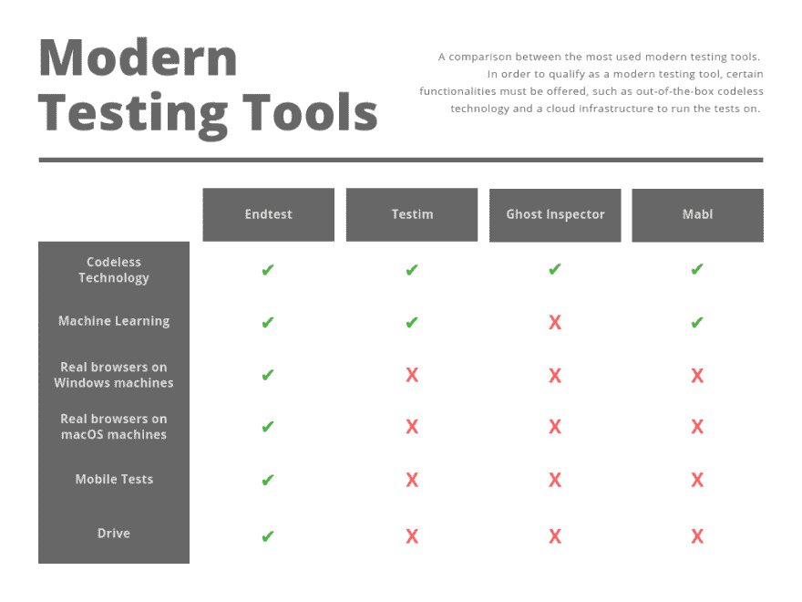
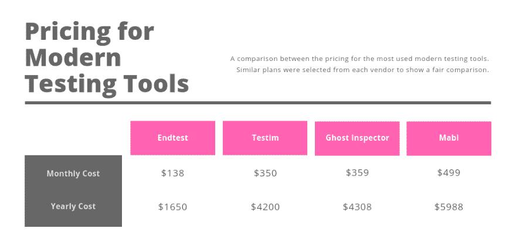

# 自动化测试工具的简短比较

> 原文：<https://dev.to/razgandeanu/a-short-comparison-for-automated-testing-tools-2fmj>

与商业自动化解决方案的许可或订阅成本相比，Selenium 的开源和零许可成本特性非常有吸引力。

但是，当您考虑实施自动化解决方案的成本时，事情远不止如此。

Selenium 是开源和免费的，但是在这个“免费”软件上构建和使用自动化解决方案会带来一些实际的成本。

开源工具/库提供了一个起点，但是您仍然需要为测试创建、管理、执行、处理错误和报告编写代码。注意，这是在您想要自动化的测试逻辑之上的。

还要考虑构建和管理运行这些测试的基础设施的成本。

[T2】](https://res.cloudinary.com/practicaldev/image/fetch/s--FyvYpUyF--/c_limit%2Cf_auto%2Cfl_progressive%2Cq_auto%2Cw_880/https://i.imgur.com/eGwjDXS.png)

现在让我们来看看成本:

[T2】](https://res.cloudinary.com/practicaldev/image/fetch/s--3Z3RgRAv--/c_limit%2Cf_auto%2Cfl_progressive%2Cq_auto%2Cw_880/https://i.imgur.com/fYc33uf.png)

如您所见， [Endtest](https://endtest.io) 的定价方案为您的资金提供了最佳价值，特别是考虑到上面比较中提到的所提供的功能数量。