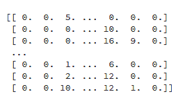
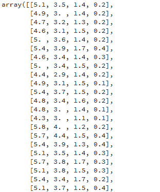
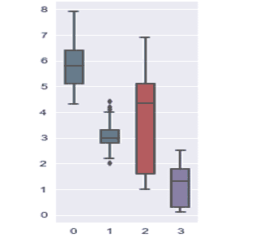

# Python 中的一个简单的机器学习项目

> 原文：<https://dev.to/educationecosystem/a-simple-machine-learning-project-in-python-5d11>

机器学习是人工智能中一个不断发展的领域。它旨在为计算机系统提供从数据中学习模式的能力，并在没有任何直接人类干预的情况下使用经验进行预测。

来自德国的经验丰富的机器学习专家 AndreyBu 喜欢向其他人传授他的技能，他说:“机器学习是有益的，因为它让我们有机会训练算法来自动做出决定，这通常是人工要求和耗时的事情。”

在本文中，我们将在 Python3 中演示一个简单的分类机器学习算法。我们将使用 Scikit-learn，这是一个简单、通用的开源机器学习框架，适用于 Python 应用程序。

此外，我们将使用 [Iris flower 数据集](https://en.wikipedia.org/wiki/Iris_flower_data_set)，这是一个流行的数据集，可用于理解机器学习的概念。

## 理解问题和数据

纳入 Scikit-learn 的 Iris flower 数据集由 150 条记录组成。它包含三种花卉 setosa(标记为 0)、versicolor(标记为 1)和 virginica(标记为 2)，它们具有以下数字属性(以厘米为单位):

*   花瓣宽度
*   花瓣长度
*   萼片宽度
*   萼片长度

我们的机器学习算法的目标是根据这些特征来预测花的种类。我们的模型将被训练成基于这些特征从数据集中学习模式。

让我们开始动手吧(我们将使用 Anaconda Python 发行版)。

Iris 数据集带有 Scikit-learn，我们可以简单地如下加载它。

```
from sklearn import datasets 
```

让我们看看是否可以从数据集中获得鸢尾花的一些特征。

```
iris = datasets.load_iris()
digits = datasets.load_digits() 
```

需要注意的是，数据集是一个类似字典的对象，它保存了关于数据的所有信息。这些数据保存在`.data`键中(一个数组列表)。

而且，在处理像这样的监督问题时，一些响应可以保存在`.target`列表中。

例如，对于数字数据集，我们可以使用`digits.data`来了解对数字样本进行分类的特征。

下面是代码和输出。

```
print(digits.data) 
```

[T2】](https://res.cloudinary.com/practicaldev/image/fetch/s--0Mz-gg7e--/c_limit%2Cf_auto%2Cfl_progressive%2Cq_auto%2Cw_880/http://blog.liveedu.tv/wp-content/uploads/2018/05/ml1.png)

此外，`digits.target`让我们更清楚地了解我们想要学习的内容。

```
print(digits.target) 
```

[T2】](https://res.cloudinary.com/practicaldev/image/fetch/s--hny4Q8Sr--/c_limit%2Cf_auto%2Cfl_progressive%2Cq_auto%2Cw_880/http://blog.liveedu.tv/wp-content/uploads/2018/05/ml2.png)

我们还可以使用`iris.data`(给出数据数组)和`iris.target`(给出标签数组)来查看数据。

您会注意到每个条目都有四个属性。

```
iris.data 
```

[T2】](https://res.cloudinary.com/practicaldev/image/fetch/s--IBghmEHu--/c_limit%2Cf_auto%2Cfl_progressive%2Cq_auto%2Cw_880/http://blog.liveedu.tv/wp-content/uploads/2018/05/ml3.png)

```
iris.target 
```

[T2】](https://res.cloudinary.com/practicaldev/image/fetch/s--OXThgU-s--/c_limit%2Cf_auto%2Cfl_progressive%2Cq_auto%2Cw_880/http://blog.liveedu.tv/wp-content/uploads/2018/05/ml4.png)

`iris.target_names`会给我们一个标签名称的数组；也就是数据集中的三种花。

`iris.target_names`

[T2】](https://res.cloudinary.com/practicaldev/image/fetch/s--jdYuV-Un--/c_limit%2Cf_auto%2Cfl_progressive%2Cq_auto%2Cw_880/http://blog.liveedu.tv/wp-content/uploads/2018/05/ml5.png)

此外，我们还可以使用[盒图](https://en.wikipedia.org/wiki/Box_plot)来生成数据集的可视化表示。

它将向我们展示我们的数据是如何分散在平面上的；利用他们的四分位数。

这是代码。

```
import seaborn as sns
iris_data = iris.data #variable for array of the data iris_target = iris.target #variable for array of the labels sns.boxplot(data = iris_data,width=0.5,fliersize=5)
sns.set(rc={'figure.figsize':(1,10)}) 
```

这是输出。

[T2】](https://res.cloudinary.com/practicaldev/image/fetch/s--tmyfEz8h--/c_limit%2Cf_auto%2Cfl_progressive%2Cq_auto%2Cw_880/http://blog.liveedu.tv/wp-content/uploads/2018/05/ml6.png)

以下是数据在横轴上的表示方式。

*   0 是萼片长度(厘米)
*   1 是萼片宽度(厘米)
*   2 是花瓣长度(厘米)
*   3 是花瓣宽度(厘米)

## 培训和测试

在了解了数据的细节之后，我们现在可以使用算法来训练预测模型。因此，我们需要将数据分成两组:训练集和测试集。

通过对一部分数据进行训练，并对另一组数据进行测试，机器学习模型从未与之交互，它可以帮助我们确保我们的算法可以识别数据集中的模式，这将提高预测的准确性。

在这种情况下，我们将保留最后 15 组数据用于测试，其余的用于训练。因此，我们将根据数据的训练集训练算法，并根据数据的测试集进行预测。

让我们看看如何做到这一点的一些代码。

```
import numpy as np
from sklearn import tree
iris_test_ids = np.random.permutation(len(iris_data)) #randomly splitting the data set
#splitting and leaving last 15 entries for testing, rest for training iris_train_one = iris_data[iris_test_ids[:-15]]
iris_test_one = iris_data[iris_test_ids[-15:]]
iris_train_two = iris_target[iris_test_ids[:-15]]
iris_test_two = iris_target[iris_test_ids[-15:]]
iris_classify = tree.DecisionTreeClassifier()#using the decision tree for classification iris_classify.fit(iris_train_one, iris_train_two) #training or fitting the classifier using the training set iris_predict = iris_classify.predict(iris_test_one) #making predictions on the test dataset 
```

## 查看结果

因为我们随机分割数据集，并且在每次迭代后都训练分类器，所以每次运行代码时，我们可能会获得不同级别的准确性。

下面是查看结果的代码。

```
from sklearn.metrics import accuracy_score
print(iris_predict) #lables predicted (flower species) print (iris_test_two) #actual labels print (accuracy_score(iris_predict, iris_test_two)*100) #accuracy metric 
```

这是输出。

[T2】](https://res.cloudinary.com/practicaldev/image/fetch/s--346Ii1Q3--/c_limit%2Cf_auto%2Cfl_progressive%2Cq_auto%2Cw_880/http://blog.liveedu.tv/wp-content/uploads/2018/05/ml7.png)

上面输出的第一行给出了测试数据的标签；即基于分类器预测的花卉种类。

第二行给出了数据集中包含的实际物种。最后一行给出了精度%。在这种情况下，我们得到了 86.67%的准确率。

不是很坏！

## 结论

这是整个项目的代码。

```
from sklearn import datasets
import seaborn as sns
import numpy as np
from sklearn import tree
from sklearn.metrics import accuracy_score

iris = datasets.load_iris()
digits = datasets.load_digits()
print(digits.data)
print(digits.target)
print(iris.data)
print(iris.target)
print(iris.target_names)

iris_data = iris.data #variable for array of the data iris_target = iris.target #variable for array of the labels sns.boxplot(data = iris_data,width=0.5,fliersize=5)
sns.set(rc={'figure.figsize':(1,10)})

iris_test_ids = np.random.permutation(len(iris_data)) #randomly splitting the data set
#splitting and leaving last 15 entries for testing, rest for training iris_train_one = iris_data[iris_test_ids[:-15]]
iris_test_one = iris_data[iris_test_ids[-15:]]
iris_train_two = iris_target[iris_test_ids[:-15]]
iris_test_two = iris_target[iris_test_ids[-15:]]
iris_classify = tree.DecisionTreeClassifier()#using the decision tree for classification iris_classify.fit(iris_train_one, iris_train_two) #training or fitting the classifier using the training set iris_predict = iris_classify.predict(iris_test_one) #making predictions on the test dataset 
print(iris_predict) #labels predicted (flower species) print (iris_test_two) #actual labels print (accuracy_score(iris_predict, iris_test_two)*100) #accuracy metric 
```

在这篇文章中，我们用 Python 演示了一个简单的机器学习项目。

为了增加你的机器学习知识，你需要完成这样的项目。

更好的是，你可以从像 [LiveEdu](https://www.liveedu.tv/projects/premium/artificial-intelligence/machine-learning/) 这样的网站上挑选其他高级项目，增加你在机器学习方面的专业知识。

快乐学习机器学习！