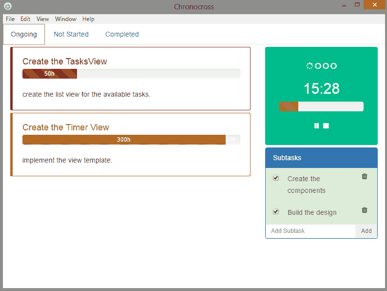
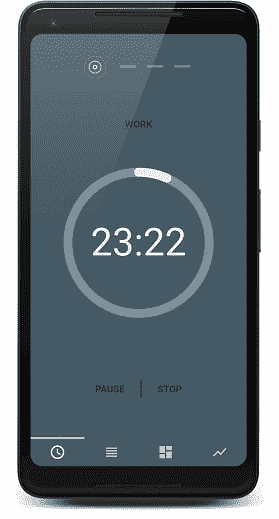
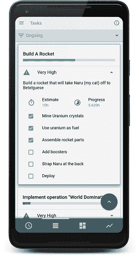
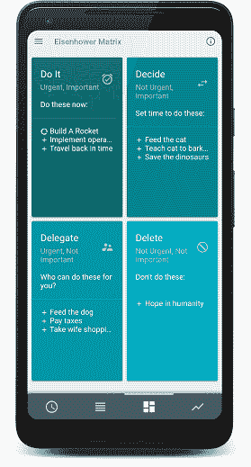
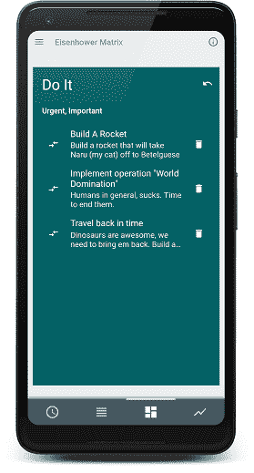
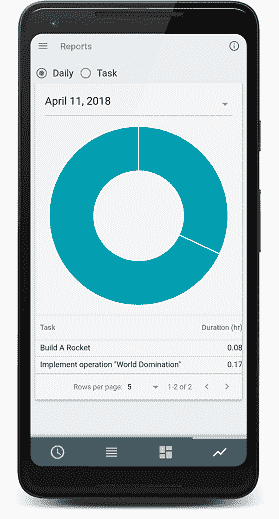
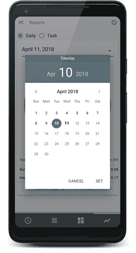
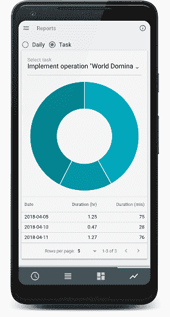
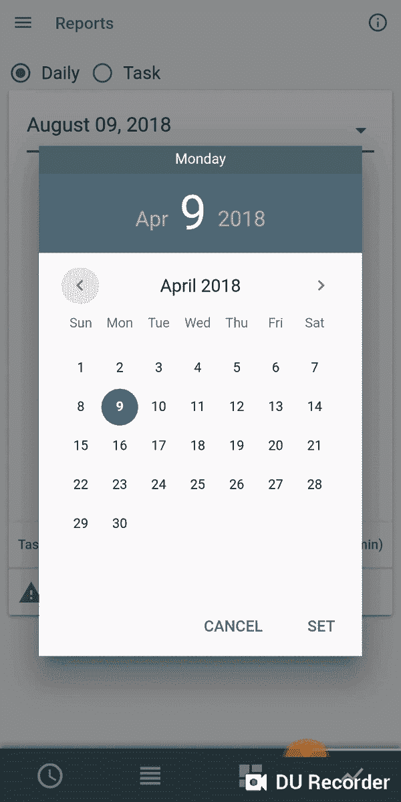

# 基于 Quasar 和 Firebase 的简单生产力应用程序

> 原文：<https://dev.to/vycoder/a-simple-productivity-app-built-on-quasar-and-firebase-2h5a>

> 编辑(2020):我已经创建了一个更新版本的应用程序，使用 Quasar v1 离线工作。你可以点击查看[上的应用。而且，它是开源的！如果你想了解我通常是如何构建我的 Quasar 项目的，你可以在这里](https://www.getenfocus.com/)查看[。如果你感兴趣的话，我已经进一步讨论了在](https://github.com/vycoder/qodo)[第一次类星体会议](https://www.youtube.com/watch?v=6ZKBZ3k4Ebk&t=1438s)期间它是如何建造的基本原理。

*这篇文章最初发表在我的[博客](https://www.josephharveyangeles.com/introducing-chronocross)上，也刊登在 [Quasar 的官方媒体出版物](https://medium.com/quasar-framework/introducing-chronocross-3139448df974)* 上。

从希腊语单词" *chronos* "，意思是"*时间*，和拉丁语" *curos* "，意思是"*参加*"， [Chronocross](https://play.google.com/store/apps/details?id=org.yevlabs.chronocross) 是一个 Todo 应用程序，它集成了其他生产力技术:Pomodoro 技术和艾森豪威尔矩阵，到一个内聚的工作流程中。

简而言之，Chronocross 实际上只是一个简单的工具，我构建它来补充我的工作流程。我是一个超级生产力极客。我迷上了划掉清单上的事情。我使用西里洛的番茄工作法来管理拖延症和保持注意力。

> 番茄工作法是一种时间管理方法，它用一个计时器将你的工作分成几个间隔，传统上是 25 分钟，中间有短暂的休息。— [维基百科](https://en.wikipedia.org/wiki/Pomodoro_Technique)

再加上另一个生产力技巧，艾森豪威尔矩阵来帮助我区分哪些任务应该在早上第一件事做，哪些应该放在最后。我的每一个工作日都感觉无比幸福。

[T2】](https://i.giphy.com/media/TKn70FuVT3Yk0/giphy-downsized-large.gif)

最终，在一个 todo 应用程序、一个单独的 Pomodoro 应用程序和我的艾森豪威尔盒子的电子表格之间切换感觉有所欠缺。感觉就像是在恳求我把它们整合到一个有凝聚力的应用程序中。在这一点上，如果我不立即响应召唤，我就不能真正称自己为软件开发人员。

最初， **Chronocross** 是用 Angular 打造的。我当时正在学习 Angular，用它来构建一个应用程序似乎是一个很好的实践。但我只是不想再做一个 web 应用程序，因为我给自己一个通过切换和在其他网站上闲逛来拖延时间的机会，这会降低我的工作效率。我决定使用电子，并将其开发为桌面应用程序。

这在当时听起来不错，但随着我的日常工作学习角和电子使它很难完成。当时我是一名 Java 开发人员，这是我在整个 JavaScript 革命之后第一次回到前端。我在大学时学过基础知识:HTML、CSS、JQuery 和 JavaScript。但我会大吃一惊。对我这个陌生人来说，让电子和 Angular 一起工作简直是一场噩梦。修改 tsconfig？还有 Webpack？装载机？安装 NPM？什么？Javascript 现在可以访问 I/O 了？Nodejs？

[T2】](https://i.giphy.com/media/BK6vj5qBYdc4w/giphy.gif)

我最终还是设法让它工作了。我花了很长的时间和无数的挫折才做到这一点；那一年，我几乎放弃使用 Java 和 Swing，不再费心学习新东西。在我的功能列表进行到一半时，我结束了搁置我的小宠物项目。

[T2】](https://res.cloudinary.com/practicaldev/image/fetch/s--_3Yf1rNy--/c_limit%2Cf_auto%2Cfl_progressive%2Cq_auto%2Cw_880/https://cdn-images-1.medium.com/max/800/1%2AkfJqKK_StydrGInLgVmiYg.png)

差不多一年后，我在另一家公司担任全栈工程师，不管这意味着什么(我认为这意味着:我懂 Java 和一点 HTML)，在前端使用 Angular。我开始渴望再次学习新东西。我发现自己站在 Vue 生态系统的门口。当我第一次学习 Angular 的时候，我就知道 Vue，但是因为 Angular 是公司选择的框架，我就对它不屑一顾。IMHO，Vue。是。漂亮。奇怪。太棒了。这次经历是一见钟情。

## 类星体框架

在将我之前的 Angular portfolio 网站移植到 Vue 之后，我冒险在 Vue 生态系统的门口走得更远，发现自己正沿着类星体框架的山谷前进。我看了文件。还有。它。曾经是。只是。哦哦。很好。

[T2】](https://i.giphy.com/media/3o7aCWJavAgtBzLWrS/giphy-downsized.gif)

Quasar 是一个框架，可以让你使用相同的代码库构建响应迅速的单页应用、服务器端渲染应用、渐进式网络应用、混合移动应用和电子应用。不仅如此，它还有一个内置的用户界面库，带有素材和 IOS 主题。这就像一场梦。你所需要担心的就是构建你的想法，如果你做得对，只需一个简单的命令，你就可以为其他平台构建你的项目。多棒啊。我知道有些人听到“混合科尔多瓦和电子应用程序”时可能会扬起眉毛。但在我看来，Quasar 可以完成 90%的用例，甚至更多。而且每天还在进步。

## 慢性 2.0

我借着回到建造时空十字的机会学习了类星体。这次我决定把它建成一个移动应用程序。我想至少有一个类似的体验，离开你的显示器和键盘，实际上发条一个真正的番茄或厨房定时器。

我放弃了以前的设计，重新开始。对于这个小应用程序，我决定实现四个主要功能，分别用不同的标签来表示:番茄标签、任务标签、艾森豪威尔盒子标签和报告标签。

番茄标签是一个非常常规的计时器，你可以播放、暂停、停止和重启。冲刺指标在顶部，每 25 分钟的工作冲刺后会有一个 5 分钟的休息冲刺。最后的休息冲刺，我称之为长休息，是 15 分钟。当然，这些冲刺持续时间总是可以在设置上调整，但那些是传统的持续时间，所以我把它们设为默认值。

[T2】](https://res.cloudinary.com/practicaldev/image/fetch/s--6xpW19rc--/c_limit%2Cf_auto%2Cfl_progressive%2Cq_auto%2Cw_880/https://cdn-images-1.medium.com/max/800/1%2AABq7pJ0UBWI507kdI3_l2A.png)

第二个选项卡包含*任务列表*。在这里你会找到你的任务。以卡片的形式列出，每张卡片乍一看都包含一些基本信息:任务名称、优先级和一个进度条，进度条代表任务花费的时间和估计时间。有一个可折叠的，包含其他信息，如实际估计时间，目前的进展和简短的描述。还有一个子任务列表，以防你想把主任务分成几块。

[T2】](https://res.cloudinary.com/practicaldev/image/fetch/s--bay_OHdq--/c_limit%2Cf_auto%2Cfl_progressive%2Cq_auto%2Cw_880/https://www.josephharveyangeles.com/statiimg/blogs/2018/chronocross/tasklist-expand-task.png)

点击一个任务选择它，之前的小工厂变成一个包含其他选项的可扩展工厂。删除，编辑，重置(重置进度回 0)，标记为完成和播放。点击播放按钮将运行所选任务的番茄计时器，这意味着你所有的工作冲刺将被记录在当前所选的任务中。这将对跟踪非常有用。如果没有选择的任务(或者你再次点击它取消选择一个当前的任务)，定时器标签仍然可以独立使用，它只是作为一个常规的番茄定时器。为了防止记录被破坏，如果计时器当前处于活动状态，我禁用了选择功能——但是仍然可以检查其他任务的详细信息。

我用 Firebase 的[实时数据库](https://firebase.google.com/products/realtime-database/)来存储所有的任务和进度时间记录，这也是一个相当方便的服务。有一个专门为 vue 制作的插件让它更加方便，这个插件叫做 [Vuefire](https://github.com/vuejs/vuefire) 。当然，我用它和 [FirebaseAuth](https://firebase.google.com/docs/reference/android/com/google/firebase/auth/FirebaseAuth) 一起登录和注册。

我为第三个选项卡创建了四张卡片，代表每个艾森豪威尔象限。任务的预览放在每个象限的标签下。这些由您在任务选项卡中创建任务时选择的优先级决定。高优先级任务将被自动分类为*紧急*和*重要*任务。

[T2】](https://res.cloudinary.com/practicaldev/image/fetch/s--POcQubiz--/c_limit%2Cf_auto%2Cfl_progressive%2Cq_auto%2Cw_880/https://www.josephharveyangeles.com/statiimg/blogs/2018/chronocross/eisenhower.png)

展开一个象限将列出其下分类的所有当前任务。如果你觉得优先级改变了，你可以把它移到不同的象限。如果您在 tasks 选项卡上编辑优先级，也可以达到同样的效果。但是在这里这样做是从艾森豪威尔矩阵的角度出发的。

[T2】](https://res.cloudinary.com/practicaldev/image/fetch/s--55n_I4Fn--/c_limit%2Cf_auto%2Cfl_progressive%2Cq_auto%2Cw_880/https://www.josephharveyangeles.com/statiimg/blogs/2018/chronocross/eisenhower-do-it.png)

最后，最后一个选项卡是报告。作为一名软件工程师，工作的一部分需要一些文书工作(我打赌你没有想到)，但不是大多数案头工作的传统文书工作。我们的文书工作版本与度量标准、任务跟踪、燃尽图和其他东西有关——如果你不是经理或 scrum 大师，并且你真的不关心你进行得有多快，你只想写代码然后回家，这是非常无聊的东西。让我们承认，记录你的工作时间是非常无聊的。当你深陷编码狂潮，一个接一个地实现特性，像喝咖啡一样快速地修复错误时，它会带走你的动力。这个简单应用的大部分灵感都是为了治疗这个病例。在一天或一周结束时，我想看看这段时间我做了哪些任务，以及我在这些任务上花了多长时间。

[T2】](https://res.cloudinary.com/practicaldev/image/fetch/s--8Aq7WsR_--/c_limit%2Cf_auto%2Cfl_progressive%2Cq_auto%2Cw_880/https://www.josephharveyangeles.com/statiimg/blogs/2018/chronocross/reports-daily.png)

现在剩下要做的就是在一天结束时更新那些吉拉卡片，我的 scrum 主人会非常高兴的。如果我忘记记录一天的工作时间，我仍然可以过滤日期，并从 quasar 提供的非常简单的日期选择器中进行选择。

[T2】](https://res.cloudinary.com/practicaldev/image/fetch/s--yo5lVoqe--/c_limit%2Cf_auto%2Cfl_progressive%2Cq_auto%2Cw_880/https://www.josephharveyangeles.com/statiimg/blogs/2018/chronocross/reports-daily-select.png)

有时，有些任务需要一天以上才能完成。也许它很大，或者有其他任务需要您的注意，您必须暂停当前正在处理的任务——我为这种情况添加了一个任务视图。有趣的是，这个报告图表功能是如此的琐碎，但我最终最喜欢它。

[T2】](https://res.cloudinary.com/practicaldev/image/fetch/s--yxrQNCws--/c_limit%2Cf_auto%2Cfl_progressive%2Cq_auto%2Cw_880/https://www.josephharveyangeles.com/statiimg/blogs/2018/chronocross/reports-task.png)

我还实现了其他功能，如:

*   保持清醒，防止您的屏幕睡眠，以便您可以随时看到计时器。
*   后台持久，让您在后台运行应用程序。
*   本地推送通知，当应用程序在后台运行时，当计时器到达时显示通知。
*   永久全屏，我只是觉得当应用程序处于全屏状态时，感觉更“引人关注”。

为了真正完成这个项目，我注册了一个谷歌开发者账户，以便在谷歌 Playstore 上发布这个应用。你必须一次性支付 25 美元的注册费，但之后你可以随心所欲地发布应用。这交易没那么糟。在 google play 中发布应用程序非常简单，你填写所有必要的信息，上传你的 APK，然后就大功告成了。(点击此[链接](https://support.google.com/googleplay/android-developer/answer/7159011#rollout)了解更多关于发布版本的信息)你必须等待几个小时才能在 playstore 上看到该应用。

在上传 APK 之前，我必须先确保它已经签名并对齐了 zip。Android 要求所有的 apk 在安装之前都要用证书进行数字签名。在使用`quasar build -m cordova`构建了我的 Quasar 应用程序之后，产生的`.apk`将在适当的发布文件夹(`project-dir/src-cordova/platforms/android/app/build/outputs/apk/release`)中可用。我使用 keytool 生成了我的私钥，然后使用`jarsigner`对包进行签名。 [`apksigner`](https://developer.android.com/studio/command-line/apksigner) 也可以用来达到同样的效果。成功签署我的 APK 后，还需要对包进行压缩，否则 Google Play 控制台将会出错。我用 [`zipalign`](https://developer.android.com/studio/command-line/zipalign) 来完成这个。(如果您计划使用`apksigner`，如果您进一步更改 APK，它将使包无效，因此，您必须在签署包之前使用 zipalign *)。更多关于应用程序签名的信息请点击。*

仅仅几个小时后，Chronocross 就在 playstore 上出现了。我通知了一些同样对番茄和生产力感兴趣的朋友，并给了他们[链接](https://play.google.com/store/apps/details?id=org.yevlabs.chronocross)。

[T2】](https://res.cloudinary.com/practicaldev/image/fetch/s--GOFE7iRT--/c_limit%2Cf_auto%2Cfl_progressive%2Cq_66%2Cw_880/https://cdn-images-1.medium.com/max/800/1%2AoE7RD-knnWC6n_9Z9-CxoQ.gif)

我真的不指望它能在 Playstore 表现良好，我只是很满意我能把 Chronocross 从我的未完成项目列表中划掉。可能还有大量的改进空间。我甚至可以用它生成一个电子应用程序，添加一个报告摘录，并直接自动化到吉拉或其他地方。如果我喜欢，我可能会不时更新它，或者如果有些人也发现它很有用并想要更多的功能。

[T2】](https://res.cloudinary.com/practicaldev/image/fetch/s--RkVuTtQN--/c_limit%2Cf_auto%2Cfl_progressive%2Cq_66%2Cw_880/https://cdn-images-1.medium.com/max/800/1%2AJ-igX3eFQmkFGR-CLMqxSQ.gif)

总的来说，我对这种体验很满意，我可能会继续使用 Quasar 开发随机应用。毕竟，编程的乐趣之一并不总是创造下一个成功的产品。有时候，它是关于建立一些东西来解决你每天遇到的小问题。

[T2】](https://i.giphy.com/media/3o7TKyqNi5CbAv7Z4s/giphy.gif)

本文与 Pomodoro Technique 或 Francesco Cirillo 无关，也不与之相关，也不被其认可。