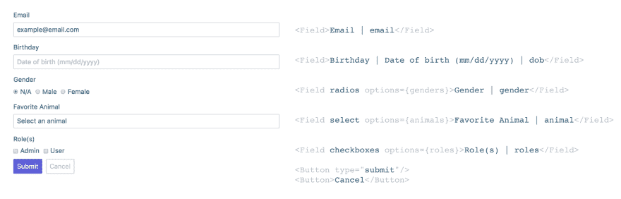

# 一个简单的反应式解

> 原文：<https://dev.to/ngduc/a-simple-react-form-solution-57d1>

React 很棒。我明白了，它让我们像快照一样创建组件。但是有时候，特别是对于像我这样过去使用纯 Javascript 和 HTML 标签的老前辈来说，我觉得现在有更多的工作要做，以便像以前一样让一个简单的东西按预期工作。

例如，要创建一个简单的表单，我们可以像这样快速编码:

```
<form>
    <span>Email</span><input id=“email” />
    <button type=“submit”>Submit</button>
</form> 
```

然后是 XHTML 验证和新的需求(添加下拉菜单和表单验证)，我学会了创建一个带有“有效”标签和属性的“适当”表单:

```
<form action=“/someendpoint” method=“POST”>
    <label for=“email”>Email</label>
    <input type=“text” id=“email” />
    <div class=“field-error” />

    <label for=“dropdown”>Dropdown</label>
    <select id=“dropdown”>
        <option value=“OPTION1”>Option 1</option>
        <option value=“OPTION2”>Option 2</option>
    </select>
    <div class=“field-error” />

    <button type=“submit” className=“btn btn-primary”>Submit</button>
</form> 
```

快进到 React world，我被告知将现有表单连接到 React 处理函数和状态。经过一些汗水和泪水，现在我的代码看起来像这样。

```
<form action=“/someendpoint” method=“POST”>
    <label htmlFor=“email”>Email</label>
    <input type=“text” id=“email” onChange={this.onEmailChange} />
    {this.state.errors[‘email’] && <div class=“field-error” />}

    <label htmlFor=“dropdown”>Dropdown</label>
    <select id=“dropdown” onChange={this.onSelectChange} >
        {this.state.options.map (opt => <option value={opt.value}>{opt.label}</option>}
    </select>
    {this.state.errors[‘dropdown’] && <div class=“field-error” />}

    <button type=“submit” className=“btn btn-primary” onChange={this.onSubmit}>Submit</button>
</form> 
```

好吧，不算太坏，增加了一点代码，但是好处大于坏处，对吗？“嗯，对……”(我的老定时器声音听起来不情愿)。

日子一天天过去，更多的需求出现了，我的表格变得越来越长，我不得不将代码复制到多个地方，并确保当样式、JSX 等发生变化时，它们都是同步的。整个应用程序。有一天，我觉得很累，决定四处寻找一些图书馆来拯救我的灵魂。Npm 展示了一长串好的库:tcomb、formik、final form、json schema form 等。他们都有不同的方法来构建我的简单表单。所以我花了更多的时间来学习它们。(JS 疲劳，有人吗？)

其中，我发现 formik 是一个非常棒的库，非常接近我得到的所有需求:受控字段、验证、易于理解等。但是我总是希望尽可能用简短自然的方式描述我的表单，所以我打开了我的 VSCode，并整理了一个表单规范，就像这样(基于 formik ),这是我想要实现的:

[T2】](https://res.cloudinary.com/practicaldev/image/fetch/s--VRKVwPD8--/c_limit%2Cf_auto%2Cfl_progressive%2Cq_auto%2Cw_880/https://i.imgur.com/L8FzVgx.png)

在一个周末，我花了一些时间尝试实现这个规范，并取得了一些成功。到目前为止，它对我最喜欢的项目非常有效:

[演示链接](https://codesandbox.io/s/l5vxk5o7vq)

让我知道你的想法，是足够简单还是有更好的方法来实现它？