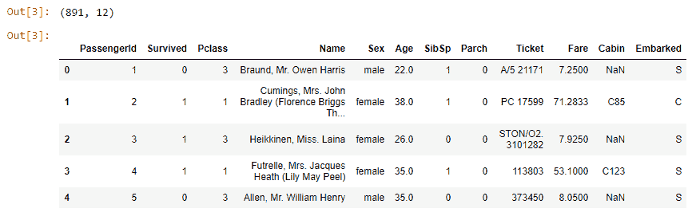
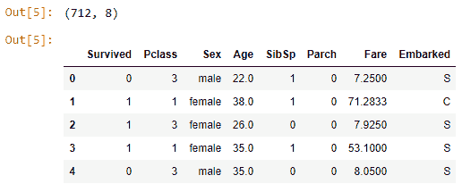
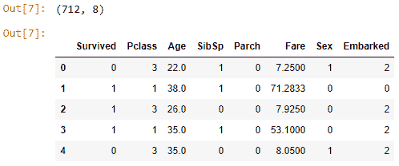
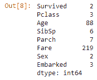
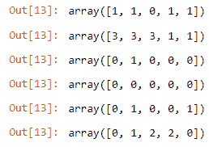
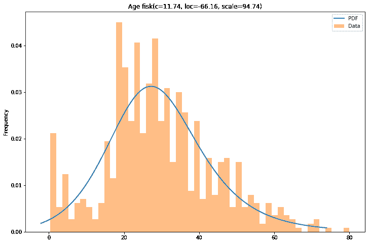
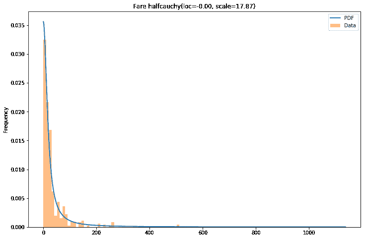
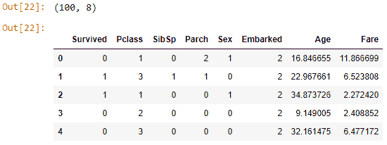
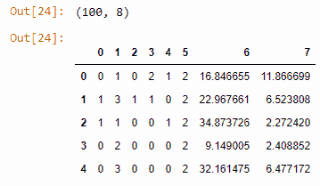

# 用 Python 和 Pandas 实现数据匿名的简单方法

> 原文：<https://dev.to/r0f1/a-simple-way-to-anonymize-data-with-python-and-pandas-79g>

最近，我得到了一个数据集，其中包含关于客户的敏感信息，在任何情况下都不应该公开。数据集存放在我们的一台服务器上，我认为这是一个相当安全的位置。我想将数据复制到我的本地驱动器，以便更舒适地处理数据，同时不必担心数据保存不完整。因此，我编写了一个小脚本来更改数据，同时仍然保留一些关键信息。我将详细介绍我所采取的所有步骤，并重点介绍一些方便的技巧。

### 任务

任务是准备数据集，以便它可以在不包含任何敏感信息的情况下用于机器学习目的(例如，分类、回归、聚类)。最终数据集不应与原始数据集有太大差异，并应反映初始数据集的分布。

### 走吧

我将使用 Jupyter 笔记本作为我的环境。首先，让我们导入所有必需的库。

```
import pandas as pd
import numpy as np
import scipy.stats
%matplotlib inline
import matplotlib.pyplot as plt
from sklearn_pandas import DataFrameMapper
from sklearn.preprocessing import LabelEncoder
# get rid of warnings import warnings
warnings.filterwarnings("ignore")
# get more than one output per Jupyter cell from IPython.core.interactiveshell import InteractiveShell
InteractiveShell.ast_node_interactivity = "all"
# for functions we implement later from utils import best_fit_distribution
from utils import plot_result 
```

Enter fullscreen mode Exit fullscreen mode

我假设您已经熟悉这里使用的大多数库。我只想强调三件事。 [sklearn_pandas](https://github.com/scikit-learn-contrib/sklearn-pandas) 是一个方便的库，试图在两个包之间架起一座桥梁。它提供了一个`DataFrameMapper`类，使得处理 pandas 数据帧更加容易，因为它允许用更少的代码行改变变量的编码。用`from IPython.core.interactiveshell ...`我改变了 Jupyter 笔记本的默认设置，这样就可以显示多个输出。一篇关于其他便捷 Jupyter 技巧的博客文章[在这里](https://www.dataquest.io/blog/jupyter-notebook-tips-tricks-shortcuts/)。最后，我们将把一些代码放入一个名为`utils.py`的文件中，我们将把它放在笔记本旁边。

```
df = pd.read_csv("../data/titanic_train.csv") 
```

Enter fullscreen mode Exit fullscreen mode

对于我们的分析，我们将使用 [Titanic 数据集](https://www.kaggle.com/c/titanic)的训练部分。

```
df.shape
df.head() 
```

Enter fullscreen mode Exit fullscreen mode

[T2】](https://res.cloudinary.com/practicaldev/image/fetch/s--icChaigA--/c_limit%2Cf_auto%2Cfl_progressive%2Cq_auto%2Cw_880/https://thepracticaldev.s3.amazonaws.com/i/j9p3vadehmxo2slbshsv.png)

既然我们已经加载了数据，我们将删除所有个人可识别的信息。列`["PassengerId", "Name"]`包含这样的信息。请注意，`["PassengerId", "Name"]`对于每一行都是唯一的，因此如果我们建立一个机器学习模型，我们以后无论如何都会删除它们。关于`["Ticket", "Cabin"]`也可以做类似的论证，几乎每一行都是唯一的。

出于演示的目的，我们将不处理丢失的值。我们简单地忽略所有包含缺失值的观察值。

```
df.drop(columns=["PassengerId", "Name"], inplace=True) # dropped because unique for every row df.drop(columns=["Ticket", "Cabin"], inplace=True) # dropped because almost unique for every row df.dropna(inplace=True) 
```

Enter fullscreen mode Exit fullscreen mode

结果看起来是这样的。

```
df.shape
df.head() 
```

Enter fullscreen mode Exit fullscreen mode

[T2】](https://res.cloudinary.com/practicaldev/image/fetch/s--YfyJyVww--/c_limit%2Cf_auto%2Cfl_progressive%2Cq_auto%2Cw_880/https://thepracticaldev.s3.amazonaws.com/i/blukzmn7p4iueoc8sdgr.png)

接下来，为了提取更多的信息，作为后面的预处理步骤，我们将用数值对`Sex`和`Embarked`进行编码。`Sex`将编码为`0,1`，`Embarked`将编码为`0,1,2`。类`LabelEncoder()`为我们做了大部分工作。

```
encoders = [(["Sex"], LabelEncoder()), (["Embarked"], LabelEncoder())]
mapper = DataFrameMapper(encoders, df_out=True)
new_cols = mapper.fit_transform(df.copy())
df = pd.concat([df.drop(columns=["Sex", "Embarked"]), new_cols], axis="columns") 
```

Enter fullscreen mode Exit fullscreen mode

`DataFrameMapper`来自`sklearn_pandas`包并接受元组列表，其中元组的第一项是列名，元组的第二项是转换器。出于我们的目的，我们使用`LabelEncoder()`，但是接口也可以接受任何其他的转换器(`MinMaxScaler()`、`FunctionTransfomer()`)。
在最后一行，我们将编码数据与其余数据连接起来。请注意，您也可以编写`axis=1`，但是`axis="columns"`可读性更好，我鼓励大家使用后一个版本。

```
df.shape
df.head() 
```

Enter fullscreen mode Exit fullscreen mode

[](https://res.cloudinary.com/practicaldev/image/fetch/s--7p1pRuPJ--/c_limit%2Cf_auto%2Cfl_progressive%2Cq_auto%2Cw_880/https://thepracticaldev.s3.amazonaws.com/i/8zhrm7sy50eavy9rmwgt.png)T3】

```
df.nunique() 
```

Enter fullscreen mode Exit fullscreen mode

[T2】](https://res.cloudinary.com/practicaldev/image/fetch/s--rXjxvY0Q--/c_limit%2Cf_auto%2Cfl_progressive%2Cq_auto%2Cw_880/https://thepracticaldev.s3.amazonaws.com/i/6mrxw5u62nmxnh6xv95k.png)

### 从同一分布中抽样匿名

上面我打印了每列唯一值的数量。我们将继续假设，所有具有少于 20 个唯一值的都是名义变量或分类变量，所有具有等于或多于 20 个唯一值的都是连续变量。让我们把名词/分类变量放在一个列表中，其他的放在另一个列表中。

```
categorical = []
continuous = []

for c in list(df):
    col = df[c]
    nunique = col.nunique()
    if nunique < 20:
        categorical.append(c)
    else:
        continuous.append(c) 
```

Enter fullscreen mode Exit fullscreen mode

`for c in list(df):`遍历所有列。代替`list(df)`，你也可以写`df.columns.tolist()`。我还在纠结我更喜欢哪一个。

这篇文章的核心思想是:对于每个分类变量，我们将确定其唯一值的频率，然后为每个唯一值创建一个频率相同的离散概率分布。对于每个连续变量，我们将从预定义的分布列表中确定*最佳*连续分布。这是如何做到的解释如下。一旦我们确定了所有的概率分布(离散的和连续的)，我们就从这些分布中取样来创建一个新的数据集。

#### 名词性/类别性变量的处理

这是更简单的情况，只需要 3 行代码。

```
 for c in categorical:
        counts = df[c].value_counts()
        np.random.choice(list(counts.index), p=(counts/len(df)).values, size=5) 
```

Enter fullscreen mode Exit fullscreen mode

[T2】](https://res.cloudinary.com/practicaldev/image/fetch/s--8FEQfdQy--/c_limit%2Cf_auto%2Cfl_progressive%2Cq_auto%2Cw_880/https://thepracticaldev.s3.amazonaws.com/i/p5sd912h28lg9cx4akr4.png)

首先，我们确定一个唯一值在变量中出现的频率。这是经验概率函数。然后，我们使用这个概率函数，并将其传送到`np.random.choice()`来创建一个具有相同概率函数的新随机变量。

#### 连续变量的处理

幸运的是，有一个关于类似问题的 [StackOverflow 线程](https://stackoverflow.com/a/37616966/1820480)。主要解决方案如下。对于每个连续变量，做:

*   使用预定义数量的条柱创建直方图
*   浏览连续函数列表，将每个函数与直方图相匹配。该拟合过程也产生函数的参数。
*   在自身和直方图之间具有最小误差(最小残差平方和)的函数是我们将用来近似连续变量的函数。

这个解决方案的作者把一切都整齐地放入两个函数中。我创建了第三个并把所有的东西放在一个名为 [`utils.py`](https://github.com/r0f1/dev_to_posts/blob/master/fake_data/utils.py) 的文件中。我们将在笔记本中使用`utils.py`中的功能。

```
best_distributions = [] 
```

Enter fullscreen mode Exit fullscreen mode

```
for c in continuous:
    data = df[c]
    best_fit_name, best_fit_params = best_fit_distribution(data, 50)
    best_distributions.append((best_fit_name, best_fit_params)) 
```

Enter fullscreen mode Exit fullscreen mode

```
# Result best_distributions = [
    ('fisk', (11.744665309421649, -66.15529969956657, 94.73575225186589)),
    ('halfcauchy', (-5.537941926133496e-09, 17.86796415175786))] 
```

Enter fullscreen mode Exit fullscreen mode

`Age`的最佳分布是`fisk`，而`Fare`的最佳分布是`halfcauchy`。让我们看看结果。

```
plot_result(df, continuous, best_distributions) 
```

Enter fullscreen mode Exit fullscreen mode

[T2】](https://res.cloudinary.com/practicaldev/image/fetch/s--wzSzCOoK--/c_limit%2Cf_auto%2Cfl_progressive%2Cq_auto%2Cw_880/https://thepracticaldev.s3.amazonaws.com/i/6brxefj3lhi91gv7x132.png)

[T2】](https://res.cloudinary.com/practicaldev/image/fetch/s--2wrADO9L--/c_limit%2Cf_auto%2Cfl_progressive%2Cq_auto%2Cw_880/https://thepracticaldev.s3.amazonaws.com/i/t3y8nvaxhdbu48jhe3tu.png)

我得说，还不算太坏。

#### 将代码放入一个函数中

```
def generate_like_df(df, categorical_cols, continuous_cols, best_distributions, n, seed=0):
    np.random.seed(seed)
    d = {}

    for c in categorical_cols:
        counts = df[c].value_counts()
        d[c] = np.random.choice(list(counts.index), p=(counts/len(df)).values, size=n)

    for c, bd in zip(continuous_cols, best_distributions):
        dist = getattr(scipy.stats, bd[0])
        d[c] = dist.rvs(size=n, *bd[1])

    return pd.DataFrame(d, columns=categorical_cols+continuous_cols) 
```

Enter fullscreen mode Exit fullscreen mode

现在我们有了一个函数，可以用来创建，比如说，100 个新的观察值。

```
gendf = generate_like_df(df, categorical, continuous, best_distributions, n=100)
gendf.shape
gendf.head() 
```

Enter fullscreen mode Exit fullscreen mode

[T2】](https://res.cloudinary.com/practicaldev/image/fetch/s--odvwQyLd--/c_limit%2Cf_auto%2Cfl_progressive%2Cq_auto%2Cw_880/https://thepracticaldev.s3.amazonaws.com/i/dgfhbpdh60gq677udpxn.png)

作为后处理步骤，还可以对连续变量进行舍入。我选择不那样做。但是，我删除了所有的列名，因为这也可能会泄露一些关于数据集的信息。我只是用 0，1，2 来代替它们，...。

```
gendf.columns = list(range(gendf.shape[1])) 
```

Enter fullscreen mode Exit fullscreen mode

[T2】](https://res.cloudinary.com/practicaldev/image/fetch/s--VFwX0znP--/c_limit%2Cf_auto%2Cfl_progressive%2Cq_auto%2Cw_880/https://thepracticaldev.s3.amazonaws.com/i/swfvqbl65yzzklsxclo1.png)

最后，一切都保存到磁盘。

```
gendf.to_csv("output.csv", index_label="id") 
```

Enter fullscreen mode Exit fullscreen mode

### 最后备注

这种方法的一个缺点是变量之间的所有相互作用都丢失了。例如，我们假设在原始数据集中，女性(`Sex=1`)比男性(`Survived=1`)有更高的存活几率。在生成的数据集中，这种关系不再存在。可能存在的变量之间的任何其他关系也丢失了。

我希望这篇博文对你有所帮助，并希望听到你的想法和评论。这里显示的所有代码也可以在 [github](https://github.com/r0f1/dev_to_posts/tree/master/fake_data) 上找到。