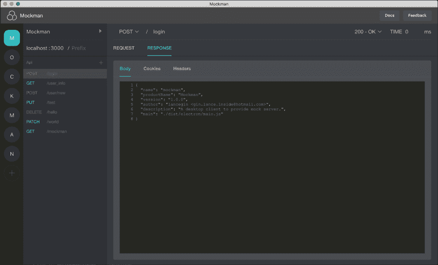
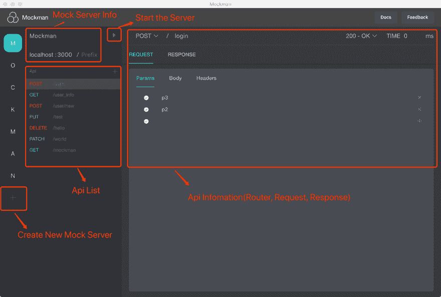

# 在本地平台上管理和启动 api 模拟服务器的简单方法。

> 原文：<https://dev.to/_lancegin/a-simple-way-to-manage-and-start-your-api-mock-server-on-your-local-platform-1ol9>

# 

> 是一个强大而方便的工具，帮助您在本地管理和启动模拟服务器。
> 
> 使用该应用程序，您可以轻松地配置模拟服务器的路由、请求格式和响应

## 屏幕上显示程序运行的图片

[T2】](https://res.cloudinary.com/practicaldev/image/fetch/s--Tq9NRuq1--/c_limit%2Cf_auto%2Cfl_progressive%2Cq_auto%2Cw_880/http://orhcxc3kd.bkt.clouddn.com/mockman.png)

## 使用

[T2】](https://res.cloudinary.com/practicaldev/image/fetch/s--tKqetypw--/c_limit%2Cf_auto%2Cfl_progressive%2Cq_auto%2Cw_880/http://orhcxc3kd.bkt.clouddn.com/mockman-preview.jpg)

1.  创建您的模拟服务器- `click the add button`
2.  配置你的移动服务器的`name`、`port`和`prefix`，确保端口没有被使用，否则 Mockman 会给你一个错误通知。
3.  为您的模拟服务器添加一些 API。
4.  配置每个 api 的`method`、`route`、`response code`、`latency`、`required request options`和`reponse data`。
5.  启动服务器- `click the start button`。
6.  毕竟，您可以在本地测试您的 api。

> 你的 api 数据会存储在哪里？
> 
> 你的数据会以`sqlite file`的形式绝对存储在你的本地，在不同的操作系统上路径会有所不同。
> 
> *   `%APPDATA%`对于 Windows
> *   `$XDG_CONFIG_HOME or ~/.config`对于 Linux
> *   `~/Library/Application Support`对于 macOS