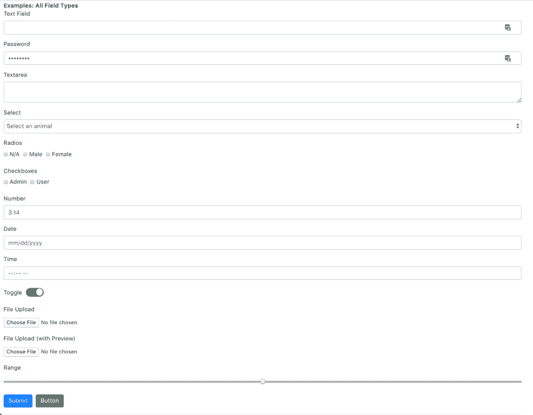

# React 中使用表单的简单方法

> 原文：<https://dev.to/ngduc/a-simple-way-to-work-with-forms-in-react-1h84>

React 中使用表单的简单方法。这是我试图解决复杂的表单渲染:

```
import { FormContainer, Form, Field, Button } from 'ez-react-form';

<FormContainer onSubmit={this.onSubmit} render={props => (
  <Form use="bootstrap4">
    <Field label="Text" name="text" />
    <Field name="password" />
    <Field textarea name="textarea" />
    <Field select options={animals} name="select" />
    <Field radios options={genders} name="radio" />
    <Field checkboxes options={roles} name="checkboxes" />
    <Field number name="number" />
    <Field date name="date" />
    <Field time name="time" />
    <Field toggle inline name="toggle" />
    <Field file label="File Upload" name="file1" />
    <Field file withPreview label="File Upload (with Preview)" name="file2" />
    <Field range name="range" />

    <Button type="submit"/>
    <Button>Cancel</Button>
  </Form>
)} /> 
```

结果:(完整的表单、验证(带 yes)和错误消息)

[T2】](https://res.cloudinary.com/practicaldev/image/fetch/s---1YWqTJ4--/c_limit%2Cf_auto%2Cfl_progressive%2Cq_auto%2Cw_880/https://github.com/ngduc/ez-react-form/raw/master/screenshot-types.png)

[Demo](https://codesandbox.io/s/l5vxk5o7vq)
[Github](https://github.com/ngduc/ez-react-form)

我感谢下面的任何反馈、建议或想法。谢谢！:)