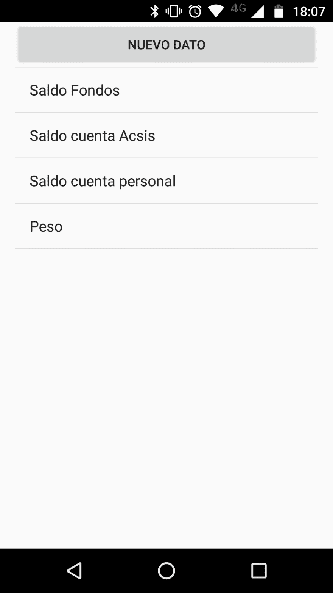
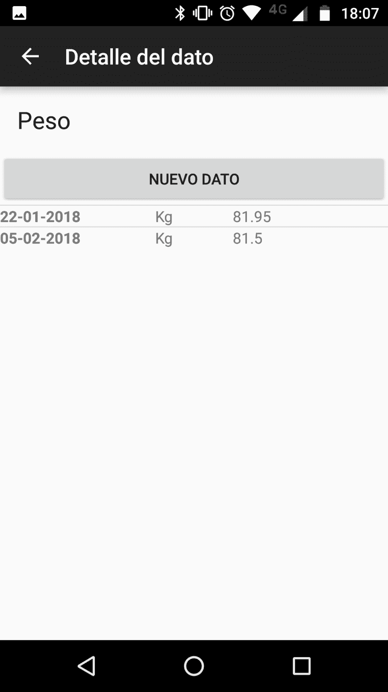
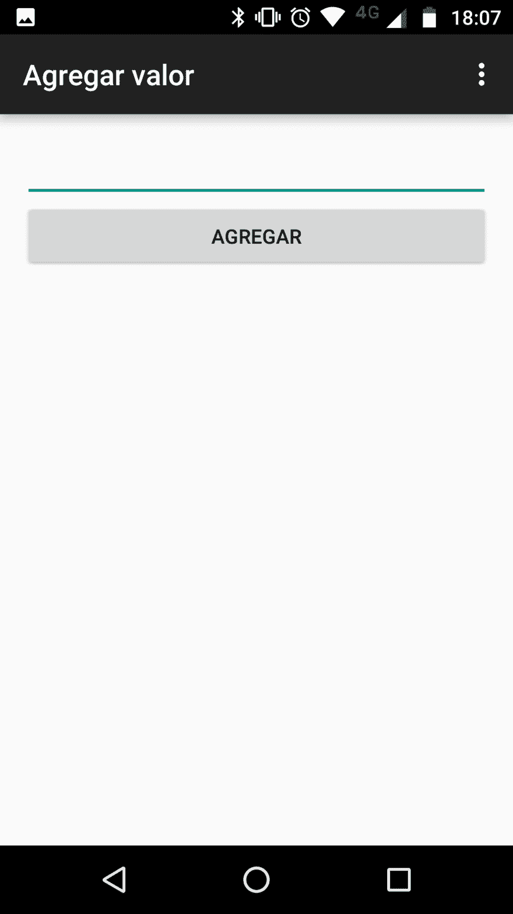
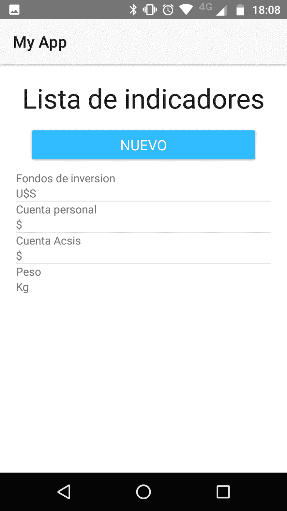
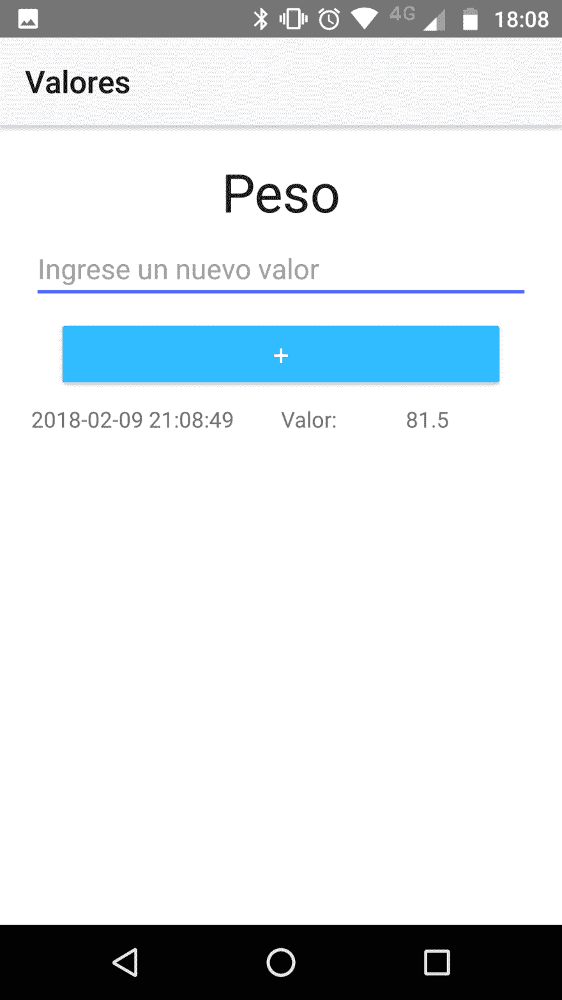

# 一个小实验

> 原文：<https://dev.to/elcotu/a-small-experiment--384b>

嗨，这周我决定做一个个人实验。我已经为 Android 开发了几年，一直基于 Java 原生代码。那是因为我已经用 Java 工作了很多年。
但是去年我对 JavaScript 产生了一些兴趣，因为我并不擅长。
这个实验是:

第一步:想一个简单的 Android 应用程序
第二步:用我的库和 Java 代码开发那个应用程序
第三步:用一些当时我还不知道的工具开发那个应用程序，这些工具使用 JavaScript 代码并构建本地应用程序。
第四步:考虑一下。

于是我想到了一个 app，可以让用户:
1)定义一个主题来收集数据。这个主题，类似于仪表板指示器，有:
a)一个名字
b)一个值的符号。例如，美元是美元的符号
2)查看指标值列表
3)添加新值。该值有一个时间戳

因此，该应用程序基本上有两个实体，存储在本地 SQLite 数据库中。

该应用程序将使用每个工具的基本模板，而不是其他。在 Java 中，我的优势是有很多样板代码已经在其他项目中使用。

# Java 安卓 App

这是我用我著名的方法编写的第一个应用程序的屏幕:

## 指标列表

[T2】](https://res.cloudinary.com/practicaldev/image/fetch/s--By2UhkI8--/c_limit%2Cf_auto%2Cfl_progressive%2Cq_auto%2Cw_880/https://thepracticaldev.s3.amazonaws.com/i/0wvjkh17a1gz4nkmz9we.png)

## 某个指标的值

[T2】](https://res.cloudinary.com/practicaldev/image/fetch/s--AjYPaZv3--/c_limit%2Cf_auto%2Cfl_progressive%2Cq_auto%2Cw_880/https://thepracticaldev.s3.amazonaws.com/i/437kri5pe2q63wmvxcod.png)

## 给指标添加新值

[T2】](https://res.cloudinary.com/practicaldev/image/fetch/s--FoK14KS---/c_limit%2Cf_auto%2Cfl_progressive%2Cq_auto%2Cw_880/https://thepracticaldev.s3.amazonaws.com/i/9o6nrg2pxojxw7j8fa2q.png)

# Javascript native script app

## 指标列表

[T2】](https://res.cloudinary.com/practicaldev/image/fetch/s--7zauFKt_--/c_limit%2Cf_auto%2Cfl_progressive%2Cq_auto%2Cw_880/https://thepracticaldev.s3.amazonaws.com/i/g36vkcw91isks1g7mi1f.png)

## 一个指标的值(并包括相加)

[T2】](https://res.cloudinary.com/practicaldev/image/fetch/s--WukTOapZ--/c_limit%2Cf_auto%2Cfl_progressive%2Cq_auto%2Cw_880/https://thepracticaldev.s3.amazonaws.com/i/mye269qg9effhqo130n3.png)

# 结论

1)与 Java 应用程序相比，我构建 NativeScript 应用程序花费的时间更少。考虑到这是我第一次使用 NativeScript，而不是第一次使用 Java，这一点很重要。

NativeScript 应用程序的标准外观比 Java 应用程序的标准外观更好(记住，我只是使用默认值)

NativeScript 应用性能良好

Java 应用程序的总大小为 3，86 MB。NativeScript 应用程序有 29，71 MB

5)代码行之间的差异非常大

NativeScript 应用程序可以构建到 iOS，而 Java 应用程序则不能

那么，还有继续生产 Java Android 应用的理由吗？你们这些人是怎么想的？

你好，