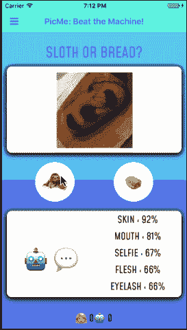

# 先睹为快的 NativeScript-Vue 2.0！

> 原文：<https://dev.to/frontendfoxes/a-sneak-peek-of-nativescript-vue-20-k7j>

2 月，我骄傲地在阿姆斯特丹 Vue 的大舞台上宣布推出 NativeScript-Vue 1.0。阿姆斯特丹会议。我们与它的创造者、社区领袖和 Vue 大师伊戈尔·兰杰洛维奇一起，向世界展示了一种美丽的新方式，即使用单一代码库为 iOS 和 Android 构建可下载的移动应用程序，将 NativeScript 的强大功能与 Vue.js 的开发乐趣结合起来

[T2】](https://res.cloudinary.com/practicaldev/image/fetch/s--O6grJwxP--/c_limit%2Cf_auto%2Cfl_progressive%2Cq_auto%2Cw_880/https://thepracticaldev.s3.amazonaws.com/i/qpnp3e0evhb5rl3mclvx.png)

如今，NativeScript-Vue 已经被用于生产应用，包括 Catholic Answers 应用:

[T2】](https://res.cloudinary.com/practicaldev/image/fetch/s--dM7Y6S2m--/c_limit%2Cf_auto%2Cfl_progressive%2Cq_auto%2Cw_880/https://thepracticaldev.s3.amazonaws.com/i/is9nzjrv1j7lvgfzfncz.png)

我自己也有几个演示，展示如何设计你的应用程序来创建一个漂亮的界面。例如，Elocute 是一款面向语言教师和学生的网络和移动应用套件:

[T2】](https://res.cloudinary.com/practicaldev/image/fetch/s--bTN0CAxG--/c_limit%2Cf_auto%2Cfl_progressive%2Cq_66%2Cw_880/https://thepracticaldev.s3.amazonaws.com/i/iokkby9pa566ma2knunt.gif)

老师们在网上输入文本，让学生们在教室里测试他们的发音。学生们在手机应用程序上完成作业(如上图所示),然后对着设备朗读文本，在设备上由语音转文本插件进行转录。然后，一种算法在幕后工作，对教师的文本和学生的抄写进行相似性评分。语音室之痛现在解决了！

或者 Picme 怎么样，我开发的一个应用程序演示了设备上 ML Kit 的速度，测试了人类识别复杂图片的能力与使用图像标签人工智能的能力:

[T2】](https://res.cloudinary.com/practicaldev/image/fetch/s--CS9tt1Vg--/c_limit%2Cf_auto%2Cfl_progressive%2Cq_66%2Cw_880/https://thepracticaldev.s3.amazonaws.com/i/xggwiw3zru4dbj9hgowm.gif)

还没印象深刻？我最新的应用程序怎么样，仍然是一个 WIP，TarotMoji，在那里你可以获得塞满表情符号的塔罗牌读数:

[T2】](https://res.cloudinary.com/practicaldev/image/fetch/s--C28PBYnu--/c_limit%2Cf_auto%2Cfl_progressive%2Cq_auto%2Cw_880/https://thepracticaldev.s3.amazonaws.com/i/o2bl7j9j6m2ssnq9omtc.png)

我们现在可以用 NativeScript-Vue 创建时尚、高性能的原生应用，还有什么可以改进的呢？换句话说，这个很酷的集成的下一步是什么？请继续阅读！

## 改变#1 -文件夹结构

当我们第一次启动通过 Vue CLI 创建 NativeScript-Vue 应用程序的标准系统时，移动应用程序的文件夹结构有点类似于通过 Vue CLI 搭建的 web 应用程序的文件夹结构。

*   开发人员在`/src`文件夹中编写了应用程序的屏幕和逻辑，其中包含`/assets`、`/components`和应用程序的其他部分，如 Vuex 商店。
*   `/template`文件夹包含`/App_Resources`文件夹，这是移动应用程序存储图标和闪屏的地方。该文件夹是构建过程所必需的。
*   最后，移动应用程序的构建版本存储在`dist`文件夹中，该文件夹包含所有最终将在应用程序准备发布时上传到应用程序商店的资产。
*   该应用程序使用`npm`命令运行，例如`npm run watch:ios`来启用 LiveSync，LiveSync 会监视模拟器或设备中的更改并刷新应用程序。

[T2】](https://res.cloudinary.com/practicaldev/image/fetch/s--9QMTqP3a--/c_limit%2Cf_auto%2Cfl_progressive%2Cq_66%2Cw_880/https://thepracticaldev.s3.amazonaws.com/i/duchm1j3f7m2tqsk7b01.gif)

在 NativeScript-Vue 的 Vue-CLI 模板 2.0 版本中，文件夹结构得到了显著简化，使其与标准 NativeScript 移动应用程序的文件夹结构保持一致。现在，当你想要使用这个模板时，导航到你想要你的应用程序所在的文件夹，在你的终端中使用:`vue init nativescript-vue/vue-cli-template myapp`。`npm install`应用程序的依赖项，您可以开始比赛了:

[T2】](https://res.cloudinary.com/practicaldev/image/fetch/s--SEO8UTmh--/c_limit%2Cf_auto%2Cfl_progressive%2Cq_66%2Cw_880/https://thepracticaldev.s3.amazonaws.com/i/3kfu3qsb0sr73s8hwtcp.gif)

安装此应用程序的依赖项，您将看到一个基本应用程序，其中包含您在预安装脚本中请求的元素。然后，使用标准的 NativeScript 命令`tns run ios / android --bundle`运行应用程序，让 webpack 工作并启动 LiveSync:

[T2】](https://res.cloudinary.com/practicaldev/image/fetch/s--tMyOeYOf--/c_limit%2Cf_auto%2Cfl_progressive%2Cq_auto%2Cw_880/https://thepracticaldev.s3.amazonaws.com/i/d6zoxu7vl56zmyzm5uss.png)

新的文件夹结构更加简单。所有你需要担心的文件都在`/app`文件夹里，作为应用开发者，你大部分时间都会花在这里。构建文件包含在应用程序根目录的`/platforms`文件夹中。它非常快，干净，整洁！

[T2】](https://res.cloudinary.com/practicaldev/image/fetch/s--dxA5HMEg--/c_limit%2Cf_auto%2Cfl_progressive%2Cq_auto%2Cw_880/https://thepracticaldev.s3.amazonaws.com/i/7uid9369otfmfskofrrc.png)

## 改变#2 -框架元素

NativeScript 4.0 引入了一个新的`Frame`元素，允许开发人员更改应用程序的根元素，从而便于在应用程序页面之间共享公共元素。在框架的早期版本中，这个框架元素是自动创建的，但现在不再是这样了。现在我们需要显式地在模板中添加一个框架。没什么大不了的！Vue-CLI 模板已经覆盖了您:

```
new Vue({
  render: h => h('frame', [h(HelloWorld)]),
}).$start(); 
```

Enter fullscreen mode Exit fullscreen mode

这是一个很小的变化，通过使用这些标准化的模板可以很容易地处理。

## 变化# 3——不是真正的变化，是一种增强:使用 Sidekick

由于之前版本的文件夹结构，不可能使用 Sidekick 工具来管理应用程序，Sidekick 工具是 CLI 的一个很好的抽象，可以让您的移动应用程序项目保持良好的组织。你猜怎么着？由于新模板提供了一个更普通的类似 NativeScript 的文件夹结构，您可以将它与 Sidekick 一起使用！点击下载 Sidekick [。](https://www.nativescript.org/nativescript-sidekick)

一旦项目通过 Vue-CLI 搭建完成，您就可以在 Sidekick 中打开它，然后管理您的构建。只需确保点击“webpack”开关，以确保 webpack 得到利用，并利用它提供的本地和云模拟器:

[T2】](https://res.cloudinary.com/practicaldev/image/fetch/s--IFLmZqS9--/c_limit%2Cf_auto%2Cfl_progressive%2Cq_auto%2Cw_880/https://thepracticaldev.s3.amazonaws.com/i/iyedtsm9iew0jb1xre15.png)

NativeScript-Vue 2.0 即将推出！同时，您现在就可以使用我们的 vue-cli 模板创建应用程序。如果你已经在这个领域工作过，请关注 NativeScript 博客中关于如何升级你的应用的文章。如果没有，现在是时候加入了！使用 NativeScript-Vue 2.0 创建您的下一个热门移动应用程序！

> 需要帮助吗？在#vue 频道的 [Slack](https://developer.telerik.com/wp-login.php?action=slack-invitation) 与我们连线，并在 NativeScript-Vue.org 的[通读文档。使用](http://www.nativescript-vue.org)[游乐场](http://play.nativescript.org)尝试无承诺的 NativeScript。
> 
> 还有！我们将于 10 月 4 日举办一场关于 NativeScript 2.0 的网络研讨会。来加入我们吧！在这里注册