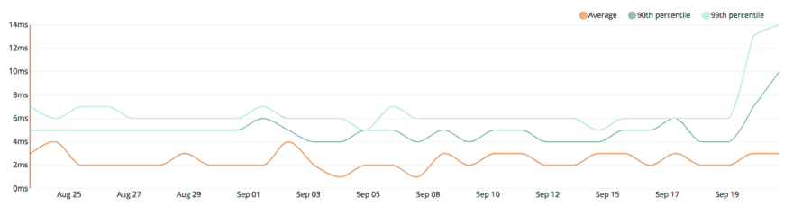

# 一个垂死巨石的故事:替换简单事物的复杂性

> 原文：<https://dev.to/foxteck/a-tale-of-a-dying-monolith-2j1d>

### 一个垂死巨石的故事:替换简单事物的复杂性

[](https://res.cloudinary.com/practicaldev/image/fetch/s--pNyTcfXc--/c_limit%2Cf_auto%2Cfl_progressive%2Cq_auto%2Cw_880/https://cdn-images-1.medium.com/max/1024/1%2AD6ltU71DfGMyGkYGPaeBYA.jpeg) 

<figcaption>照片由[托尔·阿尔维斯](https://unsplash.com/photos/wgjG86EuubE?utm_source=unsplash&utm_medium=referral&utm_content=creditCopyText)于 [Unsplash](https://unsplash.com/@terminath0r?utm_source=unsplash&utm_medium=referral&utm_content=creditCopyText)</figcaption>

我从事大媒体工作已经快两年了。我最喜欢的两个项目是构建发布平台。两者都利用了 Headless CMS 架构，并围绕它开发了一个平台。

虽然堆栈完全不同，但架构组件之间的模式似乎是相同的。

我开始在我以前工作过的旧系统中识别相同的模式，我想知道我是否可以将相同的模式应用到遗留系统中。

我的一个朋友正在为医疗保健行业的一个旧的 CakePHP 应用程序开发新版本的 Android 和 iOS 应用程序，这是我五年前帮助开发的。他希望为应用程序添加新功能，并且需要后端来支持这些新功能。

CakePHP 应用程序与来自外部系统的数据进行交互。这是应用程序中大多数实体的真实来源。两个系统紧密耦合，通过数据库表共享数据。

[](https://res.cloudinary.com/practicaldev/image/fetch/s--QoAOWD-k--/c_limit%2Cf_auto%2Cfl_progressive%2Cq_auto%2Cw_880/https://cdn-images-1.medium.com/max/1024/1%2Ad-yytiQAYljF5Y8zoa9h6g.png) 

<figcaption>CakePHP Monolith 通过数据库与外部系统紧密耦合。</figcaption>

产品名称、系统 id、定价、折扣、产品状态、用户帐户、会员状态和库存水平等数据来自外部系统。

医生和从业者可以登录 CakePHP 应用程序，向来自外部系统的数据添加额外的信息。

产品描述、图片、日历、程序、位置、简介等的模型。只存在于应用程序中，数据是在那里创建和管理的。该应用程序将呈现内容，并通过 REST API 向移动和第三方应用程序公开数据。一个旧时的巨大巨石。

我说服我的朋友让我开始围绕这个项目进行实验。我开始 [*扼死*](https://www.martinfowler.com/bliki/StranglerApplication.html) 这块巨石。经过几次迭代后，最终的架构如下:

[](https://res.cloudinary.com/practicaldev/image/fetch/s--CqDq3gF3--/c_limit%2Cf_auto%2Cfl_progressive%2Cq_auto%2Cw_880/https://cdn-images-1.medium.com/max/1024/1%2A3Rw5Hd7AFof_Uq7fOA3ACw.png) 

<figcaption>新的堆栈——一个高度解耦的架构，带有一个无头 CMS、一个外部搜索引擎和实时 API。</figcaption>

### 平台——🕸

新平台是一个事件驱动的分布式系统。在平台的中间是一层宁静的羽毛。我把所有与内容相关的责任都交给了 Prismic.io，CakePHP 上的 CMS 功能被弃用了。我用 Algolia 来驱动所有应用程序的搜索引擎，包括 API。

基于 API 的事件，我可以做一些事情，如索引新内容或从搜索引擎中删除内容，更新价格，库存水平，启用或禁用内容，以及在 CMS 上尚不存在实体的情况下，烘焙一些默认数据。

作为一个很好的奖励，移动应用程序现在可以向用户实时通知平台其他部分正在发生的事情。

#### 没有共享数据库—💥

我从消除系统间的数据库依赖开始。现在所有系统都通过 RESTful API 端点集成。

耦合集成是许多棘手问题的根源:

*   **来自外部更新的模式变化**:每当外部系统的模式更新时，后端也需要更新。其中一些变化可能会一直影响到移动应用程序。
*   **级联停机时间**:因为外部系统是成员状态和身份等信息的来源，当它由于某种原因停机时，会导致其他系统的部分故障。本地缓存有所帮助，但只是在一定程度上。
*   **批量同步**:由于系统通过数据库集成，一些东西需要与日常工作同步。Lucene 上的价目表、库存水平、状态(即停产商品)和搜索索引都必须在每天结束或开始时运行。
*   所有权(Ownership):因为当出现问题时，几乎看不到任何东西，所以在外部系统和后端的维护者之间有很多相互指责的游戏。

现在，外部系统通过 REST API 推送更改。他们为用户成员公开了一个 SOAP API，Feathers 后端使用这个 API 并作为外部客户机的 JSON API 代理。

#### 无头的 CMS——🖋

我在 Prismic 中建模了所有的内容实体。用户现在可以创建和管理内容，并近乎实时地看到它神奇地出现在所有应用程序上。

我把蛋糕的前端保持原样。保持它作为渲染引擎意味着在前端不需要额外的工作。将来，他们希望将迁移到 VueJS 或 React。

[](https://res.cloudinary.com/practicaldev/image/fetch/s--EQHbfP72--/c_limit%2Cf_auto%2Cfl_progressive%2Cq_auto%2Cw_880/https://cdn-images-1.medium.com/max/1024/1%2AEQuvgF_2UDjHO-HeVULang.png)

<figcaption>pris mic 中的建模内容(样本数据模型)</figcaption>

我设置了 webhooks 将数据同步回 CakePHP 模型。来自 Prismic 的内容将更新现有模型，处理外部资产(在本地备份)并更新当前状态。最终，所有内容都将存在于 Prismic 中。

根据以前的经验，数据迁移总是需要大量的工作。在这种情况下，不需要进行数据迁移。

[](https://res.cloudinary.com/practicaldev/image/fetch/s--7S8BK7SC--/c_limit%2Cf_auto%2Cfl_progressive%2Cq_auto%2Cw_880/https://cdn-images-1.medium.com/max/1024/1%2AiQzHdPP6blK8mjp8PSLCpg.png) 

<figcaption>来自 Prismic 的 API 的 JSON 响应(来自上面的同一个模型)。</figcaption>

#### 搜索引擎——️🔍

与 Algolia 合作轻而易举。它运行速度极快，而且易于使用。拥有一个事件驱动的架构被证明是非常有益的。API 上的事件使用 [NodeJS 的客户端](https://www.algolia.com/doc/api-client/javascript/getting-started/)异步索引数据。

[](https://res.cloudinary.com/practicaldev/image/fetch/s--oHWjFzQU--/c_limit%2Cf_auto%2Cfl_progressive%2Cq_auto%2Cw_880/https://cdn-images-1.medium.com/max/1024/1%2AX4KslL8YmYKF3SawbqT17Q.png) 

<figcaption>搜索响应时间——极快，不到 10ms。</figcaption>

几毫秒后，所有应用程序上的搜索功能将反映这些变化，并显示(或隐藏)相同的结果。PHP、Swift 和 Java 的 SDK 使集成变得容易。

[](https://res.cloudinary.com/practicaldev/image/fetch/s--pt8E4GSf--/c_limit%2Cf_auto%2Cfl_progressive%2Cq_auto%2Cw_880/https://cdn-images-1.medium.com/max/1024/1%2A2yPg3LOAVmbuDrkwsHQ-AA.png) 

<figcaption>搜索操作—平均每月 88k 次操作。</figcaption>

对于其他没有更新的现有客户端，CakePHP 搜索继续像以前一样由 algolia 在幕后提供支持。这意味着像 Chrome 的 Omnibox 搜索这样的其他集成可以继续工作。

#### 持续部署—🚀

架构中包含更多部分意味着部署新版本的平台不再能够手工完成。我在 [*好友*](https://buddy.works/) 上设置了管道来自动处理部署。

CakePHP 应用已经被部署到 AWS 上的 EC2 实例中。我只需要自动化这个过程(并添加[原子部署](https://buddy.works/blog/introducing-atomic-deployments))。

[T2】](https://res.cloudinary.com/practicaldev/image/fetch/s--IDWk_0Pd--/c_limit%2Cf_auto%2Cfl_progressive%2Cq_auto%2Cw_880/https://cdn-images-1.medium.com/max/1024/1%2ApR3dB9EC9KU3wPsyfJGKTw.png)

FeathersJS 应用部署到云上，Zeit 的[现在是](https://zeit.co/now)。一种面向不可变基础设施的服务，使快速部署功能变得简单而没有麻烦(或恐惧)。

[](https://res.cloudinary.com/practicaldev/image/fetch/s--QjlaQwhr--/c_limit%2Cf_auto%2Cfl_progressive%2Cq_auto%2Cw_880/https://cdn-images-1.medium.com/max/1024/1%2AJ1bKV4gUxhpNxCa8mdFo8w.png) 

<figcaption>NodeJS 部署管道同现在</figcaption>

合并一个分支将创建一个绑定到新域名的新容器，您可以在其中进行任何需要的测试。

如果一切正常，最后一步将把当前部署命名为后端的公共 DNS 名称，它将自动开始接收实时流量。它还会自动缩放应用程序，并确保它在所有可用的[区域](https://zeit.co/cdn)运行。

[](https://res.cloudinary.com/practicaldev/image/fetch/s--AsaBIAj---/c_limit%2Cf_auto%2Cfl_progressive%2Cq_auto%2Cw_880/https://cdn-images-1.medium.com/max/1024/1%2AytMmI0AOgDf36g9zmuXNxQ.png) 

<figcaption>现在规模</figcaption>

生产和缩放规则的别名配置作为代码在存储库中设置。像数据库连接和第三方服务的访问键被设置为从管道注入到 now 的环境变量。

MySQL 数据库生活在亚马逊的 RDS 上。RethinkDB 数据库托管在 [*compose.io*](https://www.compose.com/databases/rethinkdb) 中。使用三节点群集配置和一个代理门户节点(以及自动备份)。

#### 调试和跟踪—🕵🐛

打破整体结构使得整体架构更容易理解，更容易维护和发展。但同时也使调试变得非常困难。试图弄清楚当一个事件跨越系统边界时会发生什么是非常具有挑战性的。

由于我使用 AWS Lambda、X-Ray 和 IOPipe 的经验，我已经对可观察性和可追溯性有了一些了解。我真的很喜欢 IOPipe，但是它只对 lambda 有效。我记得通过[慈善专业](https://medium.com/u/5587d135a397)’[推特](https://twitter.com/mipsytipsy)读过《关于可观察性的伟大见解》。决定试试 Honeycomb.io。

我安装了后端和管道。

[](https://res.cloudinary.com/practicaldev/image/fetch/s--DzB7sUJk--/c_limit%2Cf_auto%2Cfl_progressive%2Cq_auto%2Cw_880/https://cdn-images-1.medium.com/max/1024/1%2AR902TgSBNMZ_ipuhWT69PA.png) 

<figcaption>每秒请求(紫色)和从 GitHub 释放(蓝色)。</figcaption>

Feathers 在幕后使用 ExpressJS，所以我只需为 NodeJS 添加它们的 [beeline，HTTP 请求就可以开箱即用了。](https://www.honeycomb.io/blog/2018/05/the-fastest-most-direct-route-to-instrumented-code-a-honeycomb-beeline/)

[](https://res.cloudinary.com/practicaldev/image/fetch/s--9OrHqlWt--/c_limit%2Cf_auto%2Cfl_progressive%2Cq_auto%2Cw_880/https://cdn-images-1.medium.com/max/868/1%2AxAwhcEaIseApND9I0t4uig.png) 

<figcaption>NodeJS 蜂巢直线</figcaption>

我使用了前的*和* [*后的*钩子**](https://docs.feathersjs.com/api/hooks.html) 来给跟踪信息添加额外的上下文。这有助于更好地了解平台中正在发生的事情，并使构建有意义的查询和创建具有商业意义的值的可视化变得更加容易。

PHP 还没有捷径可走。但是[事件 API](https://docs.honeycomb.io/api/events/) 可以用于所有其他语言。

我还在管道上安装了仪器，所以所有的发布都在蜂巢上做了标记(上图中的蓝色梳子)。为此，我使用了[标记 CLI](https://docs.honeycomb.io/working-with-data/markers/#honeymarker-installation) 。当代码被合并到 master 并标记为发布时，管道已经设置为运行，它只是运行一个额外的步骤，如下所示:

```
$ honeymarker -k $HONEYCOMB\_KEY -d feathers-ws \
    -t release \
    -m "$EXECUTION\_TAG" \
    add 
```

可以利用触发器来跟踪平台上的任何意外行为。我希望将来[触发器](https://docs.honeycomb.io/api/triggers/)将被用来跟踪自动执行回滚或别名发布的更新后的行为。

我学到了很多！该平台是健壮的、解耦的和可扩展的。它帮助我验证了我关于内容平台的理论，并帮助我认识到可以在不同项目中轻松应用的可重用模式。

另一方面，它让我意识到用分布式系统取代整体系统从长远来看是有帮助的,*但是*增加了很多复杂性，如果没有合适的工具支持它，如 CI/CD、事件日志和跟踪，这可能会很麻烦。

我认为在构建面向服务的架构(如微服务或基于 Lambda 的架构)时，可观察性是一个关键的成功因素。我会继续深入研究。

最后，将继续支持该平台的团队也对结果感到高兴。现在添加新功能更容易了。理解组件比理解原始代码库更简单。他们已经在思考下一次重构会是什么——前端。该组织对变化的厌恶程度有所降低，新的想法已经在酝酿之中，总体而言，它们进展得更快，并且对工程团队有了新的信任感。

### 更多资源📚

*   [**如何打破一块巨石**](https://martinfowler.com/articles/break-monolith-into-microservices.html) 作者[扎马克·德赫加尼](https://medium.com/u/f2c25544d719)解释了如何将一块巨石迁移到微服务架构。Nginx 的人有一个很棒的关于微服务的[文章系列，](https://www.nginx.com/blog/introduction-to-microservices/)[最后一篇](https://www.nginx.com/blog/refactoring-a-monolith-into-microservices/)解释了如何将 Monolith 重构为微服务。
*   [**巴迪**](https://buddy.works/) 是我最喜欢的 CI/CD 工具。它易于使用，拥有所有很酷的特性，如与 GitHub 集成，部署到 k8s (ECS，GKS)，在容器和他们称为沙箱的短暂环境中运行步骤。阅读他们的[指南](https://buddy.works/guides)了解更多信息。
*   [**FeathersJS**](https://docs.feathersjs.com) 是一个针对 NodeJS 的实时 REST API 框架。这是我最喜欢的开发 NodeJS APIs 的框架。 [**NestJS**](https://nestjs.com/) 第二。
*   **蜂巢的** [**博客**](https://www.honeycomb.io/blog/) 对可观察性有很好的指点。他们甚至赞助了今年(也是有史以来第一次)的奥利骗局。
*   [**新遗迹**](https://newrelic.com/nodejs) 支持[自定义度量](https://docs.newrelic.com/docs/agents/nodejs-agent/supported-features/nodejs-custom-metrics)和[分布式追踪](https://docs.newrelic.com/docs/apm/distributed-tracing/getting-started/introduction-distributed-tracing)，但是我没试过。似乎更复杂。我会尝试一下，因为我的客户在用它。
*   [**马丁·福勒**](https://martinfowler.com/aboutMe.html) 有[一个关于事件驱动模式的非常好的帖子](https://martinfowler.com/articles/201701-event-driven.html)和一个关于“无头 cms”的[演示](https://martinfowler.com/articles/two-stack-cms/)
*   [**人力造**](https://humanmade.com/) 有好的[小册子](https://gallery.mailchimp.com/afdf80ec9bf56213ada4edf20/files/7a1013d4-35da-4b5a-9082-02e317b098fb/Headless_WordPress_The_Future_CMS_1.pdf)关于无头 CMS 用 WordPress。概念适用于任何 CMS。

*感谢* [*费利佩·吉萨·迪亚兹*](https://medium.com/u/bd35c34ebe66)*[*路易斯·丹尼尔*](https://medium.com/u/4517f8f364b1)*[*米盖尔·洛美利*](https://medium.com/u/62df9fbbb4d8) *帮助校对本文。***