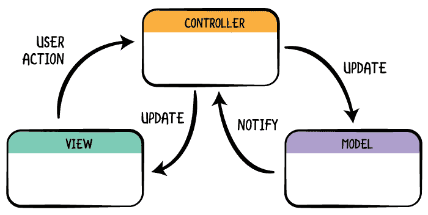
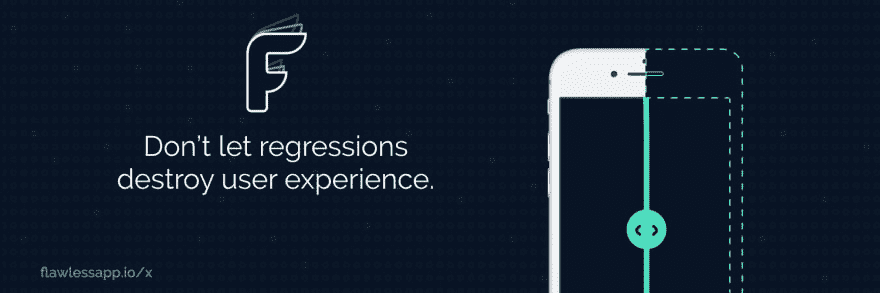
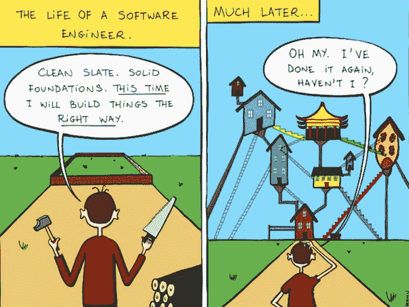
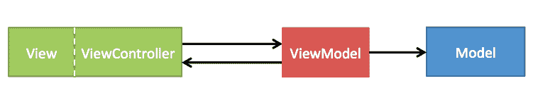
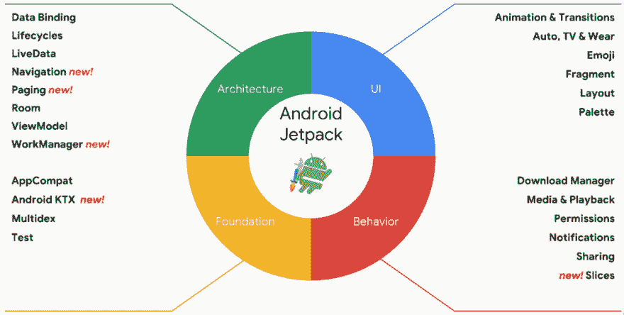
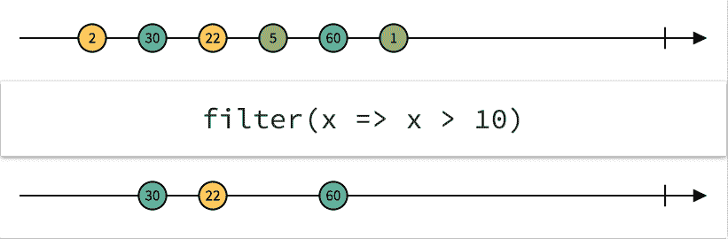

# 体验 MVVM 和反应范式

> 原文：<https://dev.to/onmyway133/a-taste-of-mvvm-and-reactive-paradigm-24p5>

[T2】](https://res.cloudinary.com/practicaldev/image/fetch/s--v6eq0AXY--/c_limit%2Cf_auto%2Cfl_progressive%2Cq_auto%2Cw_880/https://cdn-images-1.medium.com/max/2000/1%2A0dCwvCKQU2S9ntkNVaNUTQ.png)

我喜欢 Swift，就像许多其他面向对象的编程语言一样。Swift 允许您表示具有某些特征并能执行某些操作的真实世界对象。

我倾向于把一个应用程序想象成一个世界，其中每个对象都是一个人。他们工作和交流。如果一个人不能独自完成这项工作，他需要寻求帮助。以一个项目为例，如果经理必须自己做所有的工作，他会发疯的。因此，需要组织和委派任务，需要许多人在项目中合作:设计师、测试人员、scrum master、开发人员。任务完成后，需要通知经理。

这可能不是一个好例子。但至少你明白了在 OOP 中沟通和委托的重要性。当我开始 iOS 编程时，我对“架构”这个词非常感兴趣。但做了一段时间后，这一切都归结为识别和划分责任。这篇文章讲述了 MVC 和简单的[提取类](https://refactoring.com/catalog/extractClass.html)重构到 MVVM，以及如何进一步使用 Rx。你可以自由地创建自己的架构，但是无论你做什么，一致性是关键，这样才不会让你的队友感到困惑或惊讶。

[T2】](https://res.cloudinary.com/practicaldev/image/fetch/s--oVEgpv_b--/c_limit%2Cf_auto%2Cfl_progressive%2Cq_auto%2Cw_880/https://cdn-images-1.medium.com/max/3000/1%2Akhx4a3vNEcrqLHqh7Ljd0w.png)

## 模型视图控制器

看看你最了解的架构，MVC，模型视图控制器的简称。创建新的 iOS 项目时，您总是会得到一个。视图是显示数据的地方，使用 UIView、UIButton、UILabel。模型只是数据的一个花哨的词。它可以是您的实体、来自网络的数据、来自数据库或来自缓存的对象。控制器是模型和视图之间的媒介。

[T2】](https://res.cloudinary.com/practicaldev/image/fetch/s--ldEwDnNr--/c_limit%2Cf_auto%2Cfl_progressive%2Cq_auto%2Cw_880/https://cdn-images-1.medium.com/max/2000/0%2AETgFfqjBaD8SdQBd.png)

## UIViewController 是宇宙的中心

ViewController 的问题是它往往很大。苹果把它作为宇宙的中心，在那里它有很多属性和责任。有许多事情只能用 UIViewController 来做。比如与故事板交互，管理视图，配置视图旋转，状态恢复。UIViewController 设计了许多钩子，供您覆盖和定制。

看看 UIViewController [文档](https://developer.apple.com/documentation/uikit/uiviewcontroller)中的许多部分，没有 UIViewController 你就不能做下面的事情。

```
func viewDidLoad()
var preferredStatusBarStyle: UIStatusBarStyle { get }
UITableViewDataSource
var presentationController: UIPresentationController? { get }
func childViewControllerForScreenEdgesDeferringSystemGestures() -> UIViewController?
func didMove(toParentViewController parent: UIViewController?)
var systemMinimumLayoutMargins: NSDirectionalEdgeInsets
var edgesForExtendedLayout: UIRectEdge
var previewActionItems: [UIPreviewActionItem]
var navigationItem: UINavigationItem
var shouldAutorotate: Bool 
```

Enter fullscreen mode Exit fullscreen mode

随着应用程序的增长，我们需要为其他逻辑添加更多代码。例如网络、数据源、处理多个委托、呈现子视图控制器。当然，我们可以把所有的东西都放在视图控制器上，但是这导致了大视图控制器和滚动技巧的提高。这是你失去责任的大画面的地方，因为所有的东西都留在大视图控制器中。您可能会引入代码重复，而且错误很难修复，因为它们无处不在。

Windows Phone 中的 Page 或 Android 中的 Activity 也是如此。它们用于功能屏幕或部分功能屏幕。有些动作只能通过它们来完成，比如[页面。OnNavigatedTo](https://msdn.microsoft.com/en-us/library/system.windows.controls.page.onnavigatedto%28v=vs.105%29.aspx) ， [Activity.onCreate](https://developer.android.com/guide/components/activities/activity-lifecycle#oncreate) 。

[T2】](https://res.cloudinary.com/practicaldev/image/fetch/s--crV8dv2b--/c_limit%2Cf_auto%2Cfl_progressive%2Cq_auto%2Cw_880/https://cdn-images-1.medium.com/max/3000/0%2AFegPo70Zxmid6brv.png)

## 建筑的流行语

当 ViewController 做很多事情的时候你会怎么做？你把工作转移给其他组件。顺便说一下，如果您希望另一个对象来处理用户输入，您可以使用 Presenter。如果展示者做得太多，那么它会将业务逻辑转移给交互者。还有，可以用的流行语比较多。

```
let buzzWords = [
  "Model", "View", "Controller", "Entity", "Router", "Clean", "Reactive", 
  "Presenter", "Interactor", "Megatron", "Coordinator", "Flow", "Manager"
]
let architecture = buzzWords.shuffled().takeRandom()
let acronym = architecture.makeAcronym() 
```

Enter fullscreen mode Exit fullscreen mode

[T2】](https://res.cloudinary.com/practicaldev/image/fetch/s--_eNJwNDs--/c_limit%2Cf_auto%2Cfl_progressive%2Cq_auto%2Cw_880/https://cdn-images-1.medium.com/max/2000/0%2AN785wG7eDrflu_OT.jpeg)

在所有的流行词汇被组合起来之后，我们得到了一个架构。其中有很多，从简单的提取类重构，拥抱 MVC 或从 Clean Code、Rx、EventBus 或 Redux 中获取灵感。选择取决于项目，有些团队更喜欢一种架构而不是另一种。

## 务实的程序员

人们对什么是好的建筑有不同的看法。对我来说，它是关于关注点的清晰分离、良好的沟通模式和使用的舒适性。体系结构中的每个组件都应该是可识别的，并且有特定的角色。交流必须清晰，这样我们才能知道是哪个对象在互相交流。这与良好的依赖注入一起将使测试更加容易。

理论上听起来不错的东西，实际上未必行得通。分离的域对象很酷，协议扩展很酷，多层抽象很酷。但是太多会是个问题。

如果你对设计模式有足够的了解，你就会知道它们都可以归结为这些简单的原则:

*   封装变化的内容:识别应用程序中变化的方面，并将它们与保持不变的内容分开。

*   编程到接口，而不是实现

*   偏好组合而非继承

如果有一件事我们应该掌握，那就是**作文**。关键是确定责任，并以合理和一致的方式组合它们。和你的队友商量什么最合适。总是带着你也将是未来的维护者的想法写代码。那你就换个写法。

## 不对抗体制

一些架构引入了全新的范式。其中一些很麻烦，需要人们编写脚本来生成锅炉板代码。一个问题有多种解决方法，这很好。但对我来说，有时感觉他们是在与体制抗争。一些任务变得简单，而一些琐碎的任务变得极其困难。我们不应该仅仅因为一种建筑是时髦的，就把自己局限于这种建筑。要务实，不要教条。

在 iOS 中，我们应该拥抱 MVC。UIViewController 不适合全屏显示内容。它们可以包含并被组合以分割功能。我们可以使用[协调器](http://khanlou.com/2015/10/coordinators-redux/)和[流量控制器](https://github.com/onmyway133/blog/issues/106)来管理依赖关系和处理流程。[容器](https://www.swiftbysundell.com/posts/custom-container-view-controllers-in-swift)用于状态转换，嵌入式逻辑[控制器](https://www.swiftbysundell.com/posts/logic-controllers-in-swift)，全屏内容[部分](https://davedelong.com/blog/2017/11/06/a-better-mvc-part-3-fixing-massive-view-controller/)。这种包含 ViewController 的方法很好地配合了 iOS 中的 MVC，也是我更喜欢的做法。

## 模型视图视图模型

[T2】](https://res.cloudinary.com/practicaldev/image/fetch/s--GDjsa7LU--/c_limit%2Cf_auto%2Cfl_progressive%2Cq_auto%2Cw_880/https://cdn-images-1.medium.com/max/2000/0%2AoRX6izHOCsHdhDoW.png)

另一个足够好的方法是将一些任务卸载到另一个对象，我们称之为 ViewModel。名字不重要，你可以叫它反应堆，大师，恐龙。重要的是你的团队要有一个一致的名字。ViewModel 从 ViewController 获取一些任务，并在任务完成时进行报告。Cocoa Touch 中有[种通信模式](https://www.objc.io/issues/7-foundation/communication-patterns/)可以使用，比如委托、闭包。

ViewModel 是独立的，没有对 UIKit 的引用，只有输入和输出。我们可以将许多东西放入视图模型，如计算、格式化、网络、业务逻辑。此外，如果您不希望 ViewModel 变得庞大，您肯定需要创建一些专用对象。ViewModel 是获得瘦 ViewController 的第一步。

## 同步进行

下面是一个非常简单的 ViewModel，它根据用户模型格式化数据。这是同步完成的。

```
class ProfileController: UIViewController {
  override func viewDidLoad() {
    super.viewDidLoad()
    let viewModel = ViewModel(user: user)
    nameLabel.text = viewModel.name
    birthdayLabel.text = viewModel.birthdayString
    salaryLabel.text = viewModel.salary
    piLabel.text = viewModel.millionthDigitOfPi
  }
} 
```

Enter fullscreen mode Exit fullscreen mode

## 异步

我们一直在使用异步 API。如果我们想显示用户的脸书好友数量呢？为此，我们需要调用脸书 API，这个操作需要时间。ViewModel 可以通过闭包返回报告。

```
viewModel.getFacebookFriends { friends in
  self.friendCountLabel.text = "\(friends.count)"
} 
```

Enter fullscreen mode Exit fullscreen mode

在内部，视图模型可以将任务卸载到专用的脸书 API 客户端对象。

```
class ViewModel {
  func getFacebookFriends(completion: [User] -> Void) {
    let client = APIClient()
    client.getFacebookFriends(for: user) { friends in
      DispatchQueue.main.async {
        completion(friends)
      }
    }
  }
} 
```

Enter fullscreen mode Exit fullscreen mode

## Android 中的 Jetpack

[T2】](https://res.cloudinary.com/practicaldev/image/fetch/s--IyNV1OBu--/c_limit%2Cf_auto%2Cfl_progressive%2Cq_auto%2Cw_880/https://cdn-images-1.medium.com/max/2000/0%2AORC4mswaenJBZOwP.png)

谷歌在 Google IO 2017 上推出了 Android 架构组件，现在是 Jetpack 的一部分。它有 ViewModel 和 LiveData，这也是 Android 中应用的一种 MVVM。ViewModel 在配置更改后仍然存在，并以 LiveData 的形式通知结果以供活动使用。

```
class MyActivity : AppCompatActivity() {
    override fun onCreate(savedInstanceState: Bundle?, persistentState: PersistableBundle?) {
        super.onCreate(savedInstanceState, persistentState)

        val model = ViewModelProviders.of(this).get(MyViewModel::class.java)
        model.getUsers().observe(this, { users ->
            // update UI
        })
    }
} 
```

Enter fullscreen mode Exit fullscreen mode

这是我喜欢 ViewModel 的原因之一。如果我们像这样遵循 ViewModel，那么 iOS 和 Android 之间的代码结构就变得相似了。应该不需要一些随机的 Javascript 跨平台解决方案。你学习一次这个概念，然后在 iOS 和 Android 上应用它。我在 iOS 上学习 ViewModel 和 RxSwift，在 Android 上使用 RxJava 和 RxBinding 时感觉就像在家里一样。Kickstarter 项目也证明了这在他们的 iOS 和 Android 应用中运行良好。

## 装订

为了封装闭包，我们可以创建一个名为 Binding 的类，它可以通知一个或多个侦听器。它利用了 didSet，可观察的属性变得清晰。

```
class Binding<T> {
  var value: T {
    didSet {
      listener?(value)
    }
  }
  private var listener: ((T) -> Void)?
  init(value: T) {
    self.value = value
  }
  func bind(_ closure: @escaping (T) -> Void) {
    closure(value)
    listener = closure
  }
} 
```

Enter fullscreen mode Exit fullscreen mode

下面是如何在 ViewModel 中使用它:

```
class ViewModel {
  let friends = Binding<[User]>(value: [])
  init() {
    getFacebookFriends {
      friends.value = $0
    }
  }
  func getFacebookFriends(completion: ([User]) -> Void) {
    // Do the work
  }
} 
```

Enter fullscreen mode Exit fullscreen mode

当获取或更改任何朋友时，ViewController 会相应地更新。这叫做对变化的反应。

```
override func viewDidLoad() {
  super.viewDidLoad()
  viewModel.friends.bind { friends in
    self.friendsCountLabel.text = "\(friends.count)"
  }
} 
```

Enter fullscreen mode Exit fullscreen mode

你经常看到 MVVM 引入反应式框架，这是有原因的。它们提供了许多链接操作符，使反应式编程更容易，更具声明性。

## RxSwift

也许 Swift 中最常见的反应式框架是 [RxSwift](https://github.com/ReactiveX/RxSwift) 。我喜欢它的一点是它遵循了[反应](http://reactivex.io/)的模式。所以如果你已经用过 [RxJava](https://github.com/ReactiveX/RxJava) 、 [RxJs](https://github.com/ReactiveX/rxjs) ，或者 [RxKotlin](https://github.com/ReactiveX/RxKotlin) ，你会感觉更熟悉。

## 可观察的

[T2】](https://res.cloudinary.com/practicaldev/image/fetch/s--rF98G2Ww--/c_limit%2Cf_auto%2Cfl_progressive%2Cq_auto%2Cw_880/https://cdn-images-1.medium.com/max/2000/0%2AGXJMWsuz8LvgkEXb.png)

RxSwift 通过 Observable 统一了同步和异步操作。这是你做一个的方法。

```
class ViewModel {
  let friends: Observable<[User]>
  init() {
    let client = APIClient()
    friends = Observable<[User]>.create({ subscriber in
      client.getFacebookFriends(completion: { friends in
        subscriber.onNext(friends)
        subscriber.onCompleted()
      })
      return Disposables.create()
    })
  }
} 
```

Enter fullscreen mode Exit fullscreen mode

RxSwift 的强大之处在于它众多的运算符，这些运算符可以帮助您将可观察的事物链接起来。这里可以调用 2 个网络请求，等待两个都结束，然后汇总好友。这是非常精简的，可以节省你很多时间。在这里，您可以只订阅可观察的，它将在请求完成时被触发:

```
override func viewDidLoad() {
  super.viewDidLoad()
  viewModel.friends.subscribe(onNext: { friends in
    self.friendsCountLabel.text = "\(friends.count)"
  })
} 
```

Enter fullscreen mode Exit fullscreen mode

## 输入输出

ViewModel 和 Rx 的一个优点是，我们可以使用 Observable 来分离输入和输出，这提供了一个清晰的接口。在[了解更多从开源学习:输入和输出容器](https://github.com/onmyway133/blog/issues/87)。

下面很清楚，我们 fetch 是一个输入，而 friends 是可行的输出。

```
class ViewModel {
  class Input {
    let fetch = PublishSubject<()>()
  }
  class Output {
    let friends: Driver<[User]>
  }
  let apiClient: APIClient
  let input: Input
  let output: Output
  init(apiClient: APIClient) {
    self.apiClient = apiClient
    // Connect input and output
  }
}

class ProfileViewController: BaseViewController<ProfileView> {
  let viewModel: ProfileViewModelType
  init(viewModel: ProfileViewModelType) {
    self.viewModel = viewModel
  }
  override func viewDidLoad() {
    super.viewDidLoad()
    // Input
    viewModel.input.fetch.onNext(())
    // Output
    viewModel.output.friends.subscribe(onNext: { friends in
      self.friendsCountLabel.text = "\(friends.count)"
    })
  }
} 
```

Enter fullscreen mode Exit fullscreen mode

## 无功如何工作

如果你觉得像 Rx，用一段时间后对它们有所了解也是不错的。有一些概念，如信号，信号生产者，可观察的，承诺，未来，任务，工作，发射器，异步和一些人可以有很大的区别。在这里我简单的称之为 Signal，是可以发出数值信号的东西。

## 单子

信号和它的[结果](https://en.wikipedia.org/wiki/Result_type)只是[单子](https://en.wikipedia.org/wiki/Monad_%28functional_programming%29)，是可以映射和链接的东西。

Signal 利用了延迟执行回调闭包。可以推也可以拉。这就是信号如何更新它的值和回调被调用的顺序。

执行回调闭包意味着我们将一个函数传递给另一个函数。并且传入的函数将在适当的时候被调用。

## 同步与异步

Monad 可以处于同步或异步模式。Sync 更容易理解，但 async 是您已经熟悉并在实践中使用的。

基本上，

*   Sync:您可以通过 return 立即获得返回值

*   Aync:您通过回调块获得返回值

下面是一个简单的同步和异步自由函数的例子:

```
// Sync
func sum(a: Int, b: Int) -> Int {
    return a + b
}

// Async
func sum(a: Int, b: Int, completion: Int -> Void) {
    // Assumed it is a very long task to get the result
    let result = a + b

    completion(result)
} 
```

Enter fullscreen mode Exit fullscreen mode

以及同步和异步如何应用于结果类型。请注意异步版本，我们在完成闭包中获得转换后的值，而不是从函数中立即返回。

```
enum Result<T> {
  case value(value: T)
  case failure(error: Error)

  // Sync
  public func map<U>(f: (T) -> U) -> Result<U> {
    switch self {
    case let .value(value):
      return .value(value: f(value))
    case let .failure(error):
      return .failure(error: error)
    }
  }

  // Async
  public func map<U>(f: @escaping ((T), (U) -> Void) -> Void) -> (((Result<U>) -> Void) -> Void) {
    return { g in   // g: Result<U> -> Void
      switch self {
      case let .value(value):
        f(value) { transformedValue in  // transformedValue: U
          g(.value(value: transformedValue))
        }
      case let .failure(error):
        g(.failure(error: error))
      }
    }
  }
} 
```

Enter fullscreen mode Exit fullscreen mode

## 推送信号

给出这样一个连锁信号:

A -(地图)-> B -(平面地图)-> C -(平面地图)-> D -(订阅)

Push Signal 意味着当源信号 A 被发送一个事件时，它通过回调来传播该事件。PushSignal 类似于 RxSwift 中的 PublishSubject。

*   由发送事件到源信号触发。

*   我们必须留住一个人，因为它能留住其他人

*   我们订阅最后一个 D

*   我们将事件发送给第一个 A

*   A 的回调被调用，它又用 A 的映射结果调用 B 的回调，然后 B 的回调用 B 的平面映射结果调用 C 的回调，依此类推。

它类似于[承诺 A+](https://promisesaplus.com/) ，你可以在我的 Then 框架中看到我对承诺 A+ [的快速实现。现在，这里是一个简单 PushSignal 的 Swift 4 实现。](https://github.com/onmyway133/Then/blob/master/Pod/Classes/Promise.swift)

```
public final class PushSignal<T> {
  var event: Result<T>?
  var callbacks: [(Result<T>) -> Void] = []
  let lockQueue = DispatchQueue(label: "Serial Queue")

  func notify() {
    guard let event = event else {
      return
    }

    callbacks.forEach { callback in
      callback(event)
    }
  }

  func update(event: Result<T>) {
    lockQueue.sync {
      self.event = event
    }

    notify()
  }

  public func subscribe(f: @escaping (Result<T>) -> Void) -> Signal<T> {
    // Callback
    if let event = event {
      f(event)
    }

    callbacks.append(f)

    return self
  }

  public func map<U>(f: @escaping (T) -> U) -> Signal<U> {
    let signal = Signal<U>()

    _ = subscribe { event in
      signal.update(event: event.map(f: f))
    }

    return signal
  }
} 
```

Enter fullscreen mode Exit fullscreen mode

下面是如何使用 PushSignal 将一个链从 string 转换成它的长度，你应该看到 4，字符串“test”的长度。

```
let signal = PushSignal<String>()

_ = signal.map { value in
  return value.count
}.subscribe { event in
  if case let .value(value) = event {
    print(value)
  } else {
    print("error")
  }
}

signal.update(event: .value(value: "test")) 
```

Enter fullscreen mode Exit fullscreen mode

## 拉信号

给出这样一个连锁信号:

A -(地图)-> B -(平面地图)-> C -(平面地图)-> D -(订阅)

拉动信号，有时也称为未来信号，是指当我们订阅最终信号 D 时，它会导致前面的信号动作:

*   通过订阅最终信号 D 来触发；

*   我们必须留住 D，因为它能留住其他人；

*   我们订阅最后一个 D；

*   d 的操作运行，它导致 C 的操作运行，…然后 A 的操作运行。在 A 中，任务被执行(如获取网络、检索数据库、文件访问、繁重的计算……)以获得结果，A 的完成被调用。然后，A 的完成调用 B 的完成，其结果由 B 的映射映射，…一直到订户的完成块。

下面是 PullSignal 的 Swift 4 实现。PullSignal 类似于 RxSwift 中的 Observablein 和 ReactiveSwift 中的 SignalProducer。

```
public struct PullSignal<T> {
  let operation: ((Result<T>) -> Void) -> Void

  public init(operation: @escaping ((Result<T>) -> Void) -> Void) {
    self.operation = operation
  }

  public func start(completion: (Result<T>) -> Void) {
    operation() { event in
      completion(event)
    }
  }

  public func map<U>(f: @escaping (T) -> U) -> PullSignal<U> {
    return PullSignal<U> { completion in
      self.start { event in
        completion(event.map(f: f))
      }
    }
  }
} 
```

Enter fullscreen mode Exit fullscreen mode

链是不活动的，直到您在链中的最后一个信号处调用 start，这将触发一直到第一个信号的操作流。运行这个代码片段，您应该看到控制台上显示的字符串“test”的长度为 4。

```
let signal = PullSignal<String> { completion in
  // There should be some long running operation here
  completion(Result.value(value: "test"))
}

signal.map { value in
  value.count
}.start { event in
  if case let .value(value) = event {
    print(value)
  } else {
    print("error")
  }
} 
```

Enter fullscreen mode Exit fullscreen mode

我希望这些片段足够简单，可以帮助你理解信号是如何工作的，以及如何区分冷热信号。要获得一个完全工作的信号框架，您需要实现更多的操作。例如重试、重新启动、节流、排队、展平、过滤、延迟、合并，并像 RxCocoa 一样添加对 UIKit 的支持。在我的[信号](https://github.com/onmyway133/archives/tree/master/Signal/Pod/Classes)回购中了解如何实现。

## 何去何从

建筑是一个非常固执己见的话题。希望这篇文章能给你一些想法，添加到你的决策点。MVC 在 iOS 中占主导地位，MVVM 是好朋友，Rx 是强有力的工具。以下是一些更有趣的阅读材料:

*   [MVVM 非常好](https://ashfurrow.com/blog/mvvm-is-exceptionally-ok/)

*   [好的 iOS 应用架构:MVVM vs MVC vs VIPER](https://academy.realm.io/posts/krzysztof-zablocki-mDevCamp-ios-architecture-mvvm-mvc-viper/)

*   [更好的 MVC](https://www.youtube.com/watch?v=YWVzCd5FYbs)

*   [驯服巨大的复杂性:MVVM、协调员和 RxSwift](https://blog.uptech.team/taming-great-complexity-mvvm-coordinators-and-rxswift-8daf8a76e7fd)

*   [Rx——针对初学者(第 9 部分):可观察到的冷热对比](http://blogs.microsoft.co.il/bnaya/2010/03/13/rx-for-beginners-part-9-hot-vs-cold-observable/)

*   [冷热可观测量](https://github.com/ReactiveX/RxSwift/blob/master/Documentation/HotAndColdObservables.md)

*   [什么时候使用 IEnumerable vs IObservable？](https://stackoverflow.com/questions/17082255/when-to-use-ienumerable-vs-iobservable)

*   [无黑魔法的函数式反应编程](https://www.youtube.com/watch?v=AcDaWe3S75c)

*   [Swift 同步和异步错误处理](https://www.youtube.com/watch?v=mbd6g7NfR-8)

支持我的应用程序

*   [推送 Hero -测试推送通知的纯 Swift 原生 macOS 应用](https://onmyway133.com/pushhero)
*   [PastePal -粘贴板、便笺和快捷方式管理器](https://onmyway133.com/pastepal)
*   [快速检查-智能待办事项管理器](https://onmyway133.com/quickcheck)
*   [Alias - App 和文件快捷方式管理器](https://onmyway133.com/alias)
*   [我的其他应用](https://onmyway133.com/apps/)

❤️❤️😇😍🤘❤️❤️