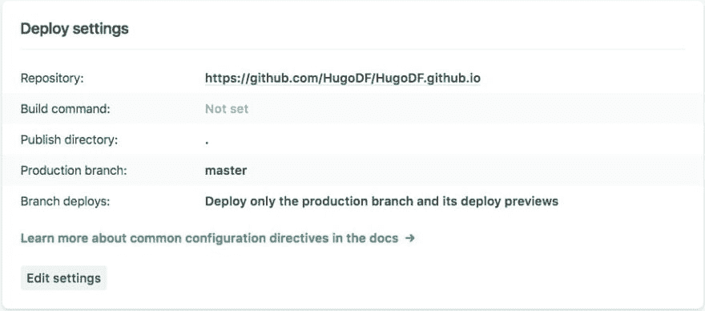

# 一个关于 GitHub 发生灾难时迁移到 Netlify 的小案例研究，以 Cloudflare 为特色

> 原文：<https://dev.to/hugo__df/a-tiny-case-study-about-migrating-to-netlify-when-disaster-strikes-at-github-featuring-cloudflare-4gof>

> 上周一(2018 年 10 月 22 日)GitHub 要去💥，Hugo 的代码中的预定内容没有上线。

作为背景，博客的设置记录在[“打开灯:Hugo vs Hugo 配置文件”](https://codewithhugo.com/switching-the-lights-on-hugo-vs-hugo-config-files/)中。

**TL；** 【T2 博士】(与本文相关)

*   cloudflare DNS+cdn+proxy+https
*   github pages-github 页面
*   [Hugo](https://gohugo.io) 作为静态站点生成器
*   CircleCI 每日部署网站+推送(🤷‍♀️wasn't 在《邮报》上，但我就是这么做的)

这篇文章的内容:

*   关于不专门从事静态托管的企业托管🤔
*   快速迁移到网络生活⏩
*   那为什么要用 Cloudflare 呢？
*   前进的道路

## 关于非静态托管业务的托管🤔

回到这个故事:[codewithhugo.com](https://codewithhugo.com)没有在 GitHub 页面上构建或发布…这意味着我的帖子[“简单但不太简单:如何`micro`改进您的节点应用”](https://dev.to/hugo__df/simple-but-not-too-simple-how-using-zeits-micro-improves-your-node-applications-1kah)，计划在世界协调时上午 7 点发布(我将写下我是如何做到这一点的[订阅以在您的收件箱](https://buttondown.email/hugo) )…没有上线。

事实证明，GitHub 团队自己在此期间努力发布了一个帖子:[“我们在内部使用 GitHub 页面，所有构建都在几个小时前暂停，所以发布这个需要额外的努力。”](https://blog.github.com/2018-10-30-oct21-post-incident-analysis/#2018-october-22-0746-utc)

更糟糕的是，GitHub 的 web-hooks 和其他核心 API 要么不可用，要么非常古怪/混乱。这意味着迁移到 Netlify 并不像通常那样简单:“从 git 部署”不会工作，因为 GitHub 端会出现中断。

## 快速迁移到网络生活⏩

一个很棒的网络功能是“手动部署”，你只需上传一个 zip 文件，它就会将它部署为一个静态站点。谢天谢地，我的 GitHub 页面库中的最新版本有我想要的帖子(只是无法部署)。

在 Netlify 上建立网站非常简单:

*   从 GitHub 下载资源库的 zip 存档(谢天谢地，这没有着火🚒像 GitHub 的其他部分一样)
*   使用仪表板将其上传到 Netlify

此时，该网站在一个`*.netlify.com`域上运行。

获取指向 Netlify 的 codewithhugo.com 域:

*   将 Cloudflare 的 DNS 上的`A`记录更新到 Netlify 的负载平衡器`104.198.14.52`

让我惊讶的是更新发生的速度有多快。DNS 更新需要时间来传播。除了这不是严格意义上的 DNS 更新，因为我使用的是 Cloudflare 的代理 DNS。这意味着如果你`dig codewithhugo.com`你会得到下面的答案部分:

```
;; ANSWER SECTION:
codewithhugo.com. 299 IN A 104.27.140.8
codewithhugo.com. 299 IN A 104.27.141.8 
```

惊喜！🎉这些记录并不指向 Netlify(或 GitHub 页面)，而是指向 Cloudflare(见[https://www.abuseipdb.com/whois/104.27.140.8](https://www.abuseipdb.com/whois/104.27.140.8)和[https://www.abuseipdb.com/whois/104.27.141.8](https://www.abuseipdb.com/whois/104.27.141.8))。然后，Cloudflare 代理 Netlify 的负载平衡器。极好的👏整洁的👏。

## 那为什么要用 Cloudflare 呢？

> 自从 [@github](https://twitter.com/github?ref_src=twsrc%5Etfw) 页面因所有问题而停止构建以来，由于 [@Netlify](https://twitter.com/Netlify?ref_src=twsrc%5Etfw) 的`zip upload`功能和 [@Cloudflare](https://twitter.com/Cloudflare?ref_src=twsrc%5Etfw) 的代理 DNS 服务，我已经能够获得我预定在今天直播的博客帖子。
> 
> 👏👍
> 
> —雨果·迪·弗朗切斯科([@雨果 _ _ df](https://dev.to/hugo__df))[2018 年 10 月 22 日](https://twitter.com/hugo__df/status/1054350487372349440?ref_src=twsrc%5Etfw)

当我第一次发表[《开灯:Hugo vs Hugo 配置文件》](https://codewithhugo.com/switching-the-lights-on-hugo-vs-hugo-config-files/)的时候，我得到的一个反应是:[“你似乎没有解释任何在 GitHub 页面之上使用 CloudFlare 的理由。介意详细说明吗？”](https://dev.to/lietux/comment/4od9)。

对此我回答说([见这里的评论](https://dev.to/hugo__df/comment/5115)):

*   HTTPS(很确定它以前不属于 GitHub 页面上的自定义域名)
*   加拿大
*   域名服务器(Domain Name Server)

即使我也不觉得这很有说服力，现在我想我有一个令人信服的理由来使用 Cloudflare:如果您利用 Cloudflare 的代理 DNS + CDN 服务，您可以在几分钟内更换托管提供商。

我认为由于 Cloudflare 的代理和 Netlify 的手动部署在这种情况下救了我(周一是新闻发布日，我想在那里发布`micro`帖子)，它带来了足够的价值来证明我的堆栈选择。

## 前进的道路

[T2】](https://res.cloudinary.com/practicaldev/image/fetch/s--Jila0s_G--/c_limit%2Cf_auto%2Cfl_progressive%2Cq_auto%2Cw_880/https://d2mxuefqeaa7sj.cloudfront.net/s_5691CB595260242ACD57C6976EE88A660D47EA1777643C78B1E18DEE1EB217B5_1540484787181_image.png)

由于我在 Netlify now 上托管我的静态网站([见“部署选项:Netlify+Dokku on digital ocean vs now . sh，GitHub Pages，Heroku 和 AWS”](http://Deployment%20options:%20Netlify%20+%20Dokku%20on%20DigitalOcean%20vs%20now.sh,%20GitHub%20Pages,%20Heroku%20and%20AWS))，我已经决定也许把 codewithhugo.com[永久地放在那里是个好主意。抱歉 GitHub 页面。](https://codewithhugo.com)

> 如果你想将一个 HTML [@github](https://twitter.com/github?ref_src=twsrc%5Etfw) Pages 站点迁移到 [@Netlify](https://twitter.com/Netlify?ref_src=twsrc%5Etfw) 这里有一个配置示例(TL；dr:使用发布目录" ")【pic.twitter.com/pDvlMXnCoc T4】
> 
> —雨果·迪·弗朗切斯科([@雨果 _ _ df](https://dev.to/hugo__df))[2018 年 10 月 23 日](https://twitter.com/hugo__df/status/1054679262584823808?ref_src=twsrc%5Etfw)

下面是一个将 GitHub 上托管的站点(可以作为 GitHub Pages 站点)部署到 Netlify 的配置示例:

[T2】](https://res.cloudinary.com/practicaldev/image/fetch/s--zBS7lhMa--/c_limit%2Cf_auto%2Cfl_progressive%2Cq_auto%2Cw_880/https://d2mxuefqeaa7sj.cloudfront.net/s_5691CB595260242ACD57C6976EE88A660D47EA1777643C78B1E18DEE1EB217B5_1540486742344_DqL5IruWkAAlwyF.jpg)

很简单，使用`Publish Directory: .`发布根目录，不要设置构建命令。

GitHub Pages 太棒了，我的演示可能还在那里。中断会发生在每个人身上，但是正如他们的事后分析所表明的，GitHub 不是一个静态托管服务🙂。Netlify 的核心业务主张是静态网站托管和部署，这就是为什么从现在开始,[和 Hugo](https://codewithhugo.com) 的代码将会存在👍。

安东尼·坎廷