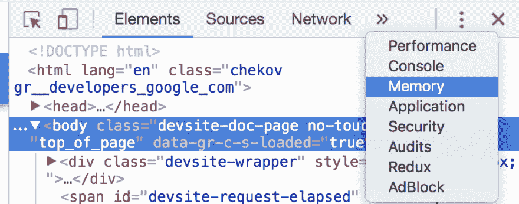
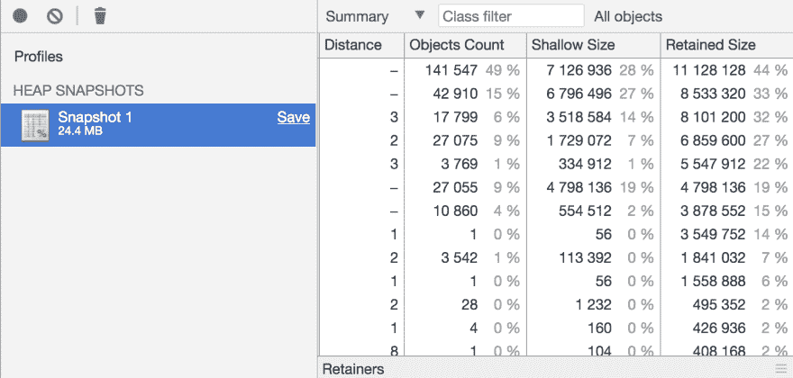
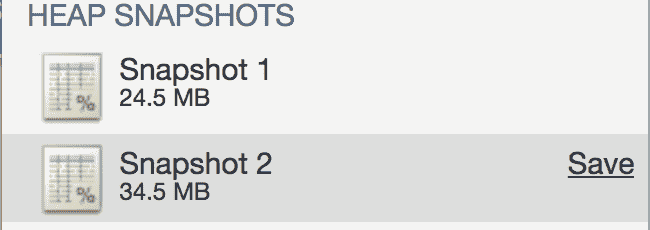
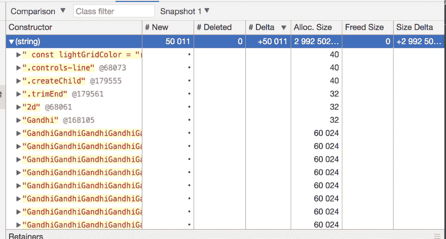

# Javascript 内存泄漏幼儿指南

> 原文：<https://dev.to/kepta/a-toddlers-guide-to-memory-leaks-in-javascript-25lf>

在本文中，我将采用一种非常简单的方法来理解内存泄漏，并尝试诊断它们。

在当今内存丰富的世界中，我们很少担心内存泄漏。但是我不想告诉你，我们生活在一个真实的世界里，没有什么是免费的。

### 哎呀我的花式函数编程

**披露:我绝对热爱函数式编程。**
函数式编程很酷，有了新的 ES6 语法，它变得更酷了。

```
const arrayAddFirst = (a, b) => [a, ...b]; 
```

Enter fullscreen mode Exit fullscreen mode

上面这个例子看起来超级好。除非你和我一起编程，而我盲目地把它放在一个重载循环中😎。

```
result = newData.reduce((p,r) => arrayAddFirst(r, p), []); 
```

Enter fullscreen mode Exit fullscreen mode

现在我不希望你因为上面的傻逼代码来评判我。 **(虚拟拥抱如果你能猜出它是干什么的😁)**

```
 for(var i = 0; i < newData.length; i++) {
    for(var j = 0; j < i; i++) {
        // stuff here
    }
} 
```

Enter fullscreen mode Exit fullscreen mode

上面的代码片段是我们示例的旧版本。注意，很容易看出它将运行`n * (n+1) / 2`次，其中`n`是`newData`的长度。

示例代码中的主要问题是垃圾收集器必须频繁地介入。每次在`.reduce`循环**中创建的花哨的`[a, ...b]`数组都需要从内存**中移除，否则它最终会耗尽所有的内存。

这个例子试图阐明一个重要的事实:记忆不是你最好的朋友。它在 99%的情况下都对你有利，但当它决定刺你时，它会直接刺你的眼睛。

[T2】](https://res.cloudinary.com/practicaldev/image/fetch/s--oHgBHPmY--/c_limit%2Cf_auto%2Cfl_progressive%2Cq_auto%2Cw_880/http://files.explosm.net/comics/Rob/blowdart.jpg)

### 内存泄露…

通常，javascript 应用程序会以两种方式冻结:

无限循环:你可能不小心写了一个永远不会终止的循环。

```
var x = 0;
while(x < 5) {
   console.log(x); // Warning! do not try this at home 
} 
```

Enter fullscreen mode Exit fullscreen mode

内存不足:我们都知道计算机的内存是有限的，如果我们不小心，我们可能会占用所有的内存。

```
var x = [ [1] ];
for(var i = 1; i < 100000; i++) {
    x.push(arrayAddFirst(i, x[i-1])); // Warning! do not try this at home 
} 
```

Enter fullscreen mode Exit fullscreen mode

### 好吧，但是内存泄露怎么办？？

当然，你可以通过小心避免这些不良行为。但是内存泄漏是那些安静地坐着的令人讨厌的魔鬼之一。

让我们定义一台拥有无限资源的计算机，让我们称之为`Deep thought`。我们将在本文`DT-42`中引用`Deep thought`，您将很快看到我们将如何使用`DT-42`来解决内存泄漏问题。

### 内存泄露

简单来说，内存泄漏就是永远等待使用的被遗忘的数据。在我们跳到科学定义之前，让我们看一个例子。

```
 function sayHi() {
    var allNames = [];
    var emoji = '👋';
    return name => {
        allNames.push(name);
        return emoji + name;
        }
} 
```

Enter fullscreen mode Exit fullscreen mode

在这个例子中，每当我们调用时，我们的程序就变得越来越胖。垃圾收集器无法清理`allNames`，因为函数需要它来推送数据。它不知道所有的名字都不会被读取，因此在内存中给它任何空间都是徒劳的。

**维基百科上说:**

> **内存泄漏**是一种[资源泄漏](https://en.wikipedia.org/wiki/Resource_leak)，当一个[计算机程序](https://en.wikipedia.org/wiki/Computer_program)错误地管理[内存分配](https://en.wikipedia.org/wiki/Memory_allocation) [ [1]](https://en.wikipedia.org/wiki/Memory_leak#cite_note-1) 使得不再需要的内存没有被释放时就会发生。

我发现把它看作一种症状会更容易理解这个概念。你的程序是一个病人，他对记忆的热爱无止境地增长。
[](https://res.cloudinary.com/practicaldev/image/fetch/s--7D23QJ9I--/c_limit%2Cf_auto%2Cfl_progressive%2Cq_66%2Cw_880/https://i.pinimg.com/originals/3e/53/d0/3e53d09e86eb0ece8a0351a7f2383f07.gif) 
大多数时候，电脑 **【垃圾收集器】** 足以发现大多数你不再使用的数据，并为你清理它们。但它并不完美，我们还远没有一个比人类更聪明的垃圾收集器。 **(如果我们有一个，那就是写代码而不是我们:P)**

### 给我一些现实生活中的漏洞

我们现实生活中的问题是，我们不会遇到这种微不足道的内存泄漏，最常见的泄漏是隐藏在一段看似运行良好的代码 **(看起来像`arrayAddFirst`**一样无辜的东西)后面。与其抛出一些现实生活中的泄漏，我宁愿向您展示如何识别内存泄漏。

让我们启动 Chrome 来帮助诊断内存泄漏。

1.  打开一个空白页面。
2.  打开开发面板 *(Command+Option+I 或 Control+Shift+I)*
3.  将此示例代码粘贴到控制台中。

```
function sayHi() {
    var allNames = [];
    return name => {
            allNames.push(name);
            return '👋 ' + name;
        }
}
var hello = sayHi();
hello('Gandhi'); 
```

Enter fullscreen mode Exit fullscreen mode

好了，我们已经开始泄漏内存了，现在让我们打开我们的`memory profiler`。

你应该可以在开发工具中找到这个标签。

[T2】](https://res.cloudinary.com/practicaldev/image/fetch/s--JtAwqgYU--/c_limit%2Cf_auto%2Cfl_progressive%2Cq_auto%2Cw_880/https://user-images.githubusercontent.com/6966254/35474233-6264a034-0359-11e8-852a-165687947454.png)

就本文的范围而言，我们将重点关注`Take Heap Snapshot`。该功能可以获取程序当前内存使用情况的快照。

在我的例子中，它看起来像这样:

[T2】](https://res.cloudinary.com/practicaldev/image/fetch/s--LSUEqYHY--/c_limit%2Cf_auto%2Cfl_progressive%2Cq_auto%2Cw_880/https://user-images.githubusercontent.com/6966254/35474258-c402b1f0-0359-11e8-8b1d-6a374bc4ea70.png)

很好，现在我们将运行几次无辜的函数。

```
for(var i=0; i<1000000; i++) {
    hello('Gandhi');
} 
```

Enter fullscreen mode Exit fullscreen mode

如果您拍摄另一个快照，您将看到内存使用量增加。

[T2】](https://res.cloudinary.com/practicaldev/image/fetch/s--ay5-iqh5--/c_limit%2Cf_auto%2Cfl_progressive%2Cq_auto%2Cw_880/https://user-images.githubusercontent.com/6966254/35474314-83a13e00-035a-11e8-815d-835d3b4a0aa2.png)

在我的例子中，有 10 兆字节的完全**差异。在许多实际情况下，几兆字节的跳跃可能是正常的，你可能想要在一段时间内拍摄**多个快照**来排除泄漏。**

您可以通过点击`Summary`下拉菜单并切换到`Comparison`来轻松比较两个快照。

[T2】](https://res.cloudinary.com/practicaldev/image/fetch/s--vHQQfEeD--/c_limit%2Cf_auto%2Cfl_progressive%2Cq_auto%2Cw_880/https://user-images.githubusercontent.com/6966254/35474393-af4e122a-035b-11e8-94cc-6583b4ac01a2.png)

如果您将新快照与之前拍摄的快照进行比较，并将`#Delta`设为降序，您会发现`(string)`中有一个巨大的数字。这是我们的内存泄漏的地方。点击它，你会看到很多`Gandhi`

我真的希望这篇文章能帮助你理解记忆。这只是诊断泄漏的几种方法之一。请查看以下链接，了解更多关于内存的高级知识:

*   [内存管理](https://blog.sessionstack.com/how-does-javascript-actually-work-part-1-b0bacc073cf)
*   [node . js 中的内存膨胀](https://tech.residebrokerage.com/debugging-node-js-memory-problems-d450787d9253)

如果你❤️这篇文章，请分享这篇文章传播的话。

在 Twitter 上联系我 [@kushan2020](https://twitter.com/kushan2020) 。