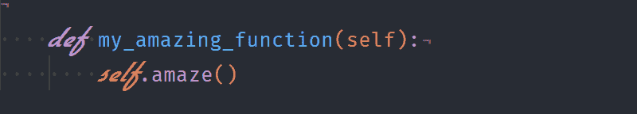

# Visual Studio 代码中运算符 Mono 的可行替代方案

> 原文：<https://dev.to/jandedobbeleer/a-viable-alternative-to-operator-mono-in-visual-studio-code-ge8>

在看到[夜猫子](https://marketplace.visualstudio.com/items?itemName=sdras.night-owl&WT.mc_id=twitter-social-sdras)之后，一个由[莎拉·德拉斯纳](https://twitter.com/sarah_edo/status/997238414390022144) **利用斜体**的使用和支持它的字体为 VSCode 创建的颜色主题，我正在犹豫是购买 Dank Mono(不太成熟，但已经非常好的运营商 Mono 替代品)，还是开始寻找免费的替代品。鉴于我的天性是每两秒钟就转换一次兴趣，我决定不要把钱花在炒作上，而是寻找肯定存在的黑客。

起初，我寻找运营商 Mono 的免费替代品，这引导我走向 Ken Krocken 制作的 FiraCodeiScript。它的作用是让两种字体看起来像一种，所以 Fira 代码是常规字体，Script12 是斜体字体。它们是用 [FontForge](https://fontforge.github.io) 编辑的，这是一种用来创建或改变字体的工具。我的第一印象是*很酷*，但过了一会儿，我忍不住不太喜欢《第 12 集》。

我想我必须**创造我自己的版本**。作为一名程序员，我不想摆弄 GUI 工具，决定使用 Python 脚本，使用 [FontTools](https://github.com/fonttools/fonttools) 编辑字体文件，使它们看起来像一个字体系列。关于如何做到这一点的信息可以在 GitHub 上开源思想库的下一期[中找到。](https://github.com/open-source-ideas/open-source-ideas/issues/10#issuecomment-360999485)

FontTools 结果是与我作对，而不是与我合作，由于某种原因，我总是不知道在哪里找到我需要调整的字段。对更好模块的探索开始了。我的终端字体总是来自[书呆子字体](https://github.com/ryanoasis/nerd-fonts)库，由于许可问题，他们也需要重命名字体，这是开始挖掘的最好地方。

他们使用一个 [Python 脚本](https://github.com/ryanoasis/nerd-fonts/blob/master/font-patcher)来编辑字体文件并添加一些很酷的东西，你猜怎么着，它使用了 FontForge 中包含的 Python 模块。酷！很简单，对吧？没有。我选择使用 Windows 10，这一次，它击中了我的要害。您不能使用`pip install FontForge`安装该模块，它包含在 FontForge 的安装中。在 Linux 上，您可以安装绑定来公开模块，并在您的脚本中使用它，但是在 Windows 上没有这样的选项。

回到思考小屋！看看 FontForge 是如何工作的，它嵌入了 Python 2.7(🤦‍)，它为您提供了开箱即用的 FontForge 模块。实际上，我决定使用 Python 可执行文件来创建脚本。使用 VSCode，您可以调整您的调试设置(位于`projectroot\.vscode\launch.json`)来做到这一点。

```
{  //  Use  IntelliSense  to  learn  about  possible  attributes.  //  Hover  to  view  descriptions  of  existing  attributes.  //  For  more  information,  visit:  https://go.microsoft.com/fwlink/?linkid=830387  "version":  "0.2.0",  "configurations":  [  {  "name":  "Python Experimental: Current File (Integrated Terminal)",  "type":  "pythonExperimental",  "request":  "launch",  "program":  "${file}",  "console":  "integratedTerminal",  "pythonPath":  "C:\\Program Files (x86)\\FontForgeBuilds\\bin\\ffpython.exe"  }  ]  } 
```

Enter fullscreen mode Exit fullscreen mode

这样你就可以*轻松地*导入 FontForge 模块并创建一个脚本，将两个字体文件转换成一个新发明的字体系列。我真的很喜欢 Fira 代码，所以我从 Nerd 字体下载了 [Fura 代码](https://github.com/ryanoasis/nerd-fonts/tree/master/patched-fonts/FiraCode/Regular/complete)来容纳所有有趣的零碎，并且爱上了 [Yellowtail](https://fonts.google.com/specimen/Yellowtail) 来作为斜体变体使用。

```
import fontforge
import uuid

def change_font_data_and_save(font_location, familyname,
                              sub_family, output_dir, uid):
    source_font = fontforge.open(font_location)
    source_font.familyname = familyname
    source_font.fullname = '{} {}'.format(familyname, sub_family)
    source_font.fontname = '{}-{}'.format(familyname, sub_family)
    source_font.appendSFNTName(str('English (US)'), str('Family'),
                               source_font.familyname)
    source_font.appendSFNTName(str('English (US)'), str('SubFamily'),
                               sub_family)
    source_font.appendSFNTName(str('English (US)'), str('UniqueID'),
                               uid)
    source_font.appendSFNTName(str('English (US)'), str('Preferred Family'),
                               source_font.familyname)
    source_font.appendSFNTName(str('English (US)'), str('Compatible Full'),
                               source_font.fullname)
    source_font.generate(output_dir + '/' + source_font.fullname + '.ttf',
                         flags=(str('opentype'), str('PfEd-comments')))

regular_font = 'path_to_fura_code.tff'
italic_font = 'path_to_yellowtail.ttf'
output_dir = './output'
familyname = 'VSCode Font'
uid = str(uuid.uuid4())
change_font_data_and_save(regular_font, familyname, 'Regular', output_dir, uid)
change_font_data_and_save(italic_font, familyname, 'Italic', output_dir, uid) 
```

Enter fullscreen mode Exit fullscreen mode

这就像一个魔咒，你在输出文件夹中得到两种字体，然后你可以安装为一个字体家族，调整 VSCode 使用该字体和利润。与**一个恼人的副作用**。根据两种字体的不同，您可能需要缩放其中一种字体。我这样做是为了让 Yellowtail 在一个以斜体开头的句子中的一些字母被砍掉。在上面的示例中，每当`def`位于一行的位置 0 时，`d`在开始时会被稍微切掉。我不需要解释这不是我想要的效果。

我去看了看其他定制字体，根据他们使用的字体，他们都有同样的问题。另一个更好的解决方案是使用[自定义 CSS 和 JS 插件](https://github.com/be5invis/vscode-custom-css)来改变斜体单词的字体大小(可以通过`mkti`类来区分)。但是，这很重要，如果我们这样做，那么我们就失去了自定义字体的用例。

因此，在浪费了几个小时来解决这个问题之后，我选择了定制 CSS 解决方案。我安装了 Fura 代码和 Yellowtail 字体的所有变体，并使用自定义 CSS 和 JS 插件为`mkti`类创建了一个覆盖。为此，创建一个包含以下内容的文件。根据你的喜好改变字体家族，在玩了几个手写字体后，我最终选择了 [Flottflott](https://www.dafont.com/flottflott.font) 。

```
.mtki {
    font-size: 1.6em;
    font-family: Flottflott;
} 
```

Enter fullscreen mode Exit fullscreen mode

这将使文本更大，但仍然尊重窗口的边界。所以你得到了同样的结果，但是更好。如果您使用的是 Windows，请确保在应用样式时运行提升的 VSCode(并在更新 VSCode 时重新应用)。

继续主题化。我们都使用不同的主题，并不是每个主题都支持斜体关键字。现在，我想教你如何覆盖主题设置，而不是创建一个自定义主题，这样无论你使用什么主题，它们都会被应用。我切换主题，比如衣服(你可以定义这是否适用于很多😲)，所以我不想每次都去摆弄这个。

事实证明，VSCode 遵循 TextMate grammer 语法来定义它需要如何呈现代码。我从另一位未透露姓名的编辑那里找到了一份很好的[指南](https://www.sublimetext.com/docs/3/scope_naming.html)，结合对现有主题及其实现方式的观察，让我得以开始。目前我的配置是这样的。

```
"editor.fontFamily":  "FuraCode NF",  "editor.fontLigatures":  true,  "vscode_custom_css.imports":  [  "file://C:/Users/jan/.vscode_css_settings.css"  ],  "vscode_custom_css.policy":  true,  "editor.tokenColorCustomizations":  {  "textMateRules":  [  {  "scope":  [  "storage.modifier",  "variable.language",  "markup.italic",  "punctuation.definition.keyword",  "keyword.control.import",  "storage.type.class",  "storage.type.function",  "storage.modifier"  ],  "settings":  {  "fontStyle":  "italic"  }  },  {  "scope":  [  //following  will  be  excluded  from  italics  "comment",  "invalid",  "keyword.operator",  "keyword.control.conditional",  "storage.type.function.arrow.js"  ],  "settings":  {  "fontStyle":  ""  }  }  ]  }, 
```

Enter fullscreen mode Exit fullscreen mode

有两个重写，一个显式地说明了什么要被呈现为斜体(并因此添加了`mkti`类)，另一个是排除关键字被呈现为斜体。这样我就可以使用我喜欢的任何主题，我的设置会让正确的单词看起来倾斜而漂亮。这个列表并不完整，还有很多可以添加的。最终，它取决于主题、语言和个人品味来定义它需要什么样的外观。

我希望你在定制你的编辑器时会像我在寻找银弹一样开心😄。

[T2】](https://res.cloudinary.com/practicaldev/image/fetch/s--g6lBOpvv--/c_limit%2Cf_auto%2Cfl_progressive%2Cq_auto%2Cw_880/https://blog.itdepends.be/img/italic.png)

最初发布于:[https://blog.itdepends.be/operator-mono-alternative/](https://blog.itdepends.be/operator-mono-alternative/)