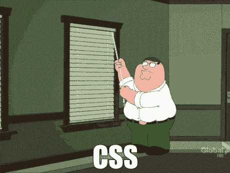

# 一年前，我根本不可能做到这一点，但我刚刚建立了我的第一个网络应用程序。在这里！

> 原文：<https://dev.to/jeremy/a-year-ago-i-never-would-have-been-able-to-do-this-but-i-just-built-my-first-web-app-here-it-is-1534>

大约一年前，我在我的 Atom 编辑器中创建了一个`index.html`文件，在里面输入了`"Hello, World!"`，启动了 *httpserver* ，第一次看到它在我的浏览器中呈现。从那时起直到今天，我一直在花时间学习 Ruby、SQL、HTML、CSS 和 JavaScript。我失败的次数比成功的次数多，但我比以往任何时候都快乐。无论如何，今天弥补了过去的失败，因为(多亏了他们)我刚刚完成了我的第一个完整的网络应用。

### 概念

当我试图弄清楚要建造什么的时候，我牢记了

![[deleted user] image](img/56fbc1337a9836e0802365a3a3022a53.png)

## [已删除的用户]

who told me once to keep it simple, especially when building something for the first time. "Your goal is to learn," he said, "not impress; besides, simple projects done well are impressive for someone at your level."

鉴于此，我知道我只想让我的应用程序有一个 has_many/belongs_to 关系，仅此而已。两个模型，没有连接表，没有问题。这意味着我将有一个用户模型和属于用户的东西。所以我认为一本葡萄酒杂志特别适合这方面的工作。用户`has_many`葡萄酒，和葡萄酒`belongs_to`用户。用户可以输入他们喜欢的葡萄酒的信息，并储存起来以备将来参考。太完美了！

然而，我很难对这个想法感到兴奋，尽管我承诺保持简单。这个想法一直在我的脑海中闪现，让所有用户都能查看每一个葡萄酒条目，而不仅仅是他们自己的，不久之后，我脑海中就有了这个以葡萄酒为中心的社交媒体平台的概念。一旦我把它命名为葡萄酒，就没有回头路了。

### 第一天:测试

我知道我想以测试驱动的方式构建 Vino，这当然意味着我需要首先编写测试。问题是我不知道如何写测试。但是我知道如何阅读测试，我认为现在是学习如何写测试的好时机。

我首先绘制了我的项目的基本结构。我拿出一张纸，潦草地写下七条 RESTful 路线、它们对应的视图以及每条路线包含的内容，然后我对用户如何从登录到注销与 Vino 交互有了一个基本的想法。

作为一名前厨师，我习惯于向前辈们学习。一个厨师，尤其是在发展的早期阶段，会研究和使用食谱，并根据自己的需要进行修改。随着练习的进行，他们开始越来越少的依赖食谱。这类似于我决定学习如何编写测试的方式。我搜索了 GitHub 上的回购，直到我找到了 RSpec 和 Capybara 测试的好例子。我将它们复制到我的 spec 文件中，一行一行地检查，重写它们以适应我对应用程序的期望。最后，我的测试套件中有 42 个测试。它们包括对两种模型的测试，验证它们具有我想要的属性，剩下的是应用程序控制器测试，涵盖了从用户能够登录到不能黑掉 URL 和修改另一个用户的数据的所有内容。编写测试是一整天的工作，但是我获得了关于测试如何工作以及如何编写测试的深入知识，这使得构建 Vino 成为一个更加高效的过程。

### 第二天到第三天:关系

一旦编写了测试，我对构建更有信心了，因为我已经习惯了运行测试和调试。我首先运行模型规范，定义我的类，并为用户模型和 Wine 模型编写迁移。一旦完成，就该运行应用程序控制器规范并定义我的路线了。我真的很喜欢数据库，但当你开始定义你的路线时，那才是你真正开始挖掘并弄清楚逻辑的时候。这就是我编程的目的，所以我真的很喜欢调试我的应用程序。

普里是我最好朋友。因为我是用 Sinatra 开发的，所以我也大量使用了一个叫做 Tux 的宝石，当你在你的控制台上运行`bundle exec tux`时，它会打开一个互动的环境，很像 Pry 和 IRB 的性感情人。

不久，我所有的测试都通过了，我的数据表现正常。我的应用程序工作正常！

不幸的是，它也是丑陋的罪恶。

### 第四天到第七天:HTML 中的冒险

我想让 Vino 看起来漂亮点。对我来说很重要的一点是，尽管我尽可能地保持它的基本，但它是我可以引以为豪的东西。一些我可以指着说“是我干的”而不会尴尬的事情。我差点就成功了。

我的设计技能有限，我仍然想保持应用程序简单。因此，我决定引导它，而不是从头开始编写我的 HTML 和 CSS。出于几个原因，这是有利的。这首先意味着我可以使用一个基本的引导模板(我没有使用主题)，编写大量定制的 HTML 和 CSS，而不需要担心像 clearfix 这样的事情。只要我注意网格，不弄乱我的行和列的大小，所有的部分就会很好地组合在一起。这意味着我不必担心让应用程序响应，因为它会自动。这也意味着我可以使用 Bootstrap 的 javascripts 为 Vino 提供一些不错的特性，在我学习的这个阶段，我通常不会尝试将这些特性融入到 Vino 中。例如，我为不同的特性使用了很多模态，我可以用 HTML 将它们编码出来，用 CSS 将它们样式化，它们会工作。

为了学习如何做到这一点，我跟随了一个关于 w3schools.com 的教程，它带我完成了添加 BootstrapCDN 脚本和为一个社交媒体风格的网站构建一个基本网格的过程。我改变了网格来适应我的需要，并开始设计。我觉得让它看起来像脸书会很有趣，所以我写了 CSS 来实现它，每当我遇到问题时就在谷歌上搜索。

[T2】](https://i.giphy.com/media/5pxnxdzdZfXFK/giphy.gif)

这听起来可能很容易，但我的第一次尝试是一个悲惨的失败。当我试图为每个葡萄酒条目创建卡片时，错误像疯了一样出现，每当我修复一个错误，另一个就会在其他地方出现。这是我玩过的最糟糕的打地鼠游戏。我的改变让我陷入困境，我知道我需要重新开始。所以我运行`git checkout`，开始一个新的分支，并开始重建 HTML。经过一两天的工作，我有了一个我喜欢的布局，并且运行正常。

`git checkout master`
T1】

当我对每个小细节都尽可能满意时，我开始重构代码。我试着让它尽可能的干燥，因为我开始删除代码行，这些代码行在开始时是有用的，但在最终产品中是不必要的。我努力不重复不必要的话。当我构建时，每个视图的所有 HTML 和 CSS 都在每个`.erb`文件中。我将所有的 CSS 移到一个样式表中，并将尽可能多的重复 HTML 移到一个布局中。它肯定可以更干，但我尽我所能缺乏经验允许的。松了一口气，我到了想不出还需要做什么的时刻。至少目前是这样。

`git add .`
`git commit -m "done."`
T2】

我微笑着打开一瓶酒，给自己倒了一杯，然后坐了回去...

...然后看了看标签，火起来`shotgun`，登录，放到我的 app 里。

### 下一步

我想添加像评论这样的功能，这将是一个很好的方式来纳入多对多，或通过关系有 _ 多。我希望更严格的认证，快速消息，登录脸书 OAuth，名单还在继续。我想做的下一件事是构建一个 Rails 应用程序，所以我可能会在 Rails 中重建 Vino 并添加这些功能。

编程有时令人沮丧，我想做点别的。然后我建造了一些东西，记得我有多爱它。我希望我总能找到重新爱上编程的方法。

如果你愿意，你可以查看一下 [GitHub repo](https://github.com/JMSchuurmans/vino) 。