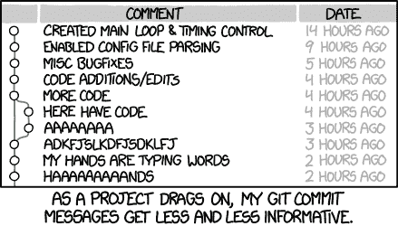

# 专业软件开发一年

> 原文：<https://dev.to/dan_mcm_/a-year-in-professional-software-development-1l7a>

## 从事专业软件开发一年

我在专业软件开发工作中熬过了一年——万岁！

[T2】](https://i.giphy.com/media/hZj44bR9FVI3K/giphy.gif)

我觉得在从一年的计算机科学转换项目中直接出来，投入到软件工程工作一年后，回忆我自己的个人经历可能有一些价值。我很幸运地被一家公司录用了，从那以后，这是一条漫长而繁荣的道路。

有几件事我觉得值得分享，这样那些新进入这个行业的人可以在他们的心态中感到一些安全感，以及他们如何在未来的工作年中发展和适应。以下是我在过去一年学到的重要经验:

### 征求同事的意见&的建议

这似乎是显而易见的，但我与各种各样的开发人员合作过，从典型的 rockstar dev(他一夜之间弹出服务和回购，没有测试覆盖率),到 dev(他对一些产品代码的一行 PR 更改提供令人烦恼的反馈),重要的是你要权衡你同事的意见和你自己的意见。

当你是一个新的开发人员时，每个人似乎都更有经验，但是你越多地接触代码库和不同的人对他们的工作流程的方法，你就开始看到为公司/你的团队提供真正价值的开发人员和那些为自己的方式大量生产代码的开发人员之间的模式，无论他们只是获得一项服务，还是试图强调他们在某个季度或 sprint 期间的独特贡献。双方的经验都可以启发和帮助你的个人发展和工作方式。

### 你们作为一个团队编码。不是作为个人

在过去的一年里，我在多个团队中工作过，发现团队合作对于实现你的目标是至关重要的。(咄)。我发现，那些花时间规划季度或冲刺，并准确考虑其成员的技能和才能的团队，在准确确定工作范围方面处于更有利的位置，并且总体上提供了积极的工作氛围。

作为一名新的开发人员，你需要非常依赖同事们的支持。在你能够做出自己有意义的贡献之前，有一个不可避免的积累时间，然而，重要的是要认识到你的同事有责任帮助你，这不是你应该感到害羞或尴尬的事情。以同样的方式，他们为你提供支持，你应该能够为将来加入的新开发者提供进一步的支持。

这是一个狗咬狗的世界，我们开发者必须团结一致。从团队的角度考虑…

### 写测试&定期维护文档

为了你自己和你同事的健康，如果可以的话，不要在生产中测试代码。

[T2】](https://res.cloudinary.com/practicaldev/image/fetch/s--48C6ZPSd--/c_limit%2Cf_auto%2Cfl_progressive%2Cq_auto%2Cw_880/https://memegenerator.net/img/instances/68965818.jpg)

你需要确保你提交的代码符合某种产品质量标准，具有*高水平的测试覆盖率*和体面的*文档*。这是有益的，原因有很多:

*   任何可能影响您的变更的代码库的未来变更将会在变更完成并且您的测试失败时立即被发现。当服务在一夜之间以有限的测试覆盖范围出现并投入生产时，您或者更糟的是您的团队成员将不得不承担技术债务，以便在以后出现问题时实现测试。

*   质量文档使代码库更容易理解如何在本地、在生产中部署服务，或者只是提供对应用程序是什么以及如何测试其功能的洞察。

*   团队理解。如果你是一个新的开发人员，你将会受益匪浅。您应该将使您的工作符合新开发人员容易采用和使用的标准视为一种责任。这并不是说您的代码应该总是简单的，而是要注意一些基本的东西，包括描述性变量名的使用和详细的本地/生产部署指令的使用。

为了理解你的代码，你需要能够为它编写测试。这是我会公开承认不时会遇到的问题，因为通常编写一段代码比模拟一个服务器调用来测试它更容易。当涉及到你的工作时，总是尝试回到*测试三角形*。

### 让工作流程为你工作

无论你的团队是采用敏捷看板、scrum 还是瀑布式的开发方式，关键在于你要专注于让现有的系统为你所用。在软件开发中有许多工作方法，但我见过的最常见的一种是使用看板(吉拉、特雷罗、LeanKit ),上面有关于史诗、故事、任务、错误以及如何单独处理它们的具体规则。

了解现有的系统，了解如何填写各种票据，了解如何使用现有的系统来优化您的工作流程。如果有一个记录和处理错误的流程，一定要遵循这个系统。我绝不会建议盲目地将系统设置为最佳状态，无论如何，你都应该在每个角落质疑你的团队或更大的组织目前实施的特定“工作方式”是否有意义。

当涉及到处理仪式之类的事情时，如站立、细化、计划、回顾、事后总结，调整并使用对团队成员最有意义的过程。如果没有人从中获得价值，那么每天和你的团队一起站立是没有意义的。同样，如果计划耗时太长或价值极低，请大胆提出，并提供备选方案来尝试和处理遇到的问题。

永远不要随波逐流，尤其是当这种流动不利于团队生产力的时候。

### 带坏带好

就其本质而言，软件开发将是一条充满最高处和最低处的崎岖不平的道路。我有过很多这样的经历:某个代码块的行为不像预期的那样，我用头撞了几个小时的墙，却发现变量名的某个地方有一个打字错误。我也曾在查询 Postgres 数据库时得到奇怪的结果，这应该是一个简单的 order by 查询，却发现我使用的 JS 库有自己的怪癖。甚至有几次，我尝试应用大学里的东西，比如使用 xmlhttp 请求，却发现在 React 中，只需拿出一个 axios 库来做同样的工作要快得多。甚至不要让我开始谈论过去一年我不得不调试的 CORS 相关问题的数量…

这些经历只是我一路走来遇到的少数个人经历，所有这些经历当时都让我抓狂，但从每一次经历中，我都学到了很多，并调整了自己的个人调试方法。如果你没有听说过它，你需要去看看 ***橡皮鸭调试*** 。

[T2】](https://res.cloudinary.com/practicaldev/image/fetch/s--tRcwGuhn--/c_limit%2Cf_auto%2Cfl_progressive%2Cq_auto%2Cw_880/http://hackerboss.com/wp/wp-content/uploads/2009/08/rubber-duck-debugging.jpg)

但是软件工程的核心是解决问题。作为初级开发人员，如果你不犯错误，你就不会学到东西。重要的是，只有在你需要的时候，才尝试寻求帮助。在向更资深的开发人员寻求难题大师的建议之前，不要害怕正面解决问题。你不会因为得到了答案而变得更擅长解谜，你会因为接触到它们并调整你的思维去解决它们而变得更好。

### 大三&大四差不了那么多…

[T2】](https://res.cloudinary.com/practicaldev/image/fetch/s--mBHhErdU--/c_limit%2Cf_auto%2Cfl_progressive%2Cq_auto%2Cw_880/https://scontent-lax3-1.cdninstagram.com/vp/301e9d9db4944fecf45de75d1863eeb6/5C046797/t51.2885-15/e35/s480x480/38904439_194279941296056_1112725133316849664_n.jpg)

我在这里的观点是，尽管花费了大约 4 年的时间从事独立项目或与大学相关的材料，毕业的开发人员都很快将自己贴上了“大三学生”的标签。试着不要认为自己是一个初级开发人员，而是把注意力放在如何成为一个更好的开发人员上

除了经验之外，我发现“初级”和“高级”开发人员的最大区别是处理问题的角度。高级工程师拥有一种当他们遇到 bug 时坚持不懈的属性，并使用他们丰富的知识(即先进的 google/stack-overflow 技能)不断探索各种问题的解决方案。

考虑这样一个场景，你遇到了一个 bug，只是无法让那个 API 工作，你已经尝试了几天，但就是无法解决这个问题。你最终屈服了，向一个高级开发人员寻求帮助。他们离开几分钟去检查一些东西，回来后像变魔术一样用不到 10 分钟的时间就解决了你的问题。你可以打赌，他们能够解决这个问题的原因是他们以前遇到过，记得用谷歌搜索并使用结果 3 来解决它。

现在，我不是用一个笼统的说法来说这就是它在所有情况下的工作方式，开发人员不应该过度依赖这些资源，但总是值得考虑的是，高级开发人员不一定知道所有的答案，而是他们知道如何以不同的方式调试或搜索解决方案。在结对编程过程中，和你的同伴坐在一起，观察他们调试一些错误代码的方法，这是一次非常有价值的经历。这些调试技能将是你能获得的最有价值的技能。

### 最令人惊讶的事情……

当你是一名眼光独到的大学毕业生时，你会很快接触到一些你在职业发展领域可能意想不到的事情。以下几点让我感到惊讶，你可能需要注意:

*   即使是最简单的项目，你也要处理大型的代码库。给它时间去理解新的代码库——试着不要被一些项目的规模所吓倒，与你在大学里可能习惯处理的相比

*   最简单的任务通常会比你最初预期的时间要长。我仍然经常努力给技术票分配准确的故事点。估计完成一项任务所需的时间是随着时间和经验而来的。

*   外部依赖是你能处理的最令人沮丧的事情。无论是依靠另一个团队来启动和运行 X 服务，还是在你实施改变之前合并 Y PR……当依靠外部团队或你无法直接控制的资源时，永远不要低估任务的额外复杂性

*   不同的开发人员对文档和 PRs 等东西持有不同的标准。我试图遵循的一个关键建议是保持一致性。不管一份公关的大小如何，我总是会花时间做一个简短的描述，将它与一个问题联系起来，插入一个变化和一个标志，以表明该公关是否可以接受审查。虽然这可能需要一些额外的时间，但即使是这些基本的事情，保持一致和清晰也是值得的。

*   你将会花费一生的时间来等待连续的流水线、代码编译和许多其他有趣的过程完成。关键是要围绕这些潜在的时间下沉仔细计划你的时间。

[T2】](https://res.cloudinary.com/practicaldev/image/fetch/s---hYgwS8R--/c_limit%2Cf_auto%2Cfl_progressive%2Cq_auto%2Cw_880/https://i.imgur.com/7WtCtRw.jpg)

*   Git 可能是个苛刻的情妇。熟悉使用 git 来做一些事情是很有价值的，比如重新设置提交基准来整理您的 PRs，这样您就不会有长的提交历史链和重复的提交消息或更糟的情况。值得花时间阅读 git 文档，练习跨多个分支工作和基于提交。像 git stash 和 git stash pop 这样的命令也非常有用。

[T2】](https://res.cloudinary.com/practicaldev/image/fetch/s--PF-MonEv--/c_limit%2Cf_auto%2Cfl_progressive%2Cq_auto%2Cw_880/https://imgs.xkcd.com/comics/git_commit.png)

*   比较可能是有害的。尽量不要将你的每周产出与你更有经验的同事进行比较。努力跟上精英中的精英是很自然的事情，但是一开始你需要接受你可能需要以稍微慢一点的速度工作，这是完全可以的。开发人员认为一些知识是理所当然的，当传递工作时，他们经常会忘记他们已经做了 101 次的事情实际上前 4 或 5 次是非常棘手的。人们不会知道你的局限性，除非你能说出它们。这可能会很棘手，取决于你的工作环境，但如果你工作的公司有善解人意的同事和积极的工作环境，你应该可以自由地大声说出你无法在分配的时间内完成任务，或者你可能需要一些关于某项任务的结对编程帮助。

*   你在大学里学到的东西虽然有用，但还不到你在工作中可能用到的一半。在我自己的实际案例中，我从未接触过像 Docker & Kubernetes、持续集成管道、构建工具这样的技术，在某些情况下，甚至是我最终在项目中采用的语言，包括 React/JavaScript 和 Scala/Play/Akka。

*   技术确实经常变化。你可能会使用各种语言、技术栈和部署服务。数据库和许多其他资源。在科技行业工作是一种持续的大学式的经历，提升技能对你的职业生涯至关重要。你可能已经毕业并开始了新的工作，但真正的学习经历才刚刚开始。

## 关闭思绪

我非常感谢有机会转行到科技行业，接触和了解这么多不同的技术。我发现自己处于一个非常幸运的位置，拥有出色的同事和令人惊叹的工作环境，在这种环境下，我有发展自己技能的空间。如果我说这是一次轻松顺利的旅程，那我是在撒谎——在科技行业工作可能具有挑战性，但乐趣就在于此。如果很容易，那就没意思了。

我认为工作的第一年将是许多进入专业软件工程世界的毕业生最艰难的一年。我的建议是，不断提问，尽可能多地找到自己的导师，不断寻求反馈，并继续研究自己的个人项目。依赖在线课程有时会很无聊，有时会让讲师很无聊，但是没有什么能比端到端构建自己的应用程序并将其部署在 AWS/Heroku/Firebase 或任何其他可以访问的服务上更令人兴奋和兴奋。

我希望这里有一些知识可以帮助那些进入专业软件开发领域的人。我很想听听其他即将满一岁的人的经历，并得到你们的反馈。请务必在下方评论您分享给社区的任何建议或经验。

非常感谢阅读。
下次见！