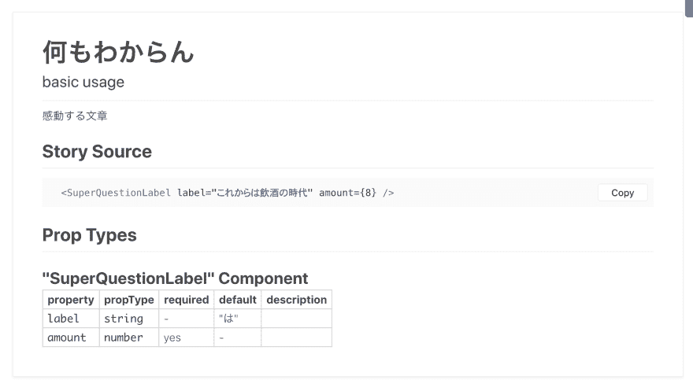
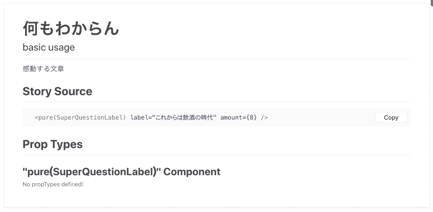
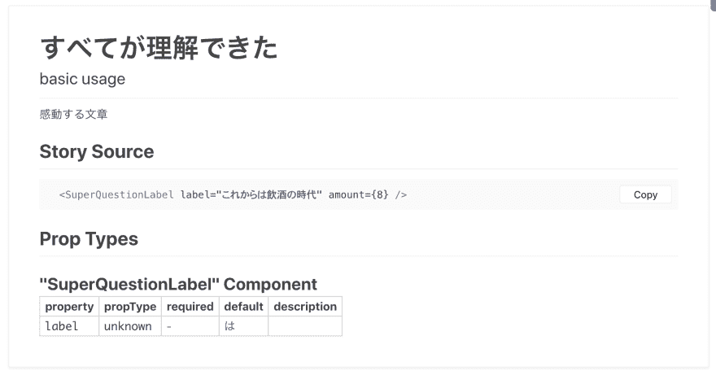

# HoCとStorybook/addon-infoの落とし穴

> 原文:# t0]https://dev . to/origam/hocstorybokaddon-info-lbc

# TL；速度三角形定位法(dead reckoning)

尝试在 addon-info 中显示 Higher-Order Components 时出现错误

# 故事书？故事书/附加信息？

各位，在用[storybook](https://storybook.js.org) 吗？ 制作组件的时候太方便了，所以请一定要使用。 因为说明乏力，所以一看项目页的 examples 就能知道。

那么，storybook 的插件[addon-info](https://www.npmjs.com/package/@storybook/addon-info) 也非常方便。 在 markdown 中描述组件起到了什么作用，以及是为了什么而制作的，可以显示组件在 story 代码中的实际使用情况，还可以通过 Flow 进行类型检查(可能还有 TypeScript )

例如，假设有以下组件:

```
// @flow
import React from 'react';

type Props = {
    /* クエスチョンマークの前につく文字列です */
    label: string,
    /* クエスチョンマークの数 */
    amount: number,
};

/* めっちゃクエスチョンマークをあれします */
const SuperQuestionLabel = ({label, amount}: Props) => (
    <a>{label + '？'.repeat(amount)}</a>
);

SuperQuestionLabel.defaultProps = {
    label: "は",
};

export default SuperQuestionLabel; 
```

Enter fullscreen mode Exit fullscreen mode

然后，story 的代码如下所示。

```
// @flow
import React from 'react';
import { storiesOf } from '@storybook/react';
import { withInfo } from '@storybook/addon-info';

import SuperQuestionLabel from "../SuperQuestionLabel";

storiesOf('何もわからん', module)
    .add(
        'basic usage',
        withInfo(
            '感動する文章'
        )(() => (
            <SuperQuestionLabel
                label={"これからは飲酒の時代"}
                amount={8} />
        ))) 
```

Enter fullscreen mode Exit fullscreen mode

然后，storybook 的该页面会显示 Info 按钮，点击后会显示以下精彩的信息信息。

[T2】](https://res.cloudinary.com/practicaldev/image/fetch/s--DkPF1L_u--/c_limit%2Cf_auto%2Cfl_progressive%2Cq_auto%2Cw_880/https://thepracticaldev.s3.amazonaws.com/i/zr3smtqm77t89bgb8btv.png)

令人感动的文章，组件如何使用的一个例子，还有属性的详细信息，很感动呢。 不仅是 React，现在如果要制作 React 组件的话，storybook、还有 addon-info 都越来越不可缺少。 (遗憾的是，[现在的 addon-info 是只支持 React 的](https://github.com/storybooks/storybook/blob/master/ADDONS_SUPPORT.md)点吗)

# 主要问题

那样的 addon-info 有天敌。 **Higher-Order Components** 。

例如，在 Stateless Functional Components 中使用[recompose](https://github.com/acdlite/recompose) 的功能时。

看看不顺利的例子吧。

```
// @flow
import React from 'react';
import {pure} from 'recompose';

type Props = {
    /* クエスチョンマークの前につく文字列です */
    label: string,
    /* クエスチョンマークの数 */
    amount: number,
};

/* めっちゃクエスチョンマークをあれします */
const SuperQuestionLabel = ({label, amount}: Props) => (
    <a>{label + '？'.repeat(amount)}</a>
);

SuperQuestionLabel.defaultProps = {
    label: "は",
};

export default pure(SuperQuestionLabel); 
```

Enter fullscreen mode Exit fullscreen mode

使用 recompose 的`pure`来抑制组件的重新渲染。 如果是要求高性能的 web APP 应用，经常会使用`pure`和`onlyUpdateForKeys`进行调整吧。 但是，Storybook 的 Info 页面如下所示。

[T2】](https://res.cloudinary.com/practicaldev/image/fetch/s--cdGCfpwX--/c_limit%2Cf_auto%2Cfl_progressive%2Cq_auto%2Cw_880/https://thepracticaldev.s3.amazonaws.com/i/ycinss8x5syqm1yvodaz.png)

岂止是感动，反而会失望。

为什么会变成这样？ 理由是这些`pure`和`onlyUpdateForKeys`是**Higher-Order Components** 。 这样一来，组件就会变成包装在一个组件中的形式，因此 addon-info 就不会收集各种信息了。

# 解

因为问题在于是 HoC 的组件，所以只要将素材的组件记述在 stories 中就可以了。

也就是说，取以下代码。

```
// @flow
import React from 'react';
import {pure} from 'recompose';

type Props = {
    /* クエスチョンマークの前につく文字列です */
    label: string,
    /* クエスチョンマークの数 */
    amount: number,
};

/* めっちゃクエスチョンマークをあれします */
const SuperQuestionLabel = ({label, amount}: Props) => (
    <a>{label + '？'.repeat(amount)}</a>
);

SuperQuestionLabel.defaultProps = {
    label: "は",
};

export const SuperQuestionLabel_ = SuperQuestionLabel;
export default pure(SuperQuestionLabel); 
```

Enter fullscreen mode Exit fullscreen mode

使用`export const`，只是追加输出了素材的组件。

然后，story 用的代码也只要更改输入的内容就可以了。

```
// @flow
import React from 'react';
import { storiesOf } from '@storybook/react';
import { withInfo } from '@storybook/addon-info';

// ここを変更！
import {SuperQuestionLabel_} from "../SuperQuestionLabel";

storiesOf('すべてが理解できた', module)
    .add(
        'basic usage',
        withInfo(
            '感動する文章'
        )(() => (
            <SuperQuestionLabel_
                label={"これからは飲酒の時代"}
                amount={8} />
        ))) 
```

Enter fullscreen mode Exit fullscreen mode

虽然(导出的名字)有点潦草，但是这样 addon-info 就会显示出期待的样子，如下所示。

[T2】](https://res.cloudinary.com/practicaldev/image/fetch/s--AFdxCOCG--/c_limit%2Cf_auto%2Cfl_progressive%2Cq_auto%2Cw_880/https://thepracticaldev.s3.amazonaws.com/i/qni06of2tjduwhimlyh7.png)

# 结论

在 default 中输出 Higher-Order Components 的组件，如果至少想在 Storybook 的 addon-info 中显示概要的话，也可以导出像素的组件

## 文件结束

最后一张图片的 Alt text 是“感动！ 你也哭吧”。

然后我彻底沉迷于这个问题，浪费了两天。 人生短暂，大家的人生也短暂，所以我写了一篇文章，进一步削减了人生的时间，不浪费大家的人生时间……