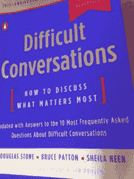
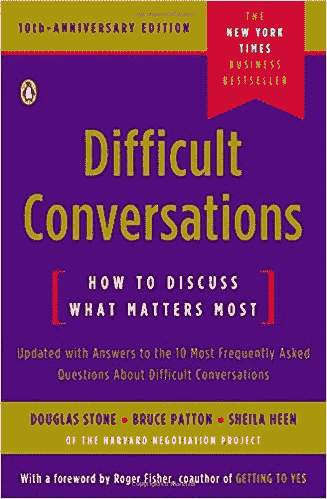

# 关于《艰难的对话》(菲尔·哈克推荐的书)

> 原文：<https://dev.to/elemarjr/about-difficult-conversations-book-recommended-by-phil-haack--1ahc>

[T2】](https://res.cloudinary.com/practicaldev/image/fetch/s--oSLr5XFs--/c_limit%2Cf_auto%2Cfl_progressive%2Cq_auto%2Cw_880/http://www.elemarjr.com/wp-content/uploads/2018/03/DifficultConversationsBook-225x300.jpeg)

几天前，我在 IT 职业劲量播客上听到了菲尔·哈克的精彩采访。以下是剧集描述:

在这一集里，菲尔·哈克告诉我们为什么我们需要为艰难的对话做好准备，以及为什么这会对你的职业生涯有所帮助。Phil 还谈到了编写代码时小心谨慎的重要性，以及为什么应该仔细测试代码。

多棒的表演啊！

在这次采访中，菲尔推荐了一本优秀的书: [**《艰难的对话:如何讨论最重要的事情》。**](https://www.amazon.com.br/Difficult-Conversations-Discuss-What-Matters/dp/0143118447?tag=goog0ef-20&smid=A1ZZFT5FULY4LN&ascsubtag=7b1b405b-689b-4446-bb71-cca294c7c7df) 我听了这本书的音频版，印象深刻。我强烈推荐。

[T2】](https://res.cloudinary.com/practicaldev/image/fetch/s--zALg06ay--/c_limit%2Cf_auto%2Cfl_progressive%2Cq_auto%2Cw_880/http://www.elemarjr.com/wp-content/uploads/2018/03/51HuEI-hISL._SX325_BO1204203200_.jpg)

这本书就如何在富有挑战性的对话中取得成功给出了很多好的建议。这里有一个简短的描述(来自亚马逊):

我们每天都试图或避免艰难的对话——无论是与表现不佳的员工打交道，与配偶发生分歧，还是与客户谈判。哈佛谈判项目(Harvard Negotiation Project)是一个组织，它为你提供了一种循序渐进的方法，让你在压力更小、更成功的情况下进行艰难的对话。您将学习如何:

*   *破译每一次艰难对话的潜在结构*
*   *开始一场没有防御性的对话*
*   *听出没说的意思*
*   *面对攻击和指责保持平衡*
*   *从情绪转移到有效解决问题*

我希望几年前有机会读到(或听到)它。当然，我会有更少压力的时刻。

谢谢菲尔。

O post [关于《艰难的对话》(菲尔·哈克推荐的书)](http://www.elemarjr.com/en/2018/03/about-difficult-conversations/)apareceu primeiro em[Elemar JR](http://www.elemarjr.com/en)。