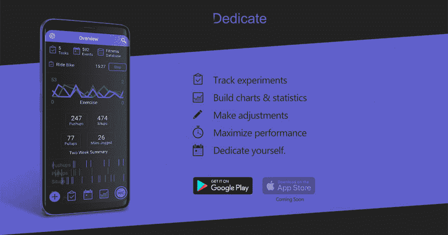

# 即将推出测试版移动应用

> 原文：<https://dev.to/markentingh/about-to-launch-beta-mobile-app-306e>

[T2】](https://res.cloudinary.com/practicaldev/image/fetch/s--6SOy3Qyh--/c_limit%2Cf_auto%2Cfl_progressive%2Cq_auto%2Cw_880/https://thepracticaldev.s3.amazonaws.com/i/2h6pb8cne5jmeh6pevf8.jpg)

在过去的四个月里，我开发了一个科学实验追踪应用，我称之为“奉献”。您可以在[https://dedicate . data silk . io](https://dedicate.datasilk.io)找到关于该应用的更多信息