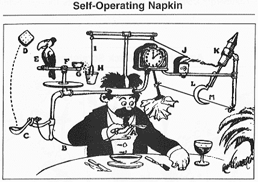

# 为了抽象而抽象

> 原文：<https://dev.to/pbeekums/abstraction-for-the-sake-of-abstraction-1fe4>

包括我自己在内的许多开发人员都有一种根深蒂固的东西，这种东西会产生过度工程化的倾向。也许这就是我们被教导的方式，或者也许这是一种对我们的代码进行“未来检验”的自然愿望。不管怎样，这种倾向是如此强烈，即使意识到这一点也不足以阻止这种行为。

[T2】](https://res.cloudinary.com/practicaldev/image/fetch/s--lIAtBM6T--/c_limit%2Cf_auto%2Cfl_progressive%2Cq_66%2Cw_880/https://blog.professorbeekums.com/img/2018/rube_goldberg_machine.gif)

今年早些时候，我在开发一个帮助用户过滤电子邮件的系统。虽然我喜欢 Gmail 过滤器，但创建和调试它们的经验有点欠缺。我想给马利加一些更简单的东西。我一开始只有两个非常宽泛的选择:

*   将每个联系人的电子邮件标记为重要邮件
*   将重要联系人的电子邮件标记为重要

存储和应用这个设置并不是火箭科学，但这并没有阻止我尝试这样做。

在我的脑海中，是我将在这个新系统中建造的所有东西的宏伟计划。我集思广益了几十个，只选择了这个作为我的规则引擎中的第一个“规则”。因此，我不能只保存设置！我*需要*有一个数据模型来存储我能想到的任何可能规则的设置。这将使将来添加新规则*变得更加容易。*

这种灵活性带来了许多好处，但它不是免费的。我写了数百行复杂的代码来处理我所有的理论案例。我最终花了两周时间来构建这个框架。用一个用例来构建这个特性需要一天的时间。不过没关系！我享受其中的每一分钟，我很快就会收获所有这些额外工作的好处！

快进 7 个月。

当我第一次构建规则引擎时，我有很多关于规则的想法，但我意识到大多数想法的价值都是有问题的。相反，我把大部分时间花在了基于用户反馈和我自己对产品的使用的更重要的事情上。我花了 7 个月才想出另一个值得建立的规则。

大多数电子邮件过滤的问题是，规则通常是在来自某个人或关于某个主题的电子邮件出现后生成的。然而，许多重要的电子邮件来自我们刚认识的人或第一次联系我们的人，关于购买我们的产品，给我们提供一份工作，或只是一般的网络。这封邮件中有一个新奇之处，使它变得重要，这就是为什么我实施的下一个过滤器是将所有新奇的邮件标记为重要。

仅仅这一点还不算太糟糕，我后端的规则引擎会很容易地覆盖它。问题是，这是一个非常独特的经验，从前面的规则。说明/教程/入职培训将会有所不同。基于这些设置的某些操作的警告会有所不同。基于这些设置的可用交互会有所不同。

我为使我的生活更容易而构建的额外抽象层实际上会在处理所有这些具体情况时使事情变得更困难。虽然我很喜欢写这段代码，但这是为了抽象而抽象。这是几年前我发誓不再做的事情，现在我又在重复这个错误。

我所构建的*感觉*像是复杂的工程，但是不必要的复杂性使得事情更难测试，更难跟踪产品缺陷，更难构建新的东西。做用户研究时尤其如此，因为做用户研究的目的是我不确定未来 6 个月可能需要什么。

老实说，我无法完全解释这个谬误。也许是因为 90%的软件不是火箭科学，好的产品不需要复杂的代码，但是复杂的代码*比*写起来有趣得多。我可能有一些深层的编程需求，而这些需求不一定仅仅通过构建一个伟大的产品就能得到满足。或者，也许我年轻时养成的习惯仍在促使我本能地做出某些决定。

不管怎样，我希望我最终戒掉了这个习惯。我删除了我的规则引擎，并在不到两天的时间内重建了我的旧规则和新规则。仍然有一些抽象，但是它简单了很多，并且为代码库提供了实际的好处。我现在的抽象不仅仅是抽象的，还有一个目的。