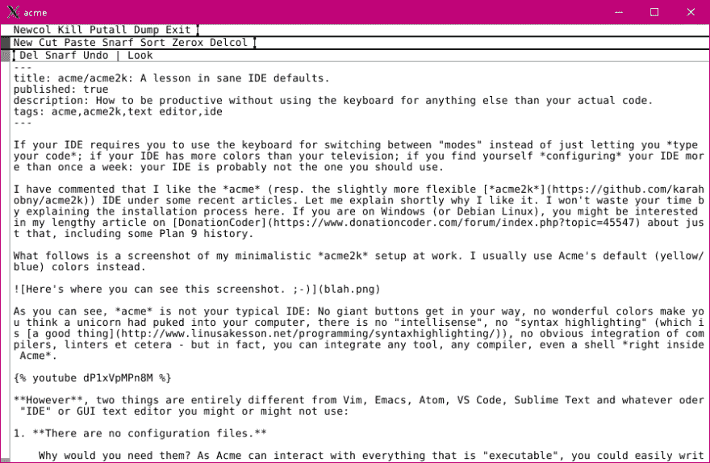

# acme/acme 2k:sane IDE 默认值的一个教训。

> 原文：<https://dev.to/tux0r/acmeacme2k-a-lesson-in-sane-ide-defaults-2cb6>

如果您的 IDE 要求您使用键盘在“模式”之间切换，而不是仅仅让您*键入代码*；如果你的 IDE 比你的电视机有更多的颜色；如果你发现自己*每周不止一次地配置*你的 IDE:你的 IDE 可能不是你应该使用的那个。

我评论过我喜欢的 [*极致*](http://acme.cat-v.org/) (分别是。稍微灵活一点的 [*acme2k*](https://github.com/karahobny/acme2k) ) IDE 在最近的一些文章下。让我简单解释一下我为什么喜欢它。我不会浪费你的时间在这里解释安装过程。如果你是 Windows(或 Debian Linux)用户，你可能会对我在 [DonationCoder](https://www.donationcoder.com/forum/index.php?topic=45547) 上的长篇文章感兴趣，包括一些 9 号计划的历史。

以下是我在工作中的极简 *acme2k* 设置截图。我通常使用 Acme 的默认颜色(黄色/蓝色)。

[T2】](https://res.cloudinary.com/practicaldev/image/fetch/s--Ta8cqjNB--/c_limit%2Cf_auto%2Cfl_progressive%2Cq_auto%2Cw_880/https://thepracticaldev.s3.amazonaws.com/i/662p4p4f8iwq6iytpej6.png)

正如你所看到的， *acme* 不是你典型的 IDE:没有巨大的按钮挡住你的路，没有美妙的颜色让你觉得一只独角兽吐到了你的电脑里，没有“智能感知”，没有“语法高亮”(这是[的一件好事](http://www.linusakesson.net/programming/syntaxhighlighting/))，没有编译器、linters 等的明显集成——但事实上，你可以集成任何工具、任何编译器，甚至是 Acme 内部的 shell *。*

[https://www.youtube.com/embed/dP1xVpMPn8M](https://www.youtube.com/embed/dP1xVpMPn8M)

**然而**，有两样东西与 Vim、Emacs、Atom、VS Code、Sublime Text 或任何你可能使用或可能不使用的“IDE”或 GUI 文本编辑器完全不同:

1.  没有配置文件。

    你为什么需要它们？由于 Acme 可以与所有“可执行”的东西进行交互，因此您可以轻松地编写一个应用程序，与编辑器窗口中的所有东西进行交互。有人已经为你准备好了 T1。

    你的优势:你不会浪费时间配置(或者:*错误配置* ) Acme，直到它适合你。你就是不能。

    **你的缺点:**如果你不喜欢默认设置，Acme 不适合你。( *acme2k* 虽然添加了主题——但要在编译时配置。)

2.  鼠标是你的命令模式。

    就像`vi`和它的精神继承者一样(在较小程度上，“现代”编辑器的“命令模式”有`Ctrl`键和弦)，Acme 有“插入模式”和“命令模式”。然而，Acme 在一个重要方面是不同的:任何与将文本输入到当前缓冲区没有直接关系的事情都需要用鼠标来完成，或者用鼠标和弦，或者用鼠标中键单击工具栏中的匹配命令。

    常见问题:“那不会拖你的后腿吗？”-不，不是真的。作为一名高效的开发人员，您可能会花大部分时间编写新代码，而不是修改现有代码。即使你需要这样做，直接点击你想输入的地方也比指示你的光标向上移动两行，向右移动五列，然后进入插入模式要容易得多。

    你的优势:你会清楚地区分*编辑文本*和*处理你的缓冲*。后者是在没有键盘的情况下完成的。( *acme2k* 增加了几个键绑定，让那些来自其他编辑器的人更容易使用。)

    你的缺点:你需要把你的思想开放一点。这不像是“从 Sublime Text 转移到 Atom”，这像是“从 IBM PC 转移到 PlayStation”。您需要忘记您所知道的关于使用 IDE 的一切。但是有可能这正是*所需要的*——仅仅因为*其他人*用他们键盘控制的 IDE*快*，并不意味着*你*也会快。

我以后大概会参考这篇文章。我希望有人会在乎。