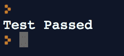
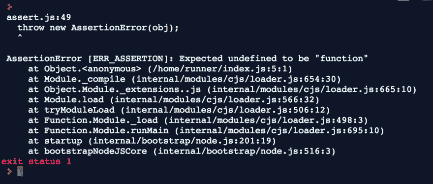

# 节点中的临时单元测试

> 原文：<https://dev.to/klamping/ad-hoc-unit-testing-in-nodejs-3gfp>

最近，我一直在使用 Electron 和 Vue 编写一个原型桌面应用程序。

放下那些“最佳实践”,尽可能多、尽可能快地编写代码，这真的很有趣。

我放弃的最佳实践之一是单元测试。我 100%相信它的价值，但只是在正确的情况下。

在我项目的这个阶段，我没有一个明确的规范，我的功能随着我的感觉来来去去，我正在编写的代码非常程序化(例如，将我的数据库与我的 Vue 组件挂钩)。

对我来说，当你在代码中使用逻辑操作符(比如 if this then that)时，单元测试的真正好处就显现出来了。我现在没那么多钱。

但是...有一个组件需要一点数据操作。我需要将一组文件路径转换成一个结构化的对象。

我需要转这个:

```
['./test/specs/a.js', './test/specs/b.js', './test/specs/a/a.js'] 
```

Enter fullscreen mode Exit fullscreen mode

在想这样的事情:

```
[{
  title: 'test',
  children: [{
    title: 'specs',
    children: [{
      title: 'a.js'
    }, {
      title: 'b.js'
    }, {
      title: 'a',
      children: [{
        title: 'a.js'
      }]
    }]
  }]
}] 
```

Enter fullscreen mode Exit fullscreen mode

在我编写代码的时候，我知道这将是一个利用单元测试的好机会。我知道我的输入是什么，也知道我想要的输出是什么。

* * *

快速提示:我在我的 YouTube 频道 :
[https://www.youtube.com/embed/442gztJZi2w](https://www.youtube.com/embed/442gztJZi2w) 上放了一段视频，涵盖了所有这些

* * *

一组单元测试真的可以帮助我验证我的代码在工作，并且给我清晰的目标和即时的反馈，[这两者都是进入一个良好的流程状态的必要条件](https://en.wikipedia.org/wiki/Flow_(psychology)#In_the_workplace)。

尽管如此，我不想分散自己写实际代码的注意力。

我还没有为这个项目编写任何单元测试，所以我还没有建立测试框架。如今，运行它们并不太复杂，但我真的不想陷入兔子洞，去研究最好的框架、模拟库等，以及如何将所有这些整合到一个电子/Vue 应用程序中。

我真的需要一个便宜、简单的测试框架的替代品，这就是“特别的”单元测试的出现。

## 编写一个非常基本的单元测试框架

运行单元测试需要两个主要特性:测试运行器和断言库。

NodeJS 附带了一个简单的断言库作为核心模块。一个非常基本的测试运行程序可以用大约 10 行代码编写。

这样，我就有了对代码进行单元测试的基本计划:

*   将我想要测试的函数移动到一个单独的文件中，以便于加载
*   在它旁边创建一个新的测试文件
*   在该文件中，加载“assert”库和我的函数文件，编写一些测试，并在末尾添加我的迷你 runner。
*   使用`node` cli 在命令行上运行我的测试

## 将我的函数移动到一个单独的文件

从技术上讲，我不需要这样做，但有很多好的理由这样做。

最重要的是，它使得在我的测试文件中加载我的函数更加容易。

因为我正在构建一个 Vue 应用程序，所以我使用了`.vue`文件语法，这不是简单的 JavaScript。

这意味着我需要做一些神奇的事情，让我的测试文件理解如何加载 Vue 组件，这样我就可以得到我想要测试的代码。

我不想这样做，所以我只是将代码移到一个单独的文件中，然后在我的 Vue 组件中需要它。感谢 Node/Webpack 中的模块支持！

移动我想要测试的功能的另一个很好的理由是，它迫使我删除任何硬编码集成到 Vue 中，因为那会给我的单元测试带来麻烦。

例如，在我的一个函数的末尾，我使用`this.data = parsedData`将最终解析的值赋给我的 Vue 组件。

对我来说，这是一行愚蠢的代码，因为它将集成代码与功能代码混在了一起。

相反，我应该将那个`parsedData`值返回给任何调用它的代码，并让它处理集成。这将使我所有的功能代码与其他代码分开，有助于关注点的分离等等。

没有编写一个测试，我已经通过清除几个坏习惯改进了我的代码(把所有东西都放在一个文件中，在同一个函数中混合关注点)。

这里有一个虚拟文件(我们称之为`doSomething.js`)让你了解我的新文件是什么样子的:

```
function doSomething(input) {
  // do some stuff to input
  let output = input * 2

  // if not right, do it again
  if (output < 10) {
    output = doSomething(output)
  }

  // some other condition that I need to test
  if (output > 10 && input === 3) {
    // here's some strange edge case I need to handle
    output += ' was 3'  
  }

  // return the value
  return output
}

module.exports = {
  doSomething
} 
```

Enter fullscreen mode Exit fullscreen mode

## 创建我的测试文件

随着代码的移动和清理，我现在可以开始测试它了。

我在与函数文件相同的文件夹中创建了我的测试文件，因为这样可以将它们放在附近，所以我记得测试文件就在那里。

为了给它命名，我给我的函数文件取了一个名字，并在那里添加了`.test`。因此给定`doSomething.js`，我将我的测试文件命名为`doSomething.test.js`。

这样，我(以及我使用的任何程序)可以区分代码文件和测试文件，尽管这两个文件是紧挨着的。

现在是时候布局我的测试文件了。

我需要做的第一件事是需要我的函数文件和节点的断言库。这很容易做到:

```
const assert = require('assert');
const { doSomething } = require('./doSomething.js') 
```

Enter fullscreen mode Exit fullscreen mode

有了这个，我就可以编写我的第一个测试了，这将是一个简单的断言`doSomething`加载。我通过检查它是一个函数来做到这一点:

```
const actual = typeof doSomething;
assert(actual === "function", `Expected ${actual} to be "function"`);
console.log('Test Passed') 
```

Enter fullscreen mode Exit fullscreen mode

这实际上是我编写第一个测试并准备运行所需要做的全部工作。

如果我通过`node doSomething.test.js`运行该代码，并且一切正常，它看起来像:

[T2】](https://res.cloudinary.com/practicaldev/image/fetch/s--hjLDJPCU--/c_limit%2Cf_auto%2Cfl_progressive%2Cq_auto%2Cw_880/https://blog.kevinlamping.com/conteimg/2018/06/1-success.png)

如果我的代码有问题(比如我忘记导出函数)，断言将抛出一个错误，如下所示:

[T2】](https://res.cloudinary.com/practicaldev/image/fetch/s--fbjbeMmP--/c_limit%2Cf_auto%2Cfl_progressive%2Cq_auto%2Cw_880/https://blog.kevinlamping.com/conteimg/2018/06/2-fail.png)

因为断言抛出一个错误，所以`console`消息永远不会被写出，因为 node 在抛出错误后会立即停止执行。

以下是目前为止的代码:

[https://repl.it/@klamping/HuskyLavishArchives?lite=true](https://repl.it/@klamping/HuskyLavishArchives?lite=true)

### 简单、有效的测试组织

我可以像这样继续写我的断言，但是它会很快变得笨拙，而且断言错误消息肯定是一个丑陋的怪物。

我真的很想给我的测试命名，这样我就可以进行一些良好的组织，并在我下周忘记时得到测试检查什么的提示(以及帮助显示错误消息)。

因为 JavaScript 中的几乎所有东西都是对象，所以我应该让我的测试也是对象！

我稍后会说明原因，但我是这么想的:

```
const tests = {
  'doSomething should be a function' : function () {
    const actual = typeof doSomething;
    assert(actual === "function", `Expected ${actual} to be "function"`);
  }
} 
```

Enter fullscreen mode Exit fullscreen mode

虽然代码多了一点，但很快就会有回报。

在这种新的格式下，我的支票不会再自动运行了。我需要在文件的末尾调用它来实现这个奇迹。

我可以通过运行`tests['doSomething should be a function']()`来做到这一点，但是天哪，这是一个臃肿的解决方案。

相反，我可以遍历我的对象属性，以编程方式运行每个测试函数。

我可以通过使用 [Object.keys](https://developer.mozilla.org/en-US/docs/Web/JavaScript/Reference/Global_Objects/Object/keys) 从`tests`对象中获取一个数组，然后使用 [forEach](https://developer.mozilla.org/en-US/docs/Web/JavaScript/Reference/Global_Objects/Array/forEach) 循环遍历该数组。

```
Object.keys(tests).forEach((test) => {
  tests[test]()
}) 
```

Enter fullscreen mode Exit fullscreen mode

### 不管外面发生了什么，只要坚持测试

有了这样的改变，现在无论我写多少测试，它们都将在文件的末尾运行，没有任何额外的工作。

除非其中一个没有通过，否则它会立即停止执行。

有点糟糕。

让我们通过使用[来解决这个问题...挡块](https://developer.mozilla.org/en-US/docs/Web/JavaScript/Reference/Statements/try...catch)。

对于你正在运行一些代码(通常是调用一个单独的函数)，并且有一点点可能会爆炸的情况，块是完美的。

与处理 RUD ( [快速非计划反汇编](https://space.stackexchange.com/questions/10022/who-coined-the-phrase-rapid-unscheduled-disassembly))不同，`try...catch`块允许我们更优雅地处理错误。它还让我们能够继续运行剩余的代码，尽管会抛出错误。

为了使用它，我们将容易出错的函数包装在一个`try`块中，然后在我们的`catch`块中处理任何错误:

```
Object.keys(tests).forEach((test) => {
  try {
    tests[test]()
    console.log(`Passed: '${test}'`)
  } catch (e) {
    console.error(`Failed: '${test}' - ${e.message}`)
  }
}); 
```

Enter fullscreen mode Exit fullscreen mode

现在我们所有的测试都会运行，即使其中一个失败了。而且，我们带回了成功的消息，同时美化了测试失败的消息。

这是一次成功的运行:

[T2】](https://res.cloudinary.com/practicaldev/image/fetch/s--3CLm5A3q--/c_limit%2Cf_auto%2Cfl_progressive%2Cq_auto%2Cw_880/https://blog.kevinlamping.com/conteimg/2018/06/3-passed.png)

这里有一个失败的例子:

[T2】](https://res.cloudinary.com/practicaldev/image/fetch/s--5KQDot6n--/c_limit%2Cf_auto%2Cfl_progressive%2Cq_auto%2Cw_880/https://blog.kevinlamping.com/conteimg/2018/06/4-fail.png)

下面是更新后的代码:

[https://repl.it/@klamping/ForkedUnitedAcrobat?lite=true](https://repl.it/@klamping/ForkedUnitedAcrobat?lite=true)

这肯定是一个更好的错误信息，对不对？

### 但是失败了，那不应该意味着什么吗？

有一些叫做“[退出代码](https://en.wikipedia.org/wiki/Exit_status)的小东西，程序用它们来让其他程序知道它们是否成功运行。

它们对于构建系统非常方便，因为你可以让父进程知道子进程不知何故搞砸了，让它停止前进，给你机会马上处理问题。

在节点中，[退出代码在各种条件下自动发送](https://nodejs.org/api/process.html#process_exit_codes)，但主要的两个是:

0 -没有出错，文件按预期完成运行
1 -未捕捉到致命异常(如某些东西爆炸)

当我们让我们的断言在没有那个`try...catch`块的情况下爆炸时，NodeJS 会以代码 1 退出，让任何其他进程知道它。

但是当我们添加了我们的`try...catch`块时，我们停止了抛出错误，Node 开始为每个测试运行返回一个代码 0，即使是那些失败的。

退出代码的功能非常好，如果能恢复的话会很酷。

嗯，我们可以这样做；我们需要做的就是调用 Node 的`process.exit`函数，并传入我们想要发送的状态。

为此，我们将定义一个变量，将其设置为 0，如果我们的任何测试失败，则将它更改为 1。在所有测试运行之后，我们将把那个变量发送给`process.exit`函数，让 Node 知道发生了什么:

```
let exitCode = 0;
Object.keys(tests).forEach((test) => {
  try {
    tests[test]()
    console.log(`Passed: '${test}'`)
  } catch (e) {
    exitCode = 1
    console.error(`Failed: '${test}' - ${e.message}`)
  }
})

process.exit(exitCode) 
```

Enter fullscreen mode Exit fullscreen mode

好吧，这解决了电脑的问题，但是我们人类呢？我们也希望得到一些状态方面的提示！

现在，所有的信息看起来都差不多。如果失败的测试是大胆的，让我们知道发生了一些奇怪的事情，那就太好了。

当我们在终端中运行这段代码时，我们可以将[转义序列](https://stackoverflow.com/a/41407246/150552)发送到控制台输出中，以改变它的显示方式。

我们想要两个:

*   bright(" \ x1b[1m])，基本上只是加粗
*   Reset ("\x1b[0m ")，重置格式。对于失败后运行的测试很重要

我们可以像处理字符串一样将这些代码传递给我们的“控制台”调用。

下面是更新后的`console.error`调用:

```
console.error('\x1b[1m', `Failed: '${test}' - ${e.message}`, '\x1b[0m') 
```

Enter fullscreen mode Exit fullscreen mode

“明亮”设置是在开始时添加的，然后“重置”序列是在结束时设置的，以降低亮度。

在添加了几个测试(故意让一个测试失败)之后，输出如下所示:

[T2】](https://res.cloudinary.com/practicaldev/image/fetch/s--nyLAlqYL--/c_limit%2Cf_auto%2Cfl_progressive%2Cq_auto%2Cw_880/https://blog.kevinlamping.com/conteimg/2018/06/5-fail.png)

下面是更新后的代码:

[https://repl.it/@klamping/BlackDarkgreyObject?lite=true](https://repl.it/@klamping/BlackDarkgreyObject?lite=true)

## 这甚至节省了时间吗？！？

这就是我的临时测试设置。总的来说，我可能会花更多的时间去尝试和写这篇文章，而不是仅仅坚持使用流行的框架。

但是我真的很喜欢这个练习，并且认为这是一个简单单元测试的好方法，尤其是当你不想安装任何外部依赖项的时候。

这也很好，因为我可以将测试视为编写更好代码的小工具，而不是检查“真正的程序员”列表的一些琐事。

对于那些对代码覆盖率上瘾的人，这里有一个“100%覆盖率”徽章，可以贴在你的 repo 自述文件上:

[T2】](https://res.cloudinary.com/practicaldev/image/fetch/s--0a0TcbjH--/c_limit%2Cf_auto%2Cfl_progressive%2Cq_auto%2Cw_880/https://blog.kevinlamping.com/conteimg/2018/06/coveralls_100.svg)

* * *

标题图片由 [Artem Sapegin](https://unsplash.com/photos/DErxVSSQNdM?utm_source=unsplash&utm_medium=referral&utm_content=creditCopyText) 在 [Unsplash](https://unsplash.com/search/photos/coding?utm_source=unsplash&utm_medium=referral&utm_content=creditCopyText) 上拍摄