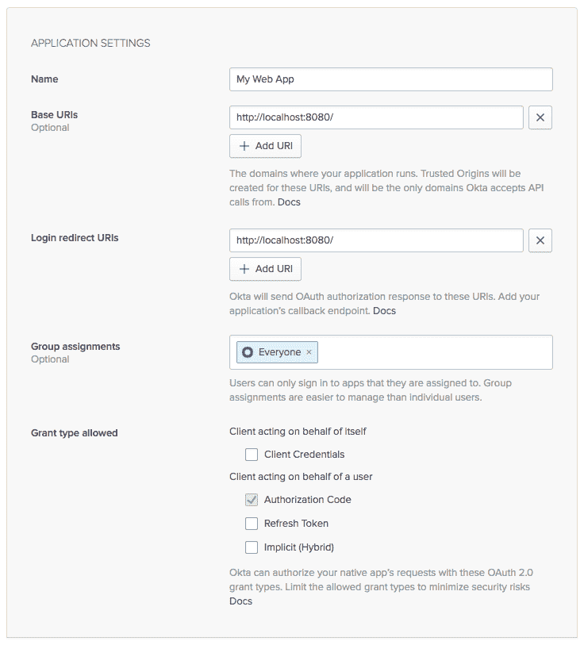
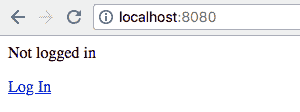
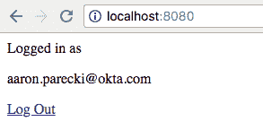

# 在 5 分钟内为你的 PHP 应用添加认证

> 原文：<https://dev.to/oktadev/add-authentication-to-your-php-app-in-5-minutes-5e04>

你有没有发现自己构建了一个应用程序，需要添加身份验证，害怕建立另一个用户名和密码数据库？在这篇文章中，我将向您展示使用 [Okta](https://developer.okta.com/) 在 5 分钟内为一个简单的 PHP 应用程序添加身份验证是多么容易。通过利用 Okta 简单的 OAuth API，我们可以通过让 Okta 处理困难的部分来轻松解决认证用户的大部分挑战。

[https://www.youtube.com/embed/o7JW5uPDc5w](https://www.youtube.com/embed/o7JW5uPDc5w)

要学习本教程，你首先需要一个 Okta 开发者账户(如果你还没有账户的话)，[免费注册](https://developer.okta.com/signup/)，完成后请回到这里。为了简单起见，我们不会在这个例子中使用任何外部 PHP 库或依赖项。

我们将从一个 PHP 文件开始演示我们的应用程序的登录/注销状态。然后我们将集成 [Okta API](https://developer.okta.com/product/authentication/) 来认证用户，并在用户登录后找到他们的用户名。您可以使用本指南作为向您自己的实际应用程序添加身份验证的基础。

## 设置示例 PHP 应用程序

如果你想跳到已完成的项目，可以查看 GitHub 上的[源代码。这篇文章在完成的项目中构建代码，并一步一步地解释它。](https://github.com/aaronpk/quick-php-authentication)

用以下内容创建一个新文件`index.php`。这将根据用户是否登录(PHP 会话中是否有用户名)来设置我们的应用程序的两个不同的“视图”。

```
<?php
// Begin the PHP session so we have a place to store the username
session_start();

// If there is a username, they are logged in, and we'll show the logged-in view
if(isset($_SESSION['username'])) {
  echo '<p>Logged in as</p>';
  echo '<p>' . $_SESSION['username'] . '</p>';
  echo '<p><a href="/?logout">Log Out</a></p>';
  die();
}

// If there is no username, they are logged out, so show them the login link
if(!isset($_SESSION['username'])) {
  $authorize_url = 'TODO';
  echo '<p>Not logged in</p>';
  echo '<p><a href="'.$authorize_url.'">Log In</a></p>';
} 
```

Enter fullscreen mode Exit fullscreen mode

有了这个简单的框架，我们就有了开始添加身份验证的地方。这个应用程序现在在会话变量中寻找一个“用户名”,当它被设置时，认为用户已经登录。

接下来，让我们添加一个简单的函数，我们将在对 Okta 进行 API 调用时使用它。这个函数将发出一个 HTTP 请求，并返回 JSON 解码的响应。它接受一个 URL 和一个可选的参数数组。如果有参数，它将使用参数作为 HTTP 主体发出 POST 请求。否则，它向给定的 URL 发出 GET 请求。因为我们所做的所有 API 调用都会产生一个 JSON 响应体，所以这个函数解码 JSON 响应并返回结果对象。

```
function http($url, $params=false) {
  $ch = curl_init($url);
  curl_setopt($ch, CURLOPT_RETURNTRANSFER, true);
  if($params)
    curl_setopt($ch, CURLOPT_POSTFIELDS, http_build_query($params));
  return json_decode(curl_exec($ch));
} 
```

Enter fullscreen mode Exit fullscreen mode

## 在 Okta 中创建 OAuth 应用程序

在我们进一步深入之前，我们需要配置我们的 Okta 开发人员帐户，以获得一个客户端 ID 和密码，用于与 API 对话。在 Okta 开发者账户的应用部分，点击**添加应用**，选择**Web** 。我们需要对默认应用程序设置进行的唯一更改是将回调 URL 更改为`http://localhost:8080/`，因为我们正在这个 PHP 文件中编写整个流程。

[T2】](https://res.cloudinary.com/practicaldev/image/fetch/s--T9edQdin--/c_limit%2Cf_auto%2Cfl_progressive%2Cq_auto%2Cw_880/https://developer.okta.com/assets-jekyll/blog/five-minute-php-app-auth/application-settings-55cfffa7f970d17c5ef13b7a0587e1e4de9997489fb3ce8dd29eb2d4b819e9ae.png)

点击**完成**，你将进入下一个屏幕，在那里你可以获得你的新客户 ID 和密码。将这两个值复制到下面的变量中，并将这个块添加到 PHP 文件的顶部，就在`session_start()` :
之后

```
$client_id = '';
$client_secret = '';
$redirect_uri = 'http://localhost:8080/'; 
```

Enter fullscreen mode Exit fullscreen mode

我们还需要找到授权服务器元数据 URL。从顶部菜单中选择**API**->-**授权服务器**。您应该在列表中看到一个授权服务器，`default`。点击并复制客户端下的元数据 URI 和重定向行:

```
$metadata_url = 'https://{yourOktaOrg}/oauth2/default/.well-known/oauth-authorization-server';
// Fetch the authorization server metadata which contains a few URLs
// that we need later, such as the authorization and token endpoints
$metadata = http($metadata_url); 
```

Enter fullscreen mode Exit fullscreen mode

## 建立登录网址

现在，我们已经准备好开始构建登录 URL，在这里我们可以发送用户进行身份验证。用以下代码替换行`$authorize_url = 'TODO';`。

```
 // Generate a random state parameter for CSRF security
  $_SESSION['state'] = bin2hex(random_bytes(5));

  // Build the authorization URL by starting with the authorization endpoint
  // and adding a few query string parameters identifying this application
  $authorize_url = $metadata->authorization_endpoint.'?'.http_build_query([
    'response_type' => 'code',
    'client_id' => $client_id,
    'redirect_uri' => $redirect_uri,
    'state' => $_SESSION['state'],
    'scope' => 'openid',
  ]); 
```

Enter fullscreen mode Exit fullscreen mode

这段代码设置了 OAuth 授权代码流的开始。如果您想了解关于这些参数的更多细节，我在之前的博客中写过关于授权代码流的文章:[什么是 OAuth 2.0 授权代码授权类型？](https://developer.okta.com/blog/2018/04/10/oauth-authorization-code-grant-type)

我们现在已经有足够的能力来尝试这个了。从命令行，导航到包含您的`index.php`文件的文件夹，并启动一个 PHP 服务器:

```
php -S 127.0.0.1:8080 
```

Enter fullscreen mode Exit fullscreen mode

现在你可以在浏览器 [http://127.0.0.1:8080/](http://127.0.0.1:8080/) 中访问这个页面，你会看到你的登录提示。

[T2】](https://res.cloudinary.com/practicaldev/image/fetch/s--DU_Nm1Wx--/c_limit%2Cf_auto%2Cfl_progressive%2Cq_auto%2Cw_880/https://developer.okta.com/assets-jekyll/blog/five-minute-php-app-auth/login-prompt-7ab0c5f8e73efe1fb1e9353b2b11f221022bf8448336495a3bfdb2d5601924ab.png)

暂时不要单击链接，因为我们仍然需要设置处理回调和获取访问令牌。

## 处理 OAuth 重定向

当用户点击登录 URL 时，它们被发送到 Okta 授权服务器。授权服务器将要求他们登录(如果他们还没有登录的话)，然后生成一个临时授权码，并将用户重定向回这个应用程序。为了验证用户确实登录了，应用程序需要检查这个临时授权码是否有效，方法是在 Okta 的授权服务器上将它换成一个访问令牌。

在您的客户机 ID 配置行和呈现注销视图的部分之间，我们将添加一个新的部分，处理将授权代码交换为访问令牌。

让我们从在查询字符串中添加对授权代码的检查开始。您的代码现在应该看起来像这样。

```
// ...
$metadata = http($metadata_url);

if(isset($_GET['code'])) {

  // TODO: we'll work on filling out this section next

}

if(!isset($_SESSION['username'])) {
// ... 
```

Enter fullscreen mode Exit fullscreen mode

在这个新的部分中，代替我们刚刚添加的“TODO”注释，让我们首先添加一些错误检查。我们首先检查授权服务器是否返回了用户开始登录时设置的相同状态参数。

```
 if($_SESSION['state'] != $_GET['state']) {
    die('Authorization server returned an invalid state parameter');
  }

  if(isset($_GET['error'])) {
    die('Authorization server returned an error: '.htmlspecialchars($_GET['error']));
  } 
```

Enter fullscreen mode Exit fullscreen mode

也有可能授权服务器在这里返回一个错误，所以如果发生这种情况，我们将显示错误。

接下来，我们需要从 URL 获取授权代码，并在令牌端点将其交换为访问令牌。为此，我们使用来自元数据响应的令牌端点，并在 API 调用中包含我们的客户机 ID 和秘密:

```
 $response = http($metadata->token_endpoint, [
    'grant_type' => 'authorization_code',
    'code' => $_GET['code'],
    'redirect_uri' => $redirect_uri,
    'client_id' => $client_id,
    'client_secret' => $client_secret,
  ]);

  if(!isset($response->access_token)) {
    die('Error fetching access token');
  } 
```

Enter fullscreen mode Exit fullscreen mode

如果一切顺利，我们将在`$response`对象中获得一个访问令牌。除了找出登录的人之外，我们实际上不需要访问令牌，所以我们不会将它存储在任何地方。相反，我们将使用它向令牌自省端点发出请求。

```
 $token = http($metadata->introspection_endpoint, [
    'token' => $response->access_token,
    'client_id' => $client_id,
    'client_secret' => $client_secret,
  ]);

  if($token->active == 1) {
    $_SESSION['username'] = $token->username;
    header('Location: /');
    die();
  } 
```

Enter fullscreen mode Exit fullscreen mode

这段代码获取访问令牌，并将其与客户端凭证一起发送到令牌自省端点。自省端点告诉我们登录者的用户名。如果令牌是活动的，我们在会话中设置用户名，然后重定向回主页。现在用户名已经在会话中了，我们的“应用程序”认为用户已经登录，我们看到了带有用户电子邮件地址的登录页面！

[T2】](https://res.cloudinary.com/practicaldev/image/fetch/s--QLHGyREN--/c_limit%2Cf_auto%2Cfl_progressive%2Cq_auto%2Cw_880/https://developer.okta.com/assets-jekyll/blog/five-minute-php-app-auth/logged-in-288782c2ba408ead03839baa510e70c0561309d8c5481e94db97102978c1614c.png)

希望这是一个有用的例子，说明在一个简单的 PHP 应用程序中添加身份验证是多么容易！显然，这是一个极简的例子，实际上你的应用程序更有特色，可能更好地组织到多个文件中。但是您应该能够将您在这里学到的东西应用到您正在使用的其他框架或用例中！

你可以在 [GitHub](https://github.com/aaronpk/quick-php-authentication) 上看到这个应用的完整源代码。

## 进一步阅读

有关 OAuth 的更多信息和教程，请查看我们的其他博客帖子！

*   [什么是 OAuth 2.0 授权码授予类型？](https://developer.okta.com/blog/2018/04/10/oauth-authorization-code-grant-type)
*   什么是 OAuth 2.0 隐式授权类型？
*   [用 Symfony 4 和 Vue 构建一个基本的 CRUD 应用](https://developer.okta.com/blog/2018/06/14/php-crud-app-symfony-vue)
*   [开始使用 Spring Boot、OAuth 2.0 和 Okta](https://developer.okta.com/blog/2017/03/21/spring-boot-oauth)

一如既往，我们希望听到你对这篇文章的看法，或者任何其他的东西！请在评论中或在 Twitter 上联系我们！