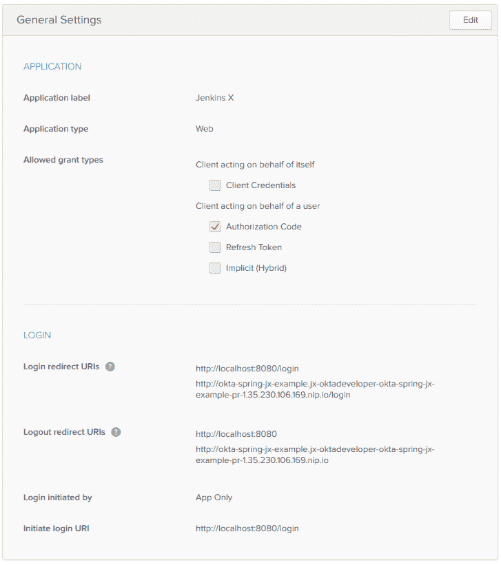

# 使用 Jenkins X 和 Kubernetes 将 CI/CD 添加到您的 Spring Boot 应用程序中

> 原文：<https://dev.to/oktadev/add-cicd-to-your-spring-boot-app-with-jenkins-x-and-kubernetes-1jld>

在过去五年的软件开发中发生了很多事情。构建、部署和编排软件的含义已经发生了巨大的变化。从内部托管软件到公共云，以及从虚拟机(VM)到容器的转变。容器比虚拟机运行起来更便宜，因为它们需要更少的资源，并且作为单个进程运行。转向容器降低了成本，但也带来了如何大规模运行容器的问题。

Kubernetes 于 2014 年 6 月 6 日首次开源。Google 已经使用容器很多年了，并且使用一个叫做 Borg 的工具来大规模管理容器。Kubernetes 是 Borg 的开源版本，在过去的四年中已经成为事实上的标准。

它成为一个标准的过程很大程度上是由所有的大玩家推动的。Red Hat、IBM、Amazon、Microsoft、Oracle 和 Pivotal——每个主要的公共云提供商都有 Kubernetes 的支持。

这对开发人员来说非常好，因为它提供了一种打包应用程序(在 Docker 容器中)并将其部署在任何 Kubernetes 集群上的方法。

## 使用 CI/CD、Kubernetes 和 Jenkins X 进行高性能开发

高绩效团队几乎总是技术成功的必要条件，持续集成、持续部署(CI/CD)、小迭代以及快速反馈是构建的基石。为您的云本机应用程序设置 CI/CD 可能会很困难。通过自动化一切，开发人员可以将宝贵的时间用于交付实际的商业价值。

你如何使用集装箱、连续交付和 Kubernetes 成为一个高绩效的团队？这就是詹金斯 X 的用武之地。

> “Jenkins X 的想法是为所有开发人员提供他们自己的 nevil 航海管家，帮助您在持续交付的海洋中航行。”詹姆斯·斯特拉坎

[T2】](https://res.cloudinary.com/practicaldev/image/fetch/s--fWhxPqJn--/c_limit%2Cf_auto%2Cfl_progressive%2Cq_auto%2Cw_880/https://developer.okta.com/assets/blog/spring-boot-jenkins-x/jenkins-x-06edfd4fd18047600da1631ba5fd06b8b742a2beb710a93f7489332e9ffb5894.svg)

Jenkins X 帮助您在 Kubernetes 中自动化您的 CI/CD——您甚至不必学习 Docker 或 Kubernetes！

## 詹金斯 X 是干什么的？

Jenkins X 可以自动安装、配置和升级 Kubernetes 上的 Jenkins 和其他应用程序(Helm、Skaffold、Nexus 等)。它使用 Docker 映像、舵图和管道来自动化应用程序的 CI/CD。它使用 [GitOps](https://www.weave.works/blog/gitops-operations-by-pull-request) 来管理环境之间的升级，并通过评论 pull 请求来提供大量的反馈，因为这些请求会影响阶段和生产。

## 詹金斯 X 入门

要安装 Jenkins X，您首先需要在您的机器或云提供商上安装`jx`二进制文件。谷歌云可以获得 300 美元的积分，所以我决定从这里开始。

### 在谷歌云上安装 Jenkins X，创建集群

导航到[cloud.google.com](https://cloud.google.com)并登录。如果您没有帐户，请注册免费试用。去控制台(右上角有链接)激活 Google Cloud shell。将以下命令复制并粘贴到 shell 中。

```
curl -L https://github.com/jenkins-x/jx/releases/download/v1.3.79/jx-linux-amd64.tar.gz | tar xzv
sudo mv jx /usr/local/bin 
```

Enter fullscreen mode Exit fullscreen mode

**注意:** Google Cloud Shell [会在一个小时](https://cloud.google.com/shell/docs/limitations#custom_installed_software_packages_and_persistence)后终止你主目录外的任何更改，所以你可能需要重新运行这些命令。好消息是他们将会出现在你的历史中，所以你只需要点击向上箭头进入。您也可以删除上面的`sudo mv`命令，将下面的命令添加到您的`.bashrc`中。

```
export PATH=$PATH:. 
```

Enter fullscreen mode Exit fullscreen mode

使用以下命令在 GKE (Google Kubernetes 引擎)上创建一个集群。您可能需要[为您的帐户启用 GKE](https://console.cloud.google.com/projectselector/kubernetes) 。

```
jx create cluster gke --skip-login 
```

Enter fullscreen mode Exit fullscreen mode

如果提示您下载，请确认您要安装`helm`。系统会提示您选择一个 Google 云区域。我建议挑一个离你家近的。我选择了`us-west1-a`，因为我住在科罗拉多州丹佛附近。对于 Google Cloud 机器类型，我选择了`n1-standard-2`，并使用默认的最小(3)和最大(5)节点数。

对于 GitHub 名称，键入您自己的名称(如`mraible`)和您在 GitHub 注册的电子邮件(如`matt.raible@okta.com`)。我试图使用`oktadeveloper`(GitHub 的一个组织)，但我无法让它工作。

**注意:**如果您的帐户启用了双因素认证，GitHub 集成将会失败。如果你想成功完成这个过程，你需要在 GitHub 上禁用它。:-/

当提示安装入口控制器时，点击**输入**表示**是**。点击**再次输入**选择默认域。

系统会提示您创建一个 GitHub API 令牌。点击[提供的网址](https://github.com/settings/tokens/new?scopes=repo,read:user,read:org,user:email,write:repo_hook,delete_repo)，将其命名为“Jenkins X”。将令牌的值复制并粘贴回您的控制台。

安装完成后，喝杯咖啡，喝点成人饮料，或者做些俯卧撑。这可能需要几分钟。

下一步是将 API 令牌从 Jenkins 复制到您的控制台。按照控制台中提供的说明进行操作。

当你完成后，运行`jx console`并点击链接登录到你的 Jenkins 实例。点击**管理**并升级 Jenkins 及其所有插件(插件管理器>滚动到底部并选择全部)。如果您未能执行此步骤，您将无法从 GitHub pull 请求导航到 Jenkins X CI 流程。

### 创建 Spring Boot App

当我第一次开始使用 Jenkins X 时，我试图导入一个现有的项目。即使我的应用程序使用了 Spring Boot，但它在根目录中没有`pom.xml`，所以 Jenkins X 认为它是一个 Node.js 应用程序。为此，我建议先创建一个空白的 Spring Boot 应用程序，以确认 Jenkins X 设置正确。

从云壳创建一个基本的 Spring Boot 应用:

```
jx create spring -d web -d actuator 
```

Enter fullscreen mode Exit fullscreen mode

这个命令使用 [Spring Initializr](https://start.spring.io) ，所以会提示您一些选择。以下是我用过的答案:

| 问题 | 回答 |
| --- | --- |
| 语言 | `java` |
| 组 | `com.okta.developer` |
| 假象 | `okta-spring-jx-example` |

**提示:**为你的神器选择一个简短的名字将会省去你的痛苦。Jenkins X 对版本名称有 53 个字符的限制，而`oktadeveloper/okta-spring-boot-jenkinsx-example`将导致超出两个字符。

选择 git 用户名、初始化 git 和提交消息的所有缺省值。如果不想使用个人帐户，可以选择一个组织来使用。运行以下命令来观察应用程序的 CI/CD 管道。

```
jx get activity -f okta-spring-jx-example -w 
```

Enter fullscreen mode Exit fullscreen mode

运行`jx console`，点击产生的链接，如果您想要更丰富的视觉效果，请导航到您的项目。

[T2】](https://res.cloudinary.com/practicaldev/image/fetch/s--6hbUC7sd--/c_limit%2Cf_auto%2Cfl_progressive%2Cq_auto%2Cw_880/https://developer.okta.com/assets/blog/spring-boot-jenkins-x/jx-console-218555ae4b7cda6108cb48d15e26a7b07bae408f50b13845496a07be904ac03e.png)

该过程将执行几项任务:

1.  为您的项目创建一个[版本](https://github.com/oktadeveloper/okta-spring-jx-example/releases/tag/v0.0.1)。
2.  为您的临时环境项目创建一个[拉请求](https://github.com/mraible/environment-marespring-staging/pull/1)。
3.  将其自动部署到试运行环境，以便您可以看到它的运行。

```
Merge status checks all passed so the promotion worked!
Application is available at: http://okta-spring-jx-example.jx-staging.35.230.106.169.nip.io 
```

Enter fullscreen mode Exit fullscreen mode

**注意:**由于 Spring Boot 默认不提供欢迎页面，当你打开上面的网址时会得到一个 404。

### 使用 Jenkins X 将您的 Spring Boot 应用部署到生产环境中

默认情况下，Jenkins X 只会自动部署到暂存。您可以使用
手动[从暂存升级到生产](http://jenkins-x.io/developing/promote/)

```
jx promote okta-spring-jx-example --version 0.0.1 --env production 
```

Enter fullscreen mode Exit fullscreen mode

您可以使用 [`jx edit environment`](https://jenkins-x.io/commands/jx_edit_environment/) 将您的生产环境更改为使用自动部署。

既然您已经知道了如何将 Jenkins X 与一个基本的 Spring Boot 应用程序结合使用，那么让我们看看如何通过一个更真实的例子来实现它。

## 保护你的 Spring Boot 应用并添加一个有角度的 PWA

在过去的几个月里，我写了一系列关于用 Ionic/Angular 和 Spring Boot 构建 PWA(渐进式网络应用)的博文。

1.  [使用 Okta 保护您的加密货币财富跟踪 PWA](https://developer.okta.com/blog/2018/01/18/cryptocurrency-pwa-secured-by-okta)
2.  [使用 Okta(而非本地存储)安全存储您的用户数据](https://developer.okta.com/blog/2018/01/23/replace-local-storage-with-okta-profile-attributes)
3.  [用 WireMock、Jest、量角器和 Travis CI 测试 Spring Boot API 和角形组件的指南](https://developer.okta.com/blog/2018/05/02/testing-spring-boot-angular-components)
4.  [将您的安全 Spring Boot + Angular PWA 作为单个工件进行部署](https://developer.okta.com/blog/2018/06/18/spring-boot-angular-auth-code-flow)

这是这个系列的最后一篇博文。我相信这是一个真实应用程序的优秀例子，因为它有许多单元和集成测试，包括使用量角器的端到端测试。让我们看看如何使用 Jenkins X 和 Kubernetes 实现生产自动化！

从 GitHub 克隆您刚刚创建的 Spring Boot 项目(确保在 URL 中更改`{yourUsername}`:

```
git clone https://github.com/{yourUsername}/okta-spring-jx-example.git okta-jenkinsx 
```

Enter fullscreen mode Exit fullscreen mode

在相邻的目录中，克隆创建的项目，将 Spring Boot + Angular 作为单个工件:

```
git clone https://github.com/oktadeveloper/okta-spring-boot-angular-auth-code-flow-example.git spring-boot-angular 
```

Enter fullscreen mode Exit fullscreen mode

在终端中，导航到`okta-jenkinsx`并删除不再需要的文件:

```
cd okta-jenkinsx
rm -rf .mvn src mvnw* pom.xml 
```

Enter fullscreen mode Exit fullscreen mode

结果应该是包含以下文件的目录结构:

```
$ tree .
.
├── charts
│ ├── okta-spring-jx-example
│ │ ├── Chart.yaml
│ │ ├── Makefile
│ │ ├── README.md
│ │ ├── templates
│ │ │ ├── deployment.yaml
│ │ │ ├── _helpers.tpl
│ │ │ ├── NOTES.txt
│ │ │ └── service.yaml
│ │ └── values.yaml
│ └── preview
│ ├── Chart.yaml
│ ├── Makefile
│ ├── requirements.yaml
│ └── values.yaml
├── Dockerfile
├── Jenkinsfile
└── skaffold.yaml

4 directories, 15 files 
```

Enter fullscreen mode Exit fullscreen mode

将所有文件从`spring-boot-angular`复制到`okta-jenkinsx`。

```
cp -r ../spring-boot-angular/* . 
```

Enter fullscreen mode Exit fullscreen mode

当使用 Travis CI 测试这个应用程序时，我运行了`npm install`作为过程的一部分。有了 Jenkins X，用一个容器(例如`maven`或`nodejs`)做任何事情都变得更容易，所以向 frontend-maven-plugin(在`holdings-api/pom.xml`中)添加一个执行来运行`npm install`(提示:您需要将 id=='npm install '的执行添加到现有的 pom.xml 中)。

现在是在 IntelliJ IDEA、Eclipse、Netbeans 或 VS Code 等 IDE 中将`okta-jenkinsx`目录作为项目打开的好时机！:)

```
<plugin>
   <groupId>com.github.eirslett</groupId>
   <artifactId>frontend-maven-plugin</artifactId>
   <version>${frontend-maven-plugin.version}</version>
   <configuration>
       <workingDirectory>../crypto-pwa</workingDirectory>
   </configuration>
   <executions>
       <execution>
           <id>install node and npm</id>
           <goals>
               <goal>install-node-and-npm</goal>
           </goals>
           <configuration>
               <nodeVersion>${node.version}</nodeVersion>
           </configuration>
       </execution>
       <execution>
           <id>npm install</id>
           <goals>
               <goal>npm</goal>
           </goals>
           <phase>generate-resources</phase>
           <configuration>
               <arguments>install --unsafe-perm</arguments>
           </configuration>
       </execution>
       ...
   </executions>
</plugin> 
```

Enter fullscreen mode Exit fullscreen mode

**注意:**`--unsafe-perm`标志是必要的，因为 Jenkins X [作为根用户](https://github.com/sass/node-sass/issues/941)运行构建。我从 [node-sass 的故障排除说明](https://github.com/sass/node-sass/blob/master/TROUBLESHOOTING.md#cannot-find-module-rootinstalljs)中想出了这个变通办法。

### 添加执行器并关闭 HTTPS

詹金斯 X 依靠 Spring Boot 的驱动器进行健康检查。这意味着如果你不把它包含在你的项目中(或者保护`/actuator/health`)，Jenkins X 会报告你的应用启动失败。

将执行机构启动器作为依赖项添加到`holdings-api/pom.xml` :

```
<dependency>
   <groupId>org.springframework.boot</groupId>
   <artifactId>spring-boot-starter-actuator</artifactId>
</dependency> 
```

Enter fullscreen mode Exit fullscreen mode

您还需要允许访问其健康检查端点。Jenkins X 会将你的应用部署在 Nginx 服务器后面，所以你也要关闭强制 HTTPS，否则你将无法访问你的应用。修改`holdings-api/src/main/java/.../SecurityConfiguration.java`以允许`/actuator/health`并移除`requiresSecure()`。

```
public class SecurityConfiguration extends WebSecurityConfigurerAdapter {

   @Override
   public void configure(WebSecurity web) throws Exception {
       web.ignoring().antMatchers("/**/*.{js,html,css}");
   }

   @Override
   protected void configure(HttpSecurity http) throws Exception {
       http
               .csrf().csrfTokenRepository(CookieCsrfTokenRepository.withHttpOnlyFalse())
           .and()
               .authorizeRequests()
               .antMatchers("/", "/home", "/api/user", "/actuator/health").permitAll()
               .anyRequest().authenticated();
   }
} 
```

Enter fullscreen mode Exit fullscreen mode

### 调整 Dockerfile 和 Jenkinsfile 中的路径

因为这个项目构建在子目录中而不是根目录中，所以更新`./Dockerfile`以在`holdings-api`中查找文件。

```
FROM openjdk:8-jdk-slim
ENV PORT 8080
ENV CLASSPATH /opt/lib
EXPOSE 8080

# copy pom.xml and wildcards to avoid this command failing if there's no target/lib directory
COPY holdings-api/pom.xml holdings-api/target/lib* /opt/lib/

# NOTE we assume there's only 1 jar in the target dir
# but at least this means we don't have to guess the name
# we could do with a better way to know the name - or to always create an app.jar or something
COPY holdings-api/target/*.jar /opt/app.jar
WORKDIR /opt
CMD ["java", "-jar", "app.jar"] 
```

Enter fullscreen mode Exit fullscreen mode

你还需要更新`Jenkinsfile`，这样它就可以运行`holdings-api`目录中的任何`mvn`命令。也添加`-Pprod`配置文件。比如:

```
// in the 'CI Build and push snapshot' stage
steps {
 container('maven') {
   dir ('./holdings-api') {
     sh "mvn versions:set -DnewVersion=$PREVIEW_VERSION"
     sh "mvn install -Pprod"
   }
 }
 ...
}
// in the 'Build Release' stage
dir ('./holdings-api') {
  sh "mvn versions:set -DnewVersion=\$(cat ../VERSION)"
}
...
dir ('./holdings-api') {
  sh "mvn clean deploy -Pprod"
} 
```

Enter fullscreen mode Exit fullscreen mode

这应该足以让这个应用程序与 Jenkins X 一起工作。但是，除非你有一个 Okta 帐户并进行相应的配置，否则你将无法登录它。

### 为什么是 Okta？

简而言之，我们使[身份管理](https://developer.okta.com/product/user-management/)比您可能习惯的更容易、更安全、更可扩展。Okta 是一种云服务，允许开发人员创建、编辑和安全存储用户帐户和用户帐户数据，并将它们与一个或多个应用程序连接。我们的 API 使您能够:

*   [认证](https://developer.okta.com/product/authentication/)和[授权](https://developer.okta.com/product/authorization/)您的用户
*   存储用户数据
*   执行基于密码的[社交登录](https://developer.okta.com/authentication-guide/social-login/)
*   通过[多重身份验证](https://developer.okta.com/use_cases/mfa/)保护您的应用
*   还有更多！查看我们的[产品文档](https://developer.okta.com/documentation/)

你被卖了吗？[注册一个永远免费的开发者账户](https://developer.okta.com/signup/)，当你完成后，回来让我们和 Spring Boot 和詹金斯一起学习更多关于 CI/CD 的知识！

## 在 Okta 为您的 Spring Boot 应用程序创建一个 Web 应用程序

完成设置过程后，登录您的帐户并导航至**应用程序** > **添加应用程序**。点击**网页**和**下一步**。在下一页上，输入以下值并单击**完成**(您必须单击完成，然后编辑以修改注销重定向 URIs)。

*   应用名称:`Jenkins X`
*   基地 URIs: `http://localhost:8080`
*   登录重定向 URIs: `http://localhost:8080/login`
*   注销重定向 URIs: `http://localhost:8080`

打开`holdings-api/src/main/resources/application.yml`并将您的组织/应用程序中的值粘贴到其中。

```
okta:
 client:
   orgUrl: https://{yourOktaDomain}
   token: XXX
security:
   oauth2:
     client:
       access-token-uri: https://{yourOktaDomain}/oauth2/default/v1/token
       user-authorization-uri: https://{yourOktaDomain}/oauth2/default/v1/authorize
       client-id: {yourClientId}
       client-secret: {yourClientSecret}
     resource:
       user-info-uri: https://{yourOktaDomain}/oauth2/default/v1/userinfo 
```

Enter fullscreen mode Exit fullscreen mode

你会注意到`token`的值是`XXX`。这是因为我更喜欢从环境变量中读取它，而不是签入到源代码控制中。您可能也想为您的客户端秘密这样做，但是为了简洁起见，我只做了一个属性。要创建 API 令牌，请执行以下操作:

1.  导航到 **API** > **令牌**并点击**创建令牌**
2.  给你的令牌一个名字(例如“Jenkins X”)，然后将其值设置为一个`OKTA_CLIENT_TOKEN`环境变量。

您需要将一个`holdings`属性添加到您组织的用户资料中，以便将您的加密货币存储在 Okta 中。导航到**用户** > **个人资料编辑器**。点击**轮廓**查看表格中的第一个轮廓。你可以通过它的 Okta 标志来识别它。点击**添加属性**并使用以下值:

*   显示名称:`Holdings`
*   变量名:`holdings`
*   描述:`Cryptocurrency Holdings`

执行完这些步骤后，您应该能够导航到`http://localhost:8080`并在运行以下命令后登录:

```
cd holdings-api
./mvnw -Pprod package
java -jar target/*.jar 
```

Enter fullscreen mode Exit fullscreen mode

### 在詹金斯 X 中储存秘密

在本地存储环境变量非常简单。但是在 Jenkins X 里怎么做呢？看看它的[凭证功能](https://jenkins.io/doc/book/using/using-credentials/)就知道了。下面是它的使用方法:

1.  在 Google Cloud Shell 上运行`jx console`来获得你的 Jenkins X 网址
2.  点击链接，登录，点击顶部的**管理**
3.  点击**国书** > **(全球)** > **添加国书**(在左边)
4.  从下拉菜单中选择**机密文本**，输入 ID`OKTA_CLIENT_TOKEN`
5.  将您的 Okta API 令牌复制/粘贴到**机密**字段中

当你在那里的时候，增加几个秘密:`OKTA_APP_ID`、`E2E_USERNAME`和`E2E_PASSWORD`。第一个是你创建的`Jenkins X` OIDC 应用的 ID。您可以通过在 Okta 上导航到您的应用程序并从 URL 复制值来获取它的值。`E2E-*`秘密应该是您想要用来运行端到端(量角器)测试的凭证。您可能需要为此创建一个新用户。

您可以通过将这些值添加到顶部附近的`environment`部分来访问这些值。

```
environment {
  ORG = 'mraible'
  APP_NAME = 'okta-spring-jx-example'
  CHARTMUSEUM_CREDS = credentials('jenkins-x-chartmuseum')
  OKTA_CLIENT_TOKEN = credentials('OKTA_CLIENT_TOKEN')
  OKTA_APP_ID = credentials('OKTA_APP_ID')
  E2E_USERNAME = credentials('E2E_USERNAME')
  E2E_PASSWORD = credentials('E2E_PASSWORD')
} 
```

Enter fullscreen mode Exit fullscreen mode

### 将环境变量转移到 Docker 容器

要将`OKTA_CLIENT_TOKEN`环境变量传输到 Docker 容器，请查找:

```
sh "make preview" 
```

Enter fullscreen mode Exit fullscreen mode

并将其改为:

```
sh "make OKTA_CLIENT_TOKEN=\$OKTA_CLIENT_TOKEN preview" 
```

Enter fullscreen mode Exit fullscreen mode

此时，您可以创建一个分支，提交您的更改，并验证 Jenkins X 中的所有工作

```
cd ..
git checkout -b add-secure-app
git add .
git commit -m "Add Bootiful PWA"
git push origin add-secure-app 
```

Enter fullscreen mode Exit fullscreen mode

打开浏览器，导航到 GitHub 上的存储库，创建一个 pull 请求。创建后应该如下图所示。

[T2】](https://res.cloudinary.com/practicaldev/image/fetch/s--W_YrETJ1--/c_limit%2Cf_auto%2Cfl_progressive%2Cq_auto%2Cw_880/https://developer.okta.com/assets/blog/spring-boot-jenkins-x/pr-bootiful-pwa-3c80d152f689f7af50ba0a8064b081e873bc7d6e8fac016c310eea9d7e8f1f74.png)

如果你的拉请求通过了测试，你应该会看到一些绿色植物和 Jenkins X 的评论，你的应用可以在预览环境中使用。

[T2】](https://res.cloudinary.com/practicaldev/image/fetch/s--uIZhnkZB--/c_limit%2Cf_auto%2Cfl_progressive%2Cq_auto%2Cw_880/https://developer.okta.com/assets/blog/spring-boot-jenkins-x/pr-bootiful-pwa-success-acae02f7777d71517ccf208eb049d285b1ad704b94d6953c6bf942b4ad060e4c.png)

如果你点击**这里的**链接并尝试登录，你很可能会从 Okta 得到一个错误，重定向 URI 没有被列入白名单。

### 在 Okta 中自动添加重定向 URIs

当你在 Okta 中创建应用并在本地运行时，很容易知道你的应用的重定向 URIs 是什么。对于这个特定的应用程序，它们分别是用于登录的`http://localhost:8080/login`和用于注销的`http://localhost:8080`。当您进入生产阶段时，URL 通常也是众所周知的。然而，在 Jenkins X 中，URL 是动态的，是根据您的拉取请求编号动态创建的。

为了让 Okta 实现这一点，您可以创建一个 Java 类，它与 Okta API 对话并动态添加 URIs。创建`holdings-api/src/test/java/.../cli/AppRedirectUriManager.java`并用下面的代码填充它。

```
package com.okta.developer.cli;

import com.okta.sdk.client.Client;
import com.okta.sdk.lang.Collections;
import com.okta.sdk.resource.application.OpenIdConnectApplication;
import org.slf4j.Logger;
import org.slf4j.LoggerFactory;
import org.springframework.beans.factory.annotation.Value;
import org.springframework.boot.ApplicationArguments;
import org.springframework.boot.ApplicationRunner;
import org.springframework.boot.SpringApplication;
import org.springframework.boot.autoconfigure.SpringBootApplication;

import java.util.LinkedHashSet;
import java.util.List;
import java.util.Set;

@SpringBootApplication
public class AppRedirectUriManager implements ApplicationRunner {
   private static final Logger log = LoggerFactory.getLogger(AppRedirectUriManager.class);

   private final Client client;

   @Value("${appId}")
   private String appId;

   @Value("${redirectUri}")
   private String redirectUri;

   @Value("${operation:add}")
   private String operation;

   public AppRedirectUriManager(Client client) {
       this.client = client;
   }

   public static void main(String[] args) {
       SpringApplication.run(AppRedirectUriManager.class, args);
   }

   @Override
   public void run(ApplicationArguments args) {
       log.info("Adjusting Okta settings: {appId: {}, redirectUri: {}, operation: {}}", appId, redirectUri, operation);
       OpenIdConnectApplication app = (OpenIdConnectApplication) client.getApplication(appId);

       String loginRedirectUri = redirectUri + "/login";

       // update redirect URIs
       List<String> redirectUris = app.getSettings().getOAuthClient().getRedirectUris();
       // use a set so values are unique
       Set<String> updatedRedirectUris = new LinkedHashSet<>(redirectUris);
       if (operation.equalsIgnoreCase("add")) {
           updatedRedirectUris.add(loginRedirectUri);
       } else if (operation.equalsIgnoreCase("remove")) {
           updatedRedirectUris.remove(loginRedirectUri);
       }

       // todo: update logout redirect URIs with redirectUri (not currently available in Java SDK)
       // https://github.com/okta/openapi/issues/132
       app.getSettings().getOAuthClient().setRedirectUris(Collections.toList(updatedRedirectUris));
       app.update();
       System.exit(0);
   }
} 
```

Enter fullscreen mode Exit fullscreen mode

这个类使用 Spring Boot 的 CLI(命令行界面)支持，这使得使用 [Exec Maven 插件](https://www.mojohaus.org/exec-maven-plugin/)调用它成为可能。为了增加对从 Maven 运行它的支持，在`holdings-api/pom.xml`中做如下修改。

```
 <properties>
    ...
   <exec-maven-plugin.version>1.6.0</exec-maven-plugin.version>
   <appId>default</appId>
   <redirectUri>override-me</redirectUri>
</properties>

<!-- dependencies -->

<build>
   <defaultGoal>spring-boot:run</defaultGoal>
   <finalName>holdings-app-${project.version}</finalName>
   <plugins>
       <!-- existing plugins -->
       <plugin>
           <groupId>org.codehaus.mojo</groupId>
           <artifactId>exec-maven-plugin</artifactId>
           <version>${exec-maven-plugin.version}</version>
           <executions>
               <execution>
                   <id>add-redirect</id>
                   <goals>
                       <goal>java</goal>
                   </goals>
               </execution>
           </executions>
           <configuration>
               <mainClass>com.okta.developer.cli.AppRedirectUriManager</mainClass>
               <classpathScope>test</classpathScope>
               <arguments>
                   <argument>appId ${appId} redirectUri ${redirectUri}</argument>
               </arguments>
           </configuration>
       </plugin>
   </plugins>
</build> 
```

Enter fullscreen mode Exit fullscreen mode

然后更新`Jenkinsfile`来添加一个在构建映像后运行`mvn exec:java`的块。

```
dir ('./charts/preview') {
  container('maven') {
    sh "make preview"
    sh "make OKTA_CLIENT_TOKEN=\$OKTA_CLIENT_TOKEN preview"
    sh "jx preview --app $APP_NAME --dir ../.."
  }
}

// Add redirect URI in Okta
dir ('./holdings-api') {
  container('maven') {
    sh '''
      yum install -y jq
      previewURL=$(jx get preview -o json|jq -r ".items[].spec | select (.previewGitInfo.name==\\"$CHANGE_ID\\") | .previewGitInfo.applicationURL")
      mvn exec:java@add-redirect -DappId=$OKTA_APP_ID -DredirectUri=$previewURL
    '''
  }
} 
```

Enter fullscreen mode Exit fullscreen mode

提交并推送您的更改，您的应用程序应该会更新为`http://{yourPreviewURL}/login`的重定向 URI。你需要为`http://{yourPreviewURL}`手动添加一个注销重定向 URI，因为 Okta 的 Java SDK 目前不支持这个[。](https://github.com/okta/openapi/issues/132)

[T2】](https://res.cloudinary.com/practicaldev/image/fetch/s--SnpiD-KY--/c_limit%2Cf_auto%2Cfl_progressive%2Cq_auto%2Cw_880/https://developer.okta.com/assets/blog/spring-boot-jenkins-x/okta-settings-with-redirect-uris-579246f0b88ce645e6cb1ddbc57872a05694fa8600c89a490d09458f3c966376.png)

要将传递的拉请求提升到暂存环境，请合并它，主分支将被推送到暂存环境。很遗憾，您将无法登录。这是因为没有进程在你的 Okta 应用程序中注册中转站点的重定向 URIs。如果您手动添加 URIs，一切都应该工作。

### 在詹金斯 X 中运行量角器测试

弄清楚如何在 Jenkins X 中运行端到端测试是我最难弄清楚的事情。我首先添加了一个新的 Maven 概要文件，它允许我用 Maven 而不是 npm 运行测试。

**注意:**为了让这个配置文件工作，你需要添加`http://localhost:8000/login`作为你的应用程序的登录重定向 URI，`http://localhost:8000`作为注销重定向 URI。

```
<profile>
   <id>e2e</id>
   <properties>
       <!-- Hard-code port instead of using build-helper-maven-plugin. -->
       <!-- This way, you don't need to add a redirectUri to Okta app. -->
       <http.port>8000</http.port>
   </properties>
   <build>
       <plugins>
           <plugin>
               <groupId>org.springframework.boot</groupId>
               <artifactId>spring-boot-maven-plugin</artifactId>
               <executions>
                   <execution>
                       <id>pre-integration-test</id>
                       <goals>
                           <goal>start</goal>
                       </goals>
                       <configuration>
                           <arguments>
                               <argument>--server.port=${http.port}</argument>
                           </arguments>
                       </configuration>
                   </execution>
                   <execution>
                       <id>post-integration-test</id>
                       <goals>
                           <goal>stop</goal>
                       </goals>
                   </execution>
               </executions>
           </plugin>
           <plugin>
               <groupId>com.github.eirslett</groupId>
               <artifactId>frontend-maven-plugin</artifactId>
               <version>${frontend-maven-plugin.version}</version>
               <configuration>
                   <workingDirectory>../crypto-pwa</workingDirectory>
               </configuration>
               <executions>
                   <execution>
                       <id>webdriver update</id>
                       <goals>
                           <goal>npm</goal>
                       </goals>
                       <phase>pre-integration-test</phase>
                       <configuration>
                           <arguments>run e2e-update</arguments>
                       </configuration>
                   </execution>
                   <execution>
                       <id>ionic e2e</id>
                       <goals>
                           <goal>npm</goal>
                       </goals>
                       <phase>integration-test</phase>
                       <configuration>
                           <environmentVariables>
                               <PORT>${http.port}</PORT>
                               <CI>true</CI>
                           </environmentVariables>
                           <arguments>run e2e-test</arguments>
                       </configuration>
                   </execution>
               </executions>
           </plugin>
       </plugins>
   </build>
</profile> 
```

Enter fullscreen mode Exit fullscreen mode

**提示:**你可能会注意到我必须为`e2e-update`和`e2e-test`指定两个不同的执行。我发现运行`npm e2e`对 frontend-maven-plugin 不起作用，因为它只是调用其他的`npm run`命令。在使用 frontend-maven-plugin 时，似乎需要直接调用一个二进制文件。

您会注意到我在这里使用了一个`CI`环境变量，而不是使用一个`TRAVIS`环境变量。这种变化需要更新`crypto-pwa/test/protractor.conf.js`来匹配。

```
baseUrl: (process.env.CI) ? 'http://localhost:' + process.env.PORT : 'http://localhost:8100', 
```

Enter fullscreen mode Exit fullscreen mode

进行这些更改，您应该能够运行`./mvnw verify -Pprod,e2e`来本地运行您的端到端测试。注意，您需要将`E2E_USERNAME`和`E2E_PASSWORD`定义为环境变量。

当我第一次在 Jenkins X 中尝试这个时，我发现`jenkins-maven`代理没有安装 Chrome。我发现很难安装，发现 [`jenkins-nodejs`预装了 Chrome 和 Xvfb】。当我第一次尝试时，我遇到了以下错误:](https://github.com/jenkins-x/builder-nodejs/blob/master/Dockerfile#L4) 

```
[21:51:08] E/launcher - unknown error: DevToolsActivePort file doesn't exist 
```

Enter fullscreen mode Exit fullscreen mode

这个错误是由 Linux 上的一个 [Chrome 问题](https://github.com/GoogleChrome/puppeteer/issues/1834)引起的。我发现解决方法是在量角器的`chromeOptions`中指定`--disable-dev-shm-usage`。我还添加了一些似乎值得推荐的附加标志。在本地运行时，我特别喜欢`--headless`，这样就不会有浏览器弹出来妨碍我。如果我想实时看到这个过程，我可以快速删除这个选项。

如果你想看到你的项目的量角器测试在 Jenkins X 上运行，你需要修改`crypto-pwa/test/protractor.conf.js`来指定下面的`chromeOptions` :

```
capabilities: {
  'browserName': 'chrome',
  'chromeOptions': {
    'args': ['--headless', ''--disable-gpu', '--no-sandbox', '--disable-extensions', '--disable-dev-shm-usage']
  }
}, 
```

Enter fullscreen mode Exit fullscreen mode

然后向位于“CI 构建”和“构建发布”阶段之间的`Jenkinsfile`添加一个新的**运行 e2e 测试**阶段。如果有帮助的话，您可以看到最终的 Jenkinsfile。

```
stage('Run e2e tests') {
 agent {
   label "jenkins-nodejs"
 }
 steps {
   container('nodejs') {
     sh '''
       yum install -y jq
       previewURL=$(jx get preview -o json|jq -r ".items[].spec | select (.previewGitInfo.name==\\"$CHANGE_ID\\") | .previewGitInfo.applicationURL")
       cd crypto-pwa && npm install --unsafe-perm && npm run e2e-update
       Xvfb :99 &
       sleep 60s
       DISPLAY=:99 npm run e2e-test -- --baseUrl=$previewURL
     '''
   }
 }
} 
```

Enter fullscreen mode Exit fullscreen mode

完成所有这些更改后，创建一个新的分支，签入您的更改，并在 GitHub 上创建一个 pull 请求。

```
git checkout -b enable-e2e-tests
git add .
git commit -m "Add stage for end-to-end tests"
git push origin enable-e2e-tests 
```

Enter fullscreen mode Exit fullscreen mode

我不得不做一些额外的调整来通过所有的量角器测试:

1.  在`crypto-pwa/e2e/spec/login.e2e-spec.ts`中，我无法让`should show a login button`测试通过，所以我通过将`it(...)`改为`xit(...)`来忽略它。
2.  在同一个文件中，我将 2000 毫秒的超时更改为 5000 毫秒，将 5000 毫秒的超时更改为 30000 毫秒。
3.  在`crypto-pwa/test/protractor.conf.js`中，我把`defaultTimeoutInterval`改成了`600000`。

测试可能会在第一次运行时失败，因为没有为新的预览环境配置注销重定向 URI。更新你的 Okta 应用程序的注销重定向 URIs，以匹配你的公关预览环境 URI，重放拉请求测试，一切都应该通过！

[T2】](https://res.cloudinary.com/practicaldev/image/fetch/s--ENDU4u9a--/c_limit%2Cf_auto%2Cfl_progressive%2Cq_auto%2Cw_880/https://developer.okta.com/assets/blog/spring-boot-jenkins-x/jenkinsx-everything-is-awesome-4850f66b7c90bed1377a55e88f9a9d25b889059d0c11b772a8ed0803dd118683.png)

您可以在 GitHub 上找到本例[中完整应用程序的源代码。](https://github.com/oktadeveloper/okta-spring-jx-example)

## 了解更多关于詹金斯 X、库伯内特和 Spring Boot 的信息

要了解更多关于 Spring Boot、詹金斯 X 和库伯内特的信息，请查阅以下资源:

*   [将您的安全 Spring Boot + Angular PWA 作为单个工件进行部署](https://developer.okta.com/blog/2018/06/18/spring-boot-angular-auth-code-flow)
*   [用 Angular 5.0 和 Spring Boot 2.0 构建一个基本的 CRUD 应用](https://developer.okta.com/blog/2017/12/04/basic-crud-angular-and-spring-boot)
*   [介绍 Jenkins X:Kubernetes 上现代云应用的 CI/CD 解决方案](https://jenkins.io/blog/2018/03/19/introducing-jenkins-x/)
*   [Kubernetes The Hard Way](https://github.com/kelseyhightower/kubernetes-the-hard-way) 作者[凯尔西·海塔尔](https://twitter.com/kelseyhightower)

如果您在 Kubernetes 上运行您的生产应用程序，我建议您关注 Jenkins X。它提供了一种在相同环境下执行 CI/CD、快速迭代并更快地向您的客户交付商业价值的方法。

Jenkins X 还包括一个 [DevPods](https://jenkins.io/blog/2018/06/21/jenkins-x-devpods/) 特性，可以在笔记本电脑上开发时自动部署保存。我不确定 DevPods 是否能很好地适用于需要生产文件转换步骤的 JavaScript 应用程序。我宁愿让 webpack 和 Browsersync 在几秒钟内刷新我的本地浏览器，而不是等待几分钟来创建 Docker 映像并部署到 Kubernetes。

为了获得 Jenkins X 的精彩概述和演示，请观看 2018 年 6 月 [Virtual JUG](https://virtualjug.com/) meetup 的 [James Strachan 的](https://twitter.com/jstrachan)[Jenkins X:Kubernetes](https://youtu.be/53AtxQGXnMk)的连续交付。

如果您有任何问题，请在下面添加评论，在 Twitter 上点击 [me，或者在我们的](https://twitter.com/mraible)[开发者论坛](https://devforum.okta.com)上发布问题。要获得未来博客文章和开发者智慧的通知，你可以在 Twitter 上关注[我的整个团队](https://twitter.com/oktadev)。