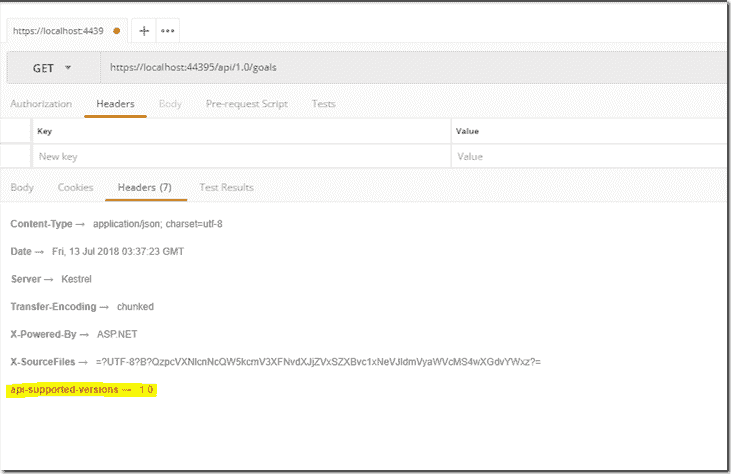
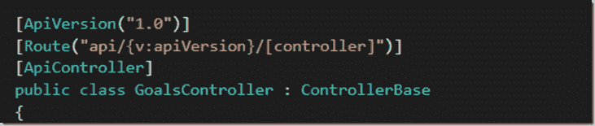
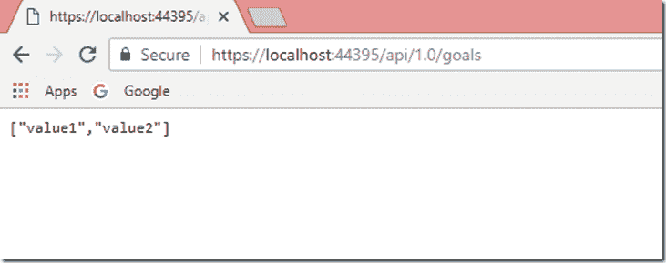

# 向 Asp.Net 核心 Web API 添加版本控制

> 原文：<https://dev.to/andrewcahill/add-versioning-to-an-asp-net-core-web-api-4blb>

有时，您希望或需要向 API 添加版本控制，以指定功能的可用性或不可用性。

有几个选项可用，如查询字符串，基于 Url 以及 Http 头。

出于我的目的，我将谈论基于 Url 的方法，因为我在我的[my revie](https://github.com/andrewcahill/MyReverie)repo 中实现了这个选项，这是出于更干净和更明确的偏好。

首先，我们需要继续安装 Nuget 包:

*   **微软。AspNetCore.Mvc.Versioning**

在启动类 ConfigureServices 方法中添加以下内容:

```
services.AddApiVersioning(v =>
{
    v.ReportApiVersions = true;
    v.AssumeDefaultVersionWhenUnspecified = true;
    v.DefaultApiVersion = new ApiVersion(1, 0);
}); 
```

Enter fullscreen mode Exit fullscreen mode

上述三个属性特别有用，因为它们允许在没有显式设置默认版本的情况下设置默认版本，并提供关于所支持的版本控制的标头信息。

**ReportApiVersions** :我们要求头部响应支持的 API 版本

**assumedefaultversion when unspecified**:如果没有明确要求，则设置默认版本

**DefaultApiVersion** :如果使用默认，将默认版本设置为 1.0

为了更好地说明上述第一个属性，请参见下文。我使用 Postman 来查看列出了受支持版本的响应头，我突出显示了这些版本

[T2】](https://aviddeveloper.com/wp-content/uploads/2018/07/Versioning_thumb7.png)

现在我所要做的就是简单地添加和更新控制器属性

目前我仍在版本 1 中，我将添加属性

```
[ApiVersion("1.0")] 
```

Enter fullscreen mode Exit fullscreen mode

并像这样更新路由属性:

```
[Route("api/{v:apiVersion}/[controller]")] 
```

Enter fullscreen mode Exit fullscreen mode

因此控制器类(在我的例子中是 GoalsController)属性的结果应该如下所示

[T2】](https://aviddeveloper.com/wp-content/uploads/2018/07/Versioning_thumb1.png)

现在，让我们测试我们的 F5，并浏览到后缀为:/api/1.0/goals 的 API 端点，在下面的例子中。

[T2】](https://aviddeveloper.com/wp-content/uploads/2018/07/Versioning_thumb3.png)

就是这样，我的 API 现在的版本是 1.0

帖子[为 Asp.Net 核心 Web API](https://aviddeveloper.com/versioning-asp-net-core-web-api/) 添加版本控制首先出现在 [Avid Developer](https://aviddeveloper.com) 上。