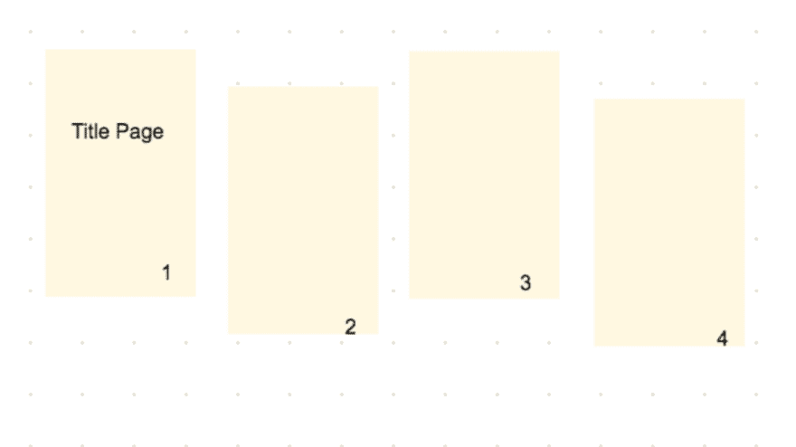
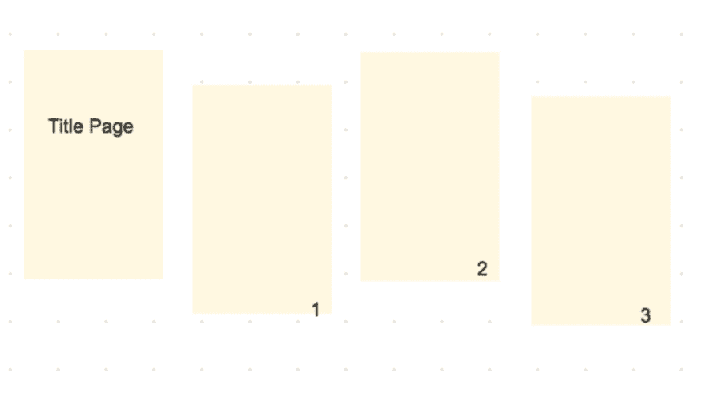

# 使用 CombinePDF 向 PDF 添加标题页

> 原文：<https://dev.to/nodefiend/adding-a-title-page-to-your-pdf-using-combinepdf-26hf>

> *   5-minute reading
> *   Assumption:
>     *   You know ruby
>     *   你有 rails 环境
>     *   Do you have a combinePDF installation

* * *

### CombinePDF

[https://github . com/boazsegev/combine _ pdf/blob/master/readme . MD](https://github.com/boazsegev/combine_pdf/blob/master/README.md)

# 走吧！

首先创建一个新的`CombinePDF`
实例

```
pdf = CombinePDF.new 
```

Enter fullscreen mode Exit fullscreen mode

现在我们有了一个实例，让我们将 PDFS 添加到其中。

*   `CombinePDF.load`将使用文件路径将 pdf 合并到我们的实例中

*   我们需要使用`<<`将它添加到 pdf 实例中

*   这里，我们将每个文件路径添加到一个数组中，以使事情变得更简单

```
 filepaths = []
filepaths << 'some/path/chickens1.pdf'
filepaths << 'some/path/cows2.pdf'
filepaths << 'some/path/froglegs3.pdf' 
```

Enter fullscreen mode Exit fullscreen mode

现在我们有了一个文件路径数组，让我们遍历数组并使用`CombinePDF.load`将 PDF 加载到我们的`CombinePDF`实例中。

```
filepaths.each do |path|
    file = CombinePDF.load(path)
    pdf << file if file
end 
```

Enter fullscreen mode Exit fullscreen mode

现在我们有了一个 pdf 数组，让我们给合并后的 PDF 文档添加一些页码:

```
pdf.number_pages location: [:bottom_right], number_format: 'Page %s', font_size: 10, opacity: 0.5 
```

Enter fullscreen mode Exit fullscreen mode

太好了！现在最后一步是为我们合并的 PDF 文档设置输出路径:

```
 output_filepath = "#{Rails.root}/tmp/combined_#{Time.now.to_i}.pdf" 
```

Enter fullscreen mode Exit fullscreen mode

最后一步是保存

```
pdf.save output_filepath 
```

Enter fullscreen mode Exit fullscreen mode

我们刚刚保存到我们的`output_filepath`让我们去看看:

[T2】](https://res.cloudinary.com/practicaldev/image/fetch/s--IDnwFG8P--/c_limit%2Cf_auto%2Cfl_progressive%2Cq_auto%2Cw_880/https://thepracticaldev.s3.amazonaws.com/i/dv8mumrhouzo4cmc48hi.png)

## OOoops

看起来我们确实有一个包含一些 pdf 的 PDF 实例，但是我不想给第一个文件添加页码，我想让那个文件作为我的文档的标题页。

让我们回到绘图板，我们需要添加区分第一个文件和其他文件，并从数组中的第二个文件开始计算页数。

```
 filepaths.each_with_index do |path,i|
      if i > 0
        file = CombinePDF.load(path, allow_optional_content: true)
        pdf << file if file
      end
    end 
```

Enter fullscreen mode Exit fullscreen mode

如果我们在这里使用`each_with_index`,从第二个索引开始，我们现在可以跳过第一个文件，然后立即调用编号方法。

在对页面进行编号之后，第一个文件被忽略了——让我们把它加回去，但是放在数组的前面

```
 # combine the file path we skipped over into the PDF instance 
title_page = CombinePDF.load(filepaths[0], allow_optional_content: true)
pdf >> title_page if title_page 
```

Enter fullscreen mode Exit fullscreen mode

注意我们使用了`>>`,这告诉 CombinePDF 我们想要在页面的开始处组合文件

如果我们想对标题页做些什么，我们可以将它设置为一个变量:

```
title_page = pdf.pages[0] 
```

Enter fullscreen mode Exit fullscreen mode

让我们运行它，看看我们会得到什么！

[T2】](https://res.cloudinary.com/practicaldev/image/fetch/s--4L08-_kz--/c_limit%2Cf_auto%2Cfl_progressive%2Cq_auto%2Cw_880/https://thepracticaldev.s3.amazonaws.com/i/70lld737zvsbqrg10o7c.png)

## 好看！

以下是最终代码:

```
pdf = CombinePDF.new

filepaths = []

filepaths << 'some/path/chickens1.pdf'
filepaths << 'some/path/cows2.pdf'
filepaths << 'some/path/froglegs3.pdf'

filepaths.each_with_index do |path,i|
      if i > 0
        file = CombinePDF.load(path, allow_optional_content: true)
        pdf << file if file
      end
    end

pdf.number_pages location: [:bottom_right], number_format: 'Page %s', font_size: 10, opacity: 0.5

title_page = CombinePDF.load(filepaths[0], allow_optional_content: true)
pdf >> title_page if title_page

output_filepath = "#{Rails.root}/tmp/combined_#{Time.now.to_i}.pdf"

pdf.save output_filepath 
```

Enter fullscreen mode Exit fullscreen mode