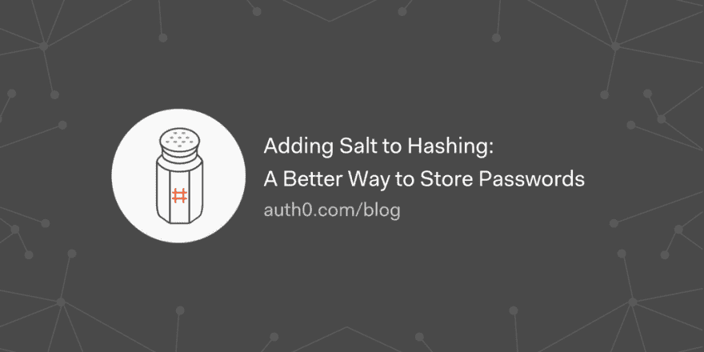

# 在哈希中加盐:存储密码的更好方法

> 原文：<https://dev.to/auth0/adding-salt-to-hashing-a-better-way-to-store-passwords-3i6i>

在散列过程中添加了一个 salt 来强制它们的唯一性，在不增加用户需求的情况下增加它们的复杂性，并减轻像彩虹表这样的密码攻击

[读读#️⃣](https://auth0.com/blog/adding-salt-to-hashing-a-better-way-to-store-passwords/?utm_source=dev&utm_medium=sc&utm_campaign=dasec_salting)

[T2】](https://res.cloudinary.com/practicaldev/image/fetch/s--1lrGllm0--/c_limit%2Cf_auto%2Cfl_progressive%2Cq_auto%2Cw_880/https://thepracticaldev.s3.amazonaws.com/i/4vzea80stkvs6q2fawnf.png)