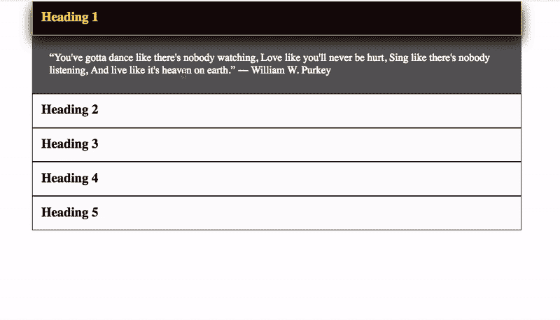
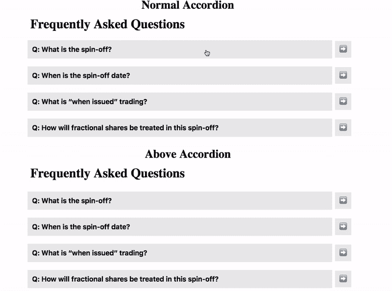

# 高级反应堆

> 原文：<https://dev.to/sait/advanced-reactjs--22lo>

今天我们学习 react 中新的和先进的东西，我们都知道 react 中的道具是用来和其他组件通信的。

现在我们学习一些不同的东西，叫做使用一些顶级 API 的 React 中的复合组件。

1.React.Children.map
2。React.cloneElement()

我们的最终输出应该像下面的图像。

**React-手风琴**
[](https://res.cloudinary.com/practicaldev/image/fetch/s--AX9xVSo---/c_limit%2Cf_auto%2Cfl_progressive%2Cq_66%2Cw_880/https://raw.githubusercontent.com/saigowthamr/React-Accordion/master/screenshot.gif)

## 手风琴组件代码

```
<Accordion>
        <Heading>Heading 1</Heading>
        <Text>
          “You've gotta dance like there's nobody watching, Love like you'll
          never be hurt, Sing like there's nobody listening, And live like it's
          heaven on earth.” ― William W. Purkey
        </Text>
        <Heading>Heading 2</Heading>

        <Text>
          “Don’t walk in front of me… I may not follow Don’t walk behind me… I
          may not lead Walk beside me… just be my friend” ― Albert Camus
        </Text>
        <Heading>Heading 3</Heading>

        <Text>
          “Darkness cannot drive out darkness: only light can do that. Hate
          cannot drive out hate: only love can do that.” ― Martin Luther King
          Jr., A Testament of Hope: The Essential Writings and Speeches
        </Text>
        <Heading>Heading 4</Heading>

        <Text>
          Mauris mauris ante, blandit et, ultrices a, suscipit eget, quam.
          Integer ut neque. Vivamus nisi metus, molestie vel, gravida in,
          condimentum sit amet, nunc. Nam a nibh. Donec suscipit eros. Nam mi.
          Proin viverra leo ut odio. Curabitur malesuada. Vestibulum a velit eu
          ante scelerisque vulputate.
        </Text>
        <Heading>Heading 5</Heading>
        <Text>
          “I believe that everything happens for a reason. People change so that
          you can learn to let go, things go wrong so that you appreciate them
          when they're right, you believe lies so you eventually learn to trust
          no one but yourself, and sometimes good things fall apart so better
          things can fall together.” ― Marilyn Monroe
        </Text>
      </Accordion> 
```

Enter fullscreen mode Exit fullscreen mode

现在让我们进入上面代码中的逻辑，Accordion 组件包含不同类型的子示例标题、文本。

## 手风琴组件实现。

```
 class Accordion extends React.Component {
  state = {
    active: -1
  };

  onShow = i => {
    this.setState({
      active: i
    });
  };
  render() {
    const children = React.Children.map(this.props.children, (child, i) => {
      return React.cloneElement(child, {
          heading: this.state.active  === i,
          text: this.state.active + 1 === i,
          onShow: () => this.onShow(i)
      });
    });

    return <div className="accordion">{children}</div>;
  }
} 
```

Enter fullscreen mode Exit fullscreen mode

上面代码所做的不是返回孩子，而是使用 React 映射孩子。通过传递一些状态给子节点来映射和克隆子节点，这意味着我们将状态传递给子节点。

## 标题组件。

```
class Heading extends React. Component {
  render() {
    const { heading, onShow, children } = this.props;

    return (
      <h2 className={heading ? "active" : "normal"} onClick={onShow}>
        {children}
      </h2>
    );
  }
} 
```

Enter fullscreen mode Exit fullscreen mode

# 文本组件

```
class Text extends React.Component {
  contentBox = () => {
    if (!this.props.text) {
      return null;
    } else {
      return (
        <div className="content-box">
          <p className="text">{this.props.children}</p>
        </div>
      );
    }
  };

  render() {
    return this.contentBox();
  }
} 
```

Enter fullscreen mode Exit fullscreen mode

其他示例

[T2】](https://res.cloudinary.com/practicaldev/image/fetch/s--gGXfmzx0--/c_limit%2Cf_auto%2Cfl_progressive%2Cq_66%2Cw_880/https://thepracticaldev.s3.amazonaws.com/i/fan2xwgb9e1xpyk74laq.gif)

你看到了吗，文本或标题组件中没有状态。

希望你们喜欢....

## [演示 url](https://saigowthamr.github.io/React-Accordion/)

## [代码库](https://github.com/saigowthamr/React-Accordion)