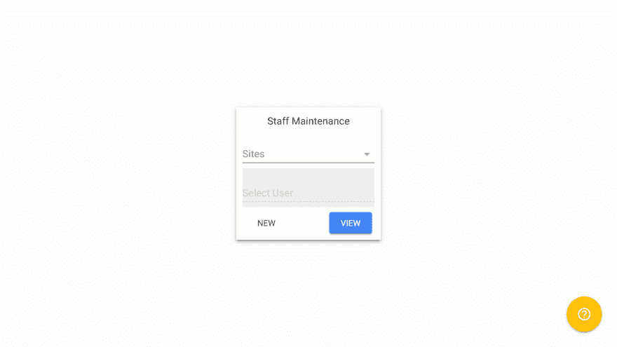

# 一个业余爱好者的冒险~第一部分

> 原文：<https://dev.to/link2twenty/adventures-of-a-hobbyist--part-one-2e0n>

# 序言

## 这是什么？

这是我的`dev-diary`来记录我学习 NodeJS 的经历，并希望为 IT 支持公司做一个开源 PWA。我想每周更新一次博客，但是，老实说，我不确定我能做到。

[T2】](https://res.cloudinary.com/practicaldev/image/fetch/s--mB1HVOMW--/c_limit%2Cf_auto%2Cfl_progressive%2Cq_auto%2Cw_880/https://thepracticaldev.s3.amazonaws.com/i/covs7ybako9s8orqiaqq.png)

## 你是谁，做什么的？

我叫安德鲁·伯恩，快 30 岁了，在一家为一些小公司提供 IT 支持的公司工作。老实说，这不是我看到自己结束的地方，但这就是生活。

### 背景

作为网站，我们想在预算范围内做一些事情，我们使用 Debian 服务器和 samba，而不是 windows 服务器。这一切都很好，但用户创建是在命令行中完成的，这对我们的一些员工来说有点挑战性。

### 诞生的异象

我们已经有一些开发部门的内部软件运行在 Apache 上，带有 Perl 和 MySQL 后端，所以我想我应该做一些简单的软件，可以 SSH 到一个站点，为您创建一个用户。这很简单，我有一点制作网站的经验，并且多年来一直支持内部软件，已经掌握了一些 Perl。这个软件很受欢迎，但是它总是感觉有点笨拙，所以我开始阅读制作 web 应用程序的最佳实践。

这就把我们带到了今天，我决定重新制作我的软件，但作为一个有 NodeJS 后端的 PWA。我希望能够制作 shell，然后让使用它的人(如果有的话)添加他们想要的模块，如资产列表、samba 控件等。

## 为什么告诉我们？

我想写下我的经历可能会很有趣，计划是该软件也是开源的，所以如果有人想跳出来帮我做一些我做得很糟糕的事情，或者只是告诉我我做错了什么，他们会感到非常欢迎。

## 你怀孕多久了？

我基本上没有，这些想法已经在我的脑海里冒泡了一段时间，但我还没有抽出时间做任何事情，落笔(嗯...)是第一步。

我想出了一个名字，“伊格尼丝”，我觉得它很好听。
我做了一个 GitHub 组织，名为[ignis-pwa](https://github.com/ignis-pwa)T3】我做了一个 logo，当然，这个 logo 可能会更改 

## 当前的想法

我想我会喜欢使用 web 组件，我曾经尝试过聚合物，发现它非常方便。

我还看了一下 [PWA 初学者工具包](https://github.com/Polymer/pwa-starter-kit)，认为这可能是一个很好的起点。

### 我们能做什么？

感谢您的提问，目前，我正处于构思阶段，对功能和 UIX 都是如此，所以如果您能提交一个[问题](https://github.com/ignis-pwa/ideas/issues/new)那将是惊人的，或者甚至查看一下[现有的问题](https://github.com/ignis-pwa/ideas/issues)并添加您的意见。

任何建议对我来说也将是惊人的；你认为有用的资源或者你在自己的旅途中学到的东西。

非常感谢你读到这里，老实说，我被你的阅读震惊了🙂。

欢迎对以后的帖子如何能更好发表评论，再次感谢。