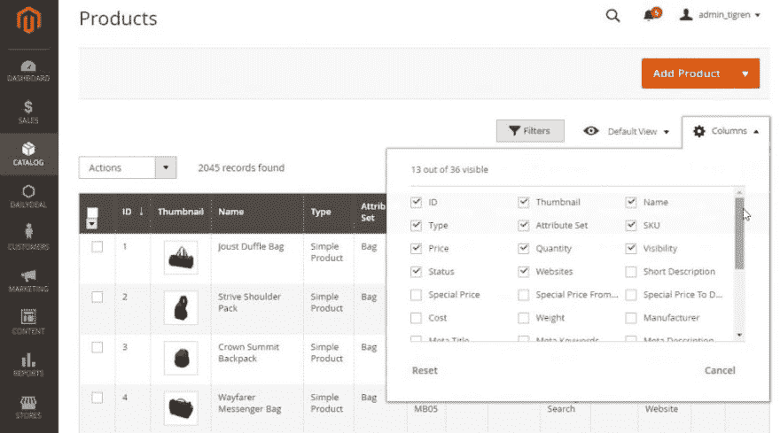
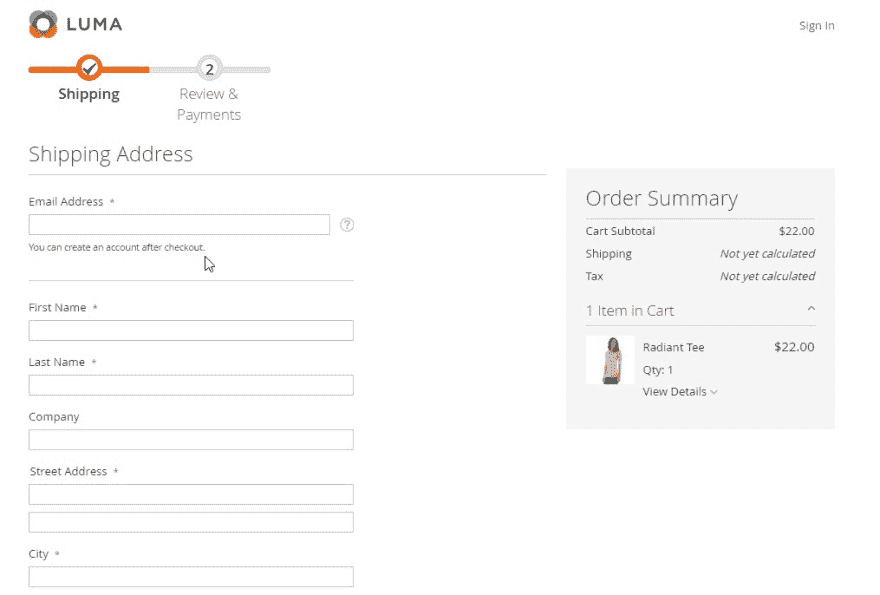
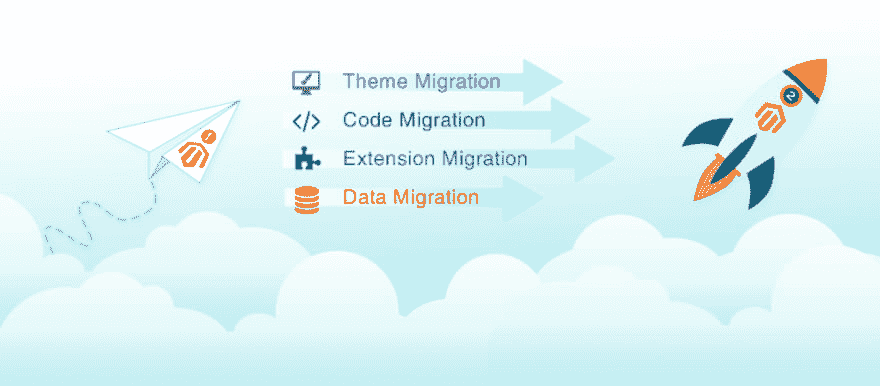

# Magento 2 迁移后，我们会得到什么？

> 原文：<https://dev.to/tigren5/after-magento-2-migration-what-will-we-get-3kcd>

 
你知道现在有四分之一的电商在用 Magento 吗？近年来，Magento 已经成为最受欢迎的电子商务平台之一，在全球拥有超过 250，000 家商店。此外，这些电子商店中的大多数都是基于 Magento 的，或者计划将 Magento 从 1 迁移到 2。尽管 Magento 1 已经是一个拥有大量惊人功能的伟大平台，但 Magento 2 能带来的*不止于此*。如果你在是否迁移到 Magento 2 的问题上犹豫不决，这篇博客文章将通过展示实施 Magento 2 迁移后你会得到什么来帮助你更容易地做出决定。在那之后，你可以决定 Magento 2 升级是否值得你努力。我们开始吧！

[**【阅读全文】**](https://www.tigren.com/magento-migration-from-1-to-2/)

## 1.显式性能提升

与 Magento 1 相比，Magento 2 提供了显著超越的性能。具体来说，大多数 Magento 2 商店在不同页面上的页面加载速度比 Magento 1 商店快 50%。此外，在 Magento 2 上开发的网站可以提供更快的结账速度，同时处理更多的订单和页面浏览量，等等。为了做到这一点，Magento 2 必须结合以下功能:

*   **允许整页缓存:**由于有整页缓存功能，Magento 2 网站中的所有页面都能够在 1-2 秒内快速加载，而在没有缓存的情况下，加载需要长达 10 秒。此外，整页缓存提供了以最佳速度同时处理多个目录页的能力。
*   **包含 Vanish cache:** Varnish cache 是另一个有价值的内置 web app 加速器，在减少相关请求的响应时间和网络带宽占用方面发挥着重要作用。
*   **支持 PHP 最新版本:** Magento 2 支持 PHP 最新版本(5.x - 7.x)，为提升网速提供了很多增强。
*   **减少 JavaScript:** 在 Magento 2 中，为了减少多余的浏览器操作，JavaScript 的数量被最小化。
*   **优化图像:** Magento 2 允许我们轻松地使用内置工具直接在服务器上压缩和优化所有图像。
*   **应用 MySql 的最新版本:** Magento 2 利用了 MySql 的最新版本，目的是增强查询、重新索引和缓存过程。

## 2.方便的管理界面

在进行 Magento 从 1 到 2 的迁移后，您将获得一个高级、干净和用户友好的管理界面。以下是在 Magento 2 管理界面上管理商店的一些好处:

*   **易于使用:**与 Magento 1 管理面板相比，这个新界面看起来很现代，即使你没有技术背景，也更容易使用。从新的调色板到智能结构，所有这些都使直观地导航和管理商店变得更加方便。

*   可定制:【Magento 2 管理界面的一个特别之处在于，它允许我们选择显示/不显示哪种类型的信息，以便快速访问所需的信息。例如，在产品管理页面中，您可以选择要显示的不同产品数据(ID、类型、价格、状态、缩略图、SKU、...)通过在列复选框上做标记。

[T2】](https://res.cloudinary.com/practicaldev/image/fetch/s--ub360BrY--/c_limit%2Cf_auto%2Cfl_progressive%2Cq_auto%2Cw_880/https://www.tigren.com/wp-content/uploads/2018/06/compare-magento-2-and-magento-1-1024x569.jpg)

*   **响应:**这个管理面板的另一个有用的特性是它针对不同的屏幕尺寸进行了优化。正因为如此，店主可以使用从台式机、笔记本电脑到智能手机的任何设备轻松管理他们的商店。尤其是在出差时，他们仍然可以在平板电脑上轻松监控商店运营。
*   **更快:**在 Magento 2 后端，我们可以轻松快速地批量创建、导入、编辑产品或客户信息。

总的来说，Magento 2 管理面板为开发者和商家有效管理网站进行了优化。

## 3.响应迅速、移动友好的网站设计

如今，人们倾向于使用各种设备进行网上购物，尤其是在手机上。因此，优化网站设计使其在各种设备上都能很好地呈现是至关重要的。幸运的是，Magento 2 storefront 在默认情况下是有响应的和移动友好的。因此，移动和桌面用户都可以享受用户友好和迷人的商店外观以及快速的页面加载速度。

## 

## 4.丰富的用户体验

为购物者带来更好的体验将对促进销售和提高 Magento 商店的转化率做出巨大贡献。由于 Magento 从 1 迁移到 2，您的用户体验将显著增强:

*   **快速且人性化的结账:**结账是 Magento 2 最突出的功能之一。这是一个平稳简单的两步流程，帮助客户尽快完成订单。因此，Magento 2 商店的结账时间被最小化，导致购物车废弃率显著降低，同时提高了销售转化率。

[T2】](https://res.cloudinary.com/practicaldev/image/fetch/s--WiBr0G-8--/c_limit%2Cf_auto%2Cfl_progressive%2Cq_auto%2Cw_880/https://www.tigren.com/wp-content/uploads/2018/06/why-magento-2.jpg)

此外，Magento 2 提供了“客人结账”功能，以便非注册买家仍然可以轻松下单，并在结账后创建一个新帐户。此外，对于注册用户，他们只需在结帐页面输入他们的电子邮件地址，然后他们保存的信息(姓名，送货和帐单地址，电话号码)将自动填充。

*   **个性化内容:**在您迁移后的 Magento 2 网站中，您将能够跟踪用户的行为、他们喜欢的项目和搜索历史。基于这些有价值的信息，店主可以提供更合适的产品和服务，并针对不同的客户群开展适当的促销活动。因此，购买者可能会感到更受尊重，对商店更忠诚。
*   **持久购物车:**这是 Magento 2 电商店铺的一个有趣之处。一旦买家登录他们的帐户，所有与他们查看的产品、产品比较、愿望清单，尤其是购物车相关的信息将会保留到下次访问。因此，购物者不需要在最后一次访问时再次搜索他们喜欢的商品，而是立即继续购物。
*   **便捷的搜索和分层导航:**对于任何电子商务网站来说，搜索和导航菜单都是至关重要的，因为它为客户打开了一扇发现各种产品的大门。在 Magento 2 中，有用的搜索功能允许用户快速有效地寻找喜欢的物品。此外，分层导航使买家能够轻松过滤产品并获得相关结果。
*   **内容丰富的产品页面:** Magento 2 的产品页面非常丰富，有视频、带缩放和样本的图像、评级和评论，...

## 5.多种支付方式

诚然，Magento 2 平台拥有最好的支付系统之一，拥有多个流行的支付网关:

*   贝宝
*   布伦特里
*   亚马逊支付
*   klarna 付款公司
*   Authorize.net

有了这些广泛的选择，客户可以快速安全地完成支付。此外，Magento 2 企业版还集成了 CyberSource 和 WorldPay，以确保所有交易都以最高的安全性进行。
... [**【阅读全文】**](https://www.tigren.com/magento-migration-from-1-to-2/)

## 结论

尽管 Magento 从 1 到 2 的迁移可能会花费您的时间和金钱，但这是值得的。实施升级后，您将获得最高的网站性能、现代化和便捷的管理界面、响应迅速和移动友好的设计、改进的客户体验和各种安全的支付方式。顺便说一下，如果你正在寻找一个可靠的 Magento 开发公司将你的网站迁移到 Magento 2，Tigren 是最好的选择之一。凭借超过 5 年的 Magento 电子商务开发经验，我们有信心帮助您以合理的成本顺利进行 Magento 迁移。 ***[现在就联系我们](http://www.tigren.com/contact/)*** 为您的项目获得免费快速的报价。

[T2】](https://res.cloudinary.com/practicaldev/image/fetch/s--uGDvIzv_--/c_limit%2Cf_auto%2Cfl_progressive%2Cq_auto%2Cw_880/https://www.tigren.com/wp-content/uploads/2018/06/magento-migration-from-1-to-2-service-1024x449.png)