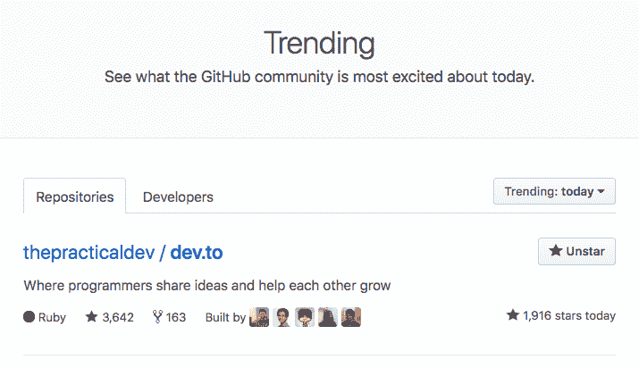
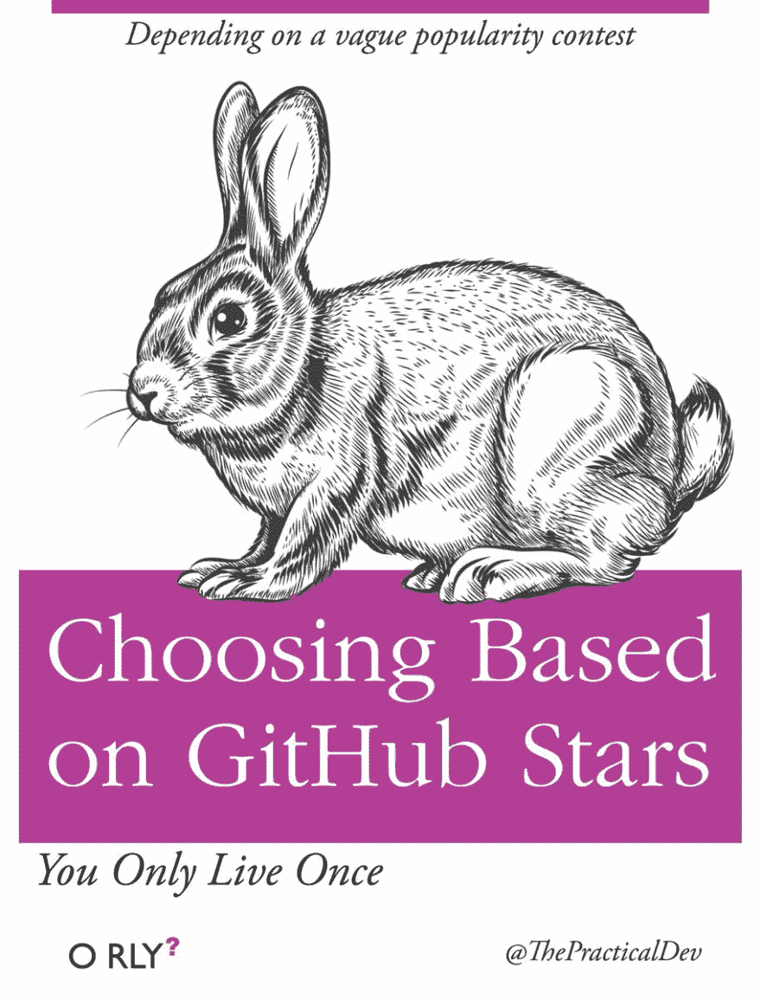

# 啊，成为开源的贾斯汀比伯

> 原文：<https://dev.to/ben/ah-to-be-the-justin-bieber-of-open-source-4jog>

在过去的几天里， [dev.to](https://dev.to/) 已经获得了很多网络积分。自从我们昨天早些时候作为开源项目发布以来，我们一直保持在 [GitHub 全球趋势报告](https://github.com/trending)的榜首。

[T2】](https://res.cloudinary.com/practicaldev/image/fetch/s--I9t2c440--/c_limit%2Cf_auto%2Cfl_progressive%2Cq_auto%2Cw_880/https://cl.ly/3S0o0n2l381X/Image%25202018-08-09%2520at%25201.55.57%2520PM.png)

GitHub 明星不一定代表什么，但也不代表什么都没有。不管怎样，人们对流行有一种期待。人们当然会把受欢迎与“伟大”或类似的东西联系起来。

> DEV 社区👩‍💻👨‍💻[@ thepracticaldev](https://dev.to/thepracticaldev)⭐️⭐️⭐️⭐️⭐️>⭐️⭐️⭐️2016 年 8 月 03 日下午 14:47

很多人认为这是向我们学习的一个机会，当然，我们希望尽可能多地教别人——尤其是对新人。也就是说，大部分教学将是点对点的；自上而下，我们没有那么多可提供的。我们在这里和其他人一样学习。

 [## 你从 DEV 开源代码库中学到了什么？

### 李名炀🍕8 月 9 日 181 分钟读取

#discuss #opensource](/michael/what-are-you-learning-from-the-devto-codebase-2na1)

这个黑客新评论讲述了一个关于期望的非常典型的故事:

> 看起来像是标准的 rails 乱七八糟:/不要误会。我会不时地查看其他人的 rails 代码，了解他们是如何解决成熟的 rails 应用程序中的常见问题的。大多数时候，我离开时相当失望...
> 我喜欢注释#id_code_generated 的规范；)

是真的。我们是一个相当标准的铁路烂摊子。我们没有走到这一步，因为我们编写了完美的代码。我们来到这里是因为我们非常关心这个社区。我碰巧想到，现在我们是开源的，我们可能最终会不辜负我们作为开发人员社区中一个重要的 web 应用程序的地位。但这不是我们今天的处境。

在我看来，我们受欢迎是有充分理由的。我们在每一步都与社区紧密合作，并一直努力做正确的事情。但在某种意义上，我们也因出名而出名，作为软件开发人员，我们希望随着时间的推移，随着我们的成长，这个项目的成功也是我们应得的。

快乐编码