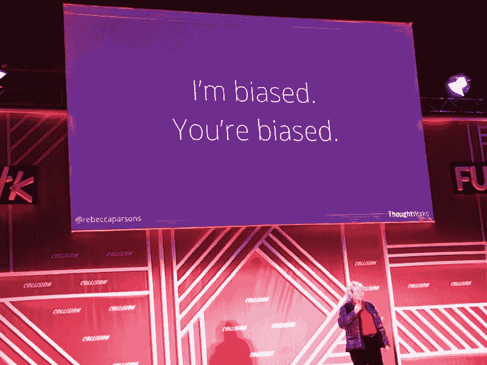
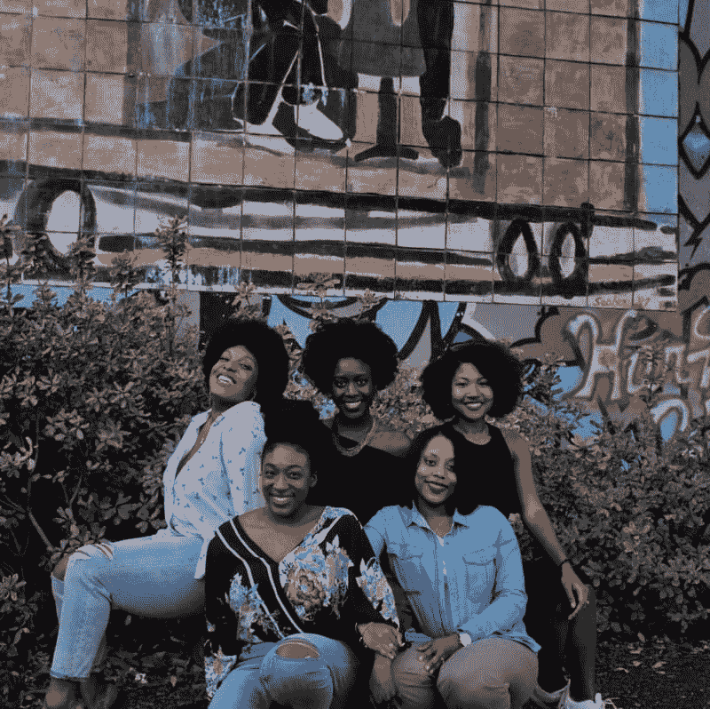

# A.我很有偏见，我们应该停止它

> 原文：<https://dev.to/uu/ai-is-very-biased-and-we-should-stop-it-3gmn>

作为一名生活在北美的黑人男性，有时很难承认我内心固有的偏见。这尤其困难，因为我在社交媒体和新闻上看到的大多数事情都是像我这样的人遭受偏见待遇的故事——因为肤色而受到不公平待遇的故事。此外，很难承认我有偏见，因为我自己也经历过偏见，承认我也有偏见被我与几个坏苹果的一些负面经历所掩盖。

> 我觉得这个演讲非常有趣，因为丽贝卡不仅关注种族和性别偏见。

在纽奥良的[碰撞会议](https://collisionconf.com/)上，我有幸听了 [ThoughtWorks](https://www.thoughtworks.com/) 的[丽贝卡·帕森斯](https://www.linkedin.com/in/rebecca-parsons-871491/)的演讲*多样性，人工智能*中的编码&偏见。这次谈话揭示了当今社会存在的一些偏见。

【the Collision 2018

### AI 是有偏见的

我发现这个演讲非常有趣，因为丽贝卡不仅仅关注种族和性别偏见。除了报道种族和性别偏见，
Rebecca 还对我们社会中的偏见进行了 360 度全方位报道，并展示了培养包容性文化以创造公平的技术未来的重要性。对我来说，这次演讲的一些收获是:

*   人工智能制造者的思想、意图和偏见被转移到人工智能中。
*   接受我们的偏见是提高科技公平性的重要一步。
*   开发人员不仅应该为和他们一样的人构建，还应该为不同背景和取向的人构建和测试。
*   人工智能的行动和决策受到开发人员在开发时认为重要的东西的影响。

### 无偏见的决议

要想在任何努力中取得进步或成功，首先要认识到问题所在，并制定计划和目标来解决问题。除了计划和设定目标，还需要持续的有意识的努力来达成长期的解决方案。展望未来，我决心做以下三件事来促进包容性，以实现公平的技术未来。我鼓励你根据自己的独特情况调整和适应以下内容:

**1。承认并重申我自己的偏见:**

对我来说，我相信承认并重申我的偏见是摆脱它们的第一步。承认我的偏见将使我能够解决它们，重申它们将不断提醒和检查我。

**2。促进用户测试中的包容性:**

提倡让不同人口统计的人参与用户测试。这将使我工作的产品能够很好地为更多人口统计数据的人工作，并防止类似于为医生设计的个人助理对男性声音(医生)工作良好但对女性声音(医生)不工作的情况发生。

 
照片由[维多利亚诺·伊斯基耶多](https://unsplash.com/photos/ldkinv-1_To?utm_source=unsplash&utm_medium=referral&utm_content=creditCopyText)于 [Unsplash](https://unsplash.com/search/photos/shocked?utm_source=unsplash&utm_medium=referral&utm_content=creditCopyText)

**3。当有人做出不恰当的评论时大声说出来:**

大声反对不恰当的评论是我最关心的事情。我想继续从事这项工作，尤其是因为它与女性有关。我关心这个，因为我有三个姐妹，我生活中还有其他强大的女性，我关心她们，和她们一起工作。可悲的是，几年前，我没有站出来反对一个不恰当的评论。当和一些人一起吃午饭时，其中一个人说了这样的话“为什么她不明白？她是一个穿裙子的漂亮女孩”。我大吃一惊，不敢相信地垂下了嘴。尽管我很震惊，但我没有面对那个人。在那种情况下，我学会了当我听到这样不恰当的评论时不要保持沉默。从那以后，我一直大声反对这种评论，现在我更加决心继续大声疾呼。

### 我们都应该做什么

> 我有偏见。你有偏见。AI 有失偏颇。我们都有偏见。

 
照片由[莱尼](https://unsplash.com/photos/hx87JWG4yCI?utm_source=unsplash&utm_medium=referral&utm_content=creditCopyText)上[下](https://unsplash.com/search/photos/african-women?utm_source=unsplash&utm_medium=referral&utm_content=creditCopyText)

随着我们在技术上不断进步，开发出几乎可以冒充人的人工智能，我们是否可以集体和单独承认并检查我们的偏见，在用户研究和开发中包括不同的人口统计数据，并大声反对对与我们不同的人做出的不当评论。

* * *