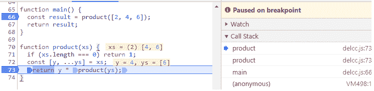

# JavaScript 第 3 部分中的代数效应——分隔延续

> 原文：<https://dev.to/yelouafi/algebraic-effects-in-javascript-part-3---delimited-continuations-42hj>

这是关于代数效果和处理程序系列的第三部分。

*   第 1 部分:[延续和控制权转移](https://dev.to/yelouafi/algebraic-effects-in-javascript-part-1---continuations-and-control-transfer-3g88)
*   第 2 部分:[用生成器捕获延续](https://dev.to/yelouafi/algebraic-effects-in-javascript-part-2---capturing-continuations-with-generators-13da)
*   第 3 部分:分隔延续
*   第四部分:[代数效果和处理程序](https://dev.to/yelouafi/algebraic-effects-in-javascript-part-4---implementing-algebraic-effects-and-handlers-2703)

在前面的部分中，我们介绍了延续和控制转移的概念。我们看到了如何在生成器中捕获当前延续，并演示了如何实现著名的`callcc`(一次性版本)。

在这一部分，我们将看到如何用生成器捕获分隔的延续。虽然`callcc`允许我们捕获整个程序的其余部分，但是我们也可以选择只捕获它的一部分。这个概念的一个直接后果是，分隔的延续现在可以返回值，因此它们可以在另一个函数的流中组合。这是一个重要的特性，将在下一部分中探讨。

### 回呼堆栈

在直接风格中，我们看到函数之间的控制转移是通过调用栈进行的。

*   每个函数调用都将一个新的帧(也称为激活记录)推送到堆栈上
*   每个函数返回都从堆栈中弹出相应的帧

让我们考虑下面的例子，它计算一组数字
的乘积

```
function main() {
  const result = product([2, 4, 6]);
  return result;
}

function product(xs) {
  if (xs.length === 0) return 1;
  const [y, ...ys] = xs;
  return y * product(ys);
} 
```

为了可视化给定时刻的调用堆栈，我们可以在浏览器 devtools 中设置一个断点，然后在控制台中运行上面的示例。程序将暂停，我们可以检查浏览器的调用堆栈面板

[T2】](https://res.cloudinary.com/practicaldev/image/fetch/s--Hfs8YCsT--/c_limit%2Cf_auto%2Cfl_progressive%2Cq_auto%2Cw_880/https://user-images.githubusercontent.com/5453835/45965848-7be72600-c021-11e8-80e9-ffb332d1fa28.png)

这里程序暂停在`product()`的第三行。调用堆栈已经包含四个框架:

*   `anonymous`可以被视为浏览器控制台会话的根框架
*   `main`对应于在控制台执行的`main()`调用
*   第一个`product`帧代表在`main`执行的`product([2, 4, 6])`
*   第二个`product`帧表示在`return y * product(ys)`语句中的递归调用(即`return 2 * product([4,6])`)

换句话说，调用堆栈告诉我们工作的哪一部分已经完成。它还告诉我们还有哪些工作要做:

*   在当前帧(`product([4,6])`)内要做的剩余工作，即调用`product([6])`，将结果乘以`y (= 4)`，然后将结果(`24`)返回给父帧
*   加上父帧中要做的其余工作:
    *   `product([2,4,6])`的调用帧会将之前的结果乘以`2`，然后将`48`返回到`main`帧
    *   `main()`的调用框架将简单地把结果`48`返回给它的父框架
    *   `anonymous`的调用框会将结果显示到控制台中

换句话说，continuation 主要用调用栈在考虑的
执行时刻的状态来表示。因此，如果我们能够在生成器上实现类似于调用堆栈的东西，原则上我们就能够
捕获当前的延续。

与 CPS 将连续函数表示为普通函数形成对比。这种无状态的表示可能被认为是优越的(相对于调用栈的全状态表示),因为它使我们更接近纯粹。然而，调用堆栈表示也有一些优点:

*   使用 statefull 表示更容易实现更高级的堆栈操作，比如定界延续(因为 JavaScript 是单线程的，所以这是可能的)
*   在全状态方法的基础上添加 DX 特性更容易。例如，一个 babel 插件可以在代码中添加一些有用的信息(函数名、行、列)到堆栈框架中，一些程序 API 可以在开发者模式下转储这些信息。

### 用生成器建模调用栈

下面是一个使用全状态方法的新实现

```
function isGenerator(x) {
  return x != null && typeof x.next === "function";
}

function runGenerator(gen, arg) {
  const { value, done } = gen.next(arg);

  if (done) {
    const _return = gen._return;
    if (isGenerator(_return)) {
      runGenerator(_return, value);
    } else if (typeof _return === "function") {
      _return(value);
    }
  } else {
    if (isGenerator(value)) {
      value._return = gen;
      runGenerator(value, null);
    } else if (typeof value === "function") {
      value(gen);
    }
  }
}

function start(gen, onDone) {
  gen._return = onDone;
  runGenerator(gen, null);
} 
```

我们现在不传递 continuation 参数，而是依赖于生成器中的一个`_return`字段，它表示父帧(这里使用一个符号可能更安全)。当生成器完成时，它将返回值传递给它的调用者。当我们调用一个子生成器时，我们将其`_return`设置为当前生成器。

还要注意，我们现在将生成器本身传递给产出的函数。所以要实现类似于`sleep(millis)`的东西，我们必须写

```
function sleep(ms) {
  return function(gen) {
    setTimeout(x => runGenerator(gen, null), ms);
  };
} 
```

在 statefull 实现中，我们有效地构建了一个生成器链表(通过`start`在根处插入一个回调)。

`callcc`的实现也可以自动适应

```
function callcc(genFunc) {
  return function(capturedGen) {
    // this is our escape function
    function jumpToCallccPos(value) {
      // instead if resuming the current generator
      // we directly resume the one captured by callcc
      return next => runGenerator(capturedGen, value);
    }
    const gen = genFunc(jumpToCallccPos);
    gen._return = capturedGen;
    runGenerator(gen, null);
  };
} 
```

好了，现在我们已经将调用栈具体化为一个具体的数据结构，我们准备好处理分隔的延续。

### 分隔的延续

我们将通过一系列的例子一步一步地介绍分隔的延续是如何工作的。

我们说过分隔的延续只捕获调用堆栈的一部分。然后，我们的第一步将是用某种方法来标记一个堆栈帧，作为要捕获的延续的界限。这就是`reset`的目的

```
function reset(genFunc) {
  return function(parentGen) {
    const gen = genFunc();
    gen._return = parentGen;
    // setting the limit of the continuation
    gen._reset = true;
    runGenerator(gen, null);
  };
} 
```

`reset`接受一个生成器函数并返回一个挂起的计算(这里是一个接受父生成器的函数)。像`runGenerator`一样，挂起的计算将在将其`_return`字段设置为调用生成器后运行提供的生成器函数。它还添加了一个特殊的`_reset`字段，作为调用堆栈上的标记。这个字段将帮助我们限制捕获延续的范围，我们将在后面看到。

首先要注意的是，当在“普通”生成器上调用时，`reset`相当于一个简单的生成器调用

```
function* main() {
  const result = yield reset(function*() {
    return "Hi";
  });
  return result;
}

start(main(), console.log);
// => Hi 
```

所以独自一人，`reset`是相当没用的。当我们在一个`reset`块中引入下一个函数`shift`时，有趣的事情发生了。

我们将首先介绍一个简化版本的`shift`，它没有捕获当前的延续

```
function shift(genFunc) {
  return function(parentGen) {
    // finds the closest reset
    let resetGen = parentGen;
    while (!resetGen._reset) {
      resetGen = resetGen._return;
    }
    const gen = genFunc();
    // gen will directly return to the parent of reset
    gen._return = resetGen._return;
    runGenerator(gen, null);
  };
} 
```

这里有一个它如何工作的例子

```
function* main() {
  const result = yield reset(function* resetFn() {
    const name = yield child();
    return "Hi " + name;
  });
  return result;
}

function* child() {
  const result = yield shift(function* shiftFn() {
    return "from inside shift";
  });
  return result;
}

start(main(), console.log);
// => from inside shift 
```

在正常的调用序列中，我们期望结果是`'Hi from inside shift'`。然而，`shift`不是一个普通的函数。在上面的代码中，提供给`shift`的生成器将直接返回到最近的`reset`块的父块。在这种情况下，它有效地表现为我们之前的`exit`函数。更具体地说，我们转换了下面的调用栈

```
main() -> reset(resetFn) -> child() -> shift(shiftFn) 
```

变成这个

```
main -> shiftFn() 
```

换句话说，我们已经丢弃了 shift 和(包括)reset 之间的所有堆栈帧。

被丢弃的帧会怎么样？好吧，这里有更有趣的东西，它们将构成应该提供给`shift`的定界延续。

```
function shift(genFunc) {
  return function(parentGen) {
    // finds the closest reset
    let resetGen = parentGen;
    while (!resetGen._reset) {
      resetGen = resetGen._return;
    }

    function delimitedCont(value) {
      // captures the continuation from after shift up to reset
      return nextGen => {
        resetGen._return = nextGen;
        // resume from the shift's parent frame
        runGenerator(parentGen, value);
      };
    }

    const gen = genFunc(delimitedCont);
    gen._return = resetGen._return;
    runGenerator(gen, null);
  };
} 
```

这种工作方式似乎令人困惑，所以让我们一步一步地看一个简单的例子

```
function* main() {
  const x = yield reset(function* resetFn() {
    const a = 10;
    const b = yield shift(function* shiftFn(k) {
      const c = yield k(2);
      return c + 3;
    });
    return a * b;
  });
  return x;
} 
```

直到`shift`的呼叫序列对应于

```
main() -> #resetFn() -> shift(shiftFn) 
```

其中`#`用于标记复位位置。我们看到`shift`的第一个效果是丢弃直到包围`reset`T3 的帧

```
main() -> shift(shiftFn) -> ... 
```

然后，丢弃的帧(此处为`#resetFn()`)被提供作为`shiftFn`的延续。所以在`yield k(2)`之后，我们得到下面的序列

```
main() -> shiftFn(k) -> #resetFn() 
```

`#resetFn()`对应什么？在`shift`位置之后剩下的工作就是:用一些给定的值设置`b`，然后乘以`a (= 10)`。ie 就像一个函数:`(v => a * v) -> (2 * 10) -> 20`

在`#resetFn()`返回后，`shift`继续将获得的结果`20`加到`3`上。最后的结果便是`23`。

自然，你有权利问一个合理的问题:为什么我们必须以如此混乱的方式编程？

我们有两个选择:

我可以重复前几部分中关于这如何能赋予控制流超能力的论点。这部分是对的，但可能不太具体。

或者，你可以阅读下一部分(也是最后一部分):这次我们将真正讨论代数效应和处理程序。