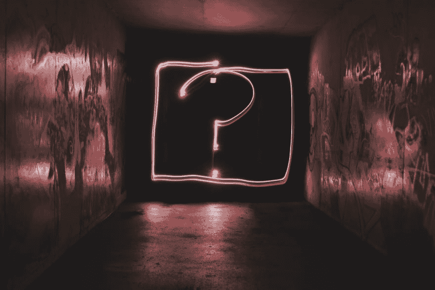

# 关于 JavaScript 中的 IF 语句和布尔值！

> 原文：<https://dev.to/codetheweb/all-about-if-statements-and-booleans-in-javascript-5com>

[T2】](https://res.cloudinary.com/practicaldev/image/fetch/s--UJhgMqk7--/c_limit%2Cf_auto%2Cfl_progressive%2Cq_auto%2Cw_880/https://codetheweb.blog/assets/img/posts/if-statements-boolean-operators/cover.jpg)

If 语句是 JavaScript 的另一个核心部分:基于值和/或变量的比较，它们允许您控制实际执行什么代码。我还会教你所有可以用布尔值做的很酷的事情！请往下读...

## 入门！

首先，我想鼓励你跟随这篇文章！让我们首先创建一个新的 HTML 文件，其中包含一个`<script>`标签:

```
<!DOCTYPE html>
<html>
    <head>
        If statements are awesome!
    </head>
    <body>
        <h1>JavaScript :)</h1>
        <script>
            // Our script will go here!
        </script>
    </body>
</html> 
```

Enter fullscreen mode Exit fullscreen mode

一旦完成，在你的网络浏览器中打开它，你就可以开始了！(不要忘记在每次更改时保存并重新加载页面)

## 什么是 if 语句？

本质上，如果一个值等于`true`，if 语句只是执行一些代码。

> ## 术语
> 
> 在本文中，我将使用术语“括号”和“花括号”。当我说括号时，我指的是这些:`( )`，当我说花括号时，我指的是这些:`{ }`。我这样说的唯一原因是因为我知道，根据你来自世界的哪个部分，你可能会有不同的名字给你的方括弧、卷括弧和普通括弧(例如圆括号)。

## if 语句语法

下面是一个简单的 if 语句的样子:

```
if (true) {
    alert('Yay!');
} 
```

Enter fullscreen mode Exit fullscreen mode

让我们来看看这是怎么回事。本质上，我们只是简单地说，如果括号内的内容等同于`true`，则执行花括号内的代码。注意这里我说的*相当于*到`true`。这并不意味着方括号中的文字必须是`true`。这只是意味着它需要是一个真实的陈述。比如:`1 + 3 == 4`就是`true`。

不要担心，我稍后会深入讨论这是如何工作的(我将在后面的文章中更多地谈论 JavaScript [数学](https://codetheweb.blog/2018/03/18/javascript-math/))。基本上就是 1 + 3 = 4 而已。1 + 3 *难道*等于 4，所以相当于`true`。因此，如果我们把它放在括号里，我们的代码就会运行！让我们试一试。将以下代码放入您的`<script>`标签中，然后重新加载页面:

```
if (1 + 3 == 4) {
    alert('Yay!');
} 
```

Enter fullscreen mode Exit fullscreen mode

现在，让我们试着让警报*不要*运行。我们将通过使括号内的语句等同于`false` :
来实现这一点

```
if (1 + 3 == 5) {
    alert('Yay!');
} 
```

Enter fullscreen mode Exit fullscreen mode

(你的高中数学老师不会感到骄傲)

现在，因为括号里的语句是`false`，所以花括号里面的代码不会运行！自己试试吧...它将不再提醒“耶！”

您现在已经学习了基本的`if`语句语法！

## 布尔运算符

是时候仔细看看是什么给了我们`true`和什么给了我们`false`了。

让我们以上面的语句为例:

```
1 + 3 == 4 /* Returns true */ 
```

Enter fullscreen mode Exit fullscreen mode

这里，我们使用双等号(`==`)来比较两边:`1 + 3`和`4`。这个比较符号表示“如果 T4 等于 T5，那么返回 T3”。但是我们也可以在其他方面进行比较！例如:

```
1 + 3 != 4 /* Returns false */ 
```

Enter fullscreen mode Exit fullscreen mode

这里，我们告诉计算机，如果`1 + 3`等于*而*不等于`4`，则返回`true`。`1 + 3`显然等于`4`，所以返回`false`。

我们还可以使用一些其他的比较方法——下面是一些基本的比较符号:

| 符号 | 如果，则返回`true`... |
| --- | --- |
| `==` | 两边**相等** |
| `!=` | 两边**不相等** |
| `<` | 左侧的**小于右侧的** |
| `>` | 左侧的**大于右侧的** |
| `<=` | 左侧**小于或等于右侧** |
| `>=` | 左侧的**大于或等于右侧的** |

让我们试几个出来...挑战时间！

**问题 1:** 预警“不是假新闻！”如果`4`小于`410`。

```
if (4 < 410) {
    alert('Not fake news!');
} 
```

Enter fullscreen mode Exit fullscreen mode

**问题二:**预警“5 最伟大！”如果`5`大于`6`。

```
if (5 > 6) {
    alert('5 is the greatest!');
} 
```

Enter fullscreen mode Exit fullscreen mode

**问题三:**预警“JavaScript 牛逼！”如果`3`小于或等于`3`。

```
if (3 <= 3) {
    alert('JavaScript is awesome!');
} 
```

Enter fullscreen mode Exit fullscreen mode

## 多个真/假语句

如果我们想合并多个语句呢？比如我们想说如果`3 + 5`等于`8`*`2 + 2`等于`4`呢？我们有两种主要的方法来组合上面的语句:*和*以及*或*。*和*简单来说就是`&&`，*或者*简单来说就是`||`(那就是上面有竖线的 2x 键，通常会是`SHIFT + backslash`)。*

 *下面是`&&` ( *和*)的工作方式:

```
true && true /* Returns true */ 
```

Enter fullscreen mode Exit fullscreen mode

```
true && false /* Returns false */ 
```

Enter fullscreen mode Exit fullscreen mode

```
false && false /* Returns false */ 
```

Enter fullscreen mode Exit fullscreen mode

下面是`||` ( *或*)的工作方式:

```
true || true /* Returns true */ 
```

Enter fullscreen mode Exit fullscreen mode

```
true || false /* Returns true */ 
```

Enter fullscreen mode Exit fullscreen mode

```
false || false /* Returns false */ 
```

Enter fullscreen mode Exit fullscreen mode

这里很重要的一点是`true || true`等于`true`，而不是`false`。这是因为 JavaScript 中的**、*或*实际上是指*和/或*** 。不要问我为什么，编程语言有时候会有那种诡异的东西。

现在，让我们用几个真实的陈述来代替`true`和`false`。这里有一个例子:

```
(65 > 25) || (5 + 1 == 5) /* Returns true */ 
```

Enter fullscreen mode Exit fullscreen mode

您不需要有括号，但是我把它们放在括号中只是为了让它更清楚一点(在 JavaScript 中您可以这样做)。如你所见，上面的代码很简单:

```
true || false /* Returns true */ 
```

Enter fullscreen mode Exit fullscreen mode

唯一不同的是，`true`换成了`65 > 25`相当于*相当于*相当于`true`，同样`false`也换成了`5 + 1 == 5`相当于`false`。

该你试试了！看看你能否完成以下任务:

**问题 1:** 如果`5`等于`5`、`3`等于`3`，则预警“宇宙未破”。

```
if (5 == 5 && 3 == 3) {
    alert('The Universe is not broken');
} 
```

Enter fullscreen mode Exit fullscreen mode

**问题 2:** 如果`1`加`2`等于`4`或者`1`加`2`等于`3`，则提示“至少有一个陈述是正确的”。

```
if (1 + 2 == 4 || 1 + 2 == 3) {
    alert('At least one of the statements is correct');
} 
```

Enter fullscreen mode Exit fullscreen mode

**问题三:**如果`5`加`5`不等于`10`或者`2`加`4`大于等于`7`，则预警“我就是这样的叛逆者”。

```
if (5 + 5 != 10 || 2 + 4 >= 7) {
    alert('I am such a rebel');
} 
```

Enter fullscreen mode Exit fullscreen mode

**问题 4:** 如果`42`大于`21`，`42`小于`47`，则报警“42 在 21 和 47 之间”。

```
if (42 > 21 && 42 < 47) {
    alert('42 is between 21 and 47');
} 
```

Enter fullscreen mode Exit fullscreen mode

呜！希望你做得不错😉

### 关于布尔运算符还有一点...

关于 JavaScript 中的布尔值，还有最后一个你应该知道的超级方便的技巧...通过在一个语句前加一个感叹号，你*颠倒了*布尔值。例如，`!true`将等于`false`，`!false`将等于`true`。

如果将感叹号放在陈述前，中间有空格或符号(例如`1 + 2 == 3`应该是`true`)，不要忘记用括号将它括起来！这确保感叹号适用于整个语句。这里有一个例子:

```
if( !(5 + 2 < 3) && 5 + 6 == 11) {
    alert('Woo!');
} 
```

Enter fullscreen mode Exit fullscreen mode

如您所见，`5 + 2 < 3`被括在括号中，因此感叹号适用于所有内容。

值得注意的是，在上面的例子中，我们一开始并不真的需要感叹号——`!(5 + 2 < 3)`与`5 + 2 >= 3`相同。然而，了解这个特性仍然是有用的，并且在进行更复杂的陈述时可以派上用场。

## ...不然呢？

我们也可以给我们的 if 语句一个`else`，如果第一组花括号*内的代码没有*运行，它就会运行——换句话说，如果普通括号内的语句是`false`。下面是它的样子:

```
if ( /* some statement... */ ) {
    /* some code to be run if that statement is true */
} else {
    /* some code to be run if that statement is not true */
} 
```

Enter fullscreen mode Exit fullscreen mode

试试吧！写一些代码，如果`2`小于`1`，将警告“2 小于 1”，否则将警告“2 不小于 1”...

```
if (2 < 1) {
    alert('2 is less than 1');
} else {
    alert('2 is not less than 1');
} 
```

Enter fullscreen mode Exit fullscreen mode

我们走吧！Else 语句就是这么简单！如果第一组花括号*不运行*，它们就会运行。

> **注意:**非常重要的一点是`else`紧跟在`if`之后，中间没有其他代码。

## 否则如果

等等，可能会更混乱？算是吧。下面是一个包含`else if`和`else`的`if`语句的样子:

```
if ( /* some statement... */ ) {
    /* some code to be run if that statement is true */
} else if ( /* another statement... */ ) {
    /* some code to be run if the first statement is false and the else if statement is true */
} else {
    /* some code to be run if nothing has been run yet */
} 
```

Enter fullscreen mode Exit fullscreen mode

这乍一看可能会令人困惑。然而，让我们假设我们是计算机，从计算机的角度来看它。

首先我们有一个`if`声明。如果括号里的东西是真的，我们执行它的卷集里的东西，然后停止。如果它不是真的，我们就进入另一个如果。如果在*那组*括号里的东西是真的，我们运行*那组*花括号里的东西，然后停止。最后，如果我们还在继续，但什么都没有发生，我们就执行`else`的一对花括号中的内容。

好吧，你现在可以不做电脑了。

试着自己做其中一件事——我们将使用之前的例子:

```
if (2 < 1) {
    alert('2 is less than 1');
} else {
    alert('2 is not less than 1');
} 
```

Enter fullscreen mode Exit fullscreen mode

现在，我们希望它在`2 == 1`的情况下提醒“2 等于 1”，否则在`2 < 1`的情况下提醒“2 小于 1”，在其他情况都不成立的情况下提醒“2 大于 1”。试一试！

```
if(2 == 1) {
    alert('2 is equal to 1');
} else if (2 < 1) {
    alert('2 is less than 1');
} else {
    alert('2 is greater than 1');
} 
```

Enter fullscreen mode Exit fullscreen mode

在这里，计算机将评估`2 == 1`——这是`false`，所以我们继续下一个语句——我们的`else if`、`2 < 1`。这又是`false`，所以我们继续到`else`并执行那组花括号内的代码:`alert('2 is greater than 1')`。

### 分机:

1.  编写一个运行`if`代码的脚本，一个运行`else if`代码，一个运行`else`代码。
2.  在 if / else if / else 语句中可以有多个 else if！！试着做一个像下面这样的例子:

```
if (1 == 5) {
    alert('1 is 5');
} else if (1 == 4) {
    alert('1 is 4');
} else if (1 == 3) {
    alert('1 is 3');
} else {
    alert('None of those were correct!');
} 
```

Enter fullscreen mode Exit fullscreen mode

## 这有什么关系？

在本文中，我主要使用数字来更清楚地说明 if 语句是如何工作的。然而，一旦我们在 if 语句中放入变量，而不仅仅是设置值，它们就变成了一个超级有用的工具和 JavaScript 的核心部分之一！

## 结论

呜！太激烈了🔥 🔥

我希望你今天学到了很多，这对你学习 JavaScript 有所帮助！如果有帮助的话，如果你[分享了这篇文章](https://codetheweb.blog/2018/02/28/if-statements-boolean-operators/#share)或者[注册了时事通讯](https://codetheweb.blog/newsletter)来接收收件箱里的新帖子，我会非常感激的！

另外，如果你[给我买杯咖啡](https://buymeacoffee.com/CodeTheWeb) ☕，我会非常感激——这篇文章超过 2500 字，花了两个半小时才写完！拜托，只是几块钱而已。也就是说，我不想让你觉得你必须这么做。事实上，去吧，不要。做一个叛逆者。我不会生气，会一如既往地爱你。我非常乐意免费提供我的内容——否则，你现在就要付费阅读了！😉 🤑

好了，今天就到这里吧！如果您有任何问题或反馈，请不要忘记查看[评论](https://codetheweb.blog/2018/02/28/if-statements-boolean-operators/#disqus_thread)。

下一次，我将写一些 JavaScript 的基本数学知识。我将讨论乘法、舍入、平方根等内容，远远超出我们今天所学的简单内容。下次见[T2😉](https://codetheweb.blog/2018/03/18/javascript-math/)

> 明天是我第一篇关于编写 Web 代码的文章发表 5 个月了！🎉 🎉在这段时间里，我写了近 50，000 字和 30 篇文章。我仍然很喜欢写博客，创作内容，和大家分享我的知识，喜欢和[的用户](https://codetheweb.blog/newsletter)以及社区的其他成员聊天。继续努力，如果你想聊天，请随时联系我[！](https://codetheweb.blog/contact)
> 
> (如果你想说谢谢，我不介意来杯[咖啡](https://buymeacoffee.com/CodeTheWeb)😉 ☕)

* * *

> ### 想要更多这样的帖子？[注册我的简讯](https://codetheweb.blog/newsletter/)。
> 
> 我一直在努力学习这些教程，但是到目前为止还没有赚到任何钱，所以如果你注册的话，我会非常感激；)

这篇文章最初发表在 [Code The Web](https://codetheweb.blog) 上，这是一个有趣且易于理解的博客，帮助你学习 Web 开发🚀
学:[HTML](https://codetheweb.blog/learn/html/)|[CSS](https://codetheweb.blog/learn/css/)|[JavaScript](https://codetheweb.blog/learn/javascript/)*