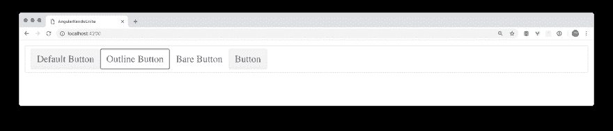
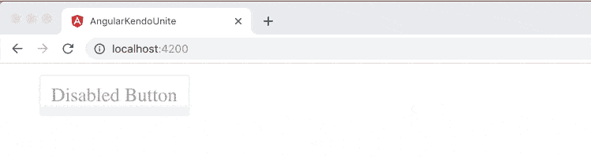
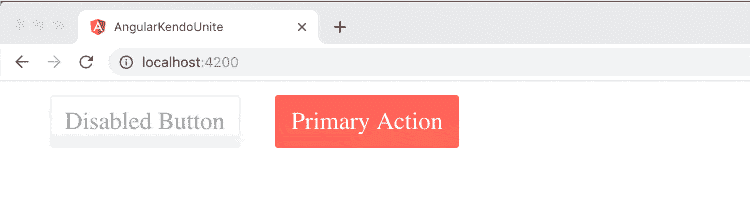
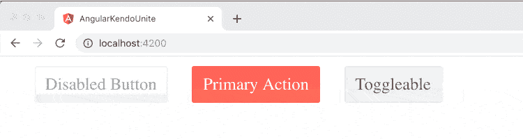
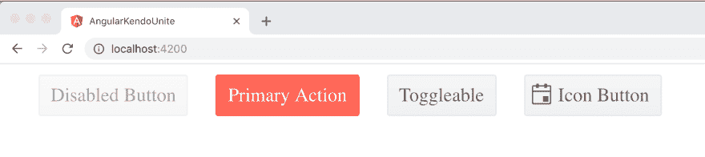
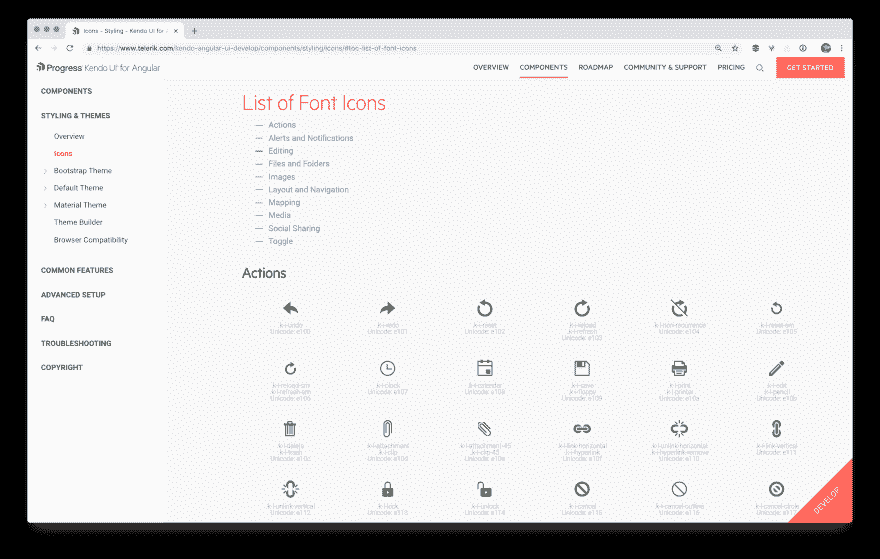
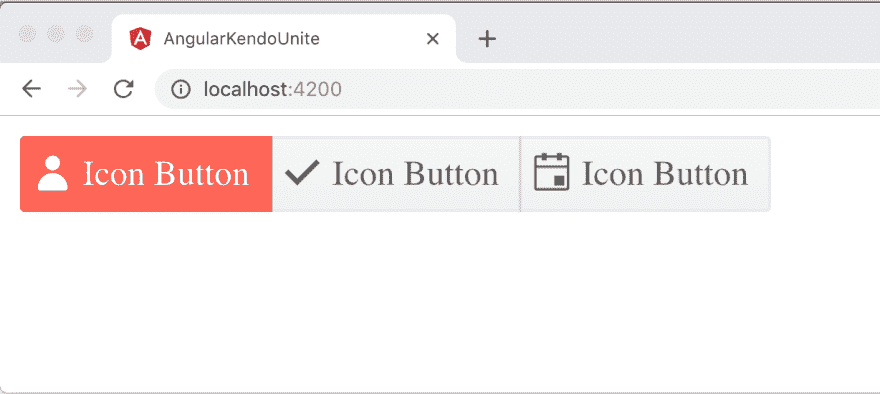
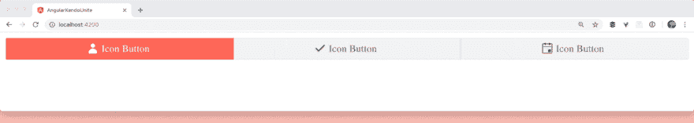
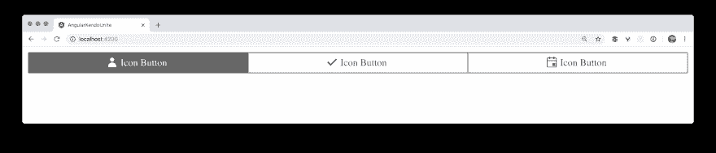

# 你想知道的关于剑道 UI 按钮的一切

> 原文：<https://dev.to/progresstelerik/all-you-could-ever-want-to-know-about-the-kendo-ui-button-1ebb>

如何在剑道 UI 中创建和设计一个漂亮的自定义按钮？了解如何轻松地为您的 web 应用程序构建完美的按钮。

大家好，欢迎回到 Angular 和剑道 UI Unite 视频系列。如果你是这个系列的新手，我建议看看[的第一个帖子](https://dev.to/progresstelerik/getting-started-with-angular--kendo-ui-1o08-temp-slug-3696551)或者看看这些帖子所基于的[视频系列](https://www.youtube.com/playlist?list=PLLGlTD7u3kMrqsgmFXe1IUuD_bJgHxSeK)。这是第二篇文章，我们将讨论所有关于按钮的内容。

如果你想看视频，你可以从这里开始:

在第一篇帖子中，我们创建了 Angular 应用程序，安装了剑道用户界面，并开始使用我们的第一个组件，即按钮。然而，我们没有时间涵盖所有内容，因为有太多太多的选择。本文将展示按钮的黑带方式，让我们开始吧！

在我的 Github 上找到要遵循的代码！

这是我们的应用程序，带有上次在按钮控制面板组件中构建的按钮。我们有一个`k-block`(一个剑道方块)，在里面我们有不同外观的按钮列表:

```
<div class="k-block">
    <button kendoButton [look]="'default'">Default Button</button>
    <button kendoButton [look]="'outline'">Outline Button</button>
    <button kendoButton [look]="'bare'">Bare Button</button>
    <button kendoButton>Button</button>
  </div> 
```

[T2】](https://res.cloudinary.com/practicaldev/image/fetch/s--V_ZU9zye--/c_limit%2Cf_auto%2Cfl_progressive%2Cq_auto%2Cw_880/https://www.telerik.com/sfimages/default-source/blogs/2018/2018-11/angular-kendo-unite-post-1/post-1/image_4.png%3Fsfvrsn%3D6b00f1d_2)

接下来我想展示你可以在你的剑道 UI 按钮上添加一些其他的东西。现在我们用这个`[look]`属性绑定来控制外观，但是你实际上可以做很多事情，比如禁用，设置一个按钮为主按钮，使一个按钮可切换或者给它一个图标。所以让我们开始吧，我会给你看那些东西！尽管知道它们都在使用属性绑定是件好事，属性绑定在方括号中。如果你需要有角度的装订复习，看看我写的这个帖子！

自定义按钮的属性绑定

|禁用按钮|[禁用]="true" |
|主按钮|[主]="true" |
|可切换按钮|[可切换]="true" |
|图标按钮| [icon]= " '检查' " |

正如您可能预料的那样，要禁用一个按钮，我们将把 disabled 设置为 true: `[disabled]="true"`。

[T2】](https://res.cloudinary.com/practicaldev/image/fetch/s--39_B4iyR--/c_limit%2Cf_auto%2Cfl_progressive%2Cq_66%2Cw_880/https://www.telerik.com/sfimages/default-source/blogs/2018/2018-11/angular-kendo-unite-post-1/post-2/image-1.gif%3Fsfvrsn%3Ddcc5bff3_2)

现在，列表中的最后一个按钮被禁用。很简单。让我们继续创建另一个按钮，但这将是一个主要按钮。我给它的是文本`Primary Action`，但这实际上类似于表单底部的提交按钮或购物车上的结账按钮。主要动作按钮应该是页面的主要目标。

```
<button kendoButton [primary]="true">Primary Action</button> 
```

[T2】](https://res.cloudinary.com/practicaldev/image/fetch/s--2bIkHP-c--/c_limit%2Cf_auto%2Cfl_progressive%2Cq_66%2Cw_880/https://www.telerik.com/sfimages/default-source/blogs/2018/2018-11/angular-kendo-unite-post-1/post-2/image-2.gif%3Fsfvrsn%3Dcf0372ca_2)

下一个，可折叠的。我们将简单地通过设置`[toggleable]="true"`来切换我们创建的下一个按钮。

```
<button kendoButton [toggleable]="true">Toggleable</button> 
```

[T2】](https://res.cloudinary.com/practicaldev/image/fetch/s--yHG4DDwx--/c_limit%2Cf_auto%2Cfl_progressive%2Cq_66%2Cw_880/https://www.telerik.com/sfimages/default-source/blogs/2018/2018-11/angular-kendo-unite-post-1/post-2/toggleable.gif%3Fsfvrsn%3D4e45cbd1_2)

警告:如果你使用的剑道 UI 按钮版本早于 4.1.3，你将需要拼写可切换属性`togglable`。

所以我们现在要讨论的最后一个特性是图标。您实际上可以将 icon 设置为一个带有图标名称的字符串。让我们看看日历。那是相当可耻的。:D

```
<button kendoButton [icon]="'calendar'" [toggleable]="true">Icon Button</button> 
```

[T2】](https://res.cloudinary.com/practicaldev/image/fetch/s--fCXnFOA4--/c_limit%2Cf_auto%2Cfl_progressive%2Cq_auto%2Cw_880/https://www.telerik.com/sfimages/default-source/blogs/2018/2018-11/angular-kendo-unite-post-1/post-2/image-3.png%3Fsfvrsn%3Dda0092ac_2)

你可以看到我们有图标按钮，超级性感，有日历图标。你可能会想，我怎么知道我还有什么其他的图标可以用呢？好吧，让我们一起浏览文档，找到更多关于图标的信息。从我们的[按钮图标文档](https://www.telerik.com/kendo-angular-ui/components/buttons/button/icons/)你可以[导航到这里](https://www.telerik.com/kendo-angular-ui-develop/components/styling/icons/#toc-list-of-font-icons)我们提供的内置图标的完整列表！

[T2】](https://res.cloudinary.com/practicaldev/image/fetch/s--Ihbts-6C--/c_limit%2Cf_auto%2Cfl_progressive%2Cq_auto%2Cw_880/https://www.telerik.com/sfimages/default-source/blogs/2018/2018-11/angular-kendo-unite-post-1/post-2/image-4.png%3Fsfvrsn%3Dc4aad7d0_2)

这就是我们如何知道哪些图标是可用的。

在下一节中，我将注释掉我们早期的一些按钮，这样我们就可以更多地使用我们漂亮的图标按钮。

## 按钮组

我们有一种叫做[剑道按钮组](https://www.telerik.com/kendo-angular-ui-develop/components/buttons/buttongroup/)的东西，你可以把你的按钮包在里面。它将它们很好地组合在一起，外部的按钮边缘有一个漂亮的圆角，而中间的按钮是方形的，所以看起来它们是一个有凝聚力的群体，这非常好。有一个简洁的组合，既包含在`kendo-buttongroup`元素中，又包含了`toggleable`集合，给出了这个独特的外观:

```
<kendo-buttongroup>
  <button kendoButton [icon]="'user'" [toggleable]="true">Icon Button</button>
  <button kendoButton [icon]="'check'" [toggleable]="true">Icon Button</button>
  <button kendoButton [icon]="'calendar'" [toggleable]="true">Icon Button</button>
</kendo-buttongroup> 
```

[T2】](https://res.cloudinary.com/practicaldev/image/fetch/s--rYSQzOVt--/c_limit%2Cf_auto%2Cfl_progressive%2Cq_auto%2Cw_880/https://www.telerik.com/sfimages/default-source/blogs/2018/2018-11/angular-kendo-unite-post-1/post-2/image-5.png%3Fsfvrsn%3D4f575c2e_2)

## 给出按钮组的全宽

您也可以通过将`width`设置为`100%`来使该按钮组响应性地跨越整个宽度。

```
<kendo-buttongroup [width]="100">
  <button kendoButton [icon]="'user'" [toggleable]="true">Icon Button</button>
  <button kendoButton [icon]="'check'" [toggleable]="true">Icon Button</button>
  <button kendoButton [icon]="'calendar'" [toggleable]="true">Icon Button</button>
</kendo-buttongroup> 
```

[T2】](https://res.cloudinary.com/practicaldev/image/fetch/s--WTveyu0c--/c_limit%2Cf_auto%2Cfl_progressive%2Cq_66%2Cw_880/https://www.telerik.com/sfimages/default-source/blogs/2018/2018-11/angular-kendo-unite-post-1/post-2/image-6.gif%3Fsfvrsn%3D39e3fb19_2)

## 给按钮组一个禁用或裸露的外观

我还想谈几个其他的特性。我们已经讨论了如何改变每个按钮的外观，你也可以很容易地改变剑道 UI 按钮组中的所有按钮。所以在剑道 UI 按钮组中，你可以说“看起来相等”,然后是默认、轮廓等。让我们继续尝试大纲。

```
<kendo-buttongroup [width]="100" look="outline">
  <button kendoButton [icon]="'user'" [toggleable]="true">Icon Button</button>
  <button kendoButton [icon]="'check'" [toggleable]="true">Icon Button</button>
  <button kendoButton [icon]="'calendar'" [toggleable]="true">Icon Button</button>
</kendo-buttongroup> 
```

[T2】](https://res.cloudinary.com/practicaldev/image/fetch/s--pUVn90RY--/c_limit%2Cf_auto%2Cfl_progressive%2Cq_auto%2Cw_880/https://www.telerik.com/sfimages/default-source/blogs/2018/2018-11/angular-kendo-unite-post-1/post-2/image-7.png%3Fsfvrsn%3Dd6ff5ca6_2)

与单个按钮一样，通过在按钮组本身上将禁用属性或外观设置为 true，可以将它们更改为轮廓、平面或裸露。

## 最终产品

```
<button kendoButton [disabled]="true">Disabled Button</button>
<button kendoButton [primary]="true">Primary Action</button>
<button kendoButton [toggleable]="true">Toggleable</button>

<kendo-buttongroup [width]="100" look="outline">
  <button kendoButton [icon]="'user'" [toggleable]="true">Icon Button</button>
  <button kendoButton [icon]="'check'" [toggleable]="true">Icon Button</button>
  <button kendoButton [icon]="'calendar'" [toggleable]="true">Icon Button</button>
</kendo-buttongroup> 
```

我希望你喜欢学习更多关于剑道 UI 按钮的知识。实际上还有两个额外的组件，下拉按钮和分割按钮，我们没有时间在这个博客系列中深入讨论，但是我们的文档讨论了所有这些组件，并且我们有惊人的例子。如果你好奇的话，请一定要去看看，它们很棒！在 Angular 和剑道 UI Unite 的下一部分，我们将在这里再见。

如果你是 Angular 的剑道用户界面新手，你可以在这里了解更多或者今天就进入[30 天免费试用](https://www.telerik.com/download-trial-file/v2/kendo-angular-ui)。