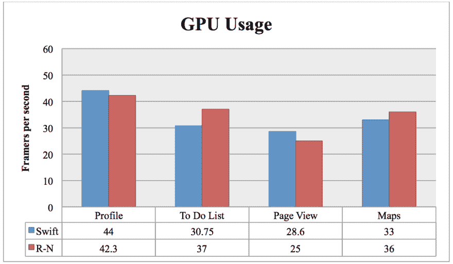

# 几乎是本机的，但是 React 本机性能符合标准吗？

> 原文：<https://dev.to/jessaminmorgan/almost-native-but-does-react-native-performance-measure-up--109l>

与为 iOS 和 Android 构建独立的原生应用相比，跨平台移动应用开发可以节省时间和金钱，这一点几乎已经得到普遍认可。

但是，如果你的公司是构建跨平台应用的新手，那么在众多可用的[移动应用开发服务](https://www.iflexion.com/services/mobile-application-development)和这些服务提供商使用的工具之间做出选择可能会很棘手。

也许您已经开始评估您的选择，并且您可能已经听说，尽管是跨平台开发领域的一个相对新来者，React Native (RN)就是这样一个正在迅速流行的工具。

事实上，它目前被认为是创建原生风格应用程序的最有前途的解决方案之一，但尽管如此，人们很自然会怀疑 React 原生性能是否真的可以与纯 Swift 或 Java 相媲美。

## 启动和响应时间

第一印象决定一切，所以你的移动应用启动并开始与后端通信的速度对成功至关重要。事实上，根据 Apteligent 的数据，50%的消费级应用程序用户发现缓慢的加载时间是主要的挫折来源，因此在用户体验优化过程中，启动和响应速度必须优先考虑。应用程序的性能，包括加载速度，也是企业用户的痛处，正如下面的统计数据(由 CIO Insight 汇编)所示。

现在，正如本文中涵盖的所有 React 本机性能标准一样，不可能在真正的本机应用程序和那些用 RN 或任何其他跨平台开发替代方案创建的应用程序之间提供通用的性能比较。事实上，有太多不同的因素在起作用，所以寻求一个绝对的基准是不现实的。不过，通过分析原生应用和基于 React Native 构建的跨平台应用的特征，可以提供一个总体比较。

## 反应原生:接近原生启动和响应时间

React Native 是一个 JavaScript 框架。如果你向你的开发者询问 JavaScript，他们无疑会告诉你它的执行速度非常慢，尤其是在 Android 设备上。

好消息是 React Native 减轻了 JavaScript 的一些性能弱点，最重要的是允许开发人员在任何有意义的地方加入本机代码。这里需要注意的重要一点是，你不必完全用一个代码库来创建应用程序。

这种非指令性的应用程序开发方法完全有可能创建加载速度与真正的原生应用程序一样快的应用程序(前提是您的开发人员不需要以牺牲所有其他东西为代价快速、廉价地构建应用程序)。

不过请记住，像所有跨平台框架一样，使用 React Native 创建应用程序会涉及一定量的额外软件开销，这不可避免地会使它们比原生应用程序略重，加载速度可能会稍慢。

## 手机 App 反应时间

当然，启动速度只是手机 app 用户判断性能的出发点。对于一个应用程序来说，对用户的输入做出快速的反应和响应同样重要。

在这方面，React Native 是一个真正的赢家，尤其是因为 RN 应用程序不像大多数原生软件那样占用大量 CPU 资源，而是更多地使用移动设备 GPU。此外，他们可以像真正的本地应用程序一样高效地使用 GPU。

例如，开发者 John A. Calderaio 为苹果设备开发并测试了两个相同的应用。一个是用本机代码(Swift)开发的，另一个是用 React Native 开发的。虽然真正的本机应用程序比 React 本机版本的 CPU 效率更高，但差异不到 18%，这不是特别显著。

在他的 GPU 测试中，John 的 React 原生应用程序实现了与原生变体几乎相同的每秒帧数性能。这个测试的结果可以在下面的图表中看到。

[T2】](https://res.cloudinary.com/practicaldev/image/fetch/s--zPcuMB_w--/c_limit%2Cf_auto%2Cfl_progressive%2Cq_auto%2Cw_880/https://cdn-images-1.medium.com/max/1200/1%2AVCrdvrBoterX_v25H9z3Pw.png)

## React 原生与 Java (Android)应用

你可能已经注意到，到目前为止提到的大多数直接比较是在 RN 和 native Swift 之间进行的，事实上，这是 React Native 表现最好的情况。与基于 Java 的应用程序相比，情况略有不同。

不得不说，当被问及 RN 与 Java 的对比时，一些开发人员表达了对跨平台框架的失望。当使用 React Native 为 Android 开发应用程序时，内存问题似乎尤为突出。

然而，这并不意味着 React Native 不适合构建 Android 应用。许多记忆问题都可以找到解决方法。此类解决方案可能包括以下任意或所有示例:

*   确保从服务器请求的图像不会超过同时显示许多图像的视图所需的大小。

*   确保静态图像是 JPG 格式(不是 PNG 格式)。

*   在 AndroidManifest.xml 中将 LargeHeap 设置为“true”

最重要的是，要明白使用 RN 构建 Android 应用的开发者需要比 iOS 平台更多的创造力来优化性能。

## 记住要考虑发展表现

当考虑到所有因素时，很少有人认为 React Native 缺乏与本机应用程序相匹配的性能。小的差距，如果有的话，会被提供给开发公司的好处所弥补，或者如果你打算使用内部资源来交付移动应用，会被提供给你自己的企业的好处所弥补。

这些优势——例如使用单一语言编写大部分代码的能力，以及仅在必要时集成本机代码的能力——使得减少创建应用程序所需的时间成为可能。它们还允许更小的工程团队并降低开发成本。

简而言之，React Native 可以提高开发效率和性能，而不会对应用质量产生重大影响。仅仅这一点就足以让你选择 RN 作为你的跨平台框架。

## React Native 是您的解决方案吗？

如果您决定使用 React Native，或者您已经在这样做了，那么您做出这个决定的关键因素是什么？

有没有什么会让你选择另一个替代品，如 Xamarin 或 Adobe 的 Cordova？或者，您是否仍然认为，为了确保最佳的用户体验，构建完全不同的原生应用程序的额外努力和成本是可以接受的？

如果您已经在使用 React Native 作为您公司的应用程序，请随时发表一两条评论，特别是您的经验。