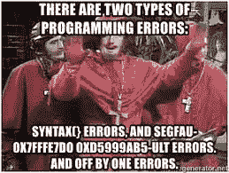
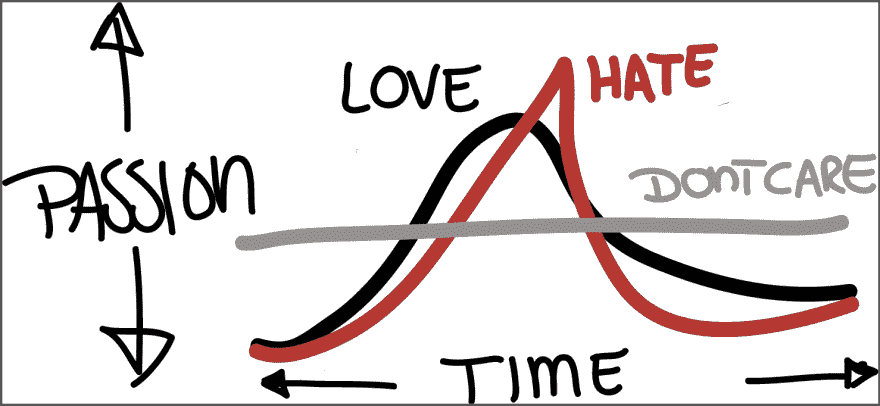

# 好吧，分手吧！使用分区/区块

> 原文：<https://dev.to/jdsteinhauser/alright-break-it-up-using-partitionchunk-h15>

> **编程应该是关于转换数据**...]我不想隐藏数据，我想转换它。
> 
> *   迪夫·托马斯，[编程仙丹](https://www.amazon.com/Programming-Elixir-1-6-Functional-Concurrent/dp/1680502999/ref=sr_1_1?ie=UTF8&qid=1538580193&sr=8-1&keywords=programming+elixir+dave+thomas)

无论是计算学生的最终成绩，将鼠标点击转化为 t 恤订单，还是从 RPi 中读取和发布温度数据，编程基本上都是将数据从一种形式提取到另一种形式。通常，这感觉不像纯粹的数据转换，因为我们试图在一个步骤中处理数据的存储和转换。这可能会使代码非常混乱，尤其是对于那些必须维护代码的人来说。

> 任何傻瓜都能写出计算机能理解的代码。优秀的程序员编写人类能够理解的代码。
> 
> *   马丁·福勒

我从过去的项目中得到了几个例子来分享，从我更关心数据点的位置时如何编写算法，到我发现分区/分块函数之后。

# 什么是分区/分块？

在本文的上下文中，分区和分块是将现有的集合、流和可枚举数/可迭代数细分成对算法更有用的部分。这种分块可以通过以下方式完成:

*   尺寸(从 [ClojureDocs](https://clojuredocs.org/clojure.core/partition)

```
;; partition a list of 22 items into 5 (20/4) lists of 4 items  ;; the last two items do not make a complete partition and are dropped.  (partition  4  (range  22))  ;;=> ((0 1 2 3) (4 5 6 7) (8 9 10 11) (12 13 14 15) (16 17 18 19)) 
```

Enter fullscreen mode Exit fullscreen mode

*   最大尺寸(从 [LoDash](https://lodash.com/docs/4.17.10)

```
_.chunk(['a', 'b', 'c', 'd'], 2);
// => [['a', 'b'], ['c', 'd']]

_.chunk(['a', 'b', 'c', 'd'], 3);
// => [['a', 'b', 'c'], ['d']] 
```

Enter fullscreen mode Exit fullscreen mode

*   映射函数，用于将流中映射到相同值的连续项目分组(来自 [Elixir Docs](https://hexdocs.pm/elixir/Enum.html#chunk_by/2)

```
Enum.chunk_by([1, 2, 2, 3, 4, 4, 6, 7, 7], &(rem(&1, 2) == 1))
# => [[1], [2, 2], [3], [4, 4, 6], [7, 7]] 
```

Enter fullscreen mode Exit fullscreen mode

[T2】](https://res.cloudinary.com/practicaldev/image/fetch/s--ddbCgLRy--/c_limit%2Cf_auto%2Cfl_progressive%2Cq_auto%2Cw_880/https://thepracticaldev.s3.amazonaws.com/i/0y5m5qompf6u26w7rq0z.jpeg)

基本上，是的...分而治之。

# 从二进制流中解析数组

如果您曾经不得不从网络上获取原始数据或者以一种专有的/很少使用的二进制格式读取数据，那么您可能不得不为它编写自己的解析器。通常情况下，你不得不读取一个数组，它的长度是由之前声明的变量定义的。抛开这一点，这本身并不是最有趣的。格式通常类似于:

| 价值 | 类型 | 大小 |
| --- | --- | --- |
| 同步字(0xC011FEFE) | int32 | four |
| 时间戳(秒) | int64 | eight |
| 元素 | int32 | four |
| 数据元素 | int32[] | 4 *内莱蒙斯 |

现在，通常我会如何构建一些东西来读取包中的内容(没有验证)，比如:

```
public class DataFrame {
    public readonly DateTime Timestamp;
    public readonly int[] Data;

    public DataFrame(DateTime timestamp, int[] data) {
        Timestamp = timestamp;
        Data = data;
    }

    public static FromBytes(byte[] rawData) {
        var timeUsec = BitConverter.ToInt64(rawData, 4);    // Skip the sync word
        var timestamp = DateTime.FromFileTimeUtc(timeUsec);
        var count = BitConverter.ToInt32(rawData, 12);
        var data = new int[count];

        // Skip the first 16 bytes before we start reading the data
        for (int i = 0; i < count; i++) {
            data[i] = BitConverter.ToInt32(rawData, 16 + i * 4);
        }

        return new DataFrame(timestamp, data);
    }
} 
```

Enter fullscreen mode Exit fullscreen mode

当然，我必须非常关心头信息在哪里，但是在将数据数组读入`data`时，必须有一种方法使我的意图更加清晰。同样的东西，用 F#写的，我感觉干净一点:

```
type DateFrame = { Timestamp : DateTime; Data : int array }

let fromBytes data = 
  let time = BitConverter.ToInt64(data, 4)
  let numItems = BitConverter.ToInt32(data, 12)
  {
    Timestamp = DateTime.FromFileTimeUtc time
    Data = data
           |> Array.skip 16
           |> Array.chunkBySize 4
           |> Array.take numItems
           |> Array.map (fun x -> BitConverter.ToInt32(x, 0))
  } 
```

Enter fullscreen mode Exit fullscreen mode

将`data`分成 4 个字节的增量允许我非常干净地将信息传递给`BitConverter`以转换成 32 位整数。我不必跟踪偏移量，并且有效地从我的代码中删除了整个偏移量或“偏离 x”的错误类别！

[T2】](https://res.cloudinary.com/practicaldev/image/fetch/s--vgTMAdz2--/c_limit%2Cf_auto%2Cfl_progressive%2Cq_auto%2Cw_880/https://thepracticaldev.s3.amazonaws.com/i/pmx7ey6a1fdyb3fu5ggp.jpg)

# 只有部分数据重要

让我们面对它:有时你只是不关心你的很多数据。

[](https://res.cloudinary.com/practicaldev/image/fetch/s--i6rBr3fE--/c_limit%2Cf_auto%2Cfl_progressive%2Cq_auto%2Cw_880/https://thepracticaldev.s3.amazonaws.com/i/ntbdkpvuu2wdmx22bu7i.png) 
图片归功于[这篇博文](https://www.capgemini.com/2012/09/communities-crossing-the-dont-care-line-and-love-your-haters/)

假设你是一家快递公司，你想确保你的司机遵守速度限制。你真的不关心他们实际上这样做的时间，但当他们超过速度限制时，他们可能想找出原因。也许他们正在下坡，开始刹车晚了。也许他们在发短信，没有注意。谁知道呢？但是你应该从你的地图 API 中获取速度限制，从 GPS 中获取速度，并计算出司机何时超速，以及超速多长时间。让我们来看看查找超速超过一分钟的司机会是什么样子:

```
public class DriverData {
    public readonly DateTime Timestamp;
    public readonly double Speed;
    public readonly double SpeedLimit;

    public DriverData(DateTime time, double speed, double speedLimit) {
        Timestamp = time;
        Speed = speed;
        SpeedLimit = speedLimit;
    }
}

public class Driver {
    public readonly Name;
    public IEnumerable<DriverData> DrivingHistory;

    public IEnumerable<(DateTime, TimeSpan)> SpeedingMoreThanAMinute() {

        // If the collection has no values or only one value, result is empty
        if (DrivingHistory == null || DrivingHistory.Count() <= 1) {
            yield break;
        }

        var isSpeeding = false;
        var speedingStart = new DateTime(0);
        var lastTime = new DateTime(0);
        var i = 0;

        foreach (var point in DrivingHistory) {
            var isSpeedingNow = point.Speed > point.SpeedLimit;

            if (isSpeedingNow) {
                if (!isSpeeding) {
                    speedingStart = point.Timestamp;
                }
                isSpeeding = true;
                lastTime = point.Timestamp;
            }
            else {
                if (isSpeeding) {     // We were speeding, and now we're not
                    var duration = (lastTime - speedingStart).TotalSeconds();
                    if (duration >= 60) {
                        yield return (speedingStart, duration);
                    }
                }
                isSpeeding = false;
            }
        }
        yield break;
    }
} 
```

Enter fullscreen mode Exit fullscreen mode

呸。那是一大堆丑陋的逻辑！这里有六种可能的情况，当我们写出来的时候，我们必须记住所有的内部状态变量和它们的函数。我们**需要**所有这些开销来发现我们的司机何时超速？你肯定不是认真的吧！

[T2】](https://res.cloudinary.com/practicaldev/image/fetch/s--kEZcunJJ--/c_limit%2Cf_auto%2Cfl_progressive%2Cq_auto%2Cw_880/https://thepracticaldev.s3.amazonaws.com/i/d0eahtoe2yneapwdl2b8.jpg)

这就是函数分块派上用场的地方。在长生不老药里尝试这个(编辑:多亏了阿列克谢·马提乌什金才稍微修复了一下！):

```
defmodule DriverData do
    defstruct [:timestamp, :speed, :speed_limit]

    def is_speeding_one_minute_plus(data)
        data
        |> Enum.drop_while(& &1[speed] <= &1[speed_limit])
        |> Enum.chunk_by(& &1[speed] > &1[speed_limit])
        |> Enum.take_every(2)
        |> Enum.map(fun x -> 
            %{start => hd(x)[timestamp],
              duration => DateTime.diff(List.last(x)[timestamp] - hd(x)[timestamp])
            end)
        |> Enum.filter(& &1[duration] >= 60)
    end
end 
```

Enter fullscreen mode Exit fullscreen mode

因为这是我在这篇文章中用过的五种语言之一(如果算上英语的话是六种！)，我将向您介绍这是怎么回事，因为事情没那么简单。Elixir `|>`操作符获取之前计算的表达式，并将其作为下一个函数调用的第一个参数。这与 Clojure 的`->`宏的功能相同，但与 F#的`|>`操作符不同(它使用前面的语句作为下一个函数的最后一个参数)。我使用`Enum.drop_while/2`从司机没有超速的地方开始删除所有点，然后我使用`Enum.chunk_by/2`然后根据司机的速度是否超过速度限制将列表分成块，然后使用`Enum.take_every/2`获取每个第二元素(由参数中的`2`指定)。这给我留下的只有司机超速的时间列表。然后我使用`Enum.map/2`将这些列表转换成带有`:start`和`:duration`键的地图，然后基于`duration >= 60`秒过滤那些列表。我们只通过对我们关心的数据块进行操作，过滤掉我们不需要的数据，并将输出转化为我们可以使用的东西，而这一切都没有使用任何条件分支或任何内部状态。

# 结论

不可否认，我花了很长时间才把数据分块/分区成有用的比特。我已经习惯了在十多年的过程化和面向对象编程中开发算法，从这种习惯转变到把一切都看成只是数据转换，这是很难的。如果这个概念对你来说很难，请理解，包括我在内的许多其他人也经历过！如果您发现自己构建了大量的内部状态，只是为了从可迭代/可枚举集合中解析出一些数据，那么可以将此作为一种代码气味，看看分块是否适合您的问题。

编码快乐！