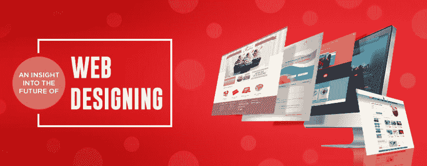

# 洞察网页设计的未来

> 原文：<https://dev.to/stevegeorge/an-insight-into-the-future-of-web-design-2lda>

随着新技术的出现，网页设计技术已经发展了很多年。在这里，我们正在讨论网页设计行业的未来，展望未来 20 年的网页设计前景。网页设计包含了创造力和技术知识。如今，网站设计在数字化商业平台中起着至关重要的作用。商业公司在网站设计上很有创意，这使他们能够建立自己的数字身份。在本文中，我们向您展示了 web 开发的未来，这是通过新技术的出现来感知的。

[T2】](https://res.cloudinary.com/practicaldev/image/fetch/s--WiRLf0-t--/c_limit%2Cf_auto%2Cfl_progressive%2Cq_auto%2Cw_880/https://thepracticaldev.s3.amazonaws.com/i/ep0p3lwgomic251bb1rv.jpg)

# 开发者工具

该网站将提供实时功能，其中集成了开发工具。这是增强用户数字体验的关键方面之一。对高级软件的需求很高，然而，目前可用的工具的质量需要改进。显然，开发强大网站的基础设施渴望得到关注。开发者工具正被用来弥补这一差距。近年来，开发人员工具的数量有所增加。因此，可以在应用程序中开发实时功能。这使得它们能够自动更新，并且用户不需要刷新浏览器。目前，某些开源框架允许用户在单一代码基础上构建移动和桌面应用。未来几年，网络体验可能会变得更便宜、更快捷。商业公司可能会从知名公司寻求专业的网站设计服务，将这些功能整合到他们的网站中。

## 设计与数据的交互**

网站的设计和数据在塑造用户体验方面起着决定性的作用。未来，网站中设计和数据之间的互动可能会更加激烈。网站设计和数据将一起开发，这将改变数据呈现在访问者面前的方式。这种设计将有助于互联网用户，为他们提供更具情境性和个性化的体验。这一点在广告显示中已经很明显，因为谷歌通过搜索 Gmail 账户来了解用户感兴趣的内容。将来，网页很可能会为特定用户进行更多的定制。这可能会在很大程度上影响客户体验。网页设计技术的未来依赖于数据，以及如何将数据整合到网站中。

## 网站界面**

未来几年，网站的界面可能会变得更具对话性。网站界面在很大程度上塑造了客户体验。随着 web UI 动画集成到网站中，用户体验将得到提升。对话式界面可以理解用户的思维方式。这种类型的界面将使网站对用户更友好。领先的网页设计公司正在网站中试验对话界面，这可以改变数据的呈现方式。它将带来公司与客户互动机制的转变。然而，设计师需要应对许多挑战，比如理解心智模型、培养信任和信心、开发语言等等。目前，商业公司把重点放在网站用户界面设计上，因为它在留住客户方面起着举足轻重的作用。随着对话式界面的出现，网页将远离传统的基于屏幕的界面，用户可以在屏幕上浏览信息和其他细节。在对话式界面中，用户会一直保持在正确的轨道上。此外，公司正在推出响应网站。通过移动设备访问互联网的用户数量正在增加。响应式网页设计的主要好处是，它使网站可以从所有类型的设备和浏览器访问。所有用户的体验都是一致的。

然而，开发者在网站上开发对话界面时，需要关注隐私、道德和透明度等方面。

## 网站中的动画**

在未来的几年里，网页动画很可能会在塑造用户体验方面发挥主导作用。这是一个相对较新的趋势，商业公司正在迅速赶上网络动画。他们正与知名开发商合作，将这些功能整合到他们的网站中。除了聊天机器人和视觉设计元素，网页动画也在网站上产生了影响。然而，当网络动画第一次出现时，它们被认为是突兀、烦人和俗气的。然而，最近这些被证明是更容易接受的，因为当用户采取行动时，它们可以向公司提供即时反馈。这使得网站能够在正确的过程中引导用户。

嗯，最初接受网络动画的阻力已经消退，这要感谢像谷歌材料设计这样的先进动画框架，以及其他提高了标准的框架。商业公司正在尝试新技术来改善用户体验。整合网页动画已经成为一种趋势，而且这种趋势在未来可能会增加。

网页设计行业正在经历一场变革，因为它需要训练有素的设计师来开发网站的这些功能。从业者现在专门开发网页动画，这已经变成了一门艺术。

### AR 和 VR**

增强现实和虚拟现实是强大的工具，它们已经在各种平台上产生了明显的影响。这些技术将彻底改变未来网站的设计。用户面前将不再有屏幕。他们将成为他们通过隐形眼镜和智能眼镜所看到的一部分。顶级设计平台仍在尝试 AR 和 VR 在网页设计中的可能性。你可能有兴趣阅读一下[网页设计技巧和原则](http://winbizsolutionsindia.com/web-design-tricks-and-principles/)，当你将这些功能整合到你的网站时，它们会对你有所帮助。这些技术将使用户更容易解释数据并更好地了解各种过程。

网站的可用性在决定用户体验方面起着重要的作用。商业公司一直在努力提高他们的网站对用户的影响。近年来，很多公司都在为用户开发加速移动网页网站。这增强了用户的整体体验。你可以去找一个知名的网站开发者，将必要的功能整合到你的网站中。