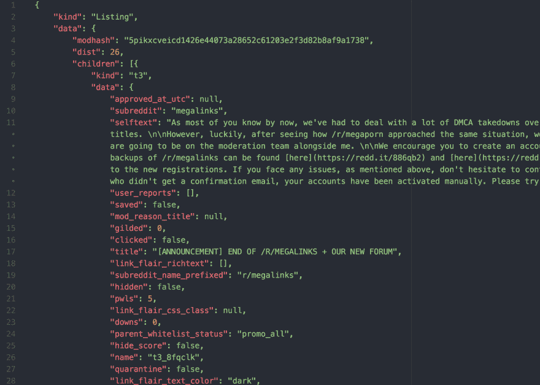
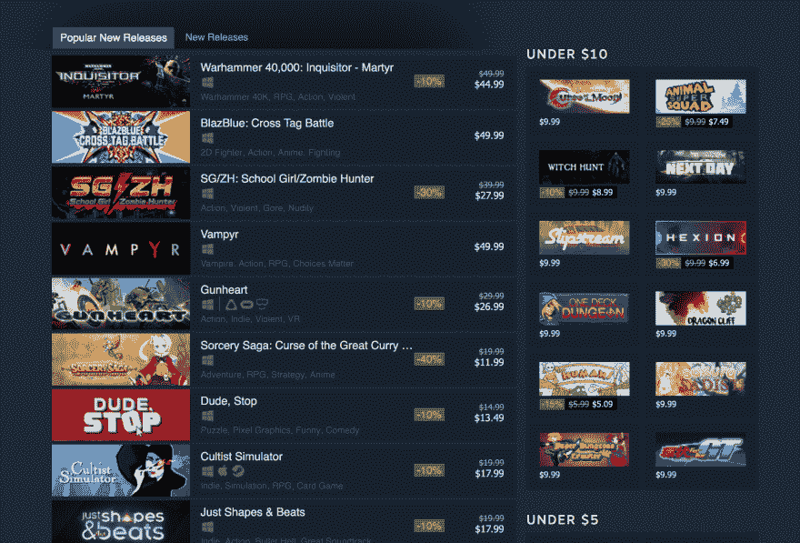
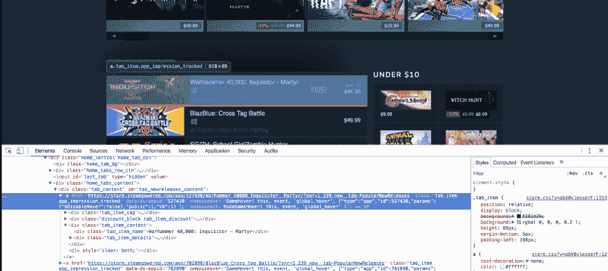
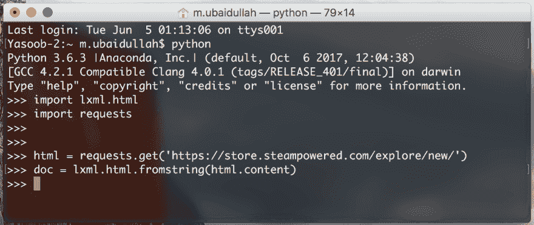
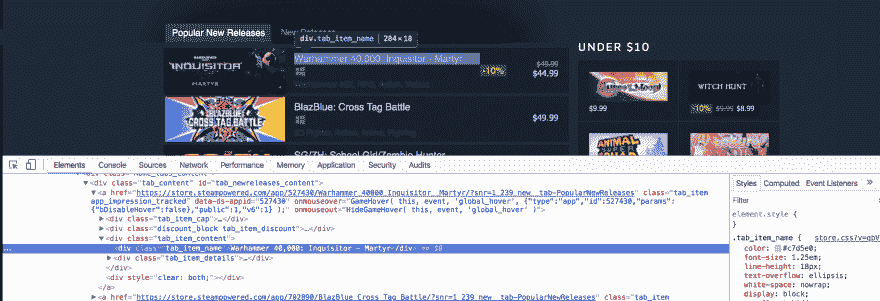
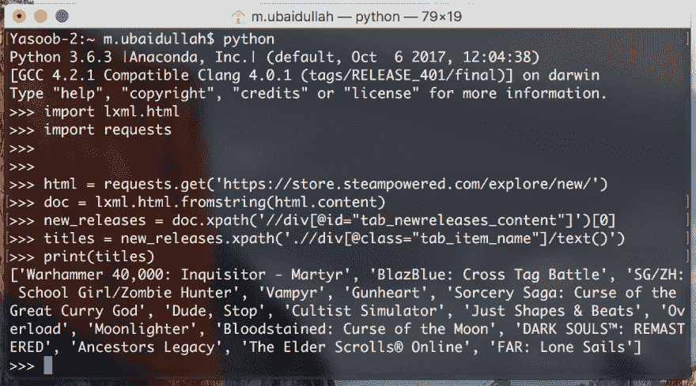
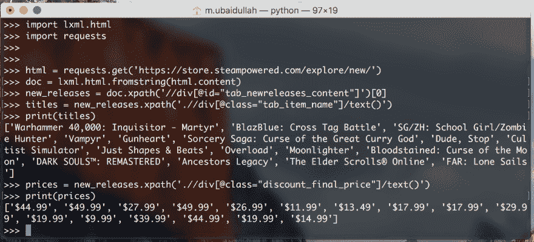
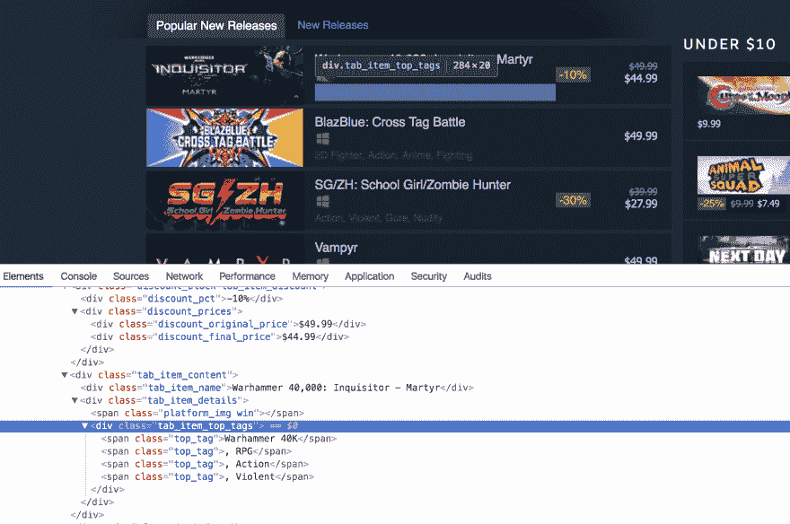
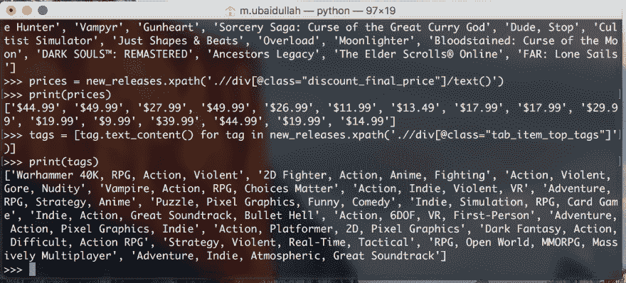
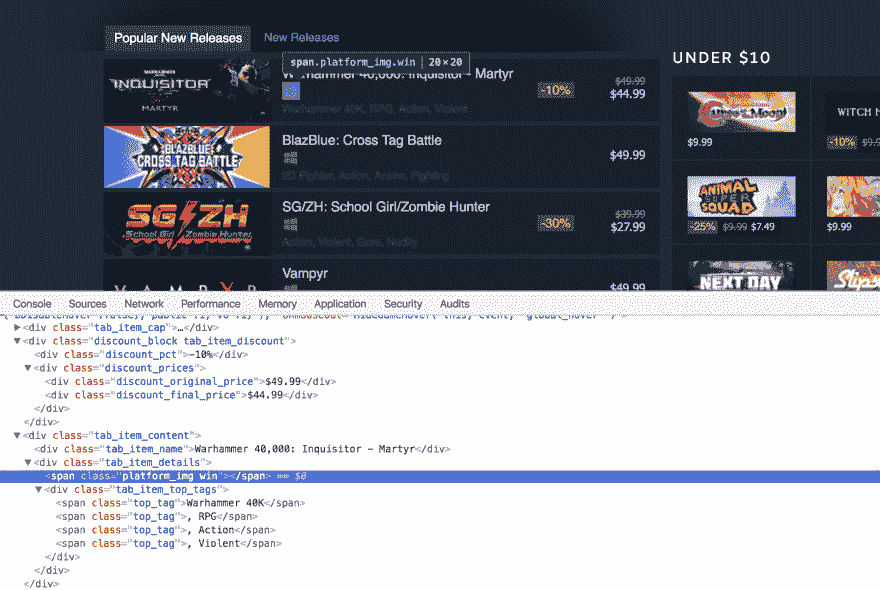

# lxml 和 Python 的网络抓取简介

> 原文：<https://dev.to/timber/an-intro-to-web-scraping-with-lxml-and-python-32hl>

你为什么要费心去学习如何抓取网页呢？如果你的工作不需要你去学习，那么让我给你一些动力。如果你想创建一个网站，展示亚马逊、沃尔玛和其他一些在线商店的最便宜的产品，该怎么办？很多在线商店都没有提供一种简单的方法来使用 API 访问他们的信息。在没有 API 的情况下，你唯一的选择是创建一个 web scraper，它可以自动从这些网站中提取信息，并以一种易于使用的方式为你提供这些信息。

下面是一个 JSON 中典型 API 响应的例子。这是 Reddit 的回复:

[T2】](https://res.cloudinary.com/practicaldev/image/fetch/s--z-rDbFTv--/c_limit%2Cf_auto%2Cfl_progressive%2Cq_auto%2Cw_880/https://imgur.com/WOBUbyn.png)

有很多 Python 库可以帮助你抓取网页。有 [lxml](http://lxml.de/) 、 [BeautifulSoup](https://www.crummy.com/software/BeautifulSoup/?) 和一个名为 [Scrapy](https://scrapy.org/) 的成熟框架。大多数教程讨论 BeautifulSoup 和 Scrapy，所以我决定在这篇文章中使用 lxml。我将教您 XPaths 的基础知识，以及如何使用它们从 HTML 文档中提取数据。我将带您看几个不同的例子，以便您能够快速掌握 lxml 和 XPaths。

如果你是一个游戏玩家，你应该已经知道(并且可能喜欢)这个网站。我们将尝试从 [Steam](https://store.steampowered.com/) 中提取数据。更具体地说，我们将从“[热门新发布](https://store.steampowered.com/explore/new/)”信息中进行选择。我正在把这个转换成一个两部分的系列。在这一部分中，我们将创建一个 Python 脚本，它可以提取游戏的名称、游戏的价格、与每个游戏和目标平台相关联的不同标签。在第二部分，我们将把这个脚本转换成一个基于 Flask 的 API，然后把它放在 Heroku 上。

[T2】](https://res.cloudinary.com/practicaldev/image/fetch/s--I0VqnEkJ--/c_limit%2Cf_auto%2Cfl_progressive%2Cq_auto%2Cw_880/https://imgur.com/M2dJIbc.png)

### 步骤 1:探索蒸汽

首先，在 Steam 上打开“[热门新品](https://store.steampowered.com/explore/new/)”页面，向下滚动，直到看到“热门新品”标签。此时，我通常会打开 Chrome 开发人员工具，查看哪些 HTML 标签包含所需的数据。我经常使用元素检查工具(开发者工具左上角的按钮)。它允许您只需点击一下鼠标，就可以看到页面上特定元素后面的 HTML 标记。作为一个高层次的概述，网页上的所有内容都封装在一个 HTML 标签中，并且标签通常是嵌套的。您需要弄清楚需要从哪些标签中提取数据，然后就可以开始了。在我们的例子中，如果我们看一下，我们可以看到每个单独的列表项都封装在一个 anchor ( `a`)标记中。

[T2】](https://res.cloudinary.com/practicaldev/image/fetch/s--Ea5hRFCJ--/c_limit%2Cf_auto%2Cfl_progressive%2Cq_auto%2Cw_880/https://imgur.com/cHKdTlR.png)

锚标签本身封装在 id 为`tab_newreleases_content`的`div`中。我提到 id 是因为这个页面上有两个选项卡。第二个选项卡是标准的“新发布”选项卡，我们不想从该选项卡中提取信息。因此，我们将首先提取“Popular New Releases”标签，然后从这个标签中提取所需的信息。

### 第二步:开始编写 Python 脚本

这是创建一个新的 Python 文件并开始写下我们的脚本的绝佳时机。我将创建一个`scrape.py`文件。现在让我们继续导入所需的库。第一个是 [`requests`](http://docs.python-requests.org/) 库，第二个是 [`lxml.html`](http://lxml.de/) 库。

```
import requests
import lxml.html 
```

如果您没有安装`requests`，您可以通过在终端中运行以下命令来轻松安装它:

```
$ pip install requests 
```

请求库将帮助我们用 Python 打开网页。我们也可以使用`lxml`来打开 HTML 页面，但是它并不适用于所有的网页，所以为了安全起见，我将使用`requests`。

现在让我们使用请求打开网页，并将响应传递给`lxml.html.fromstring`。

```
html = requests.get('https://store.steampowered.com/explore/new/')
doc = lxml.html.fromstring(html.content) 
```

这为我们提供了一个`HtmlElement`类型的对象。这个对象有一个`xpath`方法，我们可以用它来查询 HTML 文档。这为我们提供了一种从 HTML 文档中提取信息的结构化方法。

### 第三步:启动 Python 解释器

现在保存这个文件并打开一个终端。从`scrape.py`文件中复制代码并粘贴到 Python 解释器会话中。

[T2】](https://res.cloudinary.com/practicaldev/image/fetch/s--p37MNvuN--/c_limit%2Cf_auto%2Cfl_progressive%2Cq_auto%2Cw_880/https://imgur.com/j8Goguq.png)

我们这样做是为了快速测试我们的 XPaths，而不需要不断地编辑、保存和执行我们的`scrape.py`文件。

让我们尝试编写一个 XPath 来提取包含“热门新版本”标签的 div。我将一边进行一边解释代码:

```
new_releases = doc.xpath('//div[@id="tab_newreleases_content"]')[0] 
```

该语句将返回 HTML 页面中 id 为`tab_newreleases_content`的所有`divs`的列表。现在，因为我们知道页面上只有一个 div 有这个 id，所以我们可以从列表中取出第一个元素(`[0]`)，这将是我们需要的`div`。让我们分解一下`xpath`，试着去理解它:

*   `//`这些双斜线告诉`lxml`我们想要在 HTML 文档中搜索所有符合我们要求/过滤器的标签。另一种选择是使用`/`(单个正斜杠)。单个正斜杠只返回与我们的要求/过滤器匹配的直接子标签/节点
*   `div`告诉`lxml`我们正在 HTML 页面中搜索`divs`
*   `[@id="tab_newreleases_content"]`告诉`lxml`我们只对那些 id 为`tab_newreleases_content`的`divs`感兴趣

酷！我们已经得到了所需的。现在让我们回到 chrome，检查哪个标签包含了发布的标题。

### 第四步:提取标题&价格

[T2】](https://res.cloudinary.com/practicaldev/image/fetch/s--6cE9n_rQ--/c_limit%2Cf_auto%2Cfl_progressive%2Cq_auto%2Cw_880/https://imgur.com/6WiBIUU.png)

标题包含在一个具有类`tab_item_name`的 div 中。现在我们已经提取了“流行的新版本”选项卡，我们可以在该选项卡上运行进一步的 XPath 查询。在我们之前运行代码的同一个 Python 控制台中写下以下代码:

```
titles = new_releases.xpath('.//div[@class="tab_item_name"]/text()') 
```

这给了我们在“流行的新版本”标签中所有游戏的标题。以下是预期的输出:

[T2】](https://res.cloudinary.com/practicaldev/image/fetch/s--BAKTHLlL--/c_limit%2Cf_auto%2Cfl_progressive%2Cq_auto%2Cw_880/https://imgur.com/929s4ES.png)

让我们稍微分解一下这个 XPath，因为它与上一个有点不同。

*   `.`告诉 lxml 我们只对`new_releases`标签的子标签感兴趣
*   `[@class="tab_item_name"]`与我们根据`id`过滤`divs`的方式非常相似。唯一的区别是，这里我们是基于类名进行过滤的
*   `/text()`告诉 lxml 我们希望文本包含在我们刚刚提取的标签中。在这种情况下，它返回包含在具有`tab_item_name`类名的 div 中的标题

现在我们需要提取游戏的价格。我们可以通过运行以下代码轻松做到这一点:

```
prices = new_releases.xpath('.//div[@class="discount_final_price"]/text()') 
```

我不认为我需要解释这段代码，因为它与标题提取代码非常相似。我们所做的唯一改变是类名的改变。

[T2】](https://res.cloudinary.com/practicaldev/image/fetch/s--PHoottIz--/c_limit%2Cf_auto%2Cfl_progressive%2Cq_auto%2Cw_880/https://imgur.com/1j714M7.png)

### 第五步:提取标签

现在我们需要提取与标题相关的标签。以下是 HTML 标记:

[T2】](https://res.cloudinary.com/practicaldev/image/fetch/s--29cza8CT--/c_limit%2Cf_auto%2Cfl_progressive%2Cq_auto%2Cw_880/https://imgur.com/6V3uXAv.png)

在 Python 终端中写下以下代码以提取标记:

```
tags = new_releases.xpath('.//div[@class="tab_item_top_tags"]')
total_tags = []
for tag in tags:
    total_tags.append(tag.text_content()) 
```

所以我们在这里做的是提取包含游戏标签的`divs`。然后我们遍历提取的标签列表，然后使用 [`text_content()`](http://lxml.de/lxmlhtml.html#html-element-methods) 方法从这些标签中提取文本。`text_content()`返回包含在 HTML 标记中的文本，不包含 HTML 标记。

注意:我们也可以利用列表理解来缩短代码。我以这种方式写下来，这样即使那些不知道列表理解的人也能理解代码。无论如何，这是备用代码:

```
tags = [tag.text_content() for tag in new_releases.xpath('.//div[@class="tab_item_top_tags"]')] 
```

[T2】](https://res.cloudinary.com/practicaldev/image/fetch/s--EzVK-R4D--/c_limit%2Cf_auto%2Cfl_progressive%2Cq_auto%2Cw_880/https://imgur.com/kq6OSxR.png)

让我们将列表中的标签分开，这样每个标签都是一个单独的元素:

```
tags = [tag.split(', ') for tag in tags] 
```

### 第六步:提取平台

现在唯一剩下的事情是提取与每个标题相关的平台。以下是 HTML 标记:

[T2】](https://res.cloudinary.com/practicaldev/image/fetch/s--fq_IsN_2--/c_limit%2Cf_auto%2Cfl_progressive%2Cq_auto%2Cw_880/https://imgur.com/DQlDKvN.png)

这里的主要区别是平台不是作为文本包含在特定的标记中。它们被列为类名。有些游戏只有一个相关的平台，如下所示:

```
<span class="platform_img win"></span> 
```

有些游戏有 5 个相关平台，如下所示:

```
<span class="platform_img win"></span>
<span class="platform_img mac"></span>
<span class="platform_img linux"></span>
<span class="platform_img hmd_separator"></span>
<span title="HTC Vive" class="platform_img htcvive"></span>
<span title="Oculus Rift" class="platform_img oculusrift"></span> 
```

正如我们看到的，这些`spans`包含平台类型作为类名。这些`spans`之间唯一的共同点是它们都包含了`platform_img`类。首先，我们将使用`tab_item_details`类提取`divs`，然后我们将提取包含`platform_img`类的`spans`，最后我们将从这些`spans`中提取第二个类名。代码如下:

```
platforms_div = new_releases.xpath('.//div[@class="tab_item_details"]')
total_platforms = []

for game in platforms_div:
    temp = game.xpath('.//span[contains(@class, "platform_img")]')
    platforms = [t.get('class').split(' ')[-1] for t in temp]
    if 'hmd_separator' in platforms:
        platforms.remove('hmd_separator')
    total_platforms.append(platforms) 
```

在**行 1** 中，我们从提取`tab_item_details` `div`开始。**第 5 行**中的 XPath 有点不同。这里我们有`[contains(@class, "platform_img")]`而不是简单的`[@class="platform_img"]`。原因是`[@class="platform_img"]`返回那些只有`platform_img`类与之关联的`spans`。如果`spans`有一个额外的类，它们将不会被返回。而`[contains(@class, "platform_img")]`过滤所有具有`platform_img`类的`spans`。不管它是唯一的类还是有更多的类与该标签相关联。

在**第 6 行**中，我们利用列表理解来减少代码量。`.get()`方法允许我们提取标签的属性。这里我们用它来提取一个`span`的`class`属性。我们从`.get()`方法中得到一个字符串。在第一个游戏的情况下，返回的字符串是`platform_img win`，所以我们根据逗号和空格分割该字符串，然后我们将分割后的字符串的最后一部分(这是实际的平台名称)存储在列表中。

在**的第 7-8 行**中，如果`hmd_separator`存在，我们将从列表中删除它。这是因为`hmd_separator`不是一个平台。它只是一个垂直分隔条，用于将实际平台与 VR/AR 硬件分隔开来。

### 第七步:结论

这是我们目前掌握的代码:

```
import requests
import lxml.html

html = requests.get('https://store.steampowered.com/explore/new/')
doc = lxml.html.fromstring(html.content)

new_releases = doc.xpath('//div[@id="tab_newreleases_content"]')[0]

titles = new_releases.xpath('.//div[@class="tab_item_name"]/text()')
prices = new_releases.xpath('.//div[@class="discount_final_price"]/text()')

tags = [tag.text_content() for tag in new_releases.xpath('.//div[@class="tab_item_top_tags"]')]
tags = [tag.split(', ') for tag in tags]

platforms_div = new_releases.xpath('.//div[@class="tab_item_details"]')
total_platforms = []

for game in platforms_div:
    temp = game.xpath('.//span[contains(@class, "platform_img")]')
    platforms = [t.get('class').split(' ')[-1] for t in temp]
    if 'hmd_separator' in platforms:
        platforms.remove('hmd_separator')
    total_platforms.append(platforms) 
```

现在我们只需要返回一个 JSON 响应，这样我们就可以很容易地把它变成一个基于 Flask 的 API。代码如下:

```
output = []
for info in zip(titles,prices, tags, total_platforms):
    resp = {}
    resp['title'] = info[0]
    resp['price'] = info[1]
    resp['tags'] = info[2]
    resp['platforms'] = info[3]
    output.append(resp) 
```

这段代码是不言自明的。我们使用 [`zip`](https://docs.python.org/3/library/functions.html#zip) 函数来并行循环所有这些列表。然后，我们为每个游戏创建一个字典，并将标题、价格、标签和平台作为字典中的一个单独的键。最后，我们将字典添加到输出列表中。

在以后的文章中，我们将看看如何将它转换成基于 Flask 的 API，并将其托管在 Heroku 上。

本文由来自 [Python 提示](https://pythontips.com)的 [Yasoob](http://yasoob.me) 撰写。我希望你们喜欢这个教程。如果你想阅读更多类似性质的教程，请前往 [Python 提示](https://pythontips.com)。我经常在那个博客上写 Python 技巧、窍门和教程。如果你对学习中级 Python 感兴趣，那么请查看我的开源书籍[这里](http://book.pythontips.com)。

祝您愉快！

免责声明:我们是一家伐木公司。如果您试用我们的产品，我们会很高兴(它真的很棒！)，但我们要宣传的也就这些了。