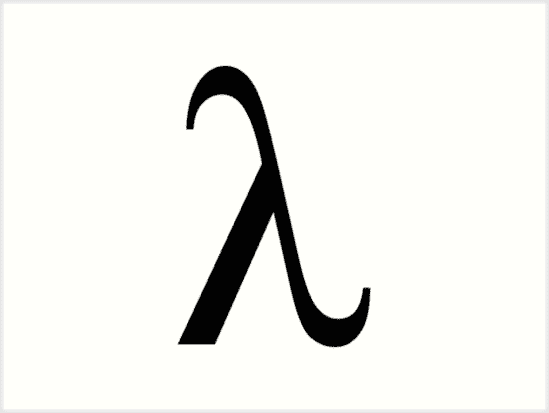

# 函数式编程基本原理的介绍

> 原文：<https://dev.to/teekay/an-introduction-to-the-basic-principles-of-functional-programming-3e0n>

[T2】](https://res.cloudinary.com/practicaldev/image/fetch/s--u070LOF9--/c_limit%2Cf_auto%2Cfl_progressive%2Cq_auto%2Cw_880/https://cdn-images-1.medium.com/max/1600/1%2AOtbWm_2OFtg7suie4zEtqA.png)

在长时间学习和使用面向对象编程之后，我退一步思考系统复杂性。

> "`Complexity is anything that makes software hard to understand or to modify.` "
> —约翰·奥特罗德

在做一些研究时，我发现了像不变性和纯函数这样的函数式编程概念。这些概念对于构建无副作用的功能来说是很大的优势，因此维护系统更容易——还有一些其他的
[好处](https://hackernoon.com/why-functional-programming-matters-c647f56a7691)。

在这篇文章中，我将告诉你更多关于函数式编程的知识，以及一些重要的概念，并附有大量的代码示例。

### 什么是函数式编程？

> **函数式编程**是一种编程范式——一种构建计算机程序的>结构和元素的风格——将计算视为数学函数的评估，并避免改变状态和可变数据
> ——[维基百科](https://en.wikipedia.org/wiki/Functional_programming)

### 纯函数

当我们想要理解函数式编程时，我们学习的第一个基本概念是**纯函数**。但是这到底意味着什么呢？是什么使得一个函数是纯的？

那么我们如何知道一个函数是否是`pure`？这里有一个非常严格的纯度定义:

*   如果给定相同的参数，它将返回相同的结果(也称为
    `deterministic`)

*   它不会引起任何明显的副作用

#### 如果给定相同的参数，它将返回相同的结果

假设我们想要实现一个计算圆的面积的函数。一个不纯的函数将接收`radius`作为参数，然后计算`radius * radius * PI`。在 Clojure 中，操作符排在第一位，所以`radius * radius * PI`变成了`(* radius radius PI)` :

```
(def  PI  3.14)  (defn  calculate-area  [radius]  (*  radius  radius  PI))  (calculate-area  10)  ;; returns 314.0 
```

Enter fullscreen mode Exit fullscreen mode

为什么这是一个不纯函数？因为它使用了一个没有作为参数传递给函数的全局对象。

现在想象一些数学家争论说`PI`的值实际上是`42`并且改变了全局对象的值。

我们的不纯函数现在将导致`10 * 10 * 42` = `4200`。对于同一个参数(`radius = 10`，我们有不同的结果。让我们修理它！

```
(def  PI  3.14)  (defn  calculate-area  [radius,  PI]  (*  radius  radius  PI))  (calculate-area  10  PI)  ;; returns 314.0 
```

Enter fullscreen mode Exit fullscreen mode

哒哒🎉！现在我们总是将`PI`值作为参数传递给函数。所以现在我们只是访问传递给函数的参数。没有`external object`。

*   对于参数`radius = 10` & `PI = 3.14`，我们总会得到相同的结果:`314.0`

*   对于参数`radius = 10` & `PI = 42`，我们总会得到相同的结果:`4200`

#### 读取文件

如果我们的函数读取外部文件，它就不是一个纯粹的函数——文件的内容可以改变。

```
(defn  characters-counter  [text]  (str  "Character count: "  (count  text)))  (defn  analyze-file  [filename]  (characters-counter  (slurp  filename)))  (analyze-file  "test.txt") 
```

Enter fullscreen mode Exit fullscreen mode

#### 随机数生成

任何依赖于随机数生成器的函数都不可能是纯函数。

```
(defn  year-end-evaluation  []  (if  (>  (rand)  0.5)  "You get a raise!"  "Better luck next year!")) 
```

Enter fullscreen mode Exit fullscreen mode

#### 它不会引起任何可观察到的副作用

可观察到的副作用的例子包括修改全局对象或通过引用传递的参数。

现在我们想实现一个函数来接收一个整数值并返回增加了 1 的值。

```
(def  counter  1)  (defn  increase-counter  [value]  (def  counter  (inc  value)))  ;; please don't do this  (increase-counter  counter)  ;; 2  counter  ;; 2 
```

Enter fullscreen mode Exit fullscreen mode

我们有了`counter`值。我们的非纯函数接收该值，并将该值加 1 重新分配给计数器。

**观察**:函数式编程不鼓励可变性。

我们正在修改全局对象。但是我们怎么才能做到呢？只需返回增加 1 的值。就这么简单。

```
(def  counter  1)  (defn  increase-counter  [value]  (inc  value))  (increase-counter  counter)  ;; 2  counter  ;; 1 
```

Enter fullscreen mode Exit fullscreen mode

看到我们的纯函数`increase-counter`返回 2，但是`counter`值还是一样的。该函数返回增加的值，而不改变变量的值。

如果我们遵循这两条简单的规则，理解我们的程序就变得更容易了。现在，每个功能都是孤立的，无法影响我们系统的其他部分。

纯函数是稳定的、一致的和可预测的。给定相同的参数，纯函数将总是返回相同的结果。我们不需要考虑相同参数有不同结果的情况，因为这永远不会发生。

#### 纯职能利益

代码肯定更容易测试。我们不需要嘲笑任何东西。所以我们可以用不同的上下文来测试纯函数:

*   给定参数`A` →期望函数返回值`B`

*   给定参数`C` →期望函数返回值`D`

一个简单的例子是一个接收数字集合的函数，并期望它递增这个集合的每个元素。

```
(defn  increment-numbers  [numbers]  (map  inc  numbers)) 
```

Enter fullscreen mode Exit fullscreen mode

我们接收`numbers`集合，使用带有`inc`函数的`map`来递增每个数字，并返回一个新的递增数字列表。

```
(=  [2  3  4  5  6]  (increment-numbers  [1  2  3  4  5]))  ;; true 
```

Enter fullscreen mode Exit fullscreen mode

对于`input` `[1 2 3 4 5]`，预期的`output`将是`[2 3 4 5 6]`。

### 永恒性

> *不随时间变化或不能改变的。*

当数据不可变时，它的**状态在它被创建后不能改变**。**如果你想改变一个不可变的对象，你不能。相反，**您用新值创建了一个新的
对象。

在 Javascript 中，我们通常使用`for`循环。下一个`for`语句有一些可变变量。

```
var values = [1, 2, 3, 4, 5];
var sumOfValues = 0;

for (var i = 0; i < values.length; i++) {
  sumOfValues += values[i];
}

sumOfValues // 15 
```

Enter fullscreen mode Exit fullscreen mode

对于每次迭代，我们都在改变`i`和`sumOfValue` **状态**。但是我们如何处理迭代中的可变性呢？递归！回到 Clojure！

```
(defn  sum  [values]  (loop  [vals  values  total  0]  (if  (empty?  vals)  total  (recur  (rest  vals)  (+  (first  vals)  total)))))  (sum  [1  2  3  4  5])  ;; 15 
```

Enter fullscreen mode Exit fullscreen mode

所以这里我们有接收数值向量的`sum`函数。`recur`跳回`loop`，直到我们得到空的向量([我们的递归](https://en.wikipedia.org/wiki/Recursion) `base case`)。对于每一次“迭代”,我们将把值添加到`total`累加器中。

通过递归，我们保持我们的**变量**不变。

**观察**:对！我们可以用`reduce`来实现这个功能。我们将在`Higher Order Functions`主题中看到这一点。

构建一个对象的最终**状态**也是很常见的。假设我们有一个字符串，我们想把这个字符串转换成一个`url slug`。

```
class UrlSlugify
  attr_reader :text

  def initialize(text)
    @text = text
  end

  def slugify!
    text.downcase!
    text.strip!
    text.gsub!(' ', '-')
  end
end

UrlSlugify.new(' I will be a url slug   ').slugify! # "i-will-be-a-url-slug" 
```

Enter fullscreen mode Exit fullscreen mode

在 Ruby 的 OOP 中，我们会创建一个类，比如说，`UrlSlugify`。这个类将有一个`slugify!`方法将字符串输入转换成一个`url slug`。

漂亮！已经实施了！这里我们有命令式编程，确切地说明我们在每个`slugify`进程中想要做什么——首先是小写，然后删除无用的空格，最后用连字符替换剩余的空格。

但是我们在这个过程中改变了输入状态。

我们可以通过函数组合或函数链接来处理这种变异。换句话说，一个函数的结果将被用作下一个函数的输入，而不修改原始的输入字符串。

```
(defn  slugify  [string]  (clojure.string/replace  (clojure.string/lower-case  (clojure.string/trim  string))  #" "  "-"))  (slugify  " I will be a url slug   ") 
```

Enter fullscreen mode Exit fullscreen mode

这里我们有:

*   `trim`:删除字符串两端的空格

*   `lower-case`:将字符串转换为全部小写

*   `replace`:用给定字符串中的替换替换 match 的所有实例

我们把这三个函数结合起来，就可以`"slugify"`我们的字符串。

说到**组合函数**，我们可以用`comp`函数来组合这三个函数。我们来看看:

```
(defn  slugify  [string]  ((comp  #(clojure.string/replace  %  #" "  "-")  clojure.string/lower-case  clojure.string/trim)  string))  (slugify  " I will be a url slug   ")  ;; "i-will-be-a-url-slug" 
```

Enter fullscreen mode Exit fullscreen mode

### 参照透明

让我们实现一个`square function` :

```
(defn  square  [n]  (*  n  n)) 
```

Enter fullscreen mode Exit fullscreen mode

给定相同的输入，这个(纯)函数将总是具有相同的输出。

```
(square  2)  ;; 4  (square  2)  ;; 4  (square  2)  ;; 4  ;; ... 
```

Enter fullscreen mode Exit fullscreen mode

将“2”作为参数传递给`square function`将总是返回 4。所以现在我们可以用 4 代替`(square 2)`。就是这样！我们的职能是`referentially transparent`。

基本上，如果一个函数对于相同的输入始终产生相同的结果，那么它就是参照透明的。

**纯函数+不可变数据=参照透明**

有了这个概念，我们可以做的一件很酷的事情就是记忆这个函数。假设我们有这个函数:

```
(+  3  (+  5  8)) 
```

Enter fullscreen mode Exit fullscreen mode

`(+ 5 8)`等于`13`。这个函数将总是导致`13`。所以我们可以这样做:

```
(+  3  13) 
```

Enter fullscreen mode Exit fullscreen mode

而这个表达式总会产生`16`。我们可以用一个数字常数替换整个表达式，然后用[来记忆](https://en.wikipedia.org/wiki/Memoization)它。

### 功能为一级实体

将函数作为一级实体的想法是，函数**也被**视为值**，而**被用作数据。

在 Clojure 中，通常使用`defn`来定义函数，但这只是对`(def foo (fn ...))`的语法修饰。`fn`返回函数本身。`defn`返回一个指向函数对象的`var`。

作为一级实体的功能可以:

*   从常量和变量中引用它

*   将其作为参数传递给其他函数

*   从其他函数返回结果

其思想是将函数视为值，并像传递数据一样传递函数。通过这种方式，我们可以组合不同的功能来创建具有新行为的新功能。

假设我们有一个函数，它将两个值相加，然后将值加倍。大概是这样:

```
(defn  double-sum  [a  b]  (*  2  (+  a  b))) 
```

Enter fullscreen mode Exit fullscreen mode

现在是一个减去数值并返回双精度值的函数:

```
(defn  double-subtraction  [a  b]  (*  2  (-  a  b))) 
```

Enter fullscreen mode Exit fullscreen mode

这些函数具有相似的逻辑，但不同之处在于运算符函数。如果我们可以将函数视为值，并将它们作为参数传递，我们就可以构建一个接收操作符函数的函数，并在函数内部使用它。让我们建造它！

```
(defn  double-operator  [f  a  b]  (*  2  (f  a  b)))  (double-operator  +  3  1)  ;; 8  (double-operator  -  3  1)  ;; 4 
```

Enter fullscreen mode Exit fullscreen mode

搞定了。现在我们有了一个`f`参数，并用它来处理`a`和`b`。我们传递了`+`和`-`函数来与`double-operator`函数组合并创建一个新的行为。

### 高阶函数

当我们谈到高阶函数时，我们指的是这样的函数:

*   接受一个或多个函数作为参数，或者

*   返回一个函数作为结果

我们上面实现的`double-operator`函数是一个高阶函数，因为它将一个操作符函数作为参数并使用它。

你可能已经听说过`filter`、`map`和`reduce`。让我们看看这些。

#### 滤镜

给定一个集合，我们希望按属性过滤。filter 函数期望一个`true`或`false`值来确定元素**是否应该包含在结果集合中。基本上，如果回调表达式是`true`，过滤函数会将元素包含在结果集合中。否则，不会。**

一个简单的例子是，当我们有一个整数集合，我们只想要偶数。

**命令式方法**

用 Javascript 实现这一点的一个必要方法是:

*   创建一个空向量`evenNumbers`

*   迭代`numbers`向量

*   将偶数推送到`evenNumbers`向量

```
var numbers = [0, 1, 2, 3, 4, 5, 6, 7, 8, 9, 10];
var evenNumbers = [];

for (var i = 0; i < numbers.length; i++) {
  if (numbers[i] % 2 == 0) {
    evenNumbers.push(numbers[i]);
  }
}

console.log(evenNumbers); // (6) [0, 2, 4, 6, 8, 10] 
```

Enter fullscreen mode Exit fullscreen mode

我们可以用`filter`高阶函数接收`even?`函数，返回一列偶数:

```
(defn  even-numbers  [coll]  (filter  even?  coll))  (even-numbers  [0  1  2  3  4  5  6  7  8  9  10])  ;; (0 2 4 6 8 10) 
```

Enter fullscreen mode Exit fullscreen mode

我在[黑客等级 FP](https://www.hackerrank.com/domains/fp) 路径上解决的一个有趣的问题是[过滤器阵列问题](https://www.hackerrank.com/challenges/fp-filter-array/problem)。问题的想法是过滤一个给定的整数数组，只输出那些小于指定值`X`的值。

这个问题的一个强制性的 Javascript 解决方案类似于:

```
var filterArray = function(x, coll) {
  var resultArray = [];

  for (var i = 0; i < coll.length; i++) {
    if (coll[i] < x) {
      resultArray.push(coll[i]);
    }
  }

  return resultArray;
}

console.log(filterArray(3, [10, 9, 8, 2, 7, 5, 1, 3, 0])); // (3) [2, 1, 0] 
```

Enter fullscreen mode Exit fullscreen mode

我们确切地说了我们的函数需要做什么——迭代集合，将集合当前项与`x`进行比较，如果它通过了条件，就将这个元素推送到`resultArray`。

**声明式方法**

但是我们想要一个更具声明性的方法来解决这个问题，并且使用`filter`高阶函数。

一个声明性的 Clojure 解决方案应该是这样的:

```
(defn  filter-array  [x  coll]  (filter  #(>  x  %)  coll))  (filter-array  3  [10  9  8  2  7  5  1  3  0])  ;; (2 1 0) 
```

Enter fullscreen mode Exit fullscreen mode

这个语法一开始看起来有点奇怪，但是很容易理解。

`#(> x %)`只是一个匿名函数，它接收`x`，并将其与集合中的每个元素进行比较。`%`代表匿名函数的参数——在本例中是`filter`中的当前元素。

我们也可以用地图来做这件事。假设我们有一张地图，上面有人们的`name`和`age`。我们希望只过滤超过指定年龄值的人，在本例中是 21 岁以上的人。

```
(def  people  [{:name  "TK"  :age  26}  {:name  "Kaio"  :age  10}  {:name  "Kazumi"  :age  30}])  (defn  over-age  [people]  (filter  #(<  21  (:age  %))  people))  (over-age  people)  ;; ({:name "TK", :age 26} {:name "Kazumi", :age 30}) 
```

Enter fullscreen mode Exit fullscreen mode

代码摘要:

*   我们有一份人员名单(有`name`和`age`)。

*   我们有匿名函数`#(< 21 (:age %))`。还记得`%`代表集合中的当前元素吗？这个系列的元素是一个人物地图。如果我们执行`(:age {:name "TK" :age 26})`，它将返回年龄值，在本例中为`26`。

*   我们根据这个匿名函数过滤所有人。

#### 地图

映射的思想是转换一个集合。

> `map`方法通过将一个函数应用到它的所有>元素来转换一个集合，并从返回值构建一个新的集合。

让我们得到上面相同的`people`集合。我们现在不想按“超龄”来过滤。我们只是想要一个字符串列表，类似于`TK is 26 years old`。所以最后一个字符串可能是`:name is :age years old`，其中`:name`和`:age`是来自`people`集合中每个元素的属性。

按照强制的 Javascript 方式，应该是:

```
var people = [
  { name: "TK", age: 26 },
  { name: "Kaio", age: 10 },
  { name: "Kazumi", age: 30 }
];

var peopleSentences = [];

for (var i = 0; i < people.length; i++) {
  var sentence = people[i].name + " is " + people[i].age + " years old";
  peopleSentences.push(sentence);
}

console.log(peopleSentences); // ['TK is 26 years old', 'Kaio is 10 years old', 'Kazumi is 30 years old'] 
```

Enter fullscreen mode Exit fullscreen mode

用一种声明性的 Clojure 方式，应该是:

```
(def  people  [{:name  "TK"  :age  26}  {:name  "Kaio"  :age  10}  {:name  "Kazumi"  :age  30}])  (defn  people-sentences  [people]  (map  #(str  (:name  %)  " is "  (:age  %)  " years old")  people))  (people-sentences  people)  ;; ("TK is 26 years old" "Kaio is 10 years old" "Kazumi is 30 years old") 
```

Enter fullscreen mode Exit fullscreen mode

整个想法是将一个给定的集合转换成一个新的集合。

另一个有趣的黑客排名问题是[更新列表问题](https://www.hackerrank.com/challenges/fp-update-list/problem)。我们只想用给定集合的绝对值来更新它们的值。

比如输入`[1 2 3 -4 5]`需要输出为`[1 2 3 4 5]`。`-4`的绝对值是`4`。

一个简单的解决方案是对每个集合值进行就地更新。

```
var values = [1, 2, 3, -4, 5];

for (var i = 0; i < values.length; i++) {
  values[i] = Math.abs(values[i]);
}

console.log(values); // [1, 2, 3, 4, 5] 
```

Enter fullscreen mode Exit fullscreen mode

我们使用`Math.abs`函数将值转换成绝对值，并进行就地更新。

这是**而不是**实现该解决方案的功能性方式。

首先，我们学习了不变性。我们知道不变性对于使我们的函数更加一致和可预测是多么重要。这个想法是建立一个包含所有绝对值的新集合。

第二，这里为什么不用`map`来“转换”所有数据？

我的第一个想法是构建一个`to-absolute`函数来只处理一个值。

```
(defn  to-absolute  [n]  (if  (neg?  n)  (*  n  -1)  n))  (to-absolute  -1)  ;; 1  (to-absolute  1)  ;; 1  (to-absolute  -2)  ;; 2  (to-absolute  0)  ;; 0 
```

Enter fullscreen mode Exit fullscreen mode

如果它是负的，我们想把它转换成正值(绝对值)。否则，我们不需要改造它。

现在我们知道了如何对一个值执行`absolute`操作，我们可以使用这个函数作为参数传递给`map`函数。你还记得一个`higher order function`可以接收一个函数作为参数并使用它吗？是的，地图可以做到！

```
(defn  update-list-map  [coll]  (map  to-absolute  coll))  (update-list-map  [])  ;; ()  (update-list-map  [1  2  3  4  5])  ;; (1 2 3 4 5)  (update-list-map  [-1  -2  -3  -4  -5])  ;; (1 2 3 4 5)  (update-list-map  [1  -2  3  -4  5])  ;; (1 2 3 4 5) 
```

Enter fullscreen mode Exit fullscreen mode

哇哦。太美了！😍

#### 减少

reduce 的思想是接收一个函数和一个集合，并返回通过组合这些项而创建的值。

人们谈论的一个常见例子是获取订单的总金额。想象你在一个购物网站上。您已经将`Product 1`、`Product 2`、`Product 3`和`Product 4`添加到您的购物车(订单)中。现在我们要计算购物车的总金额。

在命令式方法中，我们将迭代订单列表，并将每个产品的金额加到总金额中。

```
var orders = [
  { productTitle: "Product 1", amount: 10 },
  { productTitle: "Product 2", amount: 30 },
  { productTitle: "Product 3", amount: 20 },
  { productTitle: "Product 4", amount: 60 }
];

var totalAmount = 0;

for (var i = 0; i < orders.length; i++) {
  totalAmount += orders[i].amount;
}

console.log(totalAmount); // 120 
```

Enter fullscreen mode Exit fullscreen mode

使用`reduce`，我们可以构建一个函数来处理`amount sum`，并将其作为参数传递给`reduce`函数。

```
(def  shopping-cart  [{  :product-title  "Product 1"  :amount  10  },  {  :product-title  "Product 2"  :amount  30  },  {  :product-title  "Product 3"  :amount  20  },  {  :product-title  "Product 4"  :amount  60  }])  (defn  sum-amount  [total-amount  current-product]  (+  (:amount  current-product)  total-amount))  (defn  get-total-amount  [shopping-cart]  (reduce  sum-amount  0  shopping-cart))  (get-total-amount  shopping-cart)  ;; 120 
```

Enter fullscreen mode Exit fullscreen mode

这里我们有`shopping-cart`，接收当前`total-amount`的函数`sum-amount`，以及`current-product`对象`sum`它们。

`get-total-amount`功能用于使用`sum-amount`从`0`开始`reduce`T2。

另一种得到总量的方法是将`map`和`reduce`合成。我这么说是什么意思？我们可以使用`map`将`shopping-cart`转换成`amount`值的集合，然后只需将`reduce`函数与`+`函数一起使用。

```
(def  shopping-cart  [{  :product-title  "Product 1"  :amount  10  },  {  :product-title  "Product 2"  :amount  30  },  {  :product-title  "Product 3"  :amount  20  },  {  :product-title  "Product 4"  :amount  60  }])  (defn  get-amount  [product]  (:amount  product))  (defn  get-total-amount  [shopping-cart]  (reduce  +  (map  get-amount  shopping-cart)))  (get-total-amount  shopping-cart)  ;; 120 
```

Enter fullscreen mode Exit fullscreen mode

`get-amount`接收产品对象并只返回`amount`值。所以我们这里有`[10 30 20 60]`。然后`reduce`将所有项目相加。漂亮！

我们看了一下每个高阶函数是如何工作的。我想向你们展示一个例子，我们如何在一个简单的例子中组合所有三个函数。

谈到`shopping cart`，假设我们的订单中有这样一个产品列表:

```
(def  shopping-cart  [{  :product-title  "Functional Programming"  :type  "books"  :amount  10  },  {  :product-title  "Kindle"  :type  "eletronics"  :amount  30  },  {  :product-title  "Shoes"  :type  "fashion"  :amount  20  },  {  :product-title  "Clean Code"  :type  "books"  :amount  60  }]) 
```

Enter fullscreen mode Exit fullscreen mode

我们需要购物车中所有书籍的总数。就这么简单。算法？

*   **按图书类型过滤**

*   使用**映射**将购物车转换为金额集合

*   用**减少**将所有项目相加

搞定了。🎉

### 资源

我整理了一些我阅读和研究的资源。我正在分享一些我觉得非常有趣的照片。更多资源，请访问我的[函数式编程 Github 库](https://github.com/LeandroTk/learning-functional-programming)。

*   [Ruby 特定资源](https://github.com/LeandroTk/learning-functional-programming/tree/master/ruby)
*   [Javascript 特定资源](https://github.com/LeandroTk/learning-functional-programming/tree/master/javascript)
*   [Clojure 特定资源](https://github.com/LeandroTk/learning-functional-programming/tree/master/clojure)

#### 引子

*   [在 JS 中学习 FP](https://www.youtube.com/watch?v=e-5obm1G_FY)
*   [用 Python 介绍 do FP](https://codewords.recurse.com/issues/one/an-introduction-to-functional-programming)
*   [FP 概述](https://blog.codeship.com/overview-of-functional-programming)
*   [功能 JS 快速介绍](https://hackernoon.com/a-quick-introduction-to-functional-javascript-7e6fe520e7fa)
*   [什么是 FP？](https://medium.com/javascript-scene/master-the-javascript-interview-what-is-functional-programming-7f218c68b3a0)
*   [函数式编程行话](https://github.com/hemanth/functional-programming-jargon)

#### 纯函数

*   [什么是纯函数？](https://medium.com/javascript-scene/master-the-javascript-interview-what-is-a-pure-function-d1c076bec976)
*   [纯函数编程 1](https://www.fpcomplete.com/blog/2017/04/pure-functional-programming)
*   [纯函数编程 2](https://www.fpcomplete.com/blog/2017/05/pure-functional-programming-part-2)

#### 不可变的数据

*   [用于函数式编程的不可变 DS](https://www.youtube.com/watch?v=Wo0qiGPSV-s)
*   [为什么共享可变状态是万恶之源](http://henrikeichenhardt.blogspot.com/2013/06/why-shared-mutable-state-is-root-of-all.html)
*   Clojure 中的结构共享:第 1 部分
*   Clojure 中的结构共享:第二部分
*   Clojure 中的结构共享:第 3 部分
*   [clo jure 中的结构共享:最终部分](http://hypirion.com/musings/persistent-vector-performance-summarised)

#### 高阶函数

*   [雄辩的 JS:高阶函数](https://eloquentjavascript.net/05_higher_order.html)
*   [趣味趣味功能滤镜](https://www.youtube.com/watch?v=BMUiFMZr7vk&t=0s&list=PL0zVEGEvSaeEd9hlmCXrk5yUyqUag-n84&index=2&ab_channel=FunFunFunction)
*   [好玩好玩的功能图](https://www.youtube.com/watch?v=bCqtb-Z5YGQ&index=2&list=PL0zVEGEvSaeEd9hlmCXrk5yUyqUag-n84&ab_channel=FunFunFunction)
*   [趣味趣味功能基本减少](https://www.youtube.com/watch?v=Wl98eZpkp-c&list=PL0zVEGEvSaeEd9hlmCXrk5yUyqUag-n84&index=3&frags=wn&ab_channel=FunFunFunction)
*   [趣味趣味功能高级减少](https://www.youtube.com/watch?v=1DMolJ2FrNY&list=PL0zVEGEvSaeEd9hlmCXrk5yUyqUag-n84&index=4&ab_channel=FunFunFunction)
*   [Clojure 高阶函数](https://clojure.org/guides/higher_order_functions)
*   [纯函数滤波器](https://purelyfunctional.tv/lesson/filter/)
*   [纯功能图](https://purelyfunctional.tv/lesson/map/)
*   [纯功能还原](https://purelyfunctional.tv/lesson/reduce/)

#### 声明式编程

*   [声明式编程 vs 命令式编程](https://tylermcginnis.com/imperative-vs-declarative-programming/)

* * *

### 就是这样！

嘿，朋友们，我希望你们在阅读这篇文章的时候有乐趣，并且我希望你们在这里学到了很多！这是我尝试分享我所学到的东西。

这里是本文中所有代码的存储库。

来跟我学吧。我在这个[学习函数式编程库](https://github.com/LeandroTk/learning-functional-programming)中共享资源和我的代码。

我希望你在这里看到了对你有用的东西。下次再见！:)

我的 [Twitter](https://twitter.com/LeandroTk_) 、 [Github](https://github.com/LeandroTk) 、 [Medium](https://medium.com/@leandrotk_/) 。☺

TK。