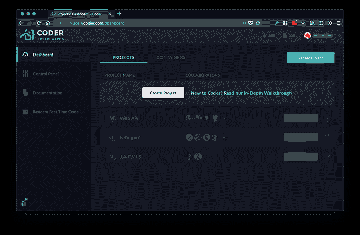
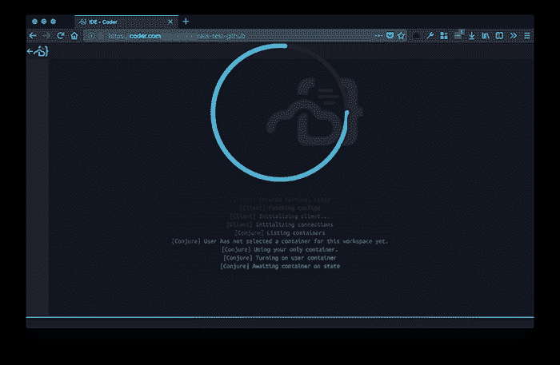
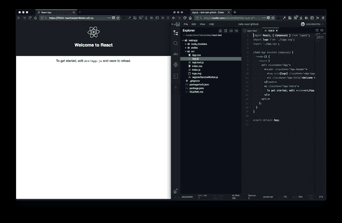

# 编码器公共 Alpha 概述

> 原文：<https://dev.to/stevetwitte/an-overview-of-coder-public-alpha-2h9l>

Coder 是一个基于 web 的 IDE，它的突出特点是为您提供了一个可伸缩的容器，具有完全的根访问权限来运行您的代码。cloud IDE 已经进入了公开测试阶段，我很好奇它的表现如何，以及它有什么缺点。这篇文章绝不是一个全面的回顾，只是概述了我在 Coder public alpha 工作的时间。

[T2】](https://res.cloudinary.com/practicaldev/image/fetch/s--Eaf_gPpP--/c_limit%2Cf_auto%2Cfl_progressive%2Cq_auto%2Cw_880/https://thepracticaldev.s3.amazonaws.com/i/7xl7mkzl7hjwra9p8vz8.png)

## 从首页突出显示

滚动编码器的主页，描述了一个完全支持 15 种语言的云 IDE，包括 C、C++、Java、HTML、Javascript、Typescript、PHP、Ruby 等等。他们还列出了 9 种部分支持的语言，但没有提到这意味着什么，但可以肯定的是，这些语言仍在开发中，因为这是 alpha 代码。

主页还提到了创建共享工作空间的能力、实时协作、稍后将介绍的 Fast Time 功能、在任何设备上工作的能力以及它们的“最高安全性”很容易理解为什么很多人会对这样的东西感兴趣，所以让我们看看在云 IDE 中工作是什么样子的。

## 加快一个项目

注册电子邮件或 GitHub 帐户后，我们会被带到仪表板。在这里，你可以访问所有的项目和容器，稍后会有更多的内容，在左边，你可以切换到你的控制面板，查看文档和兑换快速时间代码。

创建项目后，您可以打开 IDE。这样做将使您的容器联机，并加载 IDE/editor 的/coder/mnt/your-user-name/project-name 基本目录，在这里您可以做任何您想做的事情。

您将看到一个 IDE，它具有项目范围的搜索、自动完成和具有 root 访问权限的完整终端。我主要使用 Ruby on Rails 和 React 进行开发，它们都有非常完备的安装程序/设置，所以我想看看是否能开发一个新的 Rails 应用程序，以及是否能成功运行 create-react-app。

[T2】](https://res.cloudinary.com/practicaldev/image/fetch/s--1-5U24HB--/c_limit%2Cf_auto%2Cfl_progressive%2Cq_auto%2Cw_880/https://thepracticaldev.s3.amazonaws.com/i/9a5eltko81vbyjvajbf0.png)

## 铁轨开了吗？

切换到终端视图会在项目根目录下显示一个 bash 提示符，您可以看到您是以 root 用户身份登录的。我试着检查机器上的 Ruby 版本，它没有安装，所以快速检查文档显示一旦你创建了一个”。rb”文件，Ruby 会安装。

好了，我们已经安装了 Ruby，现在开始安装 Rails。Gem install rails 给了我几个错误。看起来我需要先安装一些依赖项。运行“apt-get update & & apt-get install-y build-essential locales nodejs”似乎让我更接近了，我能够安装 Rails，但是当运行 rails new AppName 时，我在安装 SQLite gem 时出现了一个错误。

经过仔细检查，这似乎是 GCC 编译器的一个问题。我正要开始调试这个问题，这时我决定不管它。我对在现实世界中用 SQLite 开发不感兴趣，所以我决定调用它。我可以通过 ruby 命令行运行一个文件并得到输出，所以我的结论是 Ruby 可以工作，但是像 Rails 这样依赖于很多东西的东西可能会工作，也可能不会工作，可能需要一些特殊的配置。

## 创建 React App？

我创建了一个新项目，运行“npm install -g create-react-app”，它安装时没有出现任何问题。运行“create-react-app test-app”也很成功，站点中没有出现错误或警告。

启动开发服务器是通常的“npm 启动”，但是为了看到结果，您使用他们的方法从另一个浏览器窗口连接到您的服务器。该窗口支持实时重载，甚至包括 https，体验很像付费的 NGROK 帐户。令我惊讶的是，这里的一切都像预期的那样工作，与我在本地启动一个新的 React 项目的方式没有明显的区别。

[T2】](https://res.cloudinary.com/practicaldev/image/fetch/s--vDvRxJnq--/c_limit%2Cf_auto%2Cfl_progressive%2Cq_auto%2Cw_880/https://thepracticaldev.s3.amazonaws.com/i/52jqdjotfe87fcrsedbp.png)

## 感觉如何？

键入 Coder 的总体感觉与您在 SSH 连接到远程服务器时所期望的非常相似。我的互联网连接速度是 100mbps，我经历了少量的延迟，我可以肯定地说我不是在我的本地机器上工作，但没有什么会阻止我完成工作。

IDE 的感觉和外观非常像 Visual Studio 代码开箱即用。我不会把它与桌面世界中我们称之为 IDE 的东西相提并论。它非常强大，但看起来更像是一个安装了常用插件的编辑器。例如，我希望 IDE 知道我是否在使用一个没有导入的类，这样就不会识别错误。

## 什么是快时间？

Fast Time 是一种按小时计费的付费升级，它“可以将您的容器动态扩展到 96 个内核。”除了如何购买 Fast Time 之外，他们没有进入任何更多的细节，但是因为我免费获得了 5 个小时的 Fast Time，所以我在 Rails 安装期间激活了它。激活它使我的 CPU 占用率大幅下降，我确信这加快了速度，但需要更深入的测试来确认到底发生了什么。

## 结论

我只是触及了可用语言的表面，更多的语言很快就会出现，因为这是 Alpha 版，但总的来说，我认为 Coder 的团队正在开发一些非常酷的东西。你在这个早期阶段所做的一切给我留下了深刻的印象，我期待着这家公司的未来和整个概念。我们已经把很多工作转移到了云端，所以我们也可以在那里开始编辑了。