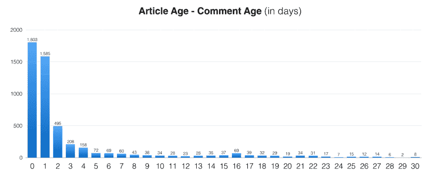
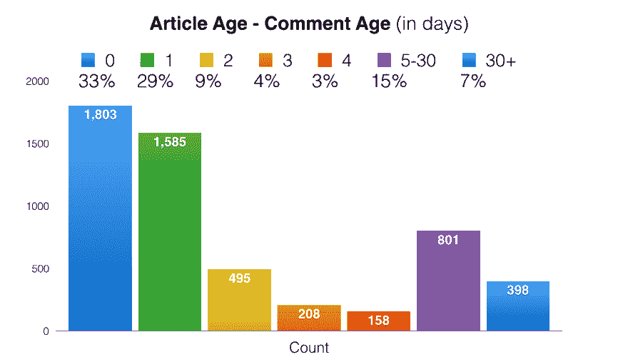

# 在帖子的生命周期中，对发展到评论频率的分析

> 原文：<https://dev.to/peter/analysis-of-devto-comment-frequency-over-the-lifetime-of-a-post--12ok>

## 什么/为什么

我想从高层次上看一下相对于发布评论的线程，开发人员的评论是何时创建的。

DEV 成员会遇到各种来源的文章——他们的主页、现场通知、社交媒体、搜索引擎查询等。我很好奇，相对于网站上日益增长的长尾文章，有多少百分比的评论是“新鲜”的。

## 如何

我在数据分析甚至 SQL 方面没有太多经验，但是准备这份高水平的报告非常快/简单。为了简化问题，我只关注 8 月份创建的评论。

**第一步**:抓取所有**评论**的`created_at`日期和文章 ID(共 5400 条)

**第二步**:抓取第一步抓取的所有**文章**的`published_at`日期

**第三步**:计算`Article Date` - `Comment Date`的差值(天数)。

## 结果

正如你所料，随着文章越来越老，它的前期负荷越来越大，并迅速减少。

[T2】](https://res.cloudinary.com/practicaldev/image/fetch/s--pvMH0A1R--/c_limit%2Cf_auto%2Cfl_progressive%2Cq_auto%2Cw_880/https://cl.ly/1K3n0N1R3s1r/Image%25202018-08-17%2520at%252010.35.55%2520AM.png)

我决定清理数据，为 5-30 岁和 30 岁以上的人创建一个“bucket”:

[T2】](https://res.cloudinary.com/practicaldev/image/fetch/s--va8SMpY1--/c_limit%2Cf_auto%2Cfl_progressive%2Cq_auto%2Cw_880/https://cl.ly/45253g3b0S3b/Image%25202018-08-17%2520at%252010.32.21%2520AM.png)

**亮点**:

*   33%的评论来自当天*发表的文章/帖子*
*   一天前的文章 29%
*   两天前的文章 9%
*   3 天内为 4%
*   4 天大的为 3%
*   5-30 天的 15%
*   30 天以上为 7%

## 关闭思绪

我认为相当有趣的是，7%的评论是在至少 30 天前发表的文章上发表的。evergreen 内容的“长尾”为更广泛的开发人员社区提供了巨大的资源，很高兴知道这里贡献的精彩内容甚至在最初的曝光率爆发后仍继续被欣赏和讨论。

希望你觉得这很有趣！