# 2018 BKK 安卓大会

> 原文：<https://dev.to/ookbee/android-conference-bkk-2018-5943>

拿到 VIP 的票是从办公室来的很高兴刚看到价格不走但免费的票来了还等什么？

我们赶不上 register 来了哦你大概 10 分钟前就开始说话了

#### **欢迎辞:Wittaya Assawasathian**

还记得很少的时候，脑子里还没有 stack，没有足够的咖啡放在一条停着的血管里，还记得他回忆起泰国人在互联网上度过的时间是最早的一年，而不是一年。

[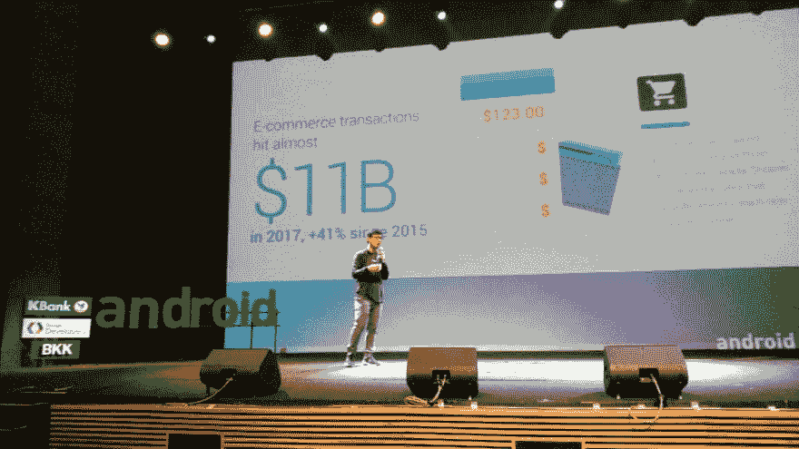T2】](https://res.cloudinary.com/practicaldev/image/fetch/s--W4gNA264--/c_limit%2Cf_auto%2Cfl_progressive%2Cq_auto%2Cw_880/https://cdn-images-1.medium.com/max/1024/1%2AHp8NODM665AB_ifsa5y5Ng.jpeg)

[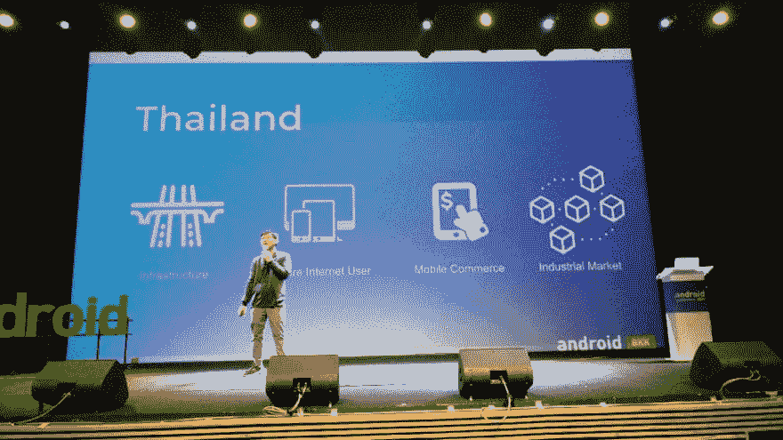T2】](https://res.cloudinary.com/practicaldev/image/fetch/s--kZ8pGACs--/c_limit%2Cf_auto%2Cfl_progressive%2Cq_auto%2Cw_880/https://cdn-images-1.medium.com/max/1024/1%2A-L1J2vY--XuG_iTkYUReMw.jpeg)

#### 开场白:姚伯泰

他说 Android 会去任何地方

> Android 几乎无处不在

我们认为这是真的。现在谷歌家庭电视的手机越来越多，IOT 越来越多，我们就越会主宰这个世界。

后来他翻开了 Android 的历史

[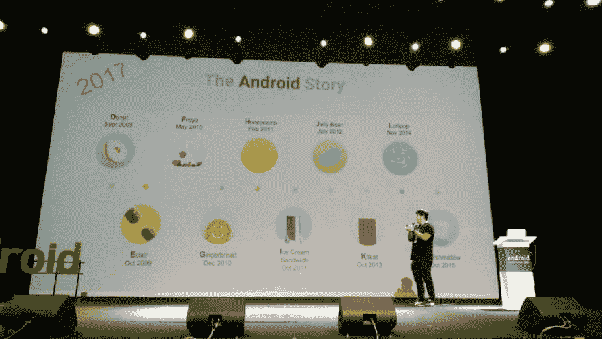T2】](https://res.cloudinary.com/practicaldev/image/fetch/s--q-jSAa2U--/c_limit%2Cf_auto%2Cfl_progressive%2Cq_auto%2Cw_880/https://cdn-images-1.medium.com/max/1024/1%2APxQYdRh5EX6cVf6YrcoDww.jpeg)

今年 Android 有个缩写是 Android P 我们是 Pancake

[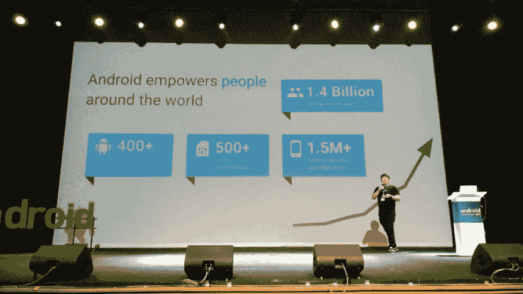T2】](https://res.cloudinary.com/practicaldev/image/fetch/s--d-r8G2Ij--/c_limit%2Cf_auto%2Cfl_progressive%2Cq_auto%2Cw_880/https://cdn-images-1.medium.com/max/1024/1%2ASguUIkVYws5ZkTrnHG_Ocw.jpeg)

[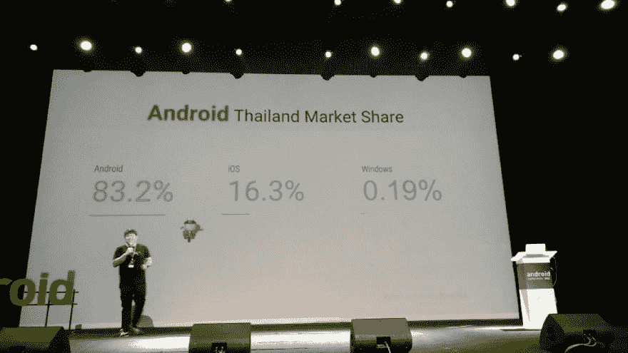T2】](https://res.cloudinary.com/practicaldev/image/fetch/s--YgpRQ3Pu--/c_limit%2Cf_auto%2Cfl_progressive%2Cq_auto%2Cw_880/https://cdn-images-1.medium.com/max/1024/1%2ArkMTtkd6pkVYLCvkPzsl2A.jpeg)

*   越来越多的初创企业 Android Thing (IOT)使用 Raspberry Pi 3 来做 Dev IOT。谷歌现在也有了云计算支持。值得一试。
*   Android Go:一个新的平台是 Android 版微型版
*   AR Core 1 .0 有一个平台可以提供 AR 手指我们就可以不用刚到 Unity 的 AR 手指了？

[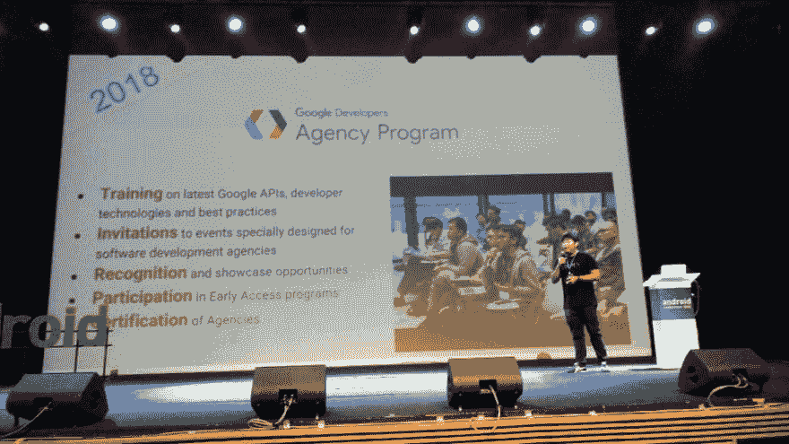T2】](https://res.cloudinary.com/practicaldev/image/fetch/s---OOoAqYj--/c_limit%2Cf_auto%2Cfl_progressive%2Cq_auto%2Cw_880/https://cdn-images-1.medium.com/max/1024/1%2AhkqAbmG9DvlehSQhkg48IA.jpeg)

*   Flutter : UI 移动框架用于创建 UI App，Android 和 IOs dev。ui 装饰线已经尝试了一些新的东西。
*   机构计画能做些什么呢？照图片来看

[T2】](https://res.cloudinary.com/practicaldev/image/fetch/s---OOoAqYj--/c_limit%2Cf_auto%2Cfl_progressive%2Cq_auto%2Cw_880/https://cdn-images-1.medium.com/max/1024/1%2AhkqAbmG9DvlehSQhkg48IA.jpeg)

#### 两个公司的故事:KBTG 的 Thadpong Pongthawornkamol 博士

他在 Android 早期就研究了 Android，然后展示了 Android 的照片

<figure> 

<figcaption>借用谷歌</figcaption>

</figure>

的图片。

后来，他告诉我 KBTG 是怎么做的，他有一个 apple，这个 applenny，他接了几个员工，还说他和 Google 合作了五年，然后 Google

[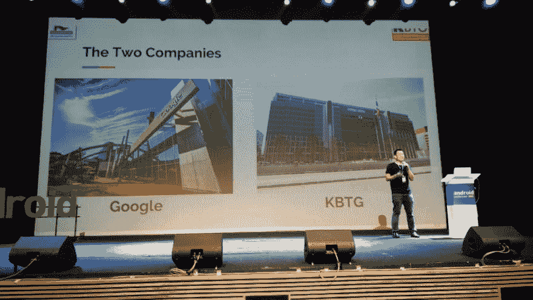T2】](https://res.cloudinary.com/practicaldev/image/fetch/s--DahM-Cvw--/c_limit%2Cf_auto%2Cfl_progressive%2Cq_auto%2Cw_880/https://cdn-images-1.medium.com/max/1024/1%2AoD5X3vVj1MZGaLtTudCR0A.jpeg)

[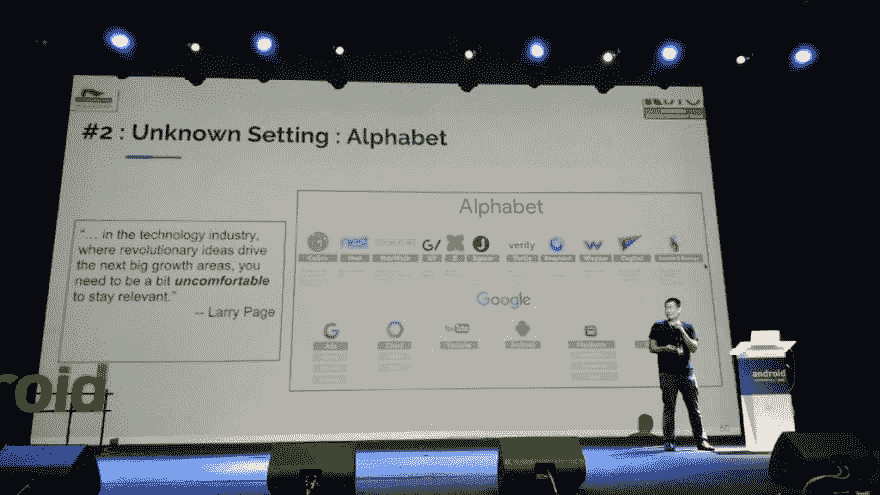T2】](https://res.cloudinary.com/practicaldev/image/fetch/s--t4-PeIuk--/c_limit%2Cf_auto%2Cfl_progressive%2Cq_auto%2Cw_880/https://cdn-images-1.medium.com/max/1024/1%2AXNpSPUMtQ20S2l49B933pQ.jpeg)

[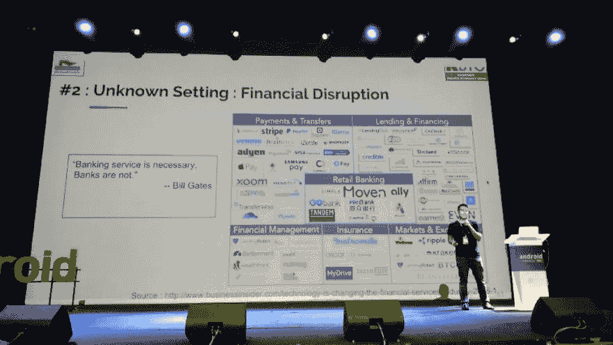T2】](https://res.cloudinary.com/practicaldev/image/fetch/s--ct3n46p1--/c_limit%2Cf_auto%2Cfl_progressive%2Cq_auto%2Cw_880/https://cdn-images-1.medium.com/max/1024/1%2AhW2dbSmtzkgV8zJa63WhZQ.jpeg)

[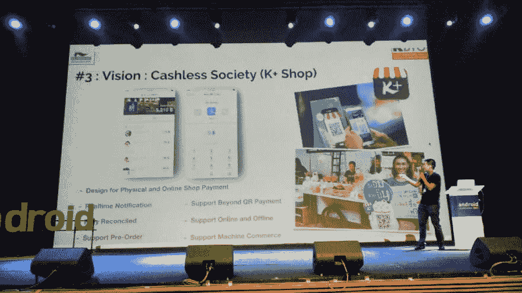T2】](https://res.cloudinary.com/practicaldev/image/fetch/s--gsZRUAxA--/c_limit%2Cf_auto%2Cfl_progressive%2Cq_auto%2Cw_880/https://cdn-images-1.medium.com/max/1024/1%2AcrI_wqjBb6LwfpsIrB3AzQ.jpeg)

[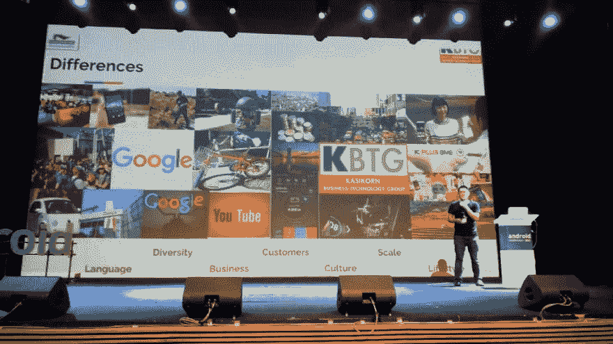T2】](https://res.cloudinary.com/practicaldev/image/fetch/s--IcdYDq81--/c_limit%2Cf_auto%2Cfl_progressive%2Cq_auto%2Cw_880/https://cdn-images-1.medium.com/max/1024/1%2AzKBnUIgDBeIehGd4bZwlQg.jpeg)

#### 比以往更快更小地构建你的应用:Somkiat Wongkitwattana(Ake)&jira wat Karanwittayakarn(Tee)

> 你是哪位，博士？

*   Custom log color 他建议设置 log time log 颜色看起来会更容易
*   Using template own template 建议设置 short time 键，像 Toast 一样打印它，放弃它，然后我们输入它，但是 value 像 message，但是 to。
*   在“打开自动导入”打开“自动导入”时，它会将必要的类带入并删除。如果我们不使用它(但它只会在相同的包中变得更聪明)。
*   使用 Parcelable instade Serilize(科特林有包裹)
*   很多 Use Tab 可能还不知道。我们可以通过一次按 Tab 来自动编译。
*   商务设计快速模式:使用时间模式，有 UI 解决方案，我们会更快地解决。
*   更新等级:每次发现 555，都给我一个图表，看看最新的，它会有多快。这是最新的，它会有多快。你看，它坏掉了。lib Appodeal 有。

[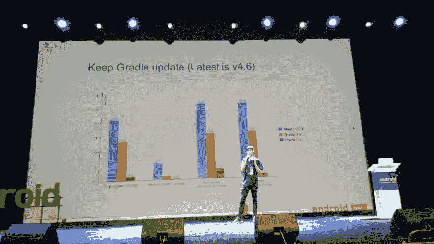T2】](https://res.cloudinary.com/practicaldev/image/fetch/s--AnotzSoN--/c_limit%2Cf_auto%2Cfl_progressive%2Cq_auto%2Cw_880/https://cdn-images-1.medium.com/max/1024/1%2Ahzn08bZ2Nb5pktIfxF5u9w.jpeg)

# 【辅助】源自于 office office，按 fn+f2 键，在 error，它会在它的某个点上跳跃。让 window 自己去找:d

[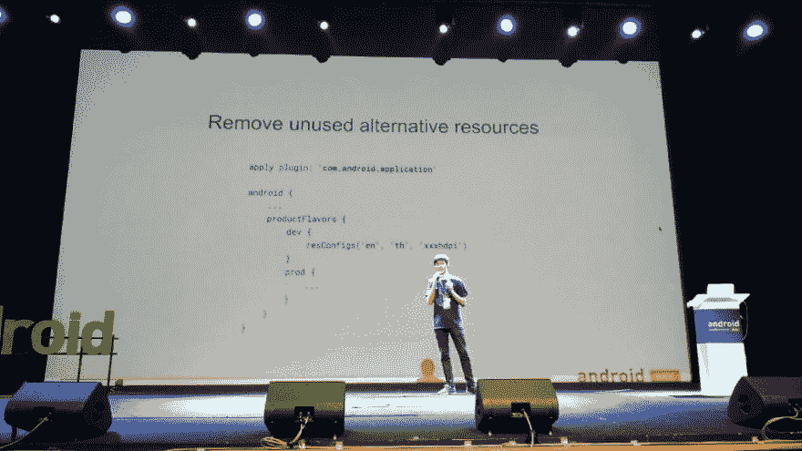T2】](https://res.cloudinary.com/practicaldev/image/fetch/s--Pq5h8YrS--/c_limit%2Cf_auto%2Cfl_progressive%2Cq_auto%2Cw_880/https://cdn-images-1.medium.com/max/1024/1%2A3EMwtrTSW2D5i796GfmeXg.jpeg)

[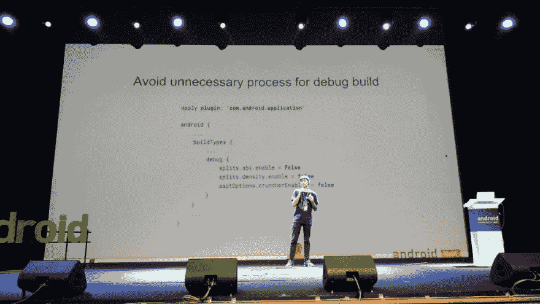T2】](https://res.cloudinary.com/practicaldev/image/fetch/s--oDpK3GRl--/c_limit%2Cf_auto%2Cfl_progressive%2Cq_auto%2Cw_880/https://cdn-images-1.medium.com/max/1024/1%2Arjzio5q4WPH0KLWEIc1k6A.jpeg)

> Smaller APK 由 tean 女士提供

一般来说，大部分开发人员都是用 mid > high 手机来称呼 top 的，我们不会觉得 App 的空间尺寸对 User 有多大价值。

*   使用 APK 分析法
*   移除未使用的资源
*   我不知道你在说什么
*   构建应用程序多屏幕密度不包括 ldpi 和 mdpi

[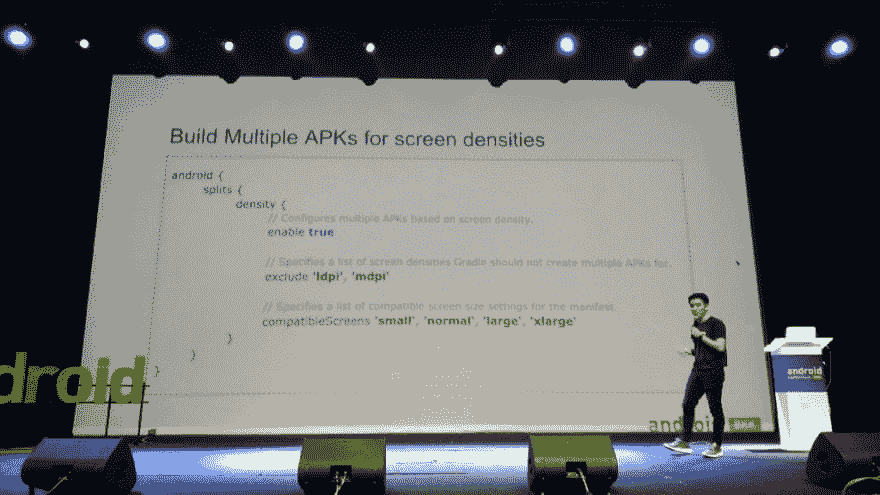T2】](https://res.cloudinary.com/practicaldev/image/fetch/s--M-wmi7nq--/c_limit%2Cf_auto%2Cfl_progressive%2Cq_auto%2Cw_880/https://cdn-images-1.medium.com/max/1024/1%2AjuVVJ-mc2eNXd0mimv0PJw.jpeg)

*   要使用的构建配置语言

[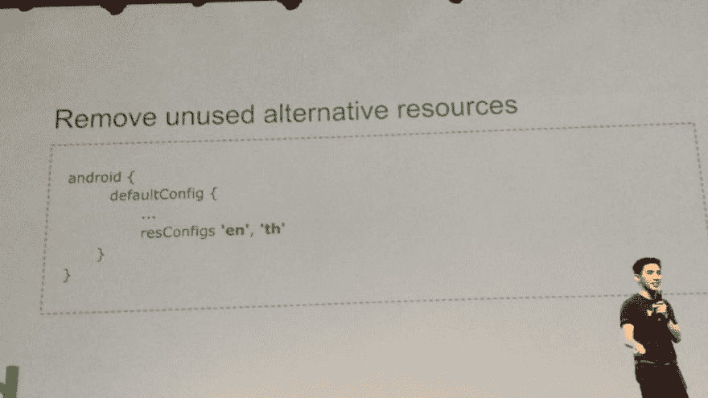T2】](https://res.cloudinary.com/practicaldev/image/fetch/s--4QkG3dhH--/c_limit%2Cf_auto%2Cfl_progressive%2Cq_auto%2Cw_880/https://cdn-images-1.medium.com/max/1024/1%2AQilpKTqVG-5LvscxdMIciA.jpeg)

*   ShrikResource(不确定我是否在某个设备上尝试过这种 it 崩溃)

[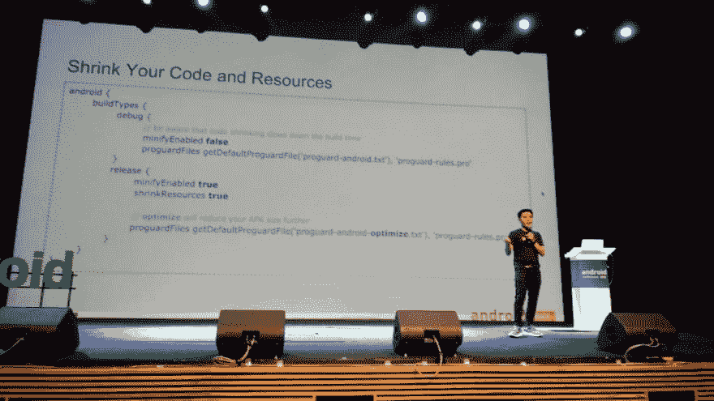T2】](https://res.cloudinary.com/practicaldev/image/fetch/s--bP_6XJVS--/c_limit%2Cf_auto%2Cfl_progressive%2Cq_auto%2Cw_880/https://cdn-images-1.medium.com/max/1024/1%2ApPEjPbjmRFmIQlX92YiVkw.jpeg)

*   使用 Webp instade PNG

[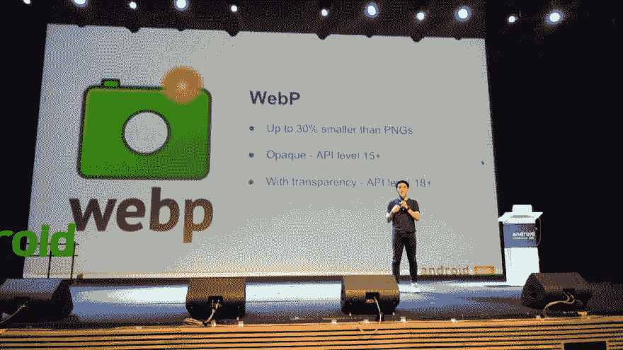T2】](https://res.cloudinary.com/practicaldev/image/fetch/s--kLJvzv1c--/c_limit%2Cf_auto%2Cfl_progressive%2Cq_auto%2Cw_880/https://cdn-images-1.medium.com/max/1024/1%2AFQbexk1JM6KZZ3VCC17Yfg.jpeg)

*   使用 D8

[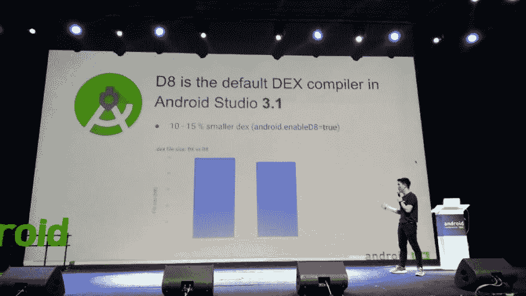T2】](https://res.cloudinary.com/practicaldev/image/fetch/s--KWaQ4o6U--/c_limit%2Cf_auto%2Cfl_progressive%2Cq_auto%2Cw_880/https://cdn-images-1.medium.com/max/1024/1%2AQxF40ZeTIQNRI1D52C5q9Q.jpeg)

说真的，最后，我们做到了一个层次，但如果我们想解决问题，就直截了当地想让 User 体验不错，我们应该发布另一个 App Light 版本来回答 johnes。

> 后一个话题，我们无所不在，什么也不兴奋。

#### Cloud Firestore Workshop:来自 Google 的 Kalyan Reddy

教他设置纤维库，他打开纤维库的页面，然后教他设置基于文档 T^T 的设置，浪费了我们很大的生命。

#### Exoplayer:来自 Fungjai 的 Monthira Chayabanjonglerd

先教 exo 也不错。exo 对一些新的 Dev 来说有点复杂。个人 dev 在几年前就和这个 lib 玩过，现在的工作很少。

[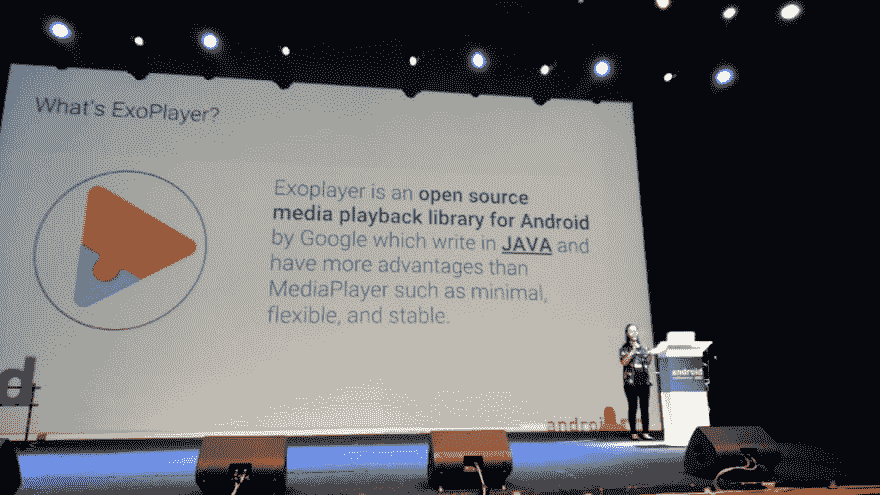T2】](https://res.cloudinary.com/practicaldev/image/fetch/s--Iqz2sjuC--/c_limit%2Cf_auto%2Cfl_progressive%2Cq_auto%2Cw_880/https://cdn-images-1.medium.com/max/1024/1%2AcKy8xhJJe4z0ZXb8VKWq1A.jpeg)

#### 打造谷歌助手 App:Warat wongmanekit

来邀请 Dev Google 助手

支持未来付款

谷歌行动

#### 用 Firebase 连接你的安卓系统

他来描述 Android Thing 的工作并介绍文件上传到云

[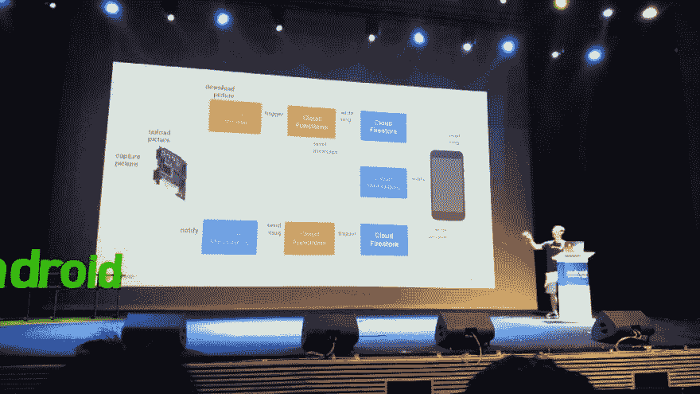T2】](https://res.cloudinary.com/practicaldev/image/fetch/s--s6AX5qzu--/c_limit%2Cf_auto%2Cfl_progressive%2Cq_auto%2Cw_880/https://cdn-images-1.medium.com/max/1024/1%2AMFWgrSPycbRNMe2C0D17vA.jpeg)

#### Android CI 与 kubrines:Anton malinski aguda

[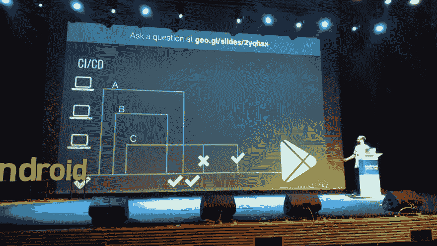T2】](https://res.cloudinary.com/practicaldev/image/fetch/s--iJY7UOka--/c_limit%2Cf_auto%2Cfl_progressive%2Cq_auto%2Cw_880/https://cdn-images-1.medium.com/max/1024/1%2AREFDSSjz5RipJzpt8RFDTg.jpeg)

不听校长讲的是波特编程，而不是教授 VIPER。教授回忆说，Agoda 团队在 Dev 团队中使用了 VIPER pattern，Dev 团队的他相当的轻。

#### 智人科特林:阿戈达的科特林简史:伊纳基·维拉·阿戈达/GDE·安卓

Verachad Wongsawangtham Kotlin 泰国社区

tipa tai Puthanukunkit kot Lin 泰国社区

Kotlin Homo 将人类历史描述为人类与 Kotlin 共同进化的主题。

[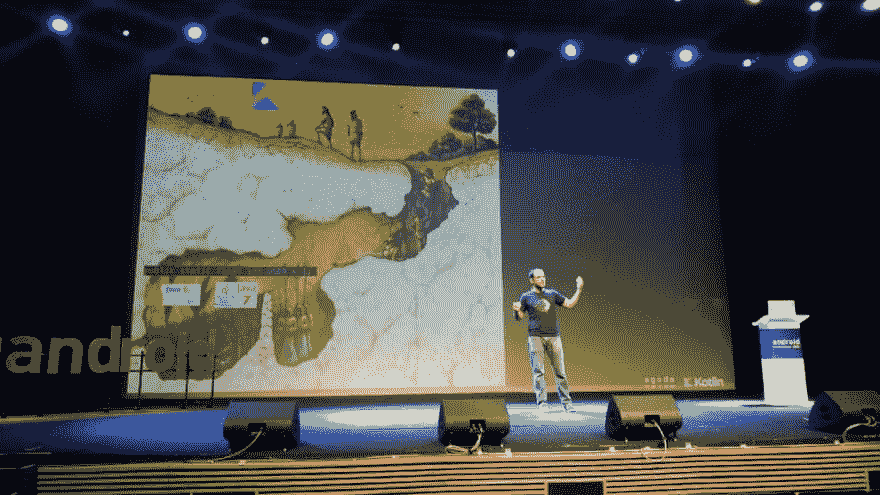T2】](https://res.cloudinary.com/practicaldev/image/fetch/s--vEG__XfP--/c_limit%2Cf_auto%2Cfl_progressive%2Cq_auto%2Cw_880/https://cdn-images-1.medium.com/max/1024/1%2A7hyQkBLN6dcW1BfQ6cq8_Q.jpeg)

[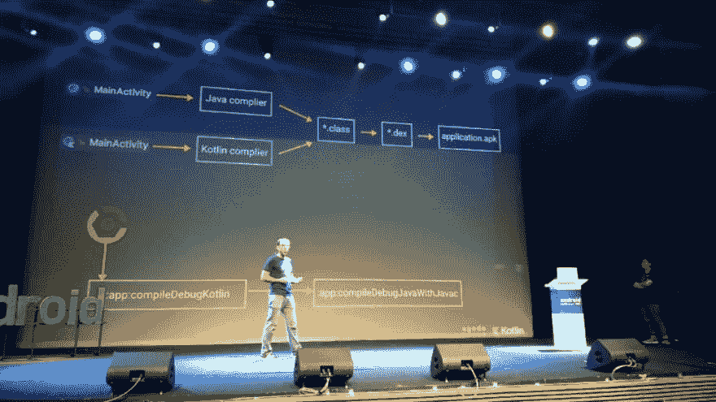T2】](https://res.cloudinary.com/practicaldev/image/fetch/s--PHjdD2dI--/c_limit%2Cf_auto%2Cfl_progressive%2Cq_auto%2Cw_880/https://cdn-images-1.medium.com/max/1024/1%2AX1BFqy2udnzGG7-_sIsDjQ.jpeg)

高阶函数，Kotlin 的好，通常是 Java，我们可以输入参数或 return，但是对象或参数数据，是的，man，但是 Kotlin，我们可以重新启动 pape。

[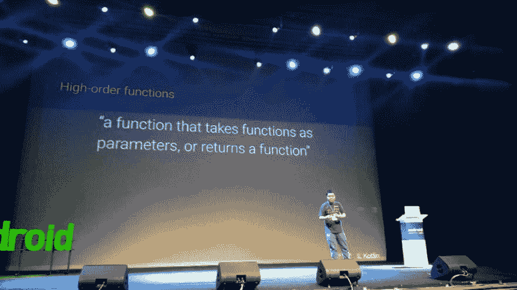T2】](https://res.cloudinary.com/practicaldev/image/fetch/s--EGsu_R_J--/c_limit%2Cf_auto%2Cfl_progressive%2Cq_auto%2Cw_880/https://cdn-images-1.medium.com/max/1024/1%2A4MdljjcSgk8zGMmMOZWjOQ.jpeg)

然后他不断地把 java 代码和 kotlin 进行比较

#### 手机诗人的张量流:GDE 安卓

这个，忘了拿东西，忘了早上起床

[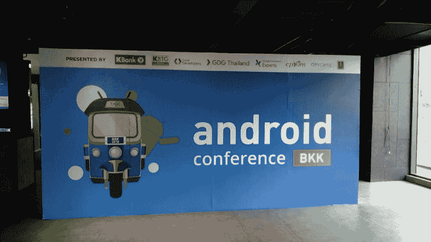T2】](https://res.cloudinary.com/practicaldev/image/fetch/s--6P9-nxXT--/c_limit%2Cf_auto%2Cfl_progressive%2Cq_auto%2Cw_880/https://cdn-images-1.medium.com/max/1024/1%2AKRw1VYC-xuRwGVv8FLe-GQ.jpeg)