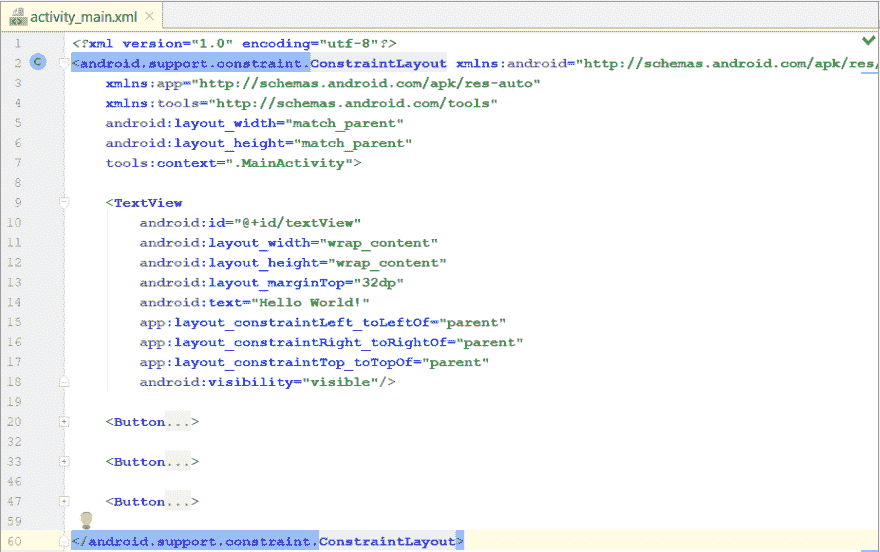
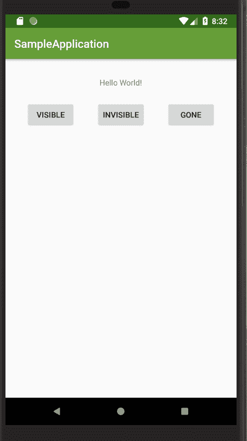
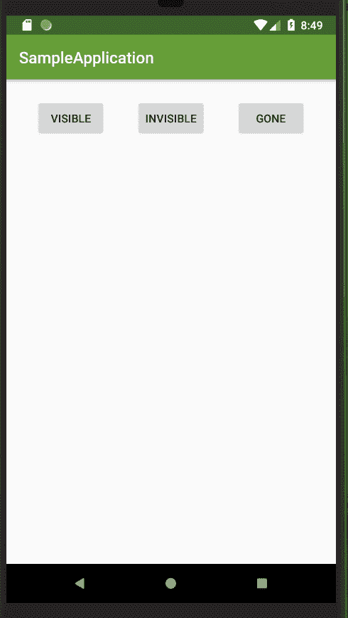
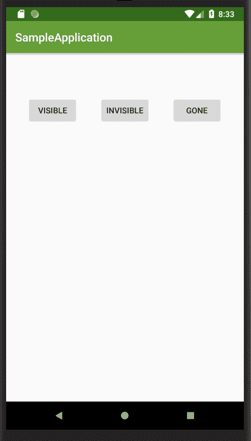
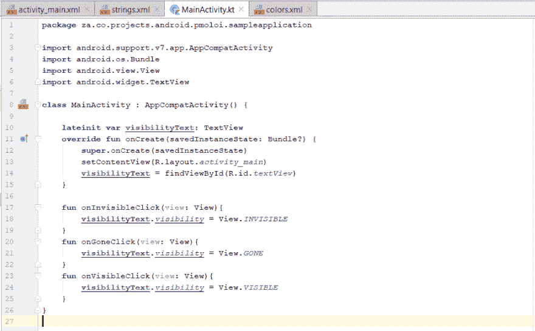

# Android 视图:躲猫猫

> 原文：<https://dev.to/pabiforbes/android-views-peek-a-boo-5ehd>

在这篇文章中，我将讨论 Android 视图的*可见性*属性。那么什么是 Android 视图呢？ **Android 视图**是绘制在屏幕上的用户界面元素，用户可以与之交互。例如，按钮、文本视图和图像视图。

Android 视图属性定义了元素的外观，比如高度、宽度和颜色。可以把它们看作视图的元数据。视图的可见性可以设置为消失、不可见或可见，如下面的示例代码所示:

**Android:visibility = " visible "**
这是一个视图默认的可见性值。这意味着视图将始终显示在屏幕上。
默认情况下，视图的可见性不必明确设置为可见。正如我们在下面的示例中看到的，显示臭名昭著的“Hello World”的 textview 在屏幕上是可见的。

**Android:visibility = " gone "**
当我们将 textview 的 visibility 属性设置为 gone 时，
它将不会显示在屏幕上，它在布局上的空间将被周围的元素占据。
当视图从消失切换到可见时，周围的元素会为视图让路，视图会占用空间并显示在屏幕上。
查看下面的示例应用程序，我们可以看到文本视图在屏幕上不可见，它的空间被按钮占据了。

**Android:visibility = " invisible "**
如果一个视图的可见性设置为不可见，该视图将不会显示，但它仍会占据布局上的空间。因此，在元素之间添加一些额外的空间可能会使布局看起来有点奇怪。
回头看看我们的示例应用程序，文本视图没有显示，但它仍然占据了它的空间。按钮保持在它们的位置上。

**随时改变可见度**
不同可见度值之间的切换可通过编程轻松实现。我添加了在点击按钮后在不同的可见性属性值之间切换的功能。当点击“消失”按钮时，我们将可见性值更改为*消失*。当点击“不可见”按钮时，我们将可见性值更改为*不可见*。单击“Visible”按钮时，我们只需将可见性值更改为 *visible* 。
下面来偷看一下:

根据屏幕上正在执行的活动，在不同的可见性值之间切换有助于我们向用户显示相关内容。例如，我们可以在进行服务调用时显示一个加载器，然后在得到服务器的响应后才显示底层内容。android 可见性属性只是我们可以使用和尝试的众多属性之一，所以不要羞于尝试。一个很酷的帖子，你可以看看[https://guides . code path . com/Android/Defining-Views-and-they-Attributes](https://guides.codepath.com/android/Defining-Views-and-their-Attributes)。

*演职员表:*
感谢安德烈·拉扎列夫拍摄的来自[https://unsplash.com/photos/U47vtNMkyXg](https://unsplash.com/photos/U47vtNMkyXg)的惊人封面图片