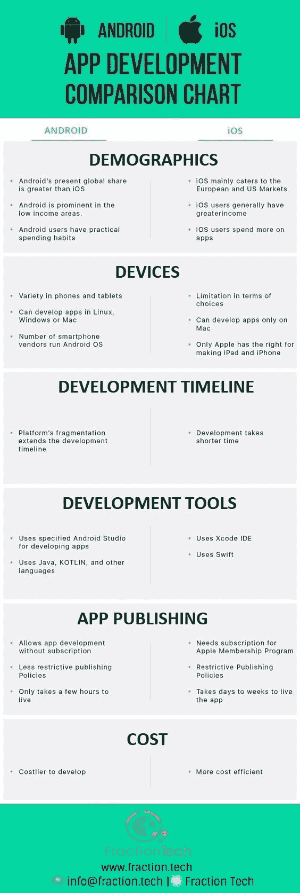

# Android 与 iOS 应用开发对比图——Fraction Tech

> 原文：<https://dev.to/fractiontech/android-vs-ios-app-development-comparison-chart--fraction-tech-24a6>

截至 2017 年 3 月，App Store 的可用应用数量略高于 Play Store 的 280 万个，达到 22 亿个。同样在 2017 年 Q1，iOS 和 [Android 应用](http://www.fraction.tech/services/application-development)的总下载量同比增长 15%，全球新下载量达到约 250 亿次。如果重新安装，这些数字可能会更高。在应用内购买方面，全球运行的 iOS 和 Android 系统的收入同样同比增长 45%，达到惊人的 150 亿美元。对于移动应用公司来说，现在绝对是继续[雇佣应用开发者](http://www.fraction.tech/services/application-development)开发各种移动应用产品的好时机——从移动音乐应用到即时通讯和移动游戏应用。据预测，在不到三年的时间里，这些应用程序将产生近 2000 亿美元的应用内和广告收入。但问题是，你应该希望[开发 Android 还是 iOS 应用](http://www.fraction.tech/services/application-development)？如果是，那么[让我们开始吧](http://www.fraction.tech/inquiry)

[T2】](https://res.cloudinary.com/practicaldev/image/fetch/s--TePJoxaV--/c_limit%2Cf_auto%2Cfl_progressive%2Cq_auto%2Cw_880/https://cdn-images-1.medium.com/max/564/1%2AV49WiLquB9YCf5-XW4rxzQ.jpeg)