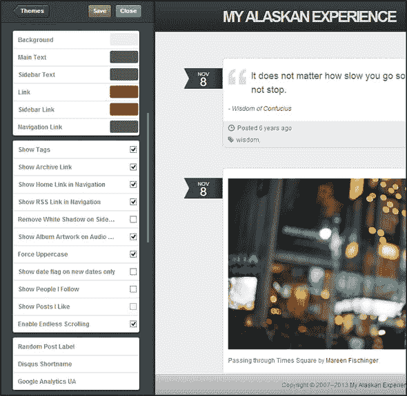
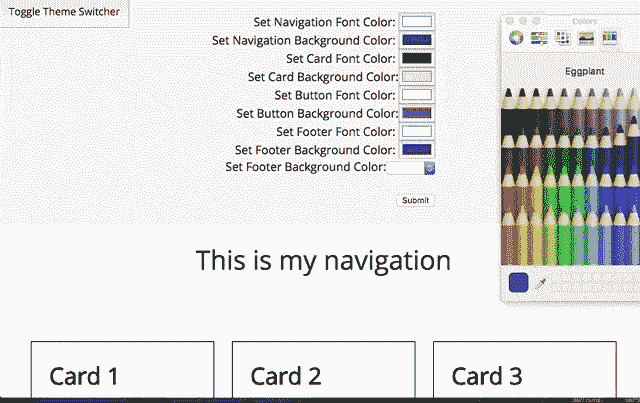

# Angular 6:没有库的动态主题

> 原文：<https://dev.to/adamaso/angular-6-dynamic-themes-without-a-library-2e9c>

从我记事起，主题化的概念就已经存在了。让用户能够选择产品的外观和感觉具有难以置信的价值——它创造了更加本地化的体验，并减少了开发人员的维护时间。

[T2】](https://res.cloudinary.com/practicaldev/image/fetch/s--Atdz1shv--/c_limit%2Cf_auto%2Cfl_progressive%2Cq_auto%2Cw_880/https://cdn-images-1.medium.com/max/1600/1%2AEb0kS7HGmxFyZR2HokgNhQ.png)

我们如何在我们的 Angular 应用程序中创建这样的东西？

## 为什么单单斗嘴不行

虽然 Sass 变量可能有助于创建预设的主题体验，但最大的缺点是它不能被 JavaScript 操纵。我们需要 JavaScript 来动态改变变量的值！

## 为什么光靠物质行不通

自从 Angular Material 发布以来，开发人员已经蜂拥到这个库中来利用他们的可重用组件(更不用说内置的可访问性了)

素材带有内置主题，但这可能行不通，原因有二:

1.  默认情况下，材质自带针对辅助功能进行了优化的调色板。如果你想生成更多的颜色，你需要把它传递到他们的 mat-palette mixin 或者创建一个新的主题文件，使用第三方工具。这就产生了一个外部依赖，并限制了在不接触代码的情况下切换主题的能力。

2.  虽然这是一个很好的选择，但不是每个人都想使用材料！许多开发人员不希望导入整个库来利用组件，而是选择创建自己的库。

**解决办法？Sass + CSS 变量！**

如果您从未使用过原生 CSS 自定义属性(我称之为变量)，这里有一篇很棒的文章可以帮助您入门。这种方法有效的原因是因为 CSS 变量可以被 JavaScript 操纵！通过这种组合，您可以使用一个表单将 CSS 变量传递给一个 Sass 映射，该映射可以在整个应用程序中使用。

## 来看看吧！

[T2】](https://res.cloudinary.com/practicaldev/image/fetch/s--CnfeuRre--/c_limit%2Cf_auto%2Cfl_progressive%2Cq_66%2Cw_880/https://cdn-images-1.medium.com/max/1600/1%2AXAFHjvjzDS1ZIaroeHKIpQ.gif)

**本次实施:**

*   不使用任何外部库
*   允许多个组件通过一个表单动态更改样式
*   将表单保存为可以保存在数据库或本地存储中的对象
*   能够加载外部对象作为预加载或预设样式

链接到演示:[https://native-theming-form-medium.stackblitz.io/](https://native-theming-form-medium.stackblitz.io/)

链接到 stack blitz:[https://stackblitz.com/edit/native-theming-form-medium](https://stackblitz.com/edit/native-theming-form-medium)

## 魔力

这种方法背后的核心原理是结合 Sass 映射和 CSS 变量。

在 theme.scss 文件中，默认值被设置并传递到 Sass 映射中

theme.scss

```
// default colors
.theme-wrapper {
    --cardColor: #CCC;
    --cardBackground: #FFF;
    --buttonColor: #FFF;
    --buttonBackground: #FFF;
    --navColor: #FFF;
    --navBackground: #FFF;
    --footerColor: #FFF;
    --footerBackground: #FFF;
    --footerAlignment: left;
}
// pass variables into a sass map
$variables: (
    --cardColor: var(--cardColor),
    --cardBackground: var(--cardBackground),
    --buttonColor: var(--buttonColor),
    --buttonBackground: var(--buttonBackground),
    --navColor: var(--navColor),
    --navBackground: var(--navBackground),
    --footerColor: var(--footerColor),
    --footerBackground: var(--footerBackground),
    --footerAlignment: var(--footerAlignment)
); 
```

Enter fullscreen mode Exit fullscreen mode

创建一个函数来从全局 sass 映射返回本地 css 变量

function.scss

```
@function var($variable) {
    @return map-get($variables, $variable);
} 
```

Enter fullscreen mode Exit fullscreen mode

组件现在可以读取这两个文件来存放一个动态变量，该变量在表单重新提交时会发生变化

card.component.scss

```
@import '../../theme';
@import '../../functions';
.card {
    background-color: var(--cardBackground);
    color: var(--cardColor);
} 
```

Enter fullscreen mode Exit fullscreen mode

卡片的背景颜色现在是#FFFFFF，文本颜色是#CCCCCC

但是我们如何改变价值观呢？

通过主题选择器组件！

在我们的 theme-picker.component.html 文件中，我们使用 ngModel 的模板表单来创建一个具有唯一键(样式)和值(输入)的对象。然后，该对象被传递到动态覆盖该变量的 TypeScript 文件。

theme-picker.component.ts

```
// searching the entire page for css variables
private themeWrapper = document.querySelector('body');
onSubmit(form) {
    this.globalOverride(form.value);
}
globalOverride(stylesheet) {
    if (stylesheet.globalNavColor) {
        this.themeWrapper.style.setProperty('--navColor',     stylesheet.globalNavColor);
    }
...
    if (stylesheet.globalButtonColor) {
        this.themeWrapper.style.setProperty('--buttonColor',     stylesheet.globalButtonColor);
    }
} 
```

Enter fullscreen mode Exit fullscreen mode

globalOverride 函数检查特定变量的值是否存在，然后用新输入的变量替换每个 CSS 变量。

**维奥拉！**

这段代码可以更好地进行缩放优化(使用预设的样式对象，在提交时保存/发布样式)，所以可以随意使用它！