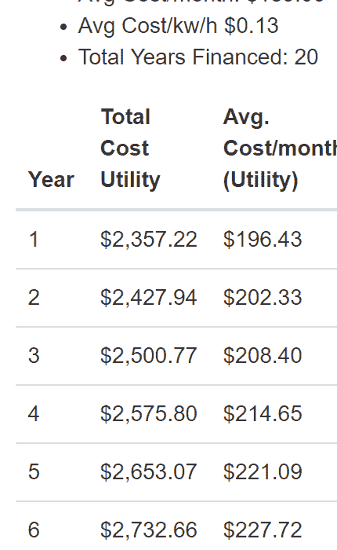

# 角度和类型脚本基础-自定义管道

> 原文：<https://dev.to/kritner/angular-and-typescript-basics--custom-pipes-573o>

[T2】](https://res.cloudinary.com/practicaldev/image/fetch/s--9HgXIHeR--/c_limit%2Cf_auto%2Cfl_progressive%2Cq_auto%2Cw_880/https://cdn-images-1.medium.com/max/250/0%2AE_EsQcTWnrmuWHYO.png)

[上一篇文章](https://dev.to/kritner/angular-basics--pipes-180)，我们在我的【http://www.kritner.com/solar-projection】页面[添加了一些基本的管道信息。我注意到，由于我的数组的工作方式，从索引 0 开始，表中的数据将第一年显示为“第 0 年”。是的，我可以改变代码中的几个地方，从 index 1 开始，更新对复利的调用以使用 index-1，等等，但这看起来像是一个 PITA。当然，我们可以做一个自定义管道来应用于表中的 year 列，返回原来的数字+1，对吗？](http://www.kritner.com/solar-projection)

[T2】](https://res.cloudinary.com/practicaldev/image/fetch/s--7wE1Cemf--/c_limit%2Cf_auto%2Cfl_progressive%2Cq_auto%2Cw_880/https://cdn-images-1.medium.com/max/490/0%2AUuxvlP3TAzbgR81T.jpg)

所以自定义管道将允许我用 TypeScript 编写我的第一个函数，哇哦！我从来都不是 JavaScript 的粉丝，所以考虑到它(看起来)是 C#-ifies JavaScript，TypeScript 听起来相当不错。更多信息请访问 http://www.typescriptlang.org/。注意——我说我写的第一个函数，因为它确实是——在以前的帖子中显示的一点 typescript 只是接口声明和/或信息，是预构建的 dotnet net angular 模板的一部分。

从[https://angular.io/guide/pipes#custom-pipes](https://angular.io/guide/pipes#custom-pipes)开始作为基础，我可以看到定制管道需要实现一个管道转换完整的例子是(截至撰写本文时):

```
import { Pipe, PipeTransform } from '[@angular/core](http://twitter.com/angular/core)';
/*
 * Raise the value exponentially
 * Takes an exponent argument that defaults to 1.
 * Usage:
 * value | exponentialStrength:exponent
 * Example:
 * {{ 2 | exponentialStrength:10 }}
 * formats to: 1024
*/
[@Pipe](http://twitter.com/Pipe)({name: 'exponentialStrength'})
export class ExponentialStrengthPipe implements PipeTransform {
 transform(value: number, exponent: string): number {
 let exp = parseFloat(exponent);
 return Math.pow(value, isNaN(exp) ? 1 : exp);
 }
} 
```

Enter fullscreen mode Exit fullscreen mode

看起来很简单，让我们修改上面的代码来得到我们的管道——一个简单地接收一个数字，并输出一个数字+1 的管道:

```
import { Pipe, PipeTransform } from '[@angular/core](http://twitter.com/angular/core)';

[@Pipe](http://twitter.com/Pipe)({name: 'indexOffset'})
export class IndexOffsetPipe implements PipeTransform {
 transform(value: number): number {
 return value + 1;
 }
} 
```

Enter fullscreen mode Exit fullscreen mode

很简单！现在将它应用到表中:

```
<td>{{ projection.purchaseYear }}</td> 
```

Enter fullscreen mode Exit fullscreen mode

变成:

```
<td>{{ projection.purchaseYear | indexOffset }}</td> 
```

Enter fullscreen mode Exit fullscreen mode

让我们试试——运行时错误。哦，不，什么不行？哦，显然这个管道需要在我的组件中注册，这应该很容易解决。

在 app-module.ts 下，我需要确保导入文件:

```
import { SolarProjectionComponent } from './solar-projection/solar-projection.component'; 
```

Enter fullscreen mode Exit fullscreen mode

并在@NgModule 声明中引用管道:

```
@NgModule({
 declarations: [
 IndexOffsetPipe,
 // etc
 }
}) 
```

Enter fullscreen mode Exit fullscreen mode

嘣！现在，当我们查看页面时，我们可以看到:

[T2】](https://res.cloudinary.com/practicaldev/image/fetch/s--HYi5fBw0--/c_limit%2Cf_auto%2Cfl_progressive%2Cq_auto%2Cw_880/https://cdn-images-1.medium.com/max/430/1%2AWJqxJ9NmqFedsc--r354lw.png)

万岁！年份从 1 开始，而不是从 0 开始！

相关:

*   我的第一个 NuGet 包！克里特纳。SolarEstimate
*   [角度基础—绑定](https://dev.to/kritner/angular-basics--binding-5dn8)
*   [角度基础——管道](https://dev.to/kritner/angular-basics--pipes-180)